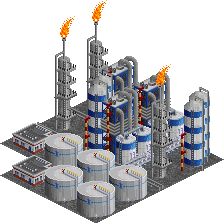

# Overview (list of industries and cargos)

## Industries

The set contains 20 industries as listed below.

### Builders yard

The builders yard provides building supplies to a nearby town. 

| Requires | Produces |
| -- | -- |
| [Timber](#timber) |  |

### Coal mine

Coal mining became one of the most important industries during the Industrial Revolution of the early 19th century, as coal was needed to power steam engines. Steam engines in turn were used to pump water out of the mines, allowing to mine much deeper. With the invention of railway steam engines, the demand of coal rose once more. 

Germany's coal mining industry developed mainly in the Ruhr area and in upper Silesia, but also in the Saar region, areas which became the first centers of heavy industrialization. In the early 20th century production increased significantly due to the introduction of improved jackhammers and mechanization. At the time, Germany was one of the largest producers of coal in the world. After World War 2 production peaked in the 1950s. However, rising costs made coal mining unprofitable and the industry slowly declined from 1960 onwards, existing on subsidies for decades. The last coal mines closed in 2018. 

When using the realistic economy model, the maximum production rises slowly in the 19th century, then spikes sharply in the early 20th century, before slowly declining until the early 20th century. 

Industry will only spawn from 1800 to 1950.
This restriction is also valid for funding the industry.
| Requires | Produces |
| -- | -- |
|  | [Coal](#coal) |

### Department store

Description to go here 

| Requires | Produces |
| -- | -- |
| [Goods](#goods) |  |

### Farm

Description to go here 

| Requires | Produces |
| -- | -- |
|  | [Grain](#grain) |
|  | [Livestock](#livestock) |

### Fishing grounds

Description to go here 

| Requires | Produces |
| -- | -- |
|  | [Fish](#fish) |

### Food processor

Description to go here 

| Requires | Produces |
| -- | -- |
| [Fish](#fish) | [Food](#food) |
| [Grain](#grain) |  |
| [Livestock](#livestock) |  |

### Forest

Description to go here 

| Requires | Produces |
| -- | -- |
|  | [Wood](#wood) |

### Furniture factory

Description to go here 

| Requires | Produces |
| -- | -- |
| [Timber](#timber) | [Goods](#goods) |

### General store

Description to go here 

| Requires | Produces |
| -- | -- |
| [Food](#food) |  |

### Hotel

Whether it is for recreational purposes or for business trips, hotels play an important role in the economy. 

In the set, hotels "produce" as many passengers as are deliver to them, which simply models that people who check in will eventually also check out. 

| Requires | Produces |
| -- | -- |
| [Food](#food) | [Passengers](#passengers) |
| [Passengers](#passengers) |  |

### Integrated steel mill

Steel is one of the key components in any industrialized economy. It is needed for virtually everything, be it buildings, vehicles, railways, ... Historically, steel production was a key driver of industrialization in the 19th century, especially with the introduction of railways. In Germany, the biggest steel industry centers were located in the Ruhr and Saar regions, where coal was abundant, while iron ore was imported. Nowadays, steel production is still an important part of the economy, requiring iron ore transportation from the ports at the North Sea coast to the mills in the Ruhr area and in Lower Saxony. 

While there are multiple different variants of producing steel out of iron ore, this set only contains the modern variant of the integrated steel mill. There are several steps to create steel out of iron ore, starting with a blast furnace, but molten pig iron is not transported over long distances, and as such it is not relevant in the scope of the game. 

| Requires | Produces |
| -- | -- |
| [Coal](#coal) | [Steel](#steel) |
| [Iron Ore](#iron-ore) |  |

### Iron ore mine

Iron ore mining has already been done in ancient times. With the invention of steel and the increasing demand, especially for railways, it became a key industry durign the industrial revolution of the 19th century. 

Germany did ore mining until the middle of the 20th century, but generally speaking, it always depended on importing the ore from elsewhere. 

| Requires | Produces |
| -- | -- |
|  | [Iron Ore](#iron-ore) |

### Oil refinery

The chemical industry is one of the most important industries in Germany, with well-known companies like BASF. Oil is one of the key ingredients in the production of (among many other things), plastics. 

Industry will only spawn after 1860.
This restriction is also valid for funding the industry.
| Requires | Produces |
| -- | -- |
| [Oil](#oil) | [Plastics](#plastics) |

### Oil rig

Description to go here 

Industry will only spawn after 1985.
This restriction is also valid for funding the industry.
| Requires | Produces |
| -- | -- |
| [Passengers](#passengers) | [Oil](#oil) |
|  | [Passengers](#passengers) |

### Oil well

Description to go here 

Industry will only spawn from 1860 to 1985.
This restriction is also valid for funding the industry.
| Requires | Produces |
| -- | -- |
|  | [Oil](#oil) |
|  | [Passengers](#passengers) |

### Port

Ports are centers of trade, and with the German industry dependent on importing many raw materials and exporting lots of goods, it is only natural to also model this in the set. German ports at the North Sea and the Baltic sea already played pivotal roles in medieval times, when the Hanse ensured that cities like Hamburg and Lübeck (among many others) prospered. 

In the set, the maximum production of harbors is constantly increasing as time goes on. This reflects the fact that ships got bigger and innovations like the switch to containerized transport took place. 

| Requires | Produces |
| -- | -- |
| [Goods](#goods) | [Coal](#coal) |
| [Vehicles](#vehicles) | [Iron Ore](#iron-ore) |
|  | [Oil](#oil) |

### Power plant

Description to go here 

| Requires | Produces |
| -- | -- |
| [Coal](#coal) | [Electricity](#electricity) |
| [Oil](#oil) |  |

### Sawmill

Description to go here 

| Requires | Produces |
| -- | -- |
| [Wood](#wood) | [Timber](#timber) |

### Vehicle distributor

Description to go here 

| Requires | Produces |
| -- | -- |
| [Vehicles](#vehicles) |  |

### Vehicle factory

Germany is renowned for its automotive industry. After all, the key inventions in car development happened in Germany in the late 19th century. Mass motorization in Germany started after World War 2, mainly driven by the Volkswagen Beetle, one of the most mass-produced vehicles ever. Nowadays, cars are one of the key export goods of the German industry. The automotive industry is one of the most important industries, with companies like Mercedes-Benz, BMW, Audi or Porsche being known throughout the world. 

Industry will only spawn after 1910.
This restriction is also valid for funding the industry.
| Requires | Produces |
| -- | -- |
| [Electricity](#electricity) | [Vehicles](#vehicles) |
| [Steel](#steel) |  |

## Cargos

The set contains 16 cargos as listed below.

### Coal

no description yet

Cargo classes: Bulk cargo
| Produced by | Required by |
| -- | -- |
| [Coal mine](#coal-mine) | [Integrated steel mill](#integrated-steel-mill) |
| [Port](#port) | [Power plant](#power-plant) |

### Electricity

no description yet

| Produced by | Required by |
| -- | -- |
| [Power plant](#power-plant) | [Vehicle factory](#vehicle-factory) |

### Fish

no description yet

Cargo classes: Express, Refrigerated
| Produced by | Required by |
| -- | -- |
| [Fishing grounds](#fishing-grounds) | [Food processor](#food-processor) |

### Food

no description yet

Cargo classes: Express, Refrigerated
| Produced by | Required by |
| -- | -- |
| [Food processor](#food-processor) | [General store](#general-store) |
|  | [Hotel](#hotel) |

### Goods

no description yet

Cargo classes: Express
| Produced by | Required by |
| -- | -- |
| [Furniture factory](#furniture-factory) | [Department store](#department-store) |
|  | [Port](#port) |

### Grain

no description yet

Cargo classes: Bulk cargo
| Produced by | Required by |
| -- | -- |
| [Farm](#farm) | [Food processor](#food-processor) |

### Iron Ore

no description yet

Cargo classes: Bulk cargo
| Produced by | Required by |
| -- | -- |
| [Iron ore mine](#iron-ore-mine) | [Integrated steel mill](#integrated-steel-mill) |
| [Port](#port) |  |

### Livestock

no description yet

Cargo classes: Piece goods
| Produced by | Required by |
| -- | -- |
| [Farm](#farm) | [Food processor](#food-processor) |

### Mail

no description yet

Cargo classes: Mail
| Produced by | Required by |
| -- | -- |

### Oil

no description yet

Cargo classes: Liquid
| Produced by | Required by |
| -- | -- |
| [Oil rig](#oil-rig) | [Oil refinery](#oil-refinery) |
| [Oil well](#oil-well) | [Power plant](#power-plant) |
| [Port](#port) |  |

### Passengers

no description yet

Cargo classes: Passengers
| Produced by | Required by |
| -- | -- |
| [Hotel](#hotel) | [Hotel](#hotel) |
| [Oil rig](#oil-rig) | [Oil rig](#oil-rig) |
| [Oil well](#oil-well) |  |

### Plastics

no description yet

Cargo classes: Bulk cargo, Piece goods
| Produced by | Required by |
| -- | -- |
| [Oil refinery](#oil-refinery) |  |

### Steel

no description yet

Cargo classes: Piece goods
| Produced by | Required by |
| -- | -- |
| [Integrated steel mill](#integrated-steel-mill) | [Vehicle factory](#vehicle-factory) |

### Timber

no description yet

Cargo classes: Piece goods
| Produced by | Required by |
| -- | -- |
| [Sawmill](#sawmill) | [Builders yard](#builders-yard) |
|  | [Furniture factory](#furniture-factory) |

### Vehicles

no description yet

Cargo classes: Oversized, Piece goods
| Produced by | Required by |
| -- | -- |
| [Vehicle factory](#vehicle-factory) | [Port](#port) |
|  | [Vehicle distributor](#vehicle-distributor) |

### Wood

no description yet

Cargo classes: Piece goods
| Produced by | Required by |
| -- | -- |
| [Forest](#forest) | [Sawmill](#sawmill) |

