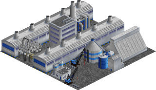
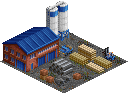
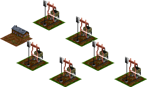

# Overview (list of industries and cargos)

## Extensions

The set contains 4 extensions as listed below.

### Aluminium

This extension adds aluminium production from bauxite and adapts other industries to require aluminium. 

#### Cargos

* [Bauxite](#bauxite)
* [Aluminium](#aluminium)

#### Industries

* [Vehicle factory](#vehicle-factory)
* [Aluminium Plant](#aluminium-plant)
* [Aluminium Plant](#aluminium-plant)

### Basic anorganic chemistry

This extension adds salt and chemical products based on it such as chlorine and lye. 

#### Cargos

* [Salt](#salt)
* [Chlorine](#chlorine)
* [Lye](#lye)
* [Hydrogen](#hydrogen)

#### Industries

* [Food processor](#food-processor)
* [Plastics Plant](#plastics-plant)
* [Aluminium Plant](#aluminium-plant)
* [Pharmaceutical Plant](#pharmaceutical-plant)
* [Salt mine](#salt-mine)
* [Chloralkali plant](#chloralkali-plant)

### Building industries

This extension introduces several cargos and industries related to the creation of various building materials. 

#### Cargos

* [Bricks](#bricks)
* [Cement](#cement)
* [Limestone](#limestone)
* [Sand](#sand)

#### Industries

* [Builders yard](#builders-yard)
* [Brick works](#brick-works)
* [Cement plant](#cement-plant)
* [Limestone mine](#limestone-mine)
* [Sand pit](#sand-pit)

### Textile industries

This extension introduces several cargos and industries related to textile and clothing production. 

#### Cargos

* [Wool](#wool)
* [Textiles](#textiles)

#### Industries

* [Farm](#farm)
* [Textile Mill](#textile-mill)
* [Clothing Plant](#clothing-plant)
* [Furniture factory](#furniture-factory)

## Industries

The set contains 37 industries as listed below.

### Aluminium Plant

The aluminium plant produces aluminium out of bauxite, an aluminium ore. This process consists of two steps, in the first one the bauxite is split up in a chemical process to get rid of impurities in the ore before creating aluminium oxide. The second step then splits up the aluminium oxide using elektrolysis. This requires lots of electricity and produces huge amounts of carbon dioxide. This makes production only viable in places where cheap electricity is available. 

Part of extension: [Aluminium](#aluminium)

Industry will only spawn after 1900.
This restriction is also valid for funding the industry.
| Requires | Produces |
| -- | -- |
| [Bauxite](#bauxite) | [Aluminium](#aluminium) |
| [Electricity](#electricity) |  |

### Aluminium Plant

The aluminium plant produces aluminium out of bauxite, an aluminium ore. This process consists of two steps, in the first one the bauxite is split up in a chemical process to get rid of impurities in the ore before creating aluminium oxide. The second step then splits up the aluminium oxide using elektrolysis. This requires lots of electricity and produces huge amounts of carbon dioxide. This makes production only viable in places where cheap electricity is available. 

Part of extension: [Aluminium](#aluminium)

Part of extension: [Basic anorganic chemistry](#basic-anorganic-chemistry)

Industry will only spawn after 1900.
This restriction is also valid for funding the industry.
| Requires | Produces |
| -- | -- |
| [Bauxite](#bauxite) | [Aluminium](#aluminium) |
| [Electricity](#electricity) |  |
| [Lye](#lye) |  |

### Brick works

The effective mass production of bricks began in the 19th century with the onset of the industrial revolution. Many manufacturing plants had to be built, and new railway lines often required huge bridges. 

In the real world, bricks have been produced for millenia, often burning wood as source material for creating the required heat. In the set, the modern variant is present which uses coal instead of wood. 

Part of extension: [Building industries](#building-industries)

| Requires | Produces |
| -- | -- |
| [Coal](#coal) | [Bricks](#bricks) |

### Builders yard

The builders yard provides building supplies to a nearby town. 

| Requires | Produces |
| -- | -- |
| [Timber](#timber) |  |

### Builders yard

The builders yard provides building supplies to a nearby town. When enabling the building materials extension, it accepts a greater variety of cargos. 

Part of extension: [Building industries](#building-industries)

| Requires | Produces |
| -- | -- |
| [Bricks](#bricks) |  |
| [Cement](#cement) |  |
| [Sand](#sand) |  |
| [Timber](#timber) |  |

### Cement plant

The first cement plants in Gemrany date back to the early 19th century. In the second half of the 19th century, the industry saw a lot of standardization in terms of production processes and quality requirements. Today, more than 50 plants operate in Germany, making it the largest producer in Europe. 

Part of extension: [Building industries](#building-industries)

Industry will only spawn after 1800.
This restriction is also valid for funding the industry.
| Requires | Produces |
| -- | -- |
| [Limestone](#limestone) | [Cement](#cement) |
| [Sand](#sand) |  |

### Chloralkali plant

The chloralkali plant uses electrolysis to split up salt into chlorine and sodium hydroxide. As a byproduct hydrogen is produced. This process was developed in the late 19th century and is one of the most important basic technical processes in the chemical industry. The reaction requires a lot of electric energy. The first plants to implement this process were built around 1890, with multiple plants in Germany, Spain, France and Russia. Today, almost 20 plants are running all over Germany, located mostly in the classic centers of chemical industry such as Ludwigshafen (BASF) and Schkopau (Dow Chemicals), with the biggest plant being located in Stade in northern Germany. 

Part of extension: [Basic anorganic chemistry](#basic-anorganic-chemistry)

Industry will only spawn after 1900.
This restriction is also valid for funding the industry.
| Requires | Produces |
| -- | -- |
| [Electricity](#electricity) | [Chlorine](#chlorine) |
| [Salt](#salt) | [Hydrogen](#hydrogen) |
|  | [Lye](#lye) |

### Clothing Plant

The clothing plant is the place where textiles are turned into clothing by means of tailoring and sewing. Creating clothing has been common since the stone ages, when animal hides were used. Later on, more refined ways using plant fibres were invented, industrialization revolutionized the way how clothing was created cheaply. Historically, there was a rich history of clothing manufacturing in Europe, which has been replaced almost completely by cheaper Asian competitors, although high quality tailors still have their niche. 

Part of extension: [Textile industries](#textile-industries)

| Requires | Produces |
| -- | -- |
| [Textiles](#textiles) | [Goods](#goods) |

### Coal mine

Coal mining became one of the most important industries during the Industrial Revolution of the early 19th century, as coal was needed to power steam engines. Steam engines in turn were used to pump water out of the mines, allowing to mine much deeper. With the invention of railway steam engines, the demand of coal rose once more. 

Germany's coal mining industry developed mainly in the Ruhr area and in upper Silesia, but also in the Saar region, areas which became the first centers of heavy industrialization. In the early 20th century production increased significantly due to the introduction of improved jackhammers and mechanization. At the time, Germany was one of the largest producers of coal in the world. After World War 2 production peaked in the 1950s. However, rising costs made coal mining unprofitable and the industry slowly declined from 1960 onwards, existing on subsidies for decades. The last coal mines closed in 2018. 

When using the realistic economy model, the maximum production rises slowly in the 19th century, then spikes sharply in the early 20th century, before slowly declining until the early 20th century. 

Industry will only spawn from 1800 to 1950.
This restriction is also valid for funding the industry.
| Requires | Produces |
| -- | -- |
|  | [Coal](#coal) |

### Department store

The department store implements the concept of generic stores where you can buy any sort of item in the household, be it clothing, books, household applications like washing machines, toys and whatever else. They are introduced to avoid the problem that small towns typically do not accept goods until they have grown to a certain size and to avoid a fluctuation in accepted cargo for your stations. 

| Requires | Produces |
| -- | -- |
| [Goods](#goods) |  |

### Farm

Farms are the main agricultural industry in the set, producing grain and livestock. Both are inputs for the food industry. 

| Requires | Produces |
| -- | -- |
|  | [Grain](#grain) |
|  | [Livestock](#livestock) |

### Farm

Farms are the main agricultural industry in the set, producing grain and livestock. Both are inputs for the food industry. When enabling the textile industry extension, they also produce wool as input for the textile creation. 

Part of extension: [Textile industries](#textile-industries)

| Requires | Produces |
| -- | -- |
|  | [Grain](#grain) |
|  | [Livestock](#livestock) |
|  | [Wool](#wool) |

### Fishing grounds

Fish has to be caught out on sea, which provides for an interesting transportation challenge, requiring ships and possibly transfers from ships to other means of transportation at ports. 

| Requires | Produces |
| -- | -- |
|  | [Fish](#fish) |

### Food processor

The food processor is an abstraction of various food-production related industries. Whether it is bakery products, canned fish or any other sort of food, it is produced here, to be transported to the supermarket shelves. 

Production starts with any of the required materials available. 

| Requires | Produces |
| -- | -- |
| [Fish](#fish) | [Food](#food) |
| [Grain](#grain) |  |
| [Livestock](#livestock) |  |

### Food processor

The food processor is an abstraction of various food-production related industries. Whether it is bakery products, canned fish or any other sort of food, it is produced here, to be transported to the supermarket shelves. 

Production starts with any of fish, grain or livestock available. Lye and salt are only used to boost production levels. 

Part of extension: [Basic anorganic chemistry](#basic-anorganic-chemistry)

| Requires | Produces |
| -- | -- |
| [Fish](#fish) | [Food](#food) |
| [Grain](#grain) |  |
| [Livestock](#livestock) |  |
| [Lye](#lye) |  |
| [Salt](#salt) |  |

### Forest

Forests have been used as a source for wood since the first humans hunted with spears and built their first houses. With industrial various uses for wood, paper production among them, woods are an important industry in reality as well as in the game. In contrast to mining industries, they are renewable, meaning they cannot run out of materials. 

| Requires | Produces |
| -- | -- |
|  | [Wood](#wood) |

### Furniture factory

The furniture industry is quite big in Germany, with IKEA being the market leader. They mostly require wooden materials and produce, for lack of a more fine-grained model, goods. 

| Requires | Produces |
| -- | -- |
| [Plastics](#plastics) | [Goods](#goods) |
| [Timber](#timber) |  |

### Furniture factory

The furniture industry is quite big in Germany, with IKEA being the market leader. They mostly require wooden materials and produce, for lack of a more fine-grained model, goods. When enabling the textile industry extension, they also required textiles for production. 

Production starts with any of the required materials available. 

Part of extension: [Textile industries](#textile-industries)

| Requires | Produces |
| -- | -- |
| [Plastics](#plastics) | [Goods](#goods) |
| [Textiles](#textiles) |  |
| [Timber](#timber) |  |

### General store

The general store is the location where food is bought in cities. You could also simply say it's the supermarket, but the modern supermarket only evolved in the latter half of the 20th century. 

| Requires | Produces |
| -- | -- |
| [Food](#food) |  |

### Hotel

Whether it is for recreational purposes or for business trips, hotels play an important role in the economy. 

In the set, hotels "produce" as many passengers as are deliver to them, which simply models that people who check in will eventually also check out. 

| Requires | Produces |
| -- | -- |
| [Food](#food) | [Passengers](#passengers) |
| [Passengers](#passengers) |  |

### Integrated steel mill

Steel is one of the key components in any industrialized economy. It is needed for virtually everything, be it buildings, vehicles, railways, ... Historically, steel production was a key driver of industrialization in the 19th century, especially with the introduction of railways. In Germany, the biggest steel industry centers were located in the Ruhr and Saar regions, where coal was abundant, while iron ore was imported. Nowadays, steel production is still an important part of the economy, requiring iron ore transportation from the ports at the North Sea coast to the mills in the Ruhr area and in Lower Saxony. 

While there are multiple different variants of producing steel out of iron ore, this set only contains the modern variant of the integrated steel mill. There are several steps to create steel out of iron ore, starting with a blast furnace, but molten pig iron is not transported over long distances, and as such it is not relevant in the scope of the game. 

| Requires | Produces |
| -- | -- |
| [Coal](#coal) | [Steel](#steel) |
| [Iron Ore](#iron-ore) |  |

### Iron ore mine

Iron ore mining has already been done in ancient times. With the invention of cheap processes to produce steel and the increasing demand, especially for railways, it became a key industry during the industrial revolution of the 19th century. 

Germany did ore mining until the middle of the 20th century, but generally speaking, it always depended on importing the ore from elsewhere. 

| Requires | Produces |
| -- | -- |
|  | [Iron Ore](#iron-ore) |

### Limestone mine

Limestone mining dates back centuries in Germany. Nowadays, mining is typically done in quarries or with open pit mining. 

Part of extension: [Building industries](#building-industries)

| Requires | Produces |
| -- | -- |
|  | [Limestone](#limestone) |

### Oil rig

Oil rigs or offshore platforms are used to drill for oil underneath the ocean. Many such resources have been found in the North Sea, and starting in the mid 1980s Germany exploited oil fields as well. However, in general, production is in a steady decline since the 1990s. 

In the set, oil rigs produce a constant number of passengers, which simulates the workers that work on the platform and are  

Industry will only spawn after 1985.
This restriction is also valid for funding the industry.
| Requires | Produces |
| -- | -- |
| [Passengers](#passengers) | [Oil](#oil) |
|  | [Passengers](#passengers) |

### Oil well

It's a little known fact that the first actual deep drilling for oil happened in Germany in the late 1850s, even before an oil boom started in North America. Oil wells are still running in some places in Northern Germany (mainly in Lower Saxony), but many locations have been closed already in the 1960s, with oil imports becoming increasingly cheaper. 

Industry will only spawn from 1860 to 1985.
This restriction is also valid for funding the industry.
| Requires | Produces |
| -- | -- |
|  | [Oil](#oil) |

### Pharmaceutical Plant

Pharmaceutical products such as medications and vaccines are a major economic factor in Germany. This goes back to the late 19th century, when breakthroughs in chemistry allowed for the creation of various new drugs. To give just one example: Bayer, a company that had started by producting dyes, developed Aspirin - today the they are one of the largest producers of pharmaceuticals in the world. 

Production starts with any of the required materials available. 

Part of extension: [Basic anorganic chemistry](#basic-anorganic-chemistry)

Industry will only spawn after 1900.
This restriction is also valid for funding the industry.
| Requires | Produces |
| -- | -- |
| [Hydrogen](#hydrogen) | [Goods](#goods) |
| [Lye](#lye) |  |

### Plastics Plant

The chemical industry is one of the most important industries in Germany, with well-known companies like BASF. Oil is one of the key ingredients in the production of (among many other things), plastics. 

Industry will only spawn after 1930.
This restriction is also valid for funding the industry.
| Requires | Produces |
| -- | -- |
| [Oil](#oil) | [Plastics](#plastics) |

### Plastics Plant

The chemical industry is one of the most important industries in Germany, with well-known companies like BASF. Oil is one of the key ingredients in the production of (among many other things), plastics. 

Part of extension: [Basic anorganic chemistry](#basic-anorganic-chemistry)

Industry will only spawn after 1930.
This restriction is also valid for funding the industry.
| Requires | Produces |
| -- | -- |
| [Chlorine](#chlorine) | [Plastics](#plastics) |
| [Oil](#oil) |  |

### Port

Ports are centers of trade, and with the German industry dependent on importing many raw materials and exporting lots of goods, it is only natural to also model this in the set. German ports at the North Sea and the Baltic sea already played pivotal roles in medieval times, when the Hanse ensured that cities like Hamburg and Lübeck (among many others) prospered. 

In the set, the maximum production of harbors is constantly increasing as time goes on. This reflects the fact that ships got bigger and innovations like the switch to containerized transport took place. 

| Requires | Produces |
| -- | -- |
| [Goods](#goods) | [Coal](#coal) |
| [Vehicles](#vehicles) | [Iron Ore](#iron-ore) |
|  | [Oil](#oil) |

### Power plant

Power plants create electricity, typically by boiling water and using the resulting steam to turn turbines which are coupled with generators. This basic principle is also used in nuclear power plants, whereas hydroplants use the water directly for the turbines. Since it is a transportation game, the set concentrates on fossil power plants that require a constant delivery of coal and/or oil to be burned in order to create electricity. 

| Requires | Produces |
| -- | -- |
| [Coal](#coal) | [Electricity](#electricity) |
| [Oil](#oil) |  |

### Salt mine

Due to the geological history of northern and central Germany, huge amounts of salt are located underground. There are various springs where salt dissolved in water can be found on ground level, which have been used for centuries to produce salt by simply evaporating the water. However, a major change in the production of salt were the first actual mines which were created in the 19th century in what was then Prussia. To this day, Germany is by far the largest producer of salt in Europe, with the salt being a major economic factor due to its relevance for the chemical industry. 

Part of extension: [Basic anorganic chemistry](#basic-anorganic-chemistry)

Industry will only spawn after 1800.
This restriction is also valid for funding the industry.
| Requires | Produces |
| -- | -- |
|  | [Salt](#salt) |

### Sand pit

Sand is mined in open pits. Due to the geological processes that shaped the relief over millions of years, sand pits are mainly found in the plains of Northern Germany, but also near the Alps. 

Part of extension: [Building industries](#building-industries)

| Requires | Produces |
| -- | -- |
|  | [Sand](#sand) |

### Sawmill

Sawmills cut wood into normalized sizes and shapes, such that the resulting beams and planks can be used for various industries. As such, they are a necessary step to provide materials used in construction, furniture industries and other applications. 

| Requires | Produces |
| -- | -- |
| [Wood](#wood) | [Timber](#timber) |

### Textile Mill

Textile mills are the representation of multiple real world industries that are focused on the creation of yarns and fabrics. This has been done since ancient times in household work before it became mechanized in the 18th and 19th century. In fact, looms were among the first mechanized items to be developed to improve production speed. In the set, this industry combines the steps of preparing cotton and synthetic fibres into yarn (spinning), and then turning them into textiles (e.g. by weaving) in a second step. The resulting textiles are then used by other industries to manufacture goods. 

Part of extension: [Textile industries](#textile-industries)

| Requires | Produces |
| -- | -- |
| [Wool](#wool) | [Textiles](#textiles) |

### Vehicle distributor

Vehicle distributors, or rather, car dealership sell vehicles in the cities. Typically they also provide services around vehicles such as repairing parts and switching tyres. 

Industry will only spawn after 1910.
This restriction is also valid for funding the industry.
| Requires | Produces |
| -- | -- |
| [Vehicles](#vehicles) |  |

### Vehicle factory

Germany is renowned for its automotive industry. After all, the key inventions in car development happened in Germany in the late 19th century. Mass motorization in Germany started after World War 2, mainly driven by the Volkswagen Beetle, one of the most mass-produced vehicles ever. Nowadays, cars are one of the key export goods of the German industry. The automotive industry is one of the most important industries, with companies like Mercedes-Benz, BMW, Audi or Porsche being known throughout the world. 

Industry will only spawn after 1910.
This restriction is also valid for funding the industry.
| Requires | Produces |
| -- | -- |
| [Electricity](#electricity) | [Vehicles](#vehicles) |
| [Plastics](#plastics) |  |
| [Steel](#steel) |  |

### Vehicle factory

Germany is renowned for its automotive industry. After all, the key inventions in car development happened in Germany in the late 19th century. Mass motorization in Germany started after World War 2, mainly driven by the Volkswagen Beetle, one of the most mass-produced vehicles ever. Nowadays, cars are one of the key export goods of the German industry. The automotive industry is one of the most important industries, with companies like Mercedes-Benz, BMW, Audi or Porsche being known throughout the world. 

Part of extension: [Aluminium](#aluminium)

Industry will only spawn after 1910.
This restriction is also valid for funding the industry.
| Requires | Produces |
| -- | -- |
| [Aluminium](#aluminium) | [Vehicles](#vehicles) |
| [Electricity](#electricity) |  |
| [Plastics](#plastics) |  |
| [Steel](#steel) |  |

## Cargos

The set contains 28 cargos as listed below.

### Aluminium

Aluminium is a light metal that is widely used everywhere, where steel is too heavy. It is relevant for building airplanes and cars, but also household items like aluminium foil or cans. Although it is rather ubiquitous on Earth, it is difficult to produce pure aluminium or alloys for technical use. Widespread usage only began in the early 20th century. Germany is one of the largest producers of Aluminium in Europe (and the biggest consumer), even though energy costs are comparably high. Production is nowadays concentrated in only three plants, two in the Ruhr area and one in Hamburg. 

Part of extension: [Aluminium](#aluminium)

Cargo classes: Bulk cargo
| Produced by | Required by |
| -- | -- |
| [Aluminium Plant](#aluminium-plant) | [Vehicle factory](#vehicle-factory) |
| [Aluminium Plant](#aluminium-plant) |  |

### Bauxite

Bauxite is the ore out of which aluminium is produced. Germany does not have any sources of bauxite, it is all imported. However, there are large plants to create aluminium, a process that requires various hazardous chemicals and lots of electricity. 

Part of extension: [Aluminium](#aluminium)

Cargo classes: Bulk cargo
| Produced by | Required by |
| -- | -- |
|  | [Aluminium Plant](#aluminium-plant) |
|  | [Aluminium Plant](#aluminium-plant) |

### Bricks

Bricks have been used for all sorts of masonry construction since ancient times. With the onset of industrialization in the 19th century, demand arose for mass-produced cheap bricks to build factory buildings, bridges and many other structures. Even today, bricks are still relevant, although they cannot be used for skyscrapers for structural reasons. 

Part of extension: [Building industries](#building-industries)

Cargo classes: Piece goods
| Produced by | Required by |
| -- | -- |
| [Brick works](#brick-works) | [Builders yard](#builders-yard) |

### Cement

Cement is a key ingredient in the production of mortar and concrete, which are the most widely used material in existence and one of the most consumed resources in the world. Without it, none of the modern skyscrapers could be built. 

Part of extension: [Building industries](#building-industries)

Cargo classes: Bulk cargo, Covered, Powderized
| Produced by | Required by |
| -- | -- |
| [Cement plant](#cement-plant) | [Builders yard](#builders-yard) |

### Chlorine

Chlorine is a highly reactive chemical element which is relevant for bleaching (e.g. in the production of paper) and disinfecting. Additionally, it is also required for many processes in the chemical industry in general, most importantly to produce a wide range of plastics such as PVC. In higher concentrations chlorine is highly dangerous and poisonous to most living organisms and has historically been used in chemical warfare. Since the early 20th century chlorine is mainly produced by splitting salt using electrolysis in the so-called chloralkali process. 

Part of extension: [Basic anorganic chemistry](#basic-anorganic-chemistry)

Cargo classes: Hazardous, Liquid
| Produced by | Required by |
| -- | -- |
| [Chloralkali plant](#chloralkali-plant) | [Plastics Plant](#plastics-plant) |

### Coal

Coal was the main driver of industrializaton in the 19th century, begin required to power steam engines. With the introduction of railway steam engines and later on power plants to produce electricity, the demand for coal rose rapidly. 

Germany had relevant coal deposits, and the areas were coal was mined became industrial centers, such as the Ruhr area. Coal remained important throughout the 20th century, but it was phased out in many areas for environmental reasons. 

Cargo classes: Bulk cargo
| Produced by | Required by |
| -- | -- |
| [Coal mine](#coal-mine) | [Brick works](#brick-works) |
| [Port](#port) | [Integrated steel mill](#integrated-steel-mill) |
|  | [Power plant](#power-plant) |

### Electricity

Electricity is not a cargo in the sense that it needs to be transported. Instead, it is produced by power plants and directly distributed to the town that the power plant is located in. The towns themselves require electricity, with the demand increasing as the town size increases. On top of that, certain industries require electricity for production. That in turn means you need to deliver enough coal/oil to the power plants that the demand of the town and the industries in question can be met. This is also shown in the info window of the industries. 

Serious scientific work to understand the nature of electricity only began in the 17th and 18th century, leading to - among other things - the first batteries. It took until the second half of the 19th century to make breakthrough progress in the field of electrical engineering, with the invention of electric engines, lightbulbs and the necessary infrastructure to produce and distribute electricity. The first power plants were built in the late 19th century, powering street lights. Since then, modern life without electricity became impossible, with many household applications such as fridges requiring a constant power supply. Electricity is used in large scale industrial applications as well, mainly in various electrolytic processes, for example in the production of aluminium or in the production of chlorine. 

| Produced by | Required by |
| -- | -- |
| [Power plant](#power-plant) | [Aluminium Plant](#aluminium-plant) |
|  | [Aluminium Plant](#aluminium-plant) |
|  | [Chloralkali plant](#chloralkali-plant) |
|  | [Vehicle factory](#vehicle-factory) |
|  | [Vehicle factory](#vehicle-factory) |

### Fish

Mankind has been fishing since ancient times. In the game, fish makes for interesting transport chains from boats via harbors across the land into the cities or production plants. 

Cargo classes: Express, Refrigerated
| Produced by | Required by |
| -- | -- |
| [Fishing grounds](#fishing-grounds) | [Food processor](#food-processor) |
|  | [Food processor](#food-processor) |

### Food

People need to eat, and ever since people started living in cities there was a demand to transport all sorts of food into cities. Even today, fresh fruit and other local food can be bought on market places, while most of the industrially produced food is transported from production plants to supermarkets. 

Cargo classes: Express, Refrigerated
| Produced by | Required by |
| -- | -- |
| [Food processor](#food-processor) | [General store](#general-store) |
| [Food processor](#food-processor) | [Hotel](#hotel) |

### Goods

In the game, Goods are an abstraction of basically anything that is produced in various plants to be sold to people living in cities. As such, goods could be anything from furniture, household items, clothing, toys. 

Cargo classes: Express
| Produced by | Required by |
| -- | -- |
| [Clothing Plant](#clothing-plant) | [Department store](#department-store) |
| [Furniture factory](#furniture-factory) | [Port](#port) |
| [Furniture factory](#furniture-factory) |  |
| [Pharmaceutical Plant](#pharmaceutical-plant) |  |

### Grain

Germany is equally famous for the variety in bread and beer, both of which are produced from grain. It is also one of the biggest producers of grain in Europe, being able to fully cover the domestic demand. A large quantity of grain is simply used for feeding livestock, only about a fifth is actually used to create food, and less than 10% are needed to make beer. On top of that, lots of grain is exported, especially wheat. 

Cargo classes: Bulk cargo
| Produced by | Required by |
| -- | -- |
| [Farm](#farm) | [Food processor](#food-processor) |
| [Farm](#farm) | [Food processor](#food-processor) |

### Hydrogen

Hydrogen is the most basic and most common chemical element in the universe. On Earth, it is mostly found in compounds, most notably water and hydrocarbons such as oil. It sees a wide range of applications in the chemical industry, most importantly in the production of ammonia. Apart from that, it is used as rocket fuel, but also has applications as coolant and in cryogenics. 

Part of extension: [Basic anorganic chemistry](#basic-anorganic-chemistry)

Cargo classes: Hazardous, Liquid
| Produced by | Required by |
| -- | -- |
| [Chloralkali plant](#chloralkali-plant) | [Pharmaceutical Plant](#pharmaceutical-plant) |

### Iron Ore

Mankind has been using iron since the, well, Iron Age, some 3000 years ago. It is almost exclusively used to produce steel, which in turn is one of the single most important materials in global economy. 

Germany has only ever had scarce resources of iron ore, and was always dependent on importing iron ore from e.g. Sweden. 

Cargo classes: Bulk cargo
| Produced by | Required by |
| -- | -- |
| [Iron ore mine](#iron-ore-mine) | [Integrated steel mill](#integrated-steel-mill) |
| [Port](#port) |  |

### Limestone

Limestone is a type of rock that is composed mainly of calcium carbonate. It is relevant for the production of cement, but can also be used as building material directly. Moreover, it has many uses as raw material in the chemical industry and is also essential in the production of steel and glass. 

Part of extension: [Building industries](#building-industries)

Cargo classes: Bulk cargo
| Produced by | Required by |
| -- | -- |
| [Limestone mine](#limestone-mine) | [Cement plant](#cement-plant) |

### Livestock

Meat was and still is an important part of human diet, and as such livestock farming is an important part of the food production. Transporting livestock also provides for specific challenges in the game, often requiring dedicated rolling stock. 

Cargo classes: Piece goods
| Produced by | Required by |
| -- | -- |
| [Farm](#farm) | [Food processor](#food-processor) |
| [Farm](#farm) | [Food processor](#food-processor) |

### Lye

Lye is the common name for various alkaline solutions. They have a wide range of applications in the creation of cleaning agents and soaps, but also in the food industry. A huge percentage of lye is industrially used in the paper industry, but it also sees widespread application in the production of dyes and bleaches. Lye, at least in the form of sodium hydroxide, is produced by splitting salt using electrolysis in the so-called chloralkali process. 

Part of extension: [Basic anorganic chemistry](#basic-anorganic-chemistry)

Cargo classes: Hazardous, Liquid
| Produced by | Required by |
| -- | -- |
| [Chloralkali plant](#chloralkali-plant) | [Aluminium Plant](#aluminium-plant) |
|  | [Food processor](#food-processor) |
|  | [Pharmaceutical Plant](#pharmaceutical-plant) |

### Mail

Transporting mail has always been one of the main tasks of any transportation networks. Mail coaches had been in use for hundreds of years, only to be replaced by railway lines and later on by trucks. While the number of letters and postcards being sent has been declining in the 21st century - being replaced by phone calls and message services via Internet - mail carriers are now in more demand than ever to transport packages from online shopping. 

Cargo classes: Mail
| Produced by | Required by |
| -- | -- |

### Oil

Oil was already known in ancient Babylon. During the 19th century it was mainly used to produce petroleum, which in turn was used as lamp oil. It was only with the invention of internal combustion engines and their dependence on fuel that crude oil became the economic and political factor that it is today. 

Apart from being used as fuel and simply being burned, oil of course is the base for for what became known as petrochemicals. This started in the 1920s with synthetic rubber for tyres, in the late 1930s nylon fibers were invented, and today oil based plastics can be found just about everywhere. 

With so many uses, demand was ever increasing, and today the German industry is almost entirely dependent on oil imports, which is not only an economic issue, but also has great political implications. 

Cargo classes: Liquid
| Produced by | Required by |
| -- | -- |
| [Oil rig](#oil-rig) | [Plastics Plant](#plastics-plant) |
| [Oil well](#oil-well) | [Plastics Plant](#plastics-plant) |
| [Port](#port) | [Power plant](#power-plant) |

### Passengers

Whether it's business trips or vacation - people need and want to travel. While for centuries travelling was limited to walking or riding, technical innovations were mainly driven by increasing travel speed. This led to building harbors, road and railway networks, and finally airports. Travel not only became faster, but also cheaper - allowing trips that were unthinkable not so long ago. 

Cargo classes: Passengers
| Produced by | Required by |
| -- | -- |
| [Hotel](#hotel) | [Hotel](#hotel) |
| [Oil rig](#oil-rig) | [Oil rig](#oil-rig) |

### Plastics

Plastics are a range of synthetic materials created mainly from crude oil. They were invented in the early 20th century and provided cheap, lightweight and durable materials for just about anything imaginable. Most of it is used for packaging, but it is also used for construction (pipes), in all sorts of machinery from hoovers to cars as well as furniture and toys - Lego bricks for example. 

In the set, this also incorporate synthetic materials that do not have the characteristic plasticity, so it also includes fibers which are relevant for clothing, like nylon and polyester. 

Cargo classes: Bulk cargo, Piece goods
| Produced by | Required by |
| -- | -- |
| [Plastics Plant](#plastics-plant) | [Furniture factory](#furniture-factory) |
| [Plastics Plant](#plastics-plant) | [Furniture factory](#furniture-factory) |
|  | [Vehicle factory](#vehicle-factory) |
|  | [Vehicle factory](#vehicle-factory) |

### Salt

Salt has been used since ancient times to conserve food. Up until the end of middle ages, salt was treated as white gold and it played a pivotal role in trade, taxes and economy in general. This only changed when mining salt became possible due to improved technical means in the 19th century. Salt mining in Germany began in 1839 in the city of Staßfurt, and even today Germany is by far the biggest producer of salt in Europe. Additionally, with the progress of science and chemistry in the 19th century, salt became an all-important raw material to produce chlorine, lye and soda, which in turn are some of the most important basic chemicals for industrial purposes. Today, about 80% of the salt mined in Germany is used for industrial purposes, less than 5% are used for in the food industry. 

Part of extension: [Basic anorganic chemistry](#basic-anorganic-chemistry)

Cargo classes: Bulk cargo, Covered
| Produced by | Required by |
| -- | -- |
| [Salt mine](#salt-mine) | [Chloralkali plant](#chloralkali-plant) |
|  | [Food processor](#food-processor) |

### Sand

Sand is a granular material found all over the world. It mainly consists of silica in the form of particles of varying size. Sand is widely used in many industries, especially in the creation of bricks, mortar and concrete, but also as a source for silicon which has widespread uses in electronics. 

Part of extension: [Building industries](#building-industries)

Cargo classes: Bulk cargo
| Produced by | Required by |
| -- | -- |
| [Sand pit](#sand-pit) | [Builders yard](#builders-yard) |
|  | [Cement plant](#cement-plant) |

### Steel

Steel, which is an alloy of iron and carbon, has already been produced more than 2000 years ago, mainly in Asia. In the 16th and 17th century, industrial steel production began in Europe, especially in the Great Britain. Technical innovations in the 19th century led to a process of converting pig iron to steel, allowing a cheap mass production of high quality steel. Likewise, demand increased exponentially, as steel was needed for railways, replaced wood to build bigger ships, and is also needed for buildings, bridges and many other structures. 

The first steel production plant in Germany was founded in the early 19th in Essen in the middle of the Ruhr area, which later evolved into the Krupp steelworks company. Today, Germany is by far the biggest producer of steel in Europe. Economic pressure has led to many plants being closed or combined into highly integrated plants to reduce energy consumption and make use of byproducts. 

Cargo classes: Piece goods
| Produced by | Required by |
| -- | -- |
| [Integrated steel mill](#integrated-steel-mill) | [Vehicle factory](#vehicle-factory) |
|  | [Vehicle factory](#vehicle-factory) |

### Textiles

Textile is an umbrella term for various fiber-based materials such as yarns, threads and various types of fabric. Textiles are mainly used to produce clothing, but they also see use in producing furniture, curtains, carpets and other household items. Additionally, there are industrial textiles used to for e.g. car seatbelts or medical textiles for e.g. bandages, among many other uses. In the set, textiles are used as material for various goods-producing industries. 

Part of extension: [Textile industries](#textile-industries)

Cargo classes: Covered, Piece goods
| Produced by | Required by |
| -- | -- |
| [Textile Mill](#textile-mill) | [Clothing Plant](#clothing-plant) |
|  | [Furniture factory](#furniture-factory) |

### Timber

Wood in the form of trees cannot be used directly, it has to be cut into various shapes and forms to be used as building material or for use in the industry, e.g. to create furniture. In the set, timber is encompassing all sorts of wood that has been processed for use in construction, i.e. cut into beams or planks. As such, it is transported from sawmills to builders yards in the cities. 

Cargo classes: Piece goods
| Produced by | Required by |
| -- | -- |
| [Sawmill](#sawmill) | [Builders yard](#builders-yard) |
|  | [Builders yard](#builders-yard) |
|  | [Furniture factory](#furniture-factory) |
|  | [Furniture factory](#furniture-factory) |

### Vehicles

In the broadest sense, a vehicle is a self-propelled land-vehicle used to transport people and/or cargo. In the game, it basically means cars. 

These are produced by vehicle factories and need to be transported to dealerships and to harbours for export. Cars are one of the most important goods to be produced and exported in Germany. From the point of gameplay, they also offer a specific challenge, since they require specific railcars and trucks for transportation. 

Cargo classes: Oversized, Piece goods
| Produced by | Required by |
| -- | -- |
| [Vehicle factory](#vehicle-factory) | [Port](#port) |
| [Vehicle factory](#vehicle-factory) | [Vehicle distributor](#vehicle-distributor) |

### Wood

Wood has been used by the first humans already, be it to build hunting spears or to kindle fires. Then buildings were made of wood, ships were built, and it was figured out how to produce paper. Today, wood is still an important resource, gaining new importance due to its regenerative nature. 

Germany always had lots of forests and thus wood always was an economic factor. Today, Germany is the biggest producer of paper in Europe and also has a relevant furniture industry. 

Cargo classes: Piece goods
| Produced by | Required by |
| -- | -- |
| [Forest](#forest) | [Sawmill](#sawmill) |

### Wool

Wool is a textile fiber obtained mainly from sheep and used to produces yarn, out of which textiles are produced. In the set, it is produced by farms and can be transported to textile mills. 

Part of extension: [Textile industries](#textile-industries)

Cargo classes: Covered, Piece goods
| Produced by | Required by |
| -- | -- |
| [Farm](#farm) | [Textile Mill](#textile-mill) |

