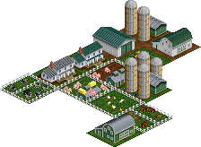
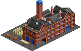
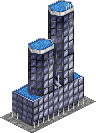
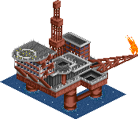

# Overview (list of industries and cargos)

## Industries

The set contains 17 industries as listed below.

### Builders yard

Description to go here

| Requires | Produces |
| -- | -- |
| [Wood products](#wood-products) |  |

### Coal mine

Description to go here

Industry will only spawn from 1800 to 1950.
This restriction is also valid for funding the industry.
| Requires | Produces |
| -- | -- |
|  | [Coal](#coal) |

### Department store

Description to go here

| Requires | Produces |
| -- | -- |
| [Goods](#goods) |  |

### Farm

Description to go here

| Requires | Produces |
| -- | -- |
|  | [Grain](#grain) |
|  | [Livestock](#livestock) |

### Fishing grounds

Description to go here

| Requires | Produces |
| -- | -- |
|  | [Fish](#fish) |

### Food processor

Description to go here

| Requires | Produces |
| -- | -- |
| [Fish](#fish) | [Food](#food) |
| [Grain](#grain) |  |
| [Livestock](#livestock) |  |

### Forest

Description to go here

| Requires | Produces |
| -- | -- |
|  | [Wood](#wood) |

### Furniture factory

Description to go here

| Requires | Produces |
| -- | -- |
| [Wood products](#wood-products) | [Goods](#goods) |

### General store

Description to go here

| Requires | Produces |
| -- | -- |
| [Food](#food) |  |

### Hotel

Description to go here

| Requires | Produces |
| -- | -- |
| [Food](#food) | [Passengers](#passengers) |
| [Passengers](#passengers) |  |

### Integrated steel mill

Description to go here

| Requires | Produces |
| -- | -- |
| [Coal](#coal) | [Steel](#steel) |
| [Iron Ore](#iron-ore) |  |

### Iron ore mine

Description to go here

| Requires | Produces |
| -- | -- |
|  | [Iron Ore](#iron-ore) |

### Oil refinery

Description to go here

Industry will only spawn after 1860.
This restriction is also valid for funding the industry.
| Requires | Produces |
| -- | -- |
| [Oil](#oil) | [Plastics](#plastics) |

### Oil rig

Description to go here

Industry will only spawn after 1985.
This restriction is also valid for funding the industry.
| Requires | Produces |
| -- | -- |
| [Passengers](#passengers) | [Oil](#oil) |
|  | [Passengers](#passengers) |

### Oil well

Description to go here

Industry will only spawn from 1860 to 1985.
This restriction is also valid for funding the industry.
| Requires | Produces |
| -- | -- |
|  | [Oil](#oil) |
|  | [Passengers](#passengers) |

### Port

Description to go here

| Requires | Produces |
| -- | -- |
| [Goods](#goods) | [Coal](#coal) |
| [Vehicles](#vehicles) | [Iron Ore](#iron-ore) |
|  | [Oil](#oil) |

### Vehicle factory

blabla

Industry will only spawn after 1910.
This restriction is also valid for funding the industry.
| Requires | Produces |
| -- | -- |
| [Steel](#steel) | [Vehicles](#vehicles) |

## Cargos

The set contains 14 cargos as listed below.

### Coal

no description yet

| Produced by | Required by |
| -- | -- |
| [Coal mine](#coal-mine) | [Integrated steel mill](#integrated-steel-mill) |
| [Port](#port) |  |

### Fish

no description yet

| Produced by | Required by |
| -- | -- |
| [Fishing grounds](#fishing-grounds) | [Food processor](#food-processor) |

### Food

no description yet

| Produced by | Required by |
| -- | -- |
| [Food processor](#food-processor) | [General store](#general-store) |
|  | [Hotel](#hotel) |

### Goods

no description yet

| Produced by | Required by |
| -- | -- |
| [Furniture factory](#furniture-factory) | [Department store](#department-store) |
|  | [Port](#port) |

### Grain

no description yet

| Produced by | Required by |
| -- | -- |
| [Farm](#farm) | [Food processor](#food-processor) |

### Iron Ore

no description yet

| Produced by | Required by |
| -- | -- |
| [Iron ore mine](#iron-ore-mine) | [Integrated steel mill](#integrated-steel-mill) |
| [Port](#port) |  |

### Livestock

no description yet

| Produced by | Required by |
| -- | -- |
| [Farm](#farm) | [Food processor](#food-processor) |

### Oil

no description yet

| Produced by | Required by |
| -- | -- |
| [Oil rig](#oil-rig) | [Oil refinery](#oil-refinery) |
| [Oil well](#oil-well) |  |
| [Port](#port) |  |

### Passengers

no description yet

| Produced by | Required by |
| -- | -- |
| [Hotel](#hotel) | [Hotel](#hotel) |
| [Oil rig](#oil-rig) | [Oil rig](#oil-rig) |
| [Oil well](#oil-well) |  |

### Plastics

no description yet

| Produced by | Required by |
| -- | -- |
| [Oil refinery](#oil-refinery) |  |

### Steel

no description yet

| Produced by | Required by |
| -- | -- |
| [Integrated steel mill](#integrated-steel-mill) | [Vehicle factory](#vehicle-factory) |

### Vehicles

no description yet

| Produced by | Required by |
| -- | -- |
| [Vehicle factory](#vehicle-factory) | [Port](#port) |

### Wood

no description yet

| Produced by | Required by |
| -- | -- |
| [Forest](#forest) |  |

### Wood products

no description yet

| Produced by | Required by |
| -- | -- |
|  | [Builders yard](#builders-yard) |
|  | [Furniture factory](#furniture-factory) |

