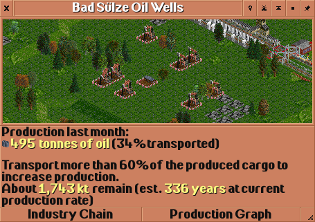
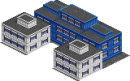
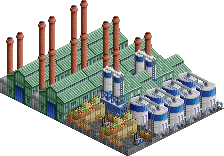
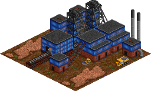
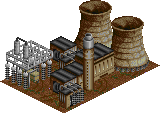
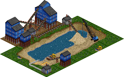

# GermanIndustries documentation

## Concepts

### Economy settings

By default, the economy is stable. No industries will simply close (except for excavating industries running out of raw materials to excavate), but new industries are randomly created.
This can be influenced by parameters.

Even if industry closures are allowed, no industry that is actively producing (stockpile is not empty, there was some production in recent time) will simply close down.
Only industries that have an empty stockpile and have not produced anything in 12 months run a small risk of being closed.

Independently from that, a realistic economy setting can be enabled by a parameter. This only influences the maximum production levels of industries. For example, historically, coal production in Germany
peaked in the 1950s and slowly declined since then. This is also modelled in the set for excavating industries. Secondary industries are not affected by this setting, their production only depends on the amount of delivered raw materials.

Some industries are only available in a certain time frame. Mines for example will not be available before 1800, modelling the fact that only the introduction of steam engines allowed constant water pumping to allow for deeper mining.
Certain chemical industries are only available from the middle of the 19th century, and vehicle production starts in 1910. Historically, certain industries have been given up over time, e.g. oil wells or coal mines.
That means the set will not create new industries of these types after certain years.

### Electricity

If the corresponding setting is enabled, some industries require electricity to produce anything.
Electricity is "produced" by power plants.
Technically, electricity is no cargo that can be transported, the distribution is done automatically.

Each industry belongs to exactly one city. Same for power stations. The electricity that is provided by a power station is distributed to the city and can be accessed by all industries belonging to that city.
Electricity demand depends on the size of the city (the bigger the city, the more electricity it will need) and on production levels of the industry.
If the power plant provides enough electricity, everything is fine. If not, industry production will be reduced or - in the worst case - completely stopped.
The relevant information is shown from the industry window of the industries and power plants.

The power plant shows the current demand and production levels. Demand is - as explained above - the sum of a base value depending on town size and the combined demands of all industries in that town.

These three screenshots show the same industry in different situations - no power available, some power available (but not enough to produce at full capacity) and enough power available.

### Modularity

The set is designed to be modular.
The basic industry chain is rather simple and comparable to the original industry chain.
However, you can now activate extensions via parameter.
These extensions add further industries and cargos, and also modify existing industries.
That way, each player can configure the set according to their personal taste.
One player may wish to play on a small map with few industries, another one wants to play on a huge map with many different industries, and others may want to focus on certain kinds of industries.
Most extensions can be enabled independently from the others.

### Production levels

Primary industries (those that do not require raw materials, e.g. mines, farms, oil wells), will increase their production if a high percentage of the produced cargo is transported.
Over time, production will simply increase or decrease to match the transport capacities.

Industries that depend on raw materials (see [Stockpiling](#stockpiling) will take 10% of the available stockpile for production with each production event (around 8 times per month, assuming default settings).
So when e.g. 100t raw material is available, the first production event will consume 10t, leaving 90t remaining. The next production event will consume 9t, leaving 81t.
This continues until the stockpile is depleted.

The output then depends on the amount of raw materials consumed, and on the industry itself. Each industry has custom hardcoded values related to which percentage of the input is converted into output.
Chemical industries for example may produce not just one output, but also carbon dioxide or other waste, which is then of course not part of the output.

On top of that, industry output may depend on the number of different raw materials that are delivered. The basic food processor for example produces food from grain, livestock and fish, but you do not need to
provide them all - it will start producing if any of these cargos is stockpiled. However, the output is reduced. If you provide all three raw materials, production output will increase drastically.

Each industry provides information on the dependencies in the information window.

This industry depends on multiple raw materials, but starts production as soon as any raw material is available.

This industry has optional input materials. It depends on all the materials marked in black, but overall production is limited as long as the optional cargo is unavailable.

This industry has optional input materials, but starts production as soon as any of the mandatory materials is available.
Overall production level increases with the number of different raw materials available.

### Resource depletion

Extractive industries such as mines and oil wells are generated with a random amount of raw materials to excavate. The industry then produces, and over time the raw materials become less and less.
Once no more raw materials are available, the industry will close. The industry information window shows how much material is left and how long this will last if production levels do not change.

The screenshot shows how the information is displayed.
This should allow the player to properly plan ahead.

### Stockpiling

Most industries require raw materials to produce anything. Depending on industry, different models of dependencies are applied.
In the most simple case, the industry requires all listed raw materials. For example, the basic steel mill without any extensions activated requires both coal and iron ore. If only one is supplied, it
will simply be stockpiled, but not used for production.

Some industries have optional raw material. These are marked in white in the stockpile list. Optional raw materials are not needed to produce anything, but they will increase the output.

The maximum size of the stockpile is hard coded in the game at 65.535 units. If you reach that limit, nothing much will happen, the next delivery of raw materials will simply be discarded (but you will get paid).
However, since production scales with stockpile size, it should be hard to run into that limit, unless you deliberately miss on delivering relevant raw materials so that nothing will get produced at all.

## Parameters

The set comes with a number of parameters to customize and tweak the behavior:

- The production of excavating industries (mines, oil wells, ...) can be scaled to fit your needs. Depending on the vehicle set in use, a higher or lower production may be desirable.
- The economy model (stable or realistic). This influences the production levels of excavating industries, as e.g. coal mines reached their peak production in Germany already in the 1950s. With the realistic model,
production will then decline, regardless of how well you serve the industries.
- Enable or disable that certain industries require electricity for production. See also [Electricity](#electricity).
- Forbid industry generation. When enabled, no new industries will spawn after the initial map generation. The player can still fund new industries.
- Forbid industry closure. When enabled, no industries will ever close. When disabled, industries that have not seen any service in 12 months run a risk of closing down.
- Enable/disable the various extensions. Each of these adds further cargos and industries and changes the industry chains. See [Extensions](#extensions) for a detailed listing.

## Basic delivery chain

The set comes with a basic set of industries and cargos. These are listed as follows:

[Coal](#cargo_COAL) [Fish](#cargo_FISH) [Food](#cargo_FOOD) [Goods](#cargo_GOOD) [Grain](#cargo_GRAI) [Iron Ore](#cargo_IORE) [Livestock](#cargo_LVST) [Mail](#cargo_MAIL) [Oil](#cargo_OIL_) [Passengers](#cargo_PASS) [Plastics](#cargo_PLAS) [Sand](#cargo_SAND) [Steel](#cargo_STEL) [Timber](#cargo_WDPR) [Vehicles](#cargo_VEHI) [Wood](#cargo_WOOD) 

[Builders Yard](#industry_4) [Coal Mine](#industry_9) [Department Store](#industry_12) [Farm](#industry_14) [Fishing Grounds](#industry_15) [Food Processing Plant](#industry_16) [Forest](#industry_18) [Furniture Factory](#industry_20) [General Store](#industry_21) [Hotel](#industry_22) [Integrated Steel Mill](#industry_23) [Iron Ore Mine](#industry_24) [Oil Rig](#industry_26) [Oil Wells](#industry_27) [Plastics Plant](#industry_31) [Port](#industry_35) [Power Station](#industry_39) [Sawmill](#industry_42) [Vehicle Distributor](#industry_45) [Vehicle Factory](#industry_46) 

If an industry box contains a year, it is the first year that this industry can be generated/funded. If the box contains two years it contains the start and end year of the range in which this industry can be generated/funded.

The colors of the arrows match with the colors used in the industry chain view in the game (except for electricity, which is not a cargo to be transported, see [Electricity](#electricity)).
Unless mentioned in the industry box, the industry requires all incoming cargos to be present in order to produce anything.

## Extensions

The image depicts the interactions between the different extensions. Each extension uses a different color here. If the extension is not enabled, you can ignore the arrows connected to it.
A cargo shown in a colored box is part of the extension of the same color, so if that extension is not enabled, the cargo is not active either.
For each extension, an extra diagram is available to see the detailed connections between their cargos and industries.

The set contains 5 extensions as listed below.

### Aluminium

Aluminium is a light metal discovered in 1825. By the end of the 19th century, mass-production had been started, and during the 20th century, it became the most important non-ferrous metal for industrial applications. It is way lighter than steel, an excellent conductor and can be be formed and shaped rather easily. Without aluminium, aviation is pretty much impossible. Similarly, it has widespread usage in the automobile sector, and of course it is a household item in the form of aluminium foil and cans. Production of Aluminium is concentrated in Southeast Asia and Australia, Norway is the largest producer in Europe. 

Color in the industry charts of this documentation: &nbsp;&nbsp;&nbsp;&nbsp;&nbsp;&nbsp;

#### Cargos

* [Aluminium](#cargo_ALUM)
* [Bauxite](#cargo_AORE)

#### Industries introduced

* [Aluminium Plant](#industry_0)
* [Aluminium Plant](#industry_1)

#### Industries modified

* [Aluminium Plant](#industry_0)
* [Aluminium Plant](#industry_1)
* [Port](#industry_36)
* [Port](#industry_38)
* [Vehicle Factory](#industry_47)
* [Vehicle Factory](#industry_49)

### Basic Inorganic Chemistry

Inorganic chemistry covers chemical compounds that are not carbon-based. This includes countless minerals, acids, lyes and of course metals. With the progress of chemistry, these fields became increasingly relevant, as a wide range of industries require various chemicals. Historically, the production levels of sulfuric acid and chlorine were indicators for the industrialization of a country. This extension introduces a number of base chemical compounds and their production industries, which are a prerequisite for other extensions. 

Color in the industry charts of this documentation: &nbsp;&nbsp;&nbsp;&nbsp;&nbsp;&nbsp;

#### Cargos

* [Chlorine](#cargo_CHLO)
* [Hydrogen](#cargo_H2__)
* [Lye](#cargo_LYE_)
* [Salt](#cargo_SALT)

#### Industries introduced

* [Chloralkali process plant](#industry_7)
* [Pharmaceutical Plant](#industry_30)
* [Salt Mine](#industry_40)

#### Industries modified

* [Aluminium Plant](#industry_1)
* [Chloralkali process plant](#industry_7)
* [Food Processing Plant](#industry_17)
* [Pharmaceutical Plant](#industry_30)
* [Plastics Plant](#industry_32)
* [Plastics Plant](#industry_34)
* [Salt Mine](#industry_40)

### Building Industries

Masonry, the craft of constructing walls and buildings from stone, is one of the oldest achievements of human civilization. Starting from burning bricks from mud in ancient times a whole industry evolved. In the 19th century, industrial level production of bricks were needed for all the new industrial buildings. Stone bridges such as the famous Göltzschtalbrücke in Saxony, the largest brick-built bridge in the world, give testament to the relevance of these industries in the 19th century. Bricks finally gave way to cement and concrete, allowing the construction of modern skyscrapers. 

Color in the industry charts of this documentation: &nbsp;&nbsp;&nbsp;&nbsp;&nbsp;&nbsp;

#### Cargos

* [Bricks](#cargo_BDMT)
* [Cement](#cargo_CMNT)
* [Limestone](#cargo_LIME)

#### Industries introduced

* [Brickworks](#industry_2)
* [Cement Plant](#industry_6)
* [Limestone Mine](#industry_25)
* [Sand pit](#industry_41)

#### Industries modified

* [Brickworks](#industry_2)
* [Builders Yard](#industry_3)
* [Cement Plant](#industry_6)
* [Limestone Mine](#industry_25)
* [Paint Factory](#industry_29)
* [Sand pit](#industry_41)

### Painting Industries

For thousands of years, paints and pigments such as Indigo had been produced from plants and various powders, which made it prohibitely expensive for industrial scale uses. The production of artificial colors was one of the first important uses of the chemical industry. In fact, some of the biggest chemical companies in Germany started as producers of paints and dyes, such as Agfa and BASF (both derived parts of their name from Anilin, a base chemical used in the production of paints). In 1925 the biggest German chemical companies joined together in the so-called I.G. Farben (literally "interest group paint industries"), which became the biggest chemical company in the world prior to World War 2. Even today, paints, dyes, pigments and related products are a staple of the chemical industry and see wide uses in many other areas, be it textile, plastics production, construction or in the automobile sector. 

Color in the industry charts of this documentation: &nbsp;&nbsp;&nbsp;&nbsp;&nbsp;&nbsp;

#### Cargos

* [Carbon Black](#cargo_CBLK)
* [Copper](#cargo_COPR)
* [Copper Ore](#cargo_CORE)
* [Paint](#cargo_COAT)

#### Industries introduced

* [Carbon Black Plant](#industry_5)
* [Copper Ore Mine](#industry_10)
* [Copper Smelter](#industry_11)
* [Paint Factory](#industry_28)
* [Paint Factory](#industry_29)

#### Industries modified

* [Carbon Black Plant](#industry_5)
* [Copper Ore Mine](#industry_10)
* [Copper Smelter](#industry_11)
* [Paint Factory](#industry_28)
* [Paint Factory](#industry_29)
* [Plastics Plant](#industry_33)
* [Plastics Plant](#industry_34)
* [Port](#industry_37)
* [Port](#industry_38)
* [Textile Mill](#industry_44)
* [Vehicle Factory](#industry_48)
* [Vehicle Factory](#industry_49)

### Textile Industries

The production of yarns and textiles to create clothes was one of the very first cultural achievements of mankind. Sources for the production include various natural sources such as wool from sheep and other animals as well as cotton and other plants. With the innovations of the chemical industry in the 20th century, artificial fibers such as polyester became available. 

Textile manufacturing was a laborious process and was among the first to be affected heavily by industrialization in the 18th century in England. Germany also had a strong textile manufacturing industry in Saxony and Silesia, which in turn benefitted from industrialization. Chemnitz in Saxony became a center of mechanical engineering with a focus on the production of machines for the textile industry. However, since the middle of the 20th century, the industry is shrinking, and nowadays most of the textile industry has moved to Asia for cost-related reasons. 

Color in the industry charts of this documentation: &nbsp;&nbsp;&nbsp;&nbsp;&nbsp;&nbsp;

#### Cargos

* [Textiles](#cargo_TEXT)
* [Wool](#cargo_WOOL)

#### Industries introduced

* [Clothing Plant](#industry_8)
* [Textile Mill](#industry_43)
* [Textile Mill](#industry_44)

#### Industries modified

* [Clothing Plant](#industry_8)
* [Farm](#industry_13)
* [Furniture Factory](#industry_19)
* [Textile Mill](#industry_43)
* [Textile Mill](#industry_44)

## Cargos

The set contains 31 cargos as listed below.

### Aluminium

Aluminium is a light metal that is widely used everywhere, where steel is too heavy. It is relevant for building airplanes and cars, but also household items like aluminium foil or cans. Although it is rather ubiquitous on Earth, it is difficult to produce pure aluminium or alloys for technical use. Widespread usage only began in the early 20th century. Germany is one of the largest producers of Aluminium in Europe (and the biggest consumer), even though energy costs are comparably high. 

Cargo Table Entry: ALUM

Part of extension: [Aluminium](#extension_0)

Cargo classes: Piece goods

Color in the industry chain view: &nbsp;&nbsp;&nbsp;&nbsp;&nbsp;&nbsp;

| Produced by | Required by |
| -- | -- |
| [Aluminium Plant](#industry_0) | [Vehicle Factory](#industry_47) |
| [Aluminium Plant](#industry_1) | [Vehicle Factory](#industry_49) |

### Bauxite

Bauxite is the ore out of which aluminium is produced. Germany does not have any sources of bauxite, it is all imported. 

Cargo Table Entry: AORE

Part of extension: [Aluminium](#extension_0)

Cargo classes: Bulk

Color in the industry chain view: &nbsp;&nbsp;&nbsp;&nbsp;&nbsp;&nbsp;

| Produced by | Required by |
| -- | -- |
| [Port](#industry_36) | [Aluminium Plant](#industry_0) |
| [Port](#industry_38) | [Aluminium Plant](#industry_1) |

### Bricks

Bricks have been used for all sorts of masonry construction since ancient times. With the onset of industrialization in the 19th century, demand arose for mass-produced cheap bricks to build factory buildings, bridges and many other structures. Even today, bricks are still relevant, although they cannot be used for skyscrapers for structural reasons. 

Cargo Table Entry: BDMT

Part of extension: [Building Industries](#extension_2)

Cargo classes: Piece goods

Color in the industry chain view: &nbsp;&nbsp;&nbsp;&nbsp;&nbsp;&nbsp;

| Produced by | Required by |
| -- | -- |
| [Brickworks](#industry_2) | [Builders Yard](#industry_3) |

### Carbon Black

Carbon black is a powder of practically pure elemental carbon. It is used as a black pigment in paints, inks and plastics. The main use is in the production of rubber for automobile tires. 

Cargo Table Entry: CBLK

Part of extension: [Painting Industries](#extension_3)

Cargo classes: Bulk, Covered, Piece goods, Powderized

Color in the industry chain view: &nbsp;&nbsp;&nbsp;&nbsp;&nbsp;&nbsp;

| Produced by | Required by |
| -- | -- |
| [Carbon Black Plant](#industry_5) | [Paint Factory](#industry_28) |
|  | [Paint Factory](#industry_29) |

### Cement

Cement is a key ingredient in the production of mortar and concrete, which are the most widely used material in existence and one of the most consumed resources in the world. Without it, none of the modern skyscrapers could be built. 

Cargo Table Entry: CMNT

Part of extension: [Building Industries](#extension_2)

Cargo classes: Bulk, Covered, Powderized

Color in the industry chain view: &nbsp;&nbsp;&nbsp;&nbsp;&nbsp;&nbsp;

| Produced by | Required by |
| -- | -- |
| [Cement Plant](#industry_6) | [Builders Yard](#industry_3) |

### Chlorine

Chlorine is a highly reactive chemical element which is relevant for bleaching (e.g. in the production of paper) and disinfecting. Additionally, it is also required for many processes in the chemical industry in general, most importantly to produce a wide range of plastics such as PVC. In higher concentrations chlorine is highly dangerous and poisonous to most living organisms and has historically been used in chemical warfare. Since the early 20th century chlorine is mainly produced by splitting salt using electrolysis in the so-called chloralkali process. 

Cargo Table Entry: CHLO

Part of extension: [Basic Inorganic Chemistry](#extension_1)

Cargo classes: Hazardous, Liquid

Color in the industry chain view: &nbsp;&nbsp;&nbsp;&nbsp;&nbsp;&nbsp;

| Produced by | Required by |
| -- | -- |
| [Chloralkali process plant](#industry_7) | [Pharmaceutical Plant](#industry_30) |
|  | [Plastics Plant](#industry_32) |
|  | [Plastics Plant](#industry_34) |

### Coal

Coal was the main driver of industrializaton in the 19th century, begin required to power steam engines. With the introduction of railway steam engines and later on power plants to produce electricity, the demand for coal rose rapidly. 

Germany had relevant coal deposits, and the areas were coal was mined became industrial centers, such as the Ruhr area and Silesia. Coal remained important throughout the 20th century, but it was phased out in many areas for environmental reasons. 

Cargo Table Entry: COAL

Cargo classes: Bulk

Color in the industry chain view: &nbsp;&nbsp;&nbsp;&nbsp;&nbsp;&nbsp;

| Produced by | Required by |
| -- | -- |
| [Coal Mine](#industry_9) | [Brickworks](#industry_2) |
| [Port](#industry_35) | [Carbon Black Plant](#industry_5) |
| [Port](#industry_36) | [Integrated Steel Mill](#industry_23) |
| [Port](#industry_37) | [Power Station](#industry_39) |
| [Port](#industry_38) |  |

### Copper

Copper is a metal which has been known for thousands of years and was among the first metals to be used by mankind. It is easy to shape and form and has a wide range of applications: today it is mainly used for wiring, cables and all sorts of electrical equipment. Historically it has been used to create paints and as material for rooftops. 

Cargo Table Entry: COPR

Part of extension: [Painting Industries](#extension_3)

Cargo classes: Piece goods

Color in the industry chain view: &nbsp;&nbsp;&nbsp;&nbsp;&nbsp;&nbsp;

| Produced by | Required by |
| -- | -- |
| [Copper Smelter](#industry_11) | [Paint Factory](#industry_28) |
|  | [Paint Factory](#industry_29) |

### Copper Ore

Copper ore describes a variety of ores from which copper can be extracted. Mining for copper ore can be dated back thousands of years to the so-called copper age. Nowadays, copper ore is of central importance due to copper being one of the most important metals for industrial production. 

Germany does not have a lot of copper ores, still mining was done until the late 20th century, mainly in Eastern Germany where there was only limited access to the world market. Still, even today, Germany has the largest capacities of copper producing industries, requiring imports of copper ore. 

Cargo Table Entry: CORE

Part of extension: [Painting Industries](#extension_3)

Cargo classes: Bulk

Color in the industry chain view: &nbsp;&nbsp;&nbsp;&nbsp;&nbsp;&nbsp;

| Produced by | Required by |
| -- | -- |
| [Copper Ore Mine](#industry_10) | [Copper Smelter](#industry_11) |
| [Port](#industry_37) |  |
| [Port](#industry_38) |  |

### Fish

Mankind has been fishing since ancient times. In the game, fish makes for interesting transport chains from boats via harbors across the land into the cities or production plants. 

Cargo Table Entry: FISH

Cargo classes: Express, Refrigerated

Color in the industry chain view: &nbsp;&nbsp;&nbsp;&nbsp;&nbsp;&nbsp;

| Produced by | Required by |
| -- | -- |
| [Fishing Grounds](#industry_15) | [Food Processing Plant](#industry_16) |
|  | [Food Processing Plant](#industry_17) |

### Food

People need to eat, and ever since people started living in cities there was a demand to transport all sorts of food into cities. Even today, fresh fruit and other local food can be bought on market places, while most of the industrially produced food is transported from production plants to supermarkets. 

Cargo Table Entry: FOOD

Cargo classes: Express, Refrigerated

Color in the industry chain view: &nbsp;&nbsp;&nbsp;&nbsp;&nbsp;&nbsp;

| Produced by | Required by |
| -- | -- |
| [Food Processing Plant](#industry_16) | [General Store](#industry_21) |
| [Food Processing Plant](#industry_17) | [Hotel](#industry_22) |

### Goods

In the game, Goods are an abstraction of basically anything that is produced in various plants to be sold to people living in cities. As such, goods could be anything from furniture, household items, clothing or toys. 

Cargo Table Entry: GOOD

Cargo classes: Express

Color in the industry chain view: &nbsp;&nbsp;&nbsp;&nbsp;&nbsp;&nbsp;

| Produced by | Required by |
| -- | -- |
| [Clothing Plant](#industry_8) | [Department Store](#industry_12) |
| [Furniture Factory](#industry_19) | [Port](#industry_35) |
| [Furniture Factory](#industry_20) | [Port](#industry_36) |
| [Pharmaceutical Plant](#industry_30) | [Port](#industry_37) |
|  | [Port](#industry_38) |

### Grain

Germany is equally famous for the variety in bread and beer, both of which are produced from grain. It is also one of the biggest producers of grain in Europe, being able to fully cover domestic demand. A large quantity of grain is simply used for feeding livestock, only about a fifth is actually used to create food, and less than 10% are needed to make beer. On top of that, lots of grain is exported, especially wheat. 

Cargo Table Entry: GRAI

Cargo classes: Bulk

Color in the industry chain view: &nbsp;&nbsp;&nbsp;&nbsp;&nbsp;&nbsp;

| Produced by | Required by |
| -- | -- |
| [Farm](#industry_13) | [Food Processing Plant](#industry_16) |
| [Farm](#industry_14) | [Food Processing Plant](#industry_17) |

### Hydrogen

Hydrogen is the most basic and most common chemical element in the universe. On Earth, it is mostly found in compounds, most notably water and hydrocarbons such as oil. It sees a wide range of applications in the chemical industry, most importantly in the production of ammonia. Apart from that, it is used as rocket fuel, but also has applications as coolant and in cryogenics. 

Cargo Table Entry: H2__

Part of extension: [Basic Inorganic Chemistry](#extension_1)

Cargo classes: Hazardous, Liquid

Color in the industry chain view: &nbsp;&nbsp;&nbsp;&nbsp;&nbsp;&nbsp;

| Produced by | Required by |
| -- | -- |

### Iron Ore

Mankind has been using iron since the, well, Iron Age, some 3000 years ago. It is almost exclusively used to produce steel, which in turn is one of the single most important materials in global economy. 

Germany has only ever had scarce resources of iron ore, and was always dependent on importing iron ore from e.g. Sweden. 

Cargo Table Entry: IORE

Cargo classes: Bulk

Color in the industry chain view: &nbsp;&nbsp;&nbsp;&nbsp;&nbsp;&nbsp;

| Produced by | Required by |
| -- | -- |
| [Iron Ore Mine](#industry_24) | [Integrated Steel Mill](#industry_23) |
| [Port](#industry_35) | [Paint Factory](#industry_28) |
| [Port](#industry_36) | [Paint Factory](#industry_29) |
| [Port](#industry_37) |  |
| [Port](#industry_38) |  |

### Limestone

Limestone is a type of rock that is composed mainly of calcium carbonate. It is relevant for the production of cement, but can also be used as building material directly. Moreover, it has many uses as raw material in the chemical industry and is also essential in the production of steel and glass. 

Cargo Table Entry: LIME

Part of extension: [Building Industries](#extension_2)

Cargo classes: Bulk

Color in the industry chain view: &nbsp;&nbsp;&nbsp;&nbsp;&nbsp;&nbsp;

| Produced by | Required by |
| -- | -- |
| [Limestone Mine](#industry_25) | [Cement Plant](#industry_6) |
|  | [Paint Factory](#industry_29) |

### Livestock

Meat was and still is an important part of human diet, and as such livestock farming is an important part of the food production. Transporting livestock also provides for specific challenges in the game, often requiring dedicated rolling stock. 

Cargo Table Entry: LVST

Cargo classes: Piece goods

Color in the industry chain view: &nbsp;&nbsp;&nbsp;&nbsp;&nbsp;&nbsp;

| Produced by | Required by |
| -- | -- |
| [Farm](#industry_13) | [Food Processing Plant](#industry_16) |
| [Farm](#industry_14) | [Food Processing Plant](#industry_17) |

### Lye

Lye is the common name for various alkaline solutions. They have a wide range of applications in the creation of cleaning agents and soaps, but also in the food industry. A huge percentage of lye is industrially used in the paper industry, but it also sees widespread application in the production of dyes and bleaches. Lye, at least in the form of sodium hydroxide, is produced by splitting salt using electrolysis in the so-called chloralkali process. 

Cargo Table Entry: LYE_

Part of extension: [Basic Inorganic Chemistry](#extension_1)

Cargo classes: Hazardous, Liquid

Color in the industry chain view: &nbsp;&nbsp;&nbsp;&nbsp;&nbsp;&nbsp;

| Produced by | Required by |
| -- | -- |
| [Chloralkali process plant](#industry_7) | [Aluminium Plant](#industry_1) |
|  | [Food Processing Plant](#industry_17) |

### Mail

Transporting mail has always been one of the main tasks of any transportation network. Mail coaches had been in use for hundreds of years, only to be replaced by railway lines and later on by trucks. While the number of letters and postcards being sent has been declining in the 21st century - being replaced by phone calls and message services via Internet - mail carriers are now in more demand than ever to transport packages from online shopping. 

Cargo Table Entry: MAIL

Cargo classes: Mail

Color in the industry chain view: &nbsp;&nbsp;&nbsp;&nbsp;&nbsp;&nbsp;

| Produced by | Required by |
| -- | -- |

### Oil

Oil was already known in ancient Babylon. During the 19th century it was mainly used to produce petroleum, which in turn was used as lamp oil. It was only with the invention of internal combustion engines and their dependence on fuel that crude oil became the economic and political factor that it is today. 

Apart from being used as fuel and simply being burned, oil of course is the base for what became known as petrochemicals. This started in the 1920s with synthetic rubber for tyres, in the late 1930s nylon fibers were invented, and today oil based plastics can be found just about everywhere. 

With so many uses, demand was ever increasing, and today the German industry is almost entirely dependent on oil imports, which is not only an economic issue, but also has great political implications. 

Cargo Table Entry: OIL_

Cargo classes: Liquid

Color in the industry chain view: &nbsp;&nbsp;&nbsp;&nbsp;&nbsp;&nbsp;

| Produced by | Required by |
| -- | -- |
| [Oil Rig](#industry_26) | [Carbon Black Plant](#industry_5) |
| [Oil Wells](#industry_27) | [Plastics Plant](#industry_31) |
| [Port](#industry_35) | [Plastics Plant](#industry_32) |
| [Port](#industry_36) | [Plastics Plant](#industry_33) |
| [Port](#industry_37) | [Plastics Plant](#industry_34) |
| [Port](#industry_38) | [Power Station](#industry_39) |

### Paint

Paints are as old as mankind, having been used already to create cave-paintings tens of thousands of years ago. Lots of different paints have been known since ancient times, often times being very expensive due to the rarity of the organic ingredients like plant leaves. With the development of modern chemistry, all sorts of compounds were developed to create synthetic paints and dyes, which see a wide range of applications. Just to name a few, lots of paints and coatings are needed in the automobile industry, while dyes are used in the textile industry, among many others. They are also simply household items, as paints are used to color walls and inks are used for writing. 

Cargo Table Entry: COAT

Part of extension: [Painting Industries](#extension_3)

Cargo classes: Liquid, Piece goods

Color in the industry chain view: &nbsp;&nbsp;&nbsp;&nbsp;&nbsp;&nbsp;

| Produced by | Required by |
| -- | -- |
| [Paint Factory](#industry_28) | [Plastics Plant](#industry_33) |
| [Paint Factory](#industry_29) | [Plastics Plant](#industry_34) |
|  | [Textile Mill](#industry_44) |
|  | [Vehicle Factory](#industry_48) |
|  | [Vehicle Factory](#industry_49) |

### Passengers

Whether it's business trips or vacation - people need and want to travel. For centuries travelling was limited to walking or riding, so technical innovations were mainly driven by increasing travel speed. This led to building harbors, road and railway networks, and finally airports. Travel not only became faster, but also cheaper - allowing trips that were unthinkable not so long ago. 

Cargo Table Entry: PASS

Cargo classes: Passengers

Color in the industry chain view: &nbsp;&nbsp;&nbsp;&nbsp;&nbsp;&nbsp;

| Produced by | Required by |
| -- | -- |
| [Hotel](#industry_22) | [Hotel](#industry_22) |
| [Oil Rig](#industry_26) | [Oil Rig](#industry_26) |

### Plastics

Plastics are a range of synthetic materials created mainly from crude oil. They were invented in the early 20th century and provided cheap, lightweight and durable materials for just about anything imaginable. Most of it is used for packaging, but it is also used for construction (pipes), in all sorts of machinery from hoovers to cars as well as furniture and toys - Lego bricks for example. 

In the set, this also incorporate synthetic materials that do not have the characteristic plasticity, so it also includes fibers which are relevant for clothing, like nylon and polyester. 

Cargo Table Entry: PLAS

Cargo classes: Bulk, Covered

Color in the industry chain view: &nbsp;&nbsp;&nbsp;&nbsp;&nbsp;&nbsp;

| Produced by | Required by |
| -- | -- |
| [Plastics Plant](#industry_31) | [Furniture Factory](#industry_19) |
| [Plastics Plant](#industry_32) | [Furniture Factory](#industry_20) |
| [Plastics Plant](#industry_33) | [Textile Mill](#industry_43) |
| [Plastics Plant](#industry_34) | [Textile Mill](#industry_44) |
|  | [Vehicle Factory](#industry_46) |
|  | [Vehicle Factory](#industry_47) |
|  | [Vehicle Factory](#industry_48) |
|  | [Vehicle Factory](#industry_49) |

### Salt

Salt has been used since ancient times to conserve food. Up until the end of middle ages, salt was treated as white gold and it played a pivotal role in trade, taxes and economy in general. This only changed when mining salt became possible due to improved technical means in the 19th century. Additionally, with the progress of science and chemistry in the 19th century, salt became an all-important raw material to produce chlorine, lye and soda, which in turn are some of the most important basic chemicals for industrial purposes. Today, about 80% of the salt mined in Germany is used for industrial purposes, less than 5% are used in the food industry. 

Cargo Table Entry: SALT

Part of extension: [Basic Inorganic Chemistry](#extension_1)

Cargo classes: Bulk, Covered

Color in the industry chain view: &nbsp;&nbsp;&nbsp;&nbsp;&nbsp;&nbsp;

| Produced by | Required by |
| -- | -- |
| [Salt Mine](#industry_40) | [Chloralkali process plant](#industry_7) |
|  | [Food Processing Plant](#industry_17) |

### Sand

Sand is a granular material found all over the world. It mainly consists of silica in the form of particles of varying size. Sand is widely used in many industries, especially in the creation of bricks, mortar and concrete, but also as a source for silicon which has widespread uses in electronics. 

Cargo Table Entry: SAND

Cargo classes: Bulk

Color in the industry chain view: &nbsp;&nbsp;&nbsp;&nbsp;&nbsp;&nbsp;

| Produced by | Required by |
| -- | -- |
| [Sand pit](#industry_41) | [Builders Yard](#industry_3) |
|  | [Cement Plant](#industry_6) |

### Steel

Steel, which is an alloy of iron and carbon, has already been produced more than 2000 years ago, mainly in Asia. In the 16th and 17th century, industrial steel production began in Europe, especially in England. Technical innovations in the 19th century led to a process of converting pig iron to steel, allowing a cheap mass production of high quality steel. Likewise, demand increased exponentially, as steel was needed for railways, replaced wood to build bigger ships, and is also needed for buildings, bridges and many other structures. 

The first steel production plant in Germany was founded in the early 19th century in Essen in the middle of the Ruhr area, which later evolved into the Krupp steelworks company. Today, Germany is by far the biggest producer of steel in Europe. 

Cargo Table Entry: STEL

Cargo classes: Piece goods

Color in the industry chain view: &nbsp;&nbsp;&nbsp;&nbsp;&nbsp;&nbsp;

| Produced by | Required by |
| -- | -- |
| [Integrated Steel Mill](#industry_23) | [Vehicle Factory](#industry_46) |
|  | [Vehicle Factory](#industry_47) |
|  | [Vehicle Factory](#industry_48) |
|  | [Vehicle Factory](#industry_49) |

### Textiles

Textile is an umbrella term for various fiber-based materials such as yarns, threads and various types of fabric. Textiles are mainly used to produce clothing, but they also see use in producing furniture, curtains, carpets and other household items. Additionally, there are industrial textiles used to for e.g. car seatbelts or medical textiles for e.g. bandages, among many other uses. In the set, textiles are used as material for various goods-producing industries. 

Cargo Table Entry: TEXT

Part of extension: [Textile Industries](#extension_4)

Cargo classes: Covered, Piece goods

Color in the industry chain view: &nbsp;&nbsp;&nbsp;&nbsp;&nbsp;&nbsp;

| Produced by | Required by |
| -- | -- |
| [Textile Mill](#industry_43) | [Clothing Plant](#industry_8) |
| [Textile Mill](#industry_44) | [Furniture Factory](#industry_19) |

### Timber

Wood in the form of trees cannot be used directly, it has to be cut into various shapes and forms to be used as building material or for use in the industry, e.g. to create furniture. In the set, timber is encompassing all sorts of wood that has been processed for use in construction, i.e. cut into beams or planks. As such, it is transported from sawmills to builders yards in the cities. 

Cargo Table Entry: WDPR

Cargo classes: Piece goods

Color in the industry chain view: &nbsp;&nbsp;&nbsp;&nbsp;&nbsp;&nbsp;

| Produced by | Required by |
| -- | -- |
| [Sawmill](#industry_42) | [Builders Yard](#industry_3) |
|  | [Builders Yard](#industry_4) |
|  | [Furniture Factory](#industry_19) |
|  | [Furniture Factory](#industry_20) |

### Vehicles

In the broadest sense, a vehicle is a self-propelled land-vehicle used to transport people and/or cargo. In the game, it basically means cars. 

These are produced by vehicle factories and need to be transported to dealerships and to harbours for export. Cars are one of the most important goods to be produced and exported in Germany. From the point of gameplay, they also offer a specific challenge, since they require specific railcars and trucks for transportation. 

Cargo Table Entry: VEHI

Cargo classes: Oversized, Piece goods

Color in the industry chain view: &nbsp;&nbsp;&nbsp;&nbsp;&nbsp;&nbsp;

| Produced by | Required by |
| -- | -- |
| [Vehicle Factory](#industry_46) | [Port](#industry_35) |
| [Vehicle Factory](#industry_47) | [Port](#industry_36) |
| [Vehicle Factory](#industry_48) | [Port](#industry_37) |
| [Vehicle Factory](#industry_49) | [Port](#industry_38) |
|  | [Vehicle Distributor](#industry_45) |

### Wood

Wood has been used by the first humans already, be it to build hunting spears or to kindle fires. Then buildings were made of wood, ships were built, and it was figured out how to produce paper. Today, wood is still an important resource, gaining new importance due to its regenerative nature. 

Germany always had lots of forests and thus wood always was an economic factor. Today, Germany is the biggest producer of paper in Europe and also has a relevant furniture industry. 

Cargo Table Entry: WOOD

Cargo classes: Piece goods

Color in the industry chain view: &nbsp;&nbsp;&nbsp;&nbsp;&nbsp;&nbsp;

| Produced by | Required by |
| -- | -- |
| [Forest](#industry_18) | [Sawmill](#industry_42) |

### Wool

Wool is a textile fiber obtained mainly from sheep and used to produces yarn, out of which textiles are produced. In the set, it is produced by farms and can be transported to textile mills. 

Cargo Table Entry: WOOL

Part of extension: [Textile Industries](#extension_4)

Cargo classes: Covered, Piece goods

Color in the industry chain view: &nbsp;&nbsp;&nbsp;&nbsp;&nbsp;&nbsp;

| Produced by | Required by |
| -- | -- |
| [Farm](#industry_13) | [Textile Mill](#industry_43) |
|  | [Textile Mill](#industry_44) |

## Industries

### Aluminium Plant

The aluminium plant produces aluminium out of bauxite, an aluminium ore. This process consists of two steps, in the first one the bauxite is split up in a chemical process to get rid of impurities in the ore before creating aluminium oxide. The second step then splits up the aluminium oxide using elektrolysis. This requires lots of electricity and produces huge amounts of carbon dioxide. This makes production only viable in places where cheap electricity is available. 

In Germany, there is only one actual company left that still produces Aluminium. It operates three plants which mainly produce Aluminium from scrap metal. 

Industry requires extension(s): [Aluminium](#extension_0) 

Industry is not available with these extension: [Basic Inorganic Chemistry](#extension_1) 

Industry will only spawn after 1900.
This restriction is also valid for funding the industry.

Color in the overview map: &nbsp;&nbsp;&nbsp;&nbsp;&nbsp;&nbsp;

Industry requires electricity to produce anything. See [Electricity](#electricty).

| Requires | Produces |
| -- | -- |
| [Bauxite](#cargo_AORE) | [Aluminium](#cargo_ALUM) |

### Aluminium Plant

The aluminium plant produces aluminium out of bauxite, an aluminium ore. This process consists of two steps, in the first one the bauxite is split up in a chemical process to get rid of impurities in the ore before creating aluminium oxide. The second step then splits up the aluminium oxide using elektrolysis. This requires lots of electricity and produces huge amounts of carbon dioxide. This makes production only viable in places where cheap electricity is available. 

In Germany, there is only one actual company left that still produces Aluminium. It operates three plants which mainly produce Aluminium from scrap metal. 

Industry requires extension(s): [Aluminium](#extension_0) [Basic Inorganic Chemistry](#extension_1) 

Industry will only spawn after 1900.
This restriction is also valid for funding the industry.

Color in the overview map: &nbsp;&nbsp;&nbsp;&nbsp;&nbsp;&nbsp;

Industry requires electricity to produce anything. See [Electricity](#electricty).

| Requires | Produces |
| -- | -- |
| [Bauxite](#cargo_AORE) | [Aluminium](#cargo_ALUM) |
| [Lye](#cargo_LYE_) |  |

### Brickworks

The effective mass production of bricks began in the 19th century with the onset of the industrial revolution. Many manufacturing plants had to be built, and new railway lines often required huge bridges. 

In the real world, bricks have been produced for millenia, often burning wood as source material for creating the required heat. In the set, the modern variant is present which uses coal instead of wood. 

Industry requires extension(s): [Building Industries](#extension_2) 

Industry will only spawn after 1800.
This restriction is also valid for funding the industry.

Color in the overview map: &nbsp;&nbsp;&nbsp;&nbsp;&nbsp;&nbsp;

| Requires | Produces |
| -- | -- |
| [Coal](#cargo_COAL) | [Bricks](#cargo_BDMT) |

### Builders Yard

The builders yard provides building supplies to a nearby town and its citizens. Game-wise it is actually more like a hardware store, i.e. a place where to buy building materials and tools. Additionally, in Germany there are locations to store building materials for community services as well, so this also would also fit the description. 

Industry requires extension(s): [Building Industries](#extension_2) 

Color in the overview map: &nbsp;&nbsp;&nbsp;&nbsp;&nbsp;&nbsp;

| Requires | Produces |
| -- | -- |
| [Bricks](#cargo_BDMT) |  |
| [Cement](#cargo_CMNT) |  |
| [Sand](#cargo_SAND) |  |
| [Timber](#cargo_WDPR) |  |

### Builders Yard

The builders yard provides building supplies to a nearby town and its citizens. Game-wise it is actually more like a hardware store, i.e. a place where to buy building materials and tools. Additionally, in Germany there are locations to store building materials for community services as well, so this also would also fit the description. 

Industry is not available with these extension: [Building Industries](#extension_2) 

Color in the overview map: &nbsp;&nbsp;&nbsp;&nbsp;&nbsp;&nbsp;

| Requires | Produces |
| -- | -- |
| [Timber](#cargo_WDPR) |  |

### Carbon Black Plant

The carbon black plant is basically speaking taking carbon-based compounds such as coal or oil and reduces them to almost pure carbon powder. Typically, the raw materials used for this are residues and heavy fractions from oil destillations. Depending on the actual process used, carbon dioxide is a usual byproduct. However, recent research resulted in new processes that do not result in unwanted byproducts, breaking down the hydrocarbons completely into carbon and Hydrogen, considerably reducing the ecological footprint. 

Industry requires extension(s): [Painting Industries](#extension_3) 

Industry will only spawn after 1850.
This restriction is also valid for funding the industry.

Color in the overview map: &nbsp;&nbsp;&nbsp;&nbsp;&nbsp;&nbsp;

Industry will start producing as soon as any of the required cargos is available. Productivity increases with the number of different available cargos.

| Requires | Produces |
| -- | -- |
| [Coal](#cargo_COAL) | [Carbon Black](#cargo_CBLK) |
| [Oil](#cargo_OIL_) |  |

### Cement Plant

The first cement plants in Germany date back to the early 19th century. In the second half of the 19th century, the industry saw a lot of standardization in terms of production processes and quality requirements. Today, more than 50 plants operate in Germany, making it the largest producer in Europe. 

Industry requires extension(s): [Building Industries](#extension_2) 

Industry will only spawn after 1800.
This restriction is also valid for funding the industry.

Color in the overview map: &nbsp;&nbsp;&nbsp;&nbsp;&nbsp;&nbsp;

| Requires | Produces |
| -- | -- |
| [Limestone](#cargo_LIME) | [Cement](#cargo_CMNT) |
| [Sand](#cargo_SAND) |  |

### Chloralkali process plant

The chloralkali plant uses electrolysis to split up salt into chlorine and sodium hydroxide. As a byproduct hydrogen is produced. This process was developed in the late 19th century and is one of the most important basic technical processes in the chemical industry, as both the main products chlorine and sodium hydroxide are needed practically everywhere in the chemical industry. The reaction requires a lot of electric energy. The first plants to implement this process were built around 1890, with multiple plants in Germany, Spain, France and Russia. Today, almost 20 plants are running all over Germany, located mostly in the classic centers of chemical industry such as Ludwigshafen (BASF) and Schkopau (Dow Chemicals), with the biggest plant being located in Stade in northern Germany. 

Industry requires extension(s): [Basic Inorganic Chemistry](#extension_1) 

Industry will only spawn after 1900.
This restriction is also valid for funding the industry.

Color in the overview map: &nbsp;&nbsp;&nbsp;&nbsp;&nbsp;&nbsp;

Industry requires electricity to produce anything. See [Electricity](#electricty).

| Requires | Produces |
| -- | -- |
| [Salt](#cargo_SALT) | [Chlorine](#cargo_CHLO) |
|  | [Lye](#cargo_LYE_) |

### Clothing Plant

The clothing plant is the place where textiles are turned into clothing by means of tailoring and sewing. Historically, there was a rich history of clothing manufacturing in Europe, which has been replaced almost completely by cheaper Asian competitors, although high quality tailors still have their niche. Germany had a considerable clothing manufacturing industry in the 19th century, mainly located in Silesia and Saxony. Today, many different companies exist, some of which are well known internationally like Boss, Triumph or adidas, but production typically has been outsourced to Asia. 

Industry requires extension(s): [Textile Industries](#extension_4) 

Color in the overview map: &nbsp;&nbsp;&nbsp;&nbsp;&nbsp;&nbsp;

| Requires | Produces |
| -- | -- |
| [Textiles](#cargo_TEXT) | [Goods](#cargo_GOOD) |

### Coal Mine

Coal mining became one of the most important industries during the Industrial Revolution of the early 19th century, as coal was needed to power steam engines. Steam engines were used to power just about anything, from water pumps in mines to mechanized looms. With the invention of railway steam engines and the introduction of steam shipping the demand of coal rose once more. 

Germany's coal mining industry developed mainly in the Ruhr area and in upper Silesia, but also in the Saar region, areas which became the first centers of heavy industrialization. In the early 20th century production increased significantly due to the introduction of improved jackhammers and mechanization. At the time, Germany was one of the largest producers of coal in the world. After World War 2 production peaked in the 1950s. However, rising costs made coal mining unprofitable and the industry slowly declined from 1960 onwards, existing on subsidies for decades. The last coal mines closed in 2018. 

Industry will only spawn from 1800 to 1950.
This restriction is also valid for funding the industry.

Color in the overview map: &nbsp;&nbsp;&nbsp;&nbsp;&nbsp;&nbsp;

Industry is generated with limited resources and will close down once these are depleted. See [Resource depletion](#resource_depletion).

| Requires | Produces |
| -- | -- |
|  | [Coal](#cargo_COAL) |

### Copper Ore Mine

Mining copper ore has been done since ancient times. In the set, as with all mining, the starting time is set way later in order to simulate the improved mining technologies required to do really deep mining. Europe in general does not contain a lot of copper ore, mining was done in central Germany, but the reserves were already depleted even before the industrial revolution. The last copper ore mines were in production until the middle of the 20th century, but that had at least partially political reasons, with East Germany not having access to copper on the world market. Today, copper is mainly produced from imported ore and by recycling scrap metal. 

Industry requires extension(s): [Painting Industries](#extension_3) 

Industry will only spawn from 1800 to 1930.
This restriction is also valid for funding the industry.

Color in the overview map: &nbsp;&nbsp;&nbsp;&nbsp;&nbsp;&nbsp;

Industry is generated with limited resources and will close down once these are depleted. See [Resource depletion](#resource_depletion).

| Requires | Produces |
| -- | -- |
|  | [Copper Ore](#cargo_CORE) |

### Copper Smelter

The production of copper from copper ore is an energy-intense multi-step process requiring electrolysis. Byproducts of the process are certain other metal ores, as well as sulphur, depending on the quality of the ore used as input material. In the set, it is assumed that high quality ore with little impurity is used, while low-quality ores with sulphur are part of a different extension. The largest producer in Europe is located in Hamburg, Germany, producing copper from imported copper ore and scrap metal. 

Industry requires extension(s): [Painting Industries](#extension_3) 

Industry will only spawn after 1900.
This restriction is also valid for funding the industry.

Color in the overview map: &nbsp;&nbsp;&nbsp;&nbsp;&nbsp;&nbsp;

Industry requires electricity to produce anything. See [Electricity](#electricty).

| Requires | Produces |
| -- | -- |
| [Copper Ore](#cargo_CORE) | [Copper](#cargo_COPR) |

### Department Store

The department store implements the concept of generic stores where you can buy any sort of item in the household, be it clothing, books, household applications like washing machines, toys and whatever else. They are introduced to avoid the problem that small towns typically do not accept goods until they have grown to a certain size and to avoid a fluctuation in accepted cargo for your stations. 

Color in the overview map: &nbsp;&nbsp;&nbsp;&nbsp;&nbsp;&nbsp;

| Requires | Produces |
| -- | -- |
| [Goods](#cargo_GOOD) |  |

### Farm

Farms are the main agricultural industry in the set, producing grain and livestock. Both are inputs for the food industry. 

Industry requires extension(s): [Textile Industries](#extension_4) 

Color in the overview map: &nbsp;&nbsp;&nbsp;&nbsp;&nbsp;&nbsp;

| Requires | Produces |
| -- | -- |
|  | [Grain](#cargo_GRAI) |
|  | [Livestock](#cargo_LVST) |
|  | [Wool](#cargo_WOOL) |

### Farm

Farms are the main agricultural industry in the set, producing grain and livestock. Both are inputs for the food industry. 

Industry is not available with these extension: [Textile Industries](#extension_4) 

Color in the overview map: &nbsp;&nbsp;&nbsp;&nbsp;&nbsp;&nbsp;

| Requires | Produces |
| -- | -- |
|  | [Grain](#cargo_GRAI) |
|  | [Livestock](#cargo_LVST) |

### Fishing Grounds

Fish has to be caught out on sea, which provides for an interesting transportation challenge, requiring ships and possibly transfers from ships to other means of transportation at ports. Although Germany has access to the North Sea and Baltic Sea, it imports most fish from elsewhere. In fact, Germany is one of the biggest importers of fish in Europe. 

Color in the overview map: &nbsp;&nbsp;&nbsp;&nbsp;&nbsp;&nbsp;

| Requires | Produces |
| -- | -- |
|  | [Fish](#cargo_FISH) |

### Food Processing Plant

The food processor is an abstraction of various food-production related industries. Whether it is bakery products, canned fish or any other sort of food, it is produced here, to be transported to the supermarket shelves. 

Industry is not available with these extension: [Basic Inorganic Chemistry](#extension_1) 

Color in the overview map: &nbsp;&nbsp;&nbsp;&nbsp;&nbsp;&nbsp;

Industry will start producing as soon as any of the required cargos is available. Productivity increases with the number of different available cargos.

| Requires | Produces |
| -- | -- |
| [Fish](#cargo_FISH) | [Food](#cargo_FOOD) |
| [Grain](#cargo_GRAI) |  |
| [Livestock](#cargo_LVST) |  |

### Food Processing Plant

The food processor is an abstraction of various food-production related industries. Whether it is bakery products, canned fish or any other sort of food, it is produced here, to be transported to the supermarket shelves. 

Industry requires extension(s): [Basic Inorganic Chemistry](#extension_1) 

Color in the overview map: &nbsp;&nbsp;&nbsp;&nbsp;&nbsp;&nbsp;

Industry requires any of the raw materials printed in black to produce anything. Maximum production level is limited by the number of different raw materials available. Raw materials printed in white will increase the maximum production level.

| Requires | Produces |
| -- | -- |
| [Fish](#cargo_FISH) | [Food](#cargo_FOOD) |
| [Grain](#cargo_GRAI) |  |
| [Livestock](#cargo_LVST) |  |
| [Lye](#cargo_LYE_) |  |
| [Salt](#cargo_SALT) |  |

### Forest

Forests have been used as a source for wood since the first humans hunted with spears and built their first houses. With industrial various uses for wood, paper production among them, woods are an important industry in reality as well as in the game. In contrast to mining industries, they are renewable, meaning they cannot run out of materials. 

Color in the overview map: &nbsp;&nbsp;&nbsp;&nbsp;&nbsp;&nbsp;

| Requires | Produces |
| -- | -- |
|  | [Wood](#cargo_WOOD) |

### Furniture Factory

The furniture industry is quite big in Germany, with IKEA being the market leader. Mostly, furniture is sold via a handful of companies who own dozens or hundreds of discount furniture stores across the whole country. Classic furniture fabrication by specialized carpenters has practically ceased to exist. 

Industry requires extension(s): [Textile Industries](#extension_4) 

Color in the overview map: &nbsp;&nbsp;&nbsp;&nbsp;&nbsp;&nbsp;

Industry will start producing as soon as any of the required cargos is available. Productivity increases with the number of different available cargos.

| Requires | Produces |
| -- | -- |
| [Plastics](#cargo_PLAS) | [Goods](#cargo_GOOD) |
| [Textiles](#cargo_TEXT) |  |
| [Timber](#cargo_WDPR) |  |

### Furniture Factory

The furniture industry is quite big in Germany, with IKEA being the market leader. Mostly, furniture is sold via a handful of companies who own dozens or hundreds of discount furniture stores across the whole country. Classic furniture fabrication by specialized carpenters has practically ceased to exist. 

Industry is not available with these extension: [Textile Industries](#extension_4) 

Color in the overview map: &nbsp;&nbsp;&nbsp;&nbsp;&nbsp;&nbsp;

Industry will start producing as soon as any of the required cargos is available. Productivity increases with the number of different available cargos.

| Requires | Produces |
| -- | -- |
| [Plastics](#cargo_PLAS) | [Goods](#cargo_GOOD) |
| [Timber](#cargo_WDPR) |  |

### General Store

The general store is the location where food is bought in cities. You could also simply say it's the supermarket, but the modern supermarket only evolved in the latter half of the 20th century. 

Color in the overview map: &nbsp;&nbsp;&nbsp;&nbsp;&nbsp;&nbsp;

| Requires | Produces |
| -- | -- |
| [Food](#cargo_FOOD) |  |

### Hotel

Whether it is for recreational purposes or for business trips, hotels play an important role in the economy. In some region like at the coast of the Baltic Sea they are the biggest economic factors. Huge cities like Frankfurt and Munich also boast a huge array of hotels to accomodate various trade fairs and festivities. 

In the set, hotels "produce" as many passengers as are deliver to them, which simply models that people who check in will eventually also check out. 

Color in the overview map: &nbsp;&nbsp;&nbsp;&nbsp;&nbsp;&nbsp;

| Requires | Produces |
| -- | -- |
| [Food](#cargo_FOOD) | [Passengers](#cargo_PASS) |
| [Passengers](#cargo_PASS) |  |

### Integrated Steel Mill

Historically, steel production was a key driver of industrialization in the 19th century, especially with the introduction of railways. In Germany, the biggest steel industry centers were located in the Ruhr and Saar regions, where coal was abundant, while iron ore was imported. Nowadays, steel production is still an important part of the economy, requiring iron ore transportation from the ports at the North Sea coast to the mills in the Ruhr area and in Lower Saxony. 

While there are multiple different variants of producing steel out of iron ore, this set only contains the modern variant of the integrated steel mill. There are several steps to create steel out of iron ore, starting with a blast furnace, but molten pig iron is not transported over long distances, and as such it is not relevant in the scope of the game. 

Industry will only spawn after 1800.
This restriction is also valid for funding the industry.

Color in the overview map: &nbsp;&nbsp;&nbsp;&nbsp;&nbsp;&nbsp;

| Requires | Produces |
| -- | -- |
| [Coal](#cargo_COAL) | [Steel](#cargo_STEL) |
| [Iron Ore](#cargo_IORE) |  |

### Iron Ore Mine

Iron ore mining has already been done in ancient times. With the invention of cheap processes to produce steel and the increasing demand, especially for railways, it became a key industry during the industrial revolution of the 19th century. 

Germany did ore mining until the middle of the 20th century, but generally speaking, it always depended on importing the ore from elsewhere. 

Industry will only spawn from 1800 to 1930.
This restriction is also valid for funding the industry.

Color in the overview map: &nbsp;&nbsp;&nbsp;&nbsp;&nbsp;&nbsp;

Industry is generated with limited resources and will close down once these are depleted. See [Resource depletion](#resource_depletion).

| Requires | Produces |
| -- | -- |
|  | [Iron Ore](#cargo_IORE) |

### Limestone Mine

Limestone mining dates back centuries in Germany. Nowadays, mining is typically done in quarries or with open pit mining. 

Industry requires extension(s): [Building Industries](#extension_2) 

Industry will only spawn after 1800.
This restriction is also valid for funding the industry.

Color in the overview map: &nbsp;&nbsp;&nbsp;&nbsp;&nbsp;&nbsp;

Industry is generated with limited resources and will close down once these are depleted. See [Resource depletion](#resource_depletion).

| Requires | Produces |
| -- | -- |
|  | [Limestone](#cargo_LIME) |

### Oil Rig

Oil rigs or offshore platforms are used to drill for oil underneath the ocean. Many such resources have been found in the North Sea, and starting in the mid 1980s Germany exploited oil fields as well. However, in general, production is in a steady decline since the 1990s. 

In the set, oil rigs produce a constant number of passengers, which simulates the workers that work on the platform. 

Industry will only spawn after 1985.
This restriction is also valid for funding the industry.

Color in the overview map: &nbsp;&nbsp;&nbsp;&nbsp;&nbsp;&nbsp;

Industry is generated with limited resources and will close down once these are depleted. See [Resource depletion](#resource_depletion).

| Requires | Produces |
| -- | -- |
| [Passengers](#cargo_PASS) | [Oil](#cargo_OIL_) |
|  | [Passengers](#cargo_PASS) |

### Oil Wells

It's a little known fact that the first actual deep drilling for oil happened in Germany in the late 1850s, even before an oil boom started in North America. Oil wells are still running in some places in Northern Germany (mainly in Lower Saxony), but many locations have been closed already in the 1960s, with oil imports becoming increasingly cheaper. 

Industry will only spawn from 1860 to 1985.
This restriction is also valid for funding the industry.

Color in the overview map: &nbsp;&nbsp;&nbsp;&nbsp;&nbsp;&nbsp;

Industry is generated with limited resources and will close down once these are depleted. See [Resource depletion](#resource_depletion).

| Requires | Produces |
| -- | -- |
|  | [Oil](#cargo_OIL_) |

### Paint Factory

Historically, factories producing paint, dyes, pigments and related products have always been a huge part of the chemical industry in Germany. Some of the most well-known chemical companies (e.g. Agfa, BASF, Bayer, Hoechst) started as paint producers or had or still have at least a huge portfolio including painting related products. These companies belong(ed) to the largest chemical companies in the world and are a relevant economic power in Germany. As such, these sorts of factories just have to be present in this set. 

Industry requires extension(s): [Painting Industries](#extension_3) 

Industry is not available with these extension: [Building Industries](#extension_2) 

Industry will only spawn after 1850.
This restriction is also valid for funding the industry.

Color in the overview map: &nbsp;&nbsp;&nbsp;&nbsp;&nbsp;&nbsp;

Industry will start producing as soon as any of the required cargos is available. Productivity increases with the number of different available cargos.

| Requires | Produces |
| -- | -- |
| [Carbon Black](#cargo_CBLK) | [Paint](#cargo_COAT) |
| [Copper](#cargo_COPR) |  |
| [Iron Ore](#cargo_IORE) |  |

### Paint Factory

Historically, factories producing paint, dyes, pigments and related products have always been a huge part of the chemical industry in Germany. Some of the most well-known chemical companies (e.g. Agfa, BASF, Bayer, Hoechst) started as paint producers or had or still have at least a huge portfolio including painting related products. These companies belong(ed) to the largest chemical companies in the world and are a relevant economic power in Germany. As such, these sorts of factories just have to be present in this set. 

Industry requires extension(s): [Painting Industries](#extension_3) [Building Industries](#extension_2) 

Industry will only spawn after 1850.
This restriction is also valid for funding the industry.

Color in the overview map: &nbsp;&nbsp;&nbsp;&nbsp;&nbsp;&nbsp;

Industry will start producing as soon as any of the required cargos is available. Productivity increases with the number of different available cargos.

| Requires | Produces |
| -- | -- |
| [Carbon Black](#cargo_CBLK) | [Paint](#cargo_COAT) |
| [Copper](#cargo_COPR) |  |
| [Iron Ore](#cargo_IORE) |  |
| [Limestone](#cargo_LIME) |  |

### Pharmaceutical Plant

Pharmaceutical products such as medications and vaccines are a major economic factor in Germany. This goes back to the late 19th century, when breakthroughs in chemistry allowed for the creation of various new drugs. To give just one example: Bayer, a company that had started by producting dyes, developed Aspirin - today they are one of the largest producers of pharmaceuticals in the world. 

Industry requires extension(s): [Basic Inorganic Chemistry](#extension_1) 

Industry will only spawn after 1900.
This restriction is also valid for funding the industry.

Color in the overview map: &nbsp;&nbsp;&nbsp;&nbsp;&nbsp;&nbsp;

Industry will start producing as soon as any of the required cargos is available. Productivity increases with the number of different available cargos.

| Requires | Produces |
| -- | -- |
| [Chlorine](#cargo_CHLO) | [Goods](#cargo_GOOD) |

### Plastics Plant

The plastics plant produces all varieties of synthesized compounds, be it PVC or polyethylene. In Germany, production of synthetic rubber, called Buna, started in the 1930s. The plant site still exists today, belongs to Dow Chemical and still produces plastics. BASF, one of the biggest chemical companies in the world, also invented various plastics throughout the 20th century. 

Industry is not available with these extension: [Basic Inorganic Chemistry](#extension_1) [Painting Industries](#extension_3) 

Industry will only spawn after 1930.
This restriction is also valid for funding the industry.

Color in the overview map: &nbsp;&nbsp;&nbsp;&nbsp;&nbsp;&nbsp;

| Requires | Produces |
| -- | -- |
| [Oil](#cargo_OIL_) | [Plastics](#cargo_PLAS) |

### Plastics Plant

The plastics plant produces all varieties of synthesized compounds, be it PVC or polyethylene. In Germany, production of synthetic rubber, called Buna, started in the 1930s. The plant site still exists today, belongs to Dow Chemical and still produces plastics. BASF, one of the biggest chemical companies in the world, also invented various plastics throughout the 20th century. 

Industry requires extension(s): [Basic Inorganic Chemistry](#extension_1) 

Industry is not available with these extension: [Painting Industries](#extension_3) 

Industry will only spawn after 1930.
This restriction is also valid for funding the industry.

Color in the overview map: &nbsp;&nbsp;&nbsp;&nbsp;&nbsp;&nbsp;

| Requires | Produces |
| -- | -- |
| [Chlorine](#cargo_CHLO) | [Plastics](#cargo_PLAS) |
| [Oil](#cargo_OIL_) |  |

### Plastics Plant

The plastics plant produces all varieties of synthesized compounds, be it PVC or polyethylene. In Germany, production of synthetic rubber, called Buna, started in the 1930s. The plant site still exists today, belongs to Dow Chemical and still produces plastics. BASF, one of the biggest chemical companies in the world, also invented various plastics throughout the 20th century. 

Industry requires extension(s): [Painting Industries](#extension_3) 

Industry is not available with these extension: [Basic Inorganic Chemistry](#extension_1) 

Industry will only spawn after 1930.
This restriction is also valid for funding the industry.

Color in the overview map: &nbsp;&nbsp;&nbsp;&nbsp;&nbsp;&nbsp;

| Requires | Produces |
| -- | -- |
| [Paint](#cargo_COAT) | [Plastics](#cargo_PLAS) |
| [Oil](#cargo_OIL_) |  |

### Plastics Plant

The plastics plant produces all varieties of synthesized compounds, be it PVC or polyethylene. In Germany, production of synthetic rubber, called Buna, started in the 1930s. The plant site still exists today, belongs to Dow Chemical and still produces plastics. BASF, one of the biggest chemical companies in the world, also invented various plastics throughout the 20th century. 

Industry requires extension(s): [Basic Inorganic Chemistry](#extension_1) [Painting Industries](#extension_3) 

Industry will only spawn after 1930.
This restriction is also valid for funding the industry.

Color in the overview map: &nbsp;&nbsp;&nbsp;&nbsp;&nbsp;&nbsp;

| Requires | Produces |
| -- | -- |
| [Chlorine](#cargo_CHLO) | [Plastics](#cargo_PLAS) |
| [Paint](#cargo_COAT) |  |
| [Oil](#cargo_OIL_) |  |

### Port

Ports are centers of trade, and with the German industry dependent on importing many raw materials and exporting lots of goods, it is only natural to also model this in the set. German ports at the North Sea and the Baltic sea already played pivotal roles in medieval times, when the Hanse ensured that cities like Hamburg and Lübeck (among many others) prospered. Today, Hamburg still is the busiest port in Germany. 

In the set, the maximum production of harbors is constantly increasing as time goes on. This reflects the fact that ships got bigger and innovations like the switch to containerized transport took place. 

Industry is not available with these extension: [Aluminium](#extension_0) [Painting Industries](#extension_3) 

Color in the overview map: &nbsp;&nbsp;&nbsp;&nbsp;&nbsp;&nbsp;

| Requires | Produces |
| -- | -- |
| [Goods](#cargo_GOOD) | [Coal](#cargo_COAL) |
| [Vehicles](#cargo_VEHI) | [Iron Ore](#cargo_IORE) |
|  | [Oil](#cargo_OIL_) |

### Port

Ports are centers of trade, and with the German industry dependent on importing many raw materials and exporting lots of goods, it is only natural to also model this in the set. German ports at the North Sea and the Baltic sea already played pivotal roles in medieval times, when the Hanse ensured that cities like Hamburg and Lübeck (among many others) prospered. Today, Hamburg still is the busiest port in Germany. 

In the set, the maximum production of harbors is constantly increasing as time goes on. This reflects the fact that ships got bigger and innovations like the switch to containerized transport took place. 

Industry requires extension(s): [Aluminium](#extension_0) 

Industry is not available with these extension: [Painting Industries](#extension_3) 

Color in the overview map: &nbsp;&nbsp;&nbsp;&nbsp;&nbsp;&nbsp;

| Requires | Produces |
| -- | -- |
| [Goods](#cargo_GOOD) | [Bauxite](#cargo_AORE) |
| [Vehicles](#cargo_VEHI) | [Coal](#cargo_COAL) |
|  | [Iron Ore](#cargo_IORE) |
|  | [Oil](#cargo_OIL_) |

### Port

Ports are centers of trade, and with the German industry dependent on importing many raw materials and exporting lots of goods, it is only natural to also model this in the set. German ports at the North Sea and the Baltic sea already played pivotal roles in medieval times, when the Hanse ensured that cities like Hamburg and Lübeck (among many others) prospered. Today, Hamburg still is the busiest port in Germany. 

In the set, the maximum production of harbors is constantly increasing as time goes on. This reflects the fact that ships got bigger and innovations like the switch to containerized transport took place. 

Industry requires extension(s): [Painting Industries](#extension_3) 

Industry is not available with these extension: [Aluminium](#extension_0) 

Color in the overview map: &nbsp;&nbsp;&nbsp;&nbsp;&nbsp;&nbsp;

| Requires | Produces |
| -- | -- |
| [Goods](#cargo_GOOD) | [Coal](#cargo_COAL) |
| [Vehicles](#cargo_VEHI) | [Copper Ore](#cargo_CORE) |
|  | [Iron Ore](#cargo_IORE) |
|  | [Oil](#cargo_OIL_) |

### Port

Ports are centers of trade, and with the German industry dependent on importing many raw materials and exporting lots of goods, it is only natural to also model this in the set. German ports at the North Sea and the Baltic sea already played pivotal roles in medieval times, when the Hanse ensured that cities like Hamburg and Lübeck (among many others) prospered. Today, Hamburg still is the busiest port in Germany. 

In the set, the maximum production of harbors is constantly increasing as time goes on. This reflects the fact that ships got bigger and innovations like the switch to containerized transport took place. 

Industry requires extension(s): [Aluminium](#extension_0) [Painting Industries](#extension_3) 

Color in the overview map: &nbsp;&nbsp;&nbsp;&nbsp;&nbsp;&nbsp;

| Requires | Produces |
| -- | -- |
| [Goods](#cargo_GOOD) | [Bauxite](#cargo_AORE) |
| [Vehicles](#cargo_VEHI) | [Coal](#cargo_COAL) |
|  | [Copper Ore](#cargo_CORE) |
|  | [Iron Ore](#cargo_IORE) |
|  | [Oil](#cargo_OIL_) |

### Power Station

Power plants create electricity, typically by boiling water and using the resulting steam to turn turbines which are coupled with generators. This basic principle is also used in nuclear power plants, whereas hydroplants use the water directly for the turbines. Since it is a transportation game, the set concentrates on fossil power plants that require a constant delivery of coal and/or oil to be burned in order to create electricity. 

Industry will only spawn after 1880.
This restriction is also valid for funding the industry.

Color in the overview map: &nbsp;&nbsp;&nbsp;&nbsp;&nbsp;&nbsp;

Industry produces electricity. See [Electricity](#electricty).

| Requires | Produces |
| -- | -- |
| [Coal](#cargo_COAL) |  |
| [Oil](#cargo_OIL_) |  |

### Salt Mine

Due to the geological processes there are huge amounts of salt located underground in northern and central Germany. There are various springs where salt dissolved in water can be found on ground level, which have been used for centuries to produce salt by simply evaporating the water. However, a major change in the production of salt were the first actual mines which were created in the 19th century The first actual salt mine was created in Staßfurt, then Prussia, in 1855. The whole area today belongs to a district literally named salt land, with a huge mine located in neighboring Bernburg being active since about 1920. Other mines exist in Lower Saxony and in Southern Germany. To this day, Germany is by far the largest producer of salt in Europe, with the salt being a major economic factor due to its relevance for the chemical industry. 

Industry requires extension(s): [Basic Inorganic Chemistry](#extension_1) 

Industry will only spawn after 1800.
This restriction is also valid for funding the industry.

Color in the overview map: &nbsp;&nbsp;&nbsp;&nbsp;&nbsp;&nbsp;

Industry is generated with limited resources and will close down once these are depleted. See [Resource depletion](#resource_depletion).

| Requires | Produces |
| -- | -- |
|  | [Salt](#cargo_SALT) |

### Sand pit

Sand is mined in open pits. Due to the geological processes that shaped the Earth over millions of years, sand pits are mainly found in the plains of Northern Germany, but also near the Alps. 

Industry requires extension(s): [Building Industries](#extension_2) 

Color in the overview map: &nbsp;&nbsp;&nbsp;&nbsp;&nbsp;&nbsp;

Industry is generated with limited resources and will close down once these are depleted. See [Resource depletion](#resource_depletion).

| Requires | Produces |
| -- | -- |
|  | [Sand](#cargo_SAND) |

### Sawmill

Sawmills cut wood into normalized sizes and shapes, such that the resulting beams and planks can be used for various industries. As such, they are a necessary step to provide materials used in construction, furniture industries and other applications. 

Color in the overview map: &nbsp;&nbsp;&nbsp;&nbsp;&nbsp;&nbsp;

| Requires | Produces |
| -- | -- |
| [Wood](#cargo_WOOD) | [Timber](#cargo_WDPR) |

### Textile Mill

Textile mills are the representation of multiple real world industries that are focused on the creation of yarns and fabrics. This has been done since ancient times in household work before it became mechanized in the 18th and 19th century. In fact, looms were among the first mechanized items to be developed to improve production speed. In the set, this industry combines the steps of preparing cotton and synthetic fibres into yarn (spinning), and then turning them into textiles (e.g. by weaving) in a second step. The resulting textiles are then used by other industries to manufacture goods. 

Industry requires extension(s): [Textile Industries](#extension_4) 

Industry is not available with these extension: [Painting Industries](#extension_3) 

Color in the overview map: &nbsp;&nbsp;&nbsp;&nbsp;&nbsp;&nbsp;

| Requires | Produces |
| -- | -- |
| [Plastics](#cargo_PLAS) | [Textiles](#cargo_TEXT) |
| [Wool](#cargo_WOOL) |  |

### Textile Mill

Textile mills are the representation of multiple real world industries that are focused on the creation of yarns and fabrics. This has been done since ancient times in household work before it became mechanized in the 18th and 19th century. In fact, looms were among the first mechanized items to be developed to improve production speed. In the set, this industry combines the steps of preparing cotton and synthetic fibres into yarn (spinning), and then turning them into textiles (e.g. by weaving) in a second step. The resulting textiles are then used by other industries to manufacture goods. 

Industry requires extension(s): [Textile Industries](#extension_4) [Painting Industries](#extension_3) 

Color in the overview map: &nbsp;&nbsp;&nbsp;&nbsp;&nbsp;&nbsp;

Industry requires the raw materials printed in black to produce anything. Raw materials printed in white will increase the maximum production level.

| Requires | Produces |
| -- | -- |
| [Paint](#cargo_COAT) | [Textiles](#cargo_TEXT) |
| [Plastics](#cargo_PLAS) |  |
| [Wool](#cargo_WOOL) |  |

### Vehicle Distributor

Vehicle distributors, or rather, car dealership sell vehicles in the cities. Typically they also provide services around vehicles such as repairing parts and switching tyres. 

Industry will only spawn after 1800.
This restriction is also valid for funding the industry.

Color in the overview map: &nbsp;&nbsp;&nbsp;&nbsp;&nbsp;&nbsp;

| Requires | Produces |
| -- | -- |
| [Vehicles](#cargo_VEHI) |  |

### Vehicle Factory

Germany is renowned for its automotive industry. After all, the key inventions in car development happened in Germany in the late 19th century. Mass motorization in Germany started after World War 2, mainly driven by the Volkswagen Beetle, one of the most mass-produced vehicles ever. Nowadays, cars are one of the key export goods of the German industry. The automotive industry is one of the most important industries, with companies like Mercedes-Benz, BMW, Audi or Porsche being known throughout the world. 

Industry is not available with these extension: [Aluminium](#extension_0) [Painting Industries](#extension_3) 

Industry will only spawn after 1910.
This restriction is also valid for funding the industry.

Color in the overview map: &nbsp;&nbsp;&nbsp;&nbsp;&nbsp;&nbsp;

Industry requires electricity to produce anything. See [Electricity](#electricty).

| Requires | Produces |
| -- | -- |
| [Plastics](#cargo_PLAS) | [Vehicles](#cargo_VEHI) |
| [Steel](#cargo_STEL) |  |

### Vehicle Factory

Germany is renowned for its automotive industry. After all, the key inventions in car development happened in Germany in the late 19th century. Mass motorization in Germany started after World War 2, mainly driven by the Volkswagen Beetle, one of the most mass-produced vehicles ever. Nowadays, cars are one of the key export goods of the German industry. The automotive industry is one of the most important industries, with companies like Mercedes-Benz, BMW, Audi or Porsche being known throughout the world. 

Industry requires extension(s): [Aluminium](#extension_0) 

Industry is not available with these extension: [Painting Industries](#extension_3) 

Industry will only spawn after 1910.
This restriction is also valid for funding the industry.

Color in the overview map: &nbsp;&nbsp;&nbsp;&nbsp;&nbsp;&nbsp;

Industry requires electricity to produce anything. See [Electricity](#electricty).

| Requires | Produces |
| -- | -- |
| [Aluminium](#cargo_ALUM) | [Vehicles](#cargo_VEHI) |
| [Plastics](#cargo_PLAS) |  |
| [Steel](#cargo_STEL) |  |

### Vehicle Factory

Germany is renowned for its automotive industry. After all, the key inventions in car development happened in Germany in the late 19th century. Mass motorization in Germany started after World War 2, mainly driven by the Volkswagen Beetle, one of the most mass-produced vehicles ever. Nowadays, cars are one of the key export goods of the German industry. The automotive industry is one of the most important industries, with companies like Mercedes-Benz, BMW, Audi or Porsche being known throughout the world. 

Industry requires extension(s): [Painting Industries](#extension_3) 

Industry is not available with these extension: [Aluminium](#extension_0) 

Industry will only spawn after 1910.
This restriction is also valid for funding the industry.

Color in the overview map: &nbsp;&nbsp;&nbsp;&nbsp;&nbsp;&nbsp;

Industry requires electricity to produce anything. See [Electricity](#electricty).

| Requires | Produces |
| -- | -- |
| [Paint](#cargo_COAT) | [Vehicles](#cargo_VEHI) |
| [Plastics](#cargo_PLAS) |  |
| [Steel](#cargo_STEL) |  |

### Vehicle Factory

Germany is renowned for its automotive industry. After all, the key inventions in car development happened in Germany in the late 19th century. Mass motorization in Germany started after World War 2, mainly driven by the Volkswagen Beetle, one of the most mass-produced vehicles ever. Nowadays, cars are one of the key export goods of the German industry. The automotive industry is one of the most important industries, with companies like Mercedes-Benz, BMW, Audi or Porsche being known throughout the world. 

Industry requires extension(s): [Aluminium](#extension_0) [Painting Industries](#extension_3) 

Industry will only spawn after 1910.
This restriction is also valid for funding the industry.

Color in the overview map: &nbsp;&nbsp;&nbsp;&nbsp;&nbsp;&nbsp;

Industry requires electricity to produce anything. See [Electricity](#electricty).

| Requires | Produces |
| -- | -- |
| [Aluminium](#cargo_ALUM) | [Vehicles](#cargo_VEHI) |
| [Paint](#cargo_COAT) |  |
| [Plastics](#cargo_PLAS) |  |
| [Steel](#cargo_STEL) |  |

