# GermanIndustries documentation

## Concepts

### Economy settings

By default, the economy is stable. No industries will simply close (except for excavating industries running out of raw materials to excavate), but new industries are randomly created.
This can be influenced by parameters.

Even if industry closures are allowed, no industry that is actively producing (stockpile is not empty, there was some production in recent time) will simply close down.
Only industries that have an empty stockpile and have not produced anything in 12 months run a small risk of being closed.

Independently from that, a realistic economy setting can be enabled by a parameter. This only influences the maximum production levels of industries. For example, historically, coal production in Germany
peaked in the 1950s and slowly declined since then. This is also modelled in the set for excavating industries. Secondary industries are not affected by this setting, their production only depends on the amount of delivered raw materials.

Some industries are only available in a certain time frame. Mines for example will not be available before 1800, modelling the fact that only the introduction of steam engines allowed constant water pumping to allow for deeper mining.
Certain chemical industries are only available from the middle of the 19th century, and vehicle production starts in 1910. Historically, certain industries have been given up over time, e.g. oil wells or coal mines.
That means the set will not create new industries of these types after certain years.

### Electricity

If the corresponding setting is enabled, some industries require electricity to produce anything.
Electricity is "produced" by power plants.
Technically, electricity is no cargo that can be transported, the distribution is done automatically.

Each industry belongs to exactly one city. Same for power stations. The electricity that is provided by a power station is distributed to the city and can be accessed by all industries belonging to that city.
Electricity demand depends on the size of the city (the bigger the city, the more electricity it will need) and on production levels of the industry.
If the power plant provides enough electricity, everything is fine. If not, industry production will be reduced or - in the worst case - completely stopped.
The relevant information is shown from the industry window of the industries and power plants.

The power plant shows the current demand and production levels. Demand is - as explained above - the sum of a base value depending on town size and the combined demands of all industries in that town.

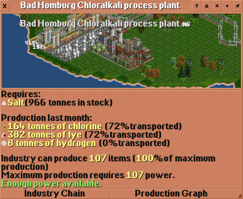

These three screenshots show the same industry in different situations - no power available, some power available (but not enough to produce at full capacity) and enough power available.

### Modularity

The set is designed to be modular.
The basic industry chain is rather simple and comparable to the original industry chain.
However, you can now activate extensions via parameter.
These extensions add further industries and cargos, and also modify existing industries.
That way, each player can configure the set according to their personal taste.
One player may wish to play on a small map with few industries, another one wants to play on a huge map with many different industries, and others may want to focus on certain kinds of industries.
Most extensions can be enabled independently from the others.

### Production levels

Primary industries (those that do not require raw materials, e.g. mines, farms, oil wells), will increase their production if a high percentage of the produced cargo is transported.
Over time, production will simply increase or decrease to match the transport capacities.

Industries that depend on raw materials (see [Stockpiling](#stockpiling) will take 10% of the available stockpile for production with each production event (around 8 times per month, assuming default settings).
So when e.g. 100t raw material is available, the first production event will consume 10t, leaving 90t remaining. The next production event will consume 9t, leaving 81t.
This continues until the stockpile is depleted.

The output then depends on the amount of raw materials consumed, and on the industry itself. Each industry has custom hardcoded values related to which percentage of the input is converted into output.
Chemical industries for example may produce not just one output, but also carbon dioxide or other waste, which is then of course not part of the output.

On top of that, industry output may depend on the number of different raw materials that are delivered. The basic food processor for example produces food from grain, livestock and fish, but you do not need to
provide them all - it will start producing if any of these cargos is stockpiled. However, the output is reduced. If you provide all three raw materials, production output will increase drastically.

Each industry provides information on the dependencies in the information window.

This industry depends on multiple raw materials, but starts production as soon as any raw material is available.

This industry has optional input materials. It depends on all the materials marked in black, but overall production is limited as long as the optional cargo is unavailable.

This industry has optional input materials, but starts production as soon as any of the mandatory materials is available.
Overall production level increases with the number of different raw materials available.

### Resource depletion

Extractive industries such as mines and oil wells are generated with a random amount of raw materials to excavate. The industry then produces, and over time the raw materials become less and less.
Once no more raw materials are available, the industry will close. The industry information window shows how much material is left and how long this will last if production levels do not change.

The screenshot shows how the information is displayed.
This should allow the player to properly plan ahead.

### Stockpiling

Most industries require raw materials to produce anything. Depending on industry, different models of dependencies are applied.
In the most simple case, the industry requires all listed raw materials. For example, the basic steel mill without any extensions activated requires both coal and iron ore. If only one is supplied, it
will simply be stockpiled, but not used for production.

Some industries have optional raw material. These are marked in white in the stockpile list. Optional raw materials are not needed to produce anything, but they will increase the output.

The maximum size of the stockpile is hard coded in the game at 65.535 units. If you reach that limit, nothing much will happen, the next delivery of raw materials will simply be discarded (but you will get paid).
However, since production scales with stockpile size, it should be hard to run into that limit, unless you deliberately miss on delivering relevant raw materials so that nothing will get produced at all.

## Parameters

The set comes with a number of parameters to customize and tweak the behavior:

- The production of excavating industries (mines, oil wells, ...) can be scaled to fit your needs. Depending on the vehicle set in use, a higher or lower production may be desirable.
- The economy model (stable or realistic). This influences the production levels of excavating industries, as e.g. coal mines reached their peak production in Germany already in the 1950s. With the realistic model,
production will then decline, regardless of how well you serve the industries.
- Enable or disable that certain industries require electricity for production. See also [Electricity](#electricity).
- Forbid industry generation. When enabled, no new industries will spawn after the initial map generation. The player can still fund new industries.
- Forbid industry closure. When enabled, no industries will ever close. When disabled, industries that have not seen any service in 12 months run a risk of closing down.
- Enable/disable the various extensions. Each of these adds further cargos and industries and changes the industry chains. See [Extensions](#extensions) for a detailed listing.

## Basic delivery chain

The set comes with a basic set of industries and cargos. These are listed as follows:

[Coal](#cargo_COAL) [Fish](#cargo_FISH) [Food](#cargo_FOOD) [Goods](#cargo_GOOD) [Grain](#cargo_GRAI) [Iron Ore](#cargo_IORE) [Livestock](#cargo_LVST) [Mail](#cargo_MAIL) [Oil](#cargo_OIL_) [Passengers](#cargo_PASS) [Plastics](#cargo_PLAS) [Sand](#cargo_SAND) [Steel](#cargo_STEL) [Timber](#cargo_WDPR) [Vehicles](#cargo_VEHI) [Wood](#cargo_WOOD) 

[Builders Yard](#industry_20) [Coal Mine](#industry_34) [Department Store](#industry_55) [Farm](#industry_61) [Fishing Grounds](#industry_66) [Food Processing Plant](#industry_69) [Forest](#industry_81) [Furniture Factory](#industry_88) [General Store](#industry_91) [Hotel](#industry_97) [Integrated Steel Mill](#industry_99) [Iron Ore Mine](#industry_115) [Oil Rig](#industry_123) [Oil Wells](#industry_124) [Petrol Station](#industry_147) [Plastics Plant](#industry_164) [Port](#industry_172) [Power Station](#industry_188) [Sawmill](#industry_197) [Vehicle Distributor](#industry_220) [Vehicle Factory](#industry_222) 

If an industry box contains a year, it is the first year that this industry can be generated/funded. If the box contains two years it contains the start and end year of the range in which this industry can be generated/funded.

The colors of the arrows match with the colors used in the industry chain view in the game (except for electricity, which is not a cargo to be transported, see [Electricity](#electricity)).
Unless mentioned in the industry box, the industry requires all incoming cargos to be present in order to produce anything.

## Extensions

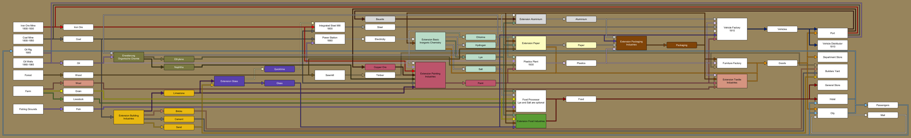

The image depicts the interactions between the different extensions. Each extension uses a different color here. If the extension is not enabled, you can ignore the arrows connected to it.
A cargo shown in a colored box is part of the extension of the same color, so if that extension is not enabled, the cargo is not active either.
For each extension, an extra diagram is available to see the detailed connections between their cargos and industries.

The set contains 16 extensions as listed below.

### Aluminium

Aluminium is a light metal discovered in 1825. By the end of the 19th century, mass-production had been started, and during the 20th century, it became the most important non-ferrous metal for industrial applications. It is way lighter than steel, an excellent conductor and can be be formed and shaped rather easily. Without aluminium, aviation is pretty much impossible. Similarly, it has widespread usage in the automobile sector, and of course it is a household item in the form of aluminium foil and cans. Production of Aluminium is concentrated in Southeast Asia and Australia, Norway is the largest producer in Europe. 

Color in the industry charts of this documentation: &nbsp;&nbsp;&nbsp;&nbsp;&nbsp;&nbsp;

#### Cargos

* [Aluminium](#cargo_ALUM)
* [Bauxite](#cargo_AORE)

#### Industries introduced

* [Aluminium Plant](#industry_4)
* [Aluminium Plant](#industry_5)
* [Aluminium Plant](#industry_6)
* [Aluminium Plant](#industry_7)

#### Industries modified

* [Aluminium Plant](#industry_4)
* [Aluminium Plant](#industry_5)
* [Aluminium Plant](#industry_6)
* [Aluminium Plant](#industry_7)
* [Engine Factory](#industry_57)
* [Engine Factory](#industry_59)
* [Foundry/Forge](#industry_83)
* [Foundry/Forge](#industry_85)
* [Packaging Plant](#industry_134)
* [Packaging Plant](#industry_136)
* [Packaging Plant](#industry_138)
* [Packaging Plant](#industry_140)
* [Port](#industry_173)
* [Port](#industry_175)
* [Port](#industry_177)
* [Port](#industry_179)
* [Port](#industry_181)
* [Port](#industry_183)
* [Port](#industry_185)
* [Port](#industry_187)
* [Sheet Mill](#industry_201)
* [Sheet Mill](#industry_203)
* [Vehicle Body Factory](#industry_216)
* [Vehicle Body Factory](#industry_217)
* [Vehicle Factory](#industry_223)
* [Vehicle Factory](#industry_225)
* [Vehicle Factory](#industry_227)
* [Vehicle Factory](#industry_229)
* [Wire Mill](#industry_236)
* [Wire Mill](#industry_238)

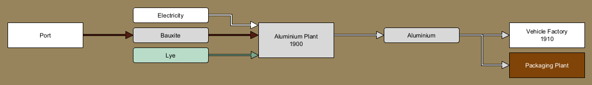

### Ammonia

Ammonia, a compount of nitrogen and hydrogen, is one of the most important chemicals today. Without it, modern agriculture is impossible, as ammonia is essential for fertilizers. The development of a technical synthesis of ammonia in the form of the Haber-Bosch-process was a milestone for chemistry and was awarded a Nobel Prize. 

Color in the industry charts of this documentation: &nbsp;&nbsp;&nbsp;&nbsp;&nbsp;&nbsp;

#### Cargos

* [Ammonia](#cargo_NH3_)
* [Nitrogen](#cargo_N2__)
* [Oxygen](#cargo_O2__)
* [Soda Ash](#cargo_SASH)

#### Industries introduced

* [Ammonia Plant](#industry_8)
* [Cleaning Products Factory](#industry_27)
* [Cleaning Products Factory](#industry_28)
* [Cleaning Products Factory](#industry_29)
* [Cleaning Products Factory](#industry_30)
* [Cryo Plant](#industry_50)
* [Solvay Plant](#industry_204)

#### Industries modified

* [Acid Plant](#industry_2)
* [Acid Plant](#industry_3)
* [Ammonia Plant](#industry_8)
* [Carbon Black Plant](#industry_23)
* [Carbon Black Plant](#industry_24)
* [Cleaning Products Factory](#industry_27)
* [Cleaning Products Factory](#industry_28)
* [Cleaning Products Factory](#industry_29)
* [Cleaning Products Factory](#industry_30)
* [Cryo Plant](#industry_50)
* [Glass Works](#industry_94)
* [Glass Works](#industry_96)
* [Integrated Steel Mill](#industry_103)
* [Integrated Steel Mill](#industry_104)
* [Integrated Steel Mill](#industry_105)
* [Integrated Steel Mill](#industry_106)
* [Integrated Steel Mill](#industry_111)
* [Integrated Steel Mill](#industry_112)
* [Integrated Steel Mill](#industry_113)
* [Integrated Steel Mill](#industry_114)
* [Ore Smelter](#industry_127)
* [Ore Smelter](#industry_128)
* [Ore Smelter](#industry_131)
* [Ore Smelter](#industry_132)
* [Pharmaceutical Plant](#industry_156)
* [Pharmaceutical Plant](#industry_157)
* [Pharmaceutical Plant](#industry_158)
* [Pharmaceutical Plant](#industry_159)
* [Pharmaceutical Plant](#industry_160)
* [Pharmaceutical Plant](#industry_161)
* [Pharmaceutical Plant](#industry_162)
* [Pharmaceutical Plant](#industry_163)
* [Solvay Plant](#industry_204)

### Basic Inorganic Chemistry

Inorganic chemistry covers chemical compounds that are not carbon-based. This includes countless minerals, acids, lyes and of course metals. With the progress of chemistry, these fields became increasingly relevant, as a wide range of industries require various chemicals. Historically, the production levels of sulfuric acid and chlorine were indicators for the industrialization of a country. This extension introduces a number of base chemical compounds and their production industries, which are a prerequisite for other extensions. 

Color in the industry charts of this documentation: &nbsp;&nbsp;&nbsp;&nbsp;&nbsp;&nbsp;

#### Cargos

* [Chlorine](#cargo_CHLO)
* [Hydrogen](#cargo_H2__)
* [Lye](#cargo_LYE_)
* [Salt](#cargo_SALT)

#### Industries introduced

* [Chloralkali Process Plant](#industry_26)
* [Pharmaceutical Plant](#industry_148)
* [Pharmaceutical Plant](#industry_149)
* [Pharmaceutical Plant](#industry_150)
* [Pharmaceutical Plant](#industry_151)
* [Pharmaceutical Plant](#industry_152)
* [Pharmaceutical Plant](#industry_153)
* [Pharmaceutical Plant](#industry_154)
* [Pharmaceutical Plant](#industry_155)
* [Pharmaceutical Plant](#industry_156)
* [Pharmaceutical Plant](#industry_157)
* [Pharmaceutical Plant](#industry_158)
* [Pharmaceutical Plant](#industry_159)
* [Pharmaceutical Plant](#industry_160)
* [Pharmaceutical Plant](#industry_161)
* [Pharmaceutical Plant](#industry_162)
* [Pharmaceutical Plant](#industry_163)
* [Salt Mine](#industry_195)

#### Industries modified

* [Acid Plant](#industry_1)
* [Acid Plant](#industry_3)
* [Aluminium Plant](#industry_5)
* [Aluminium Plant](#industry_7)
* [Chloralkali Process Plant](#industry_26)
* [Dairy](#industry_52)
* [Dairy](#industry_54)
* [Food Processing Plant](#industry_70)
* [Food Processing Plant](#industry_72)
* [Food Processing Plant](#industry_75)
* [Food Processing Plant](#industry_76)
* [Food Processing Plant](#industry_77)
* [Food Processing Plant](#industry_78)
* [Food Processing Plant](#industry_79)
* [Food Processing Plant](#industry_80)
* [Pharmaceutical Plant](#industry_148)
* [Pharmaceutical Plant](#industry_149)
* [Pharmaceutical Plant](#industry_150)
* [Pharmaceutical Plant](#industry_151)
* [Pharmaceutical Plant](#industry_152)
* [Pharmaceutical Plant](#industry_153)
* [Pharmaceutical Plant](#industry_154)
* [Pharmaceutical Plant](#industry_155)
* [Pharmaceutical Plant](#industry_156)
* [Pharmaceutical Plant](#industry_157)
* [Pharmaceutical Plant](#industry_158)
* [Pharmaceutical Plant](#industry_159)
* [Pharmaceutical Plant](#industry_160)
* [Pharmaceutical Plant](#industry_161)
* [Pharmaceutical Plant](#industry_162)
* [Pharmaceutical Plant](#industry_163)
* [Plastics Plant](#industry_165)
* [Plastics Plant](#industry_167)
* [Plastics Plant](#industry_169)
* [Plastics Plant](#industry_171)
* [Salt Mine](#industry_195)

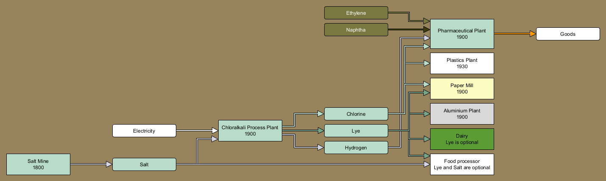

### Building Industries

Masonry, the craft of constructing walls and buildings from stone, is one of the oldest achievements of human civilization. Starting from burning bricks from mud in ancient times a whole industry evolved. In the 19th century, industrial level production of bricks were needed for all the new industrial buildings. Stone bridges such as the famous Göltzschtalbrücke in Saxony, the largest brick-built bridge in the world, give testament to the relevance of these industries in the 19th century. Bricks finally gave way to cement and concrete, allowing the construction of modern skyscrapers. 

Color in the industry charts of this documentation: &nbsp;&nbsp;&nbsp;&nbsp;&nbsp;&nbsp;

#### Cargos

* [Bricks](#cargo_BDMT)
* [Cement](#cargo_CMNT)
* [Limestone](#cargo_LIME)

#### Industries introduced

* [Brickworks](#industry_18)
* [Cement Plant](#industry_25)
* [Limestone Mine](#industry_118)
* [Sand Pit](#industry_196)

#### Industries modified

* [Brickworks](#industry_18)
* [Builders Yard](#industry_19)
* [Cement Plant](#industry_25)
* [Limestone Mine](#industry_118)
* [Paint Factory](#industry_142)
* [Paint Factory](#industry_144)
* [Sand Pit](#industry_196)

### Coke and Sulphur

Coke and sulphur are important chemicals for many industrial purposes. Without coke, production of steel and other metals would be impossible, while sulphur, or rather sulhuic acid, is the backbone of many chemical processes. 

Color in the industry charts of this documentation: &nbsp;&nbsp;&nbsp;&nbsp;&nbsp;&nbsp;

#### Cargos

* [Acid](#cargo_ACID)
* [Coke](#cargo_COKE)
* [Pyrite Ore](#cargo_PORE)
* [Sulphur](#cargo_SULP)

#### Industries introduced

* [Acid Plant](#industry_0)
* [Acid Plant](#industry_1)
* [Acid Plant](#industry_2)
* [Acid Plant](#industry_3)
* [Coke Oven](#industry_35)
* [Ore Smelter](#industry_125)
* [Ore Smelter](#industry_126)
* [Ore Smelter](#industry_127)
* [Ore Smelter](#industry_128)
* [Ore Smelter](#industry_129)
* [Ore Smelter](#industry_130)
* [Ore Smelter](#industry_131)
* [Ore Smelter](#industry_132)

#### Industries modified

* [Acid Plant](#industry_0)
* [Acid Plant](#industry_1)
* [Acid Plant](#industry_2)
* [Acid Plant](#industry_3)
* [Cleaning Products Factory](#industry_28)
* [Cleaning Products Factory](#industry_30)
* [Coke Oven](#industry_35)
* [Copper Ore Mine](#industry_45)
* [Copper Smelter](#industry_47)
* [Copper Smelter](#industry_49)
* [Integrated Steel Mill](#industry_101)
* [Integrated Steel Mill](#industry_102)
* [Integrated Steel Mill](#industry_105)
* [Integrated Steel Mill](#industry_106)
* [Integrated Steel Mill](#industry_109)
* [Integrated Steel Mill](#industry_110)
* [Integrated Steel Mill](#industry_113)
* [Integrated Steel Mill](#industry_114)
* [Lime Kiln](#industry_117)
* [Oil Refinery](#industry_122)
* [Ore Smelter](#industry_125)
* [Ore Smelter](#industry_126)
* [Ore Smelter](#industry_127)
* [Ore Smelter](#industry_128)
* [Ore Smelter](#industry_129)
* [Ore Smelter](#industry_130)
* [Ore Smelter](#industry_131)
* [Ore Smelter](#industry_132)
* [Paint Factory](#industry_143)
* [Paint Factory](#industry_144)
* [Pharmaceutical Plant](#industry_152)
* [Pharmaceutical Plant](#industry_153)
* [Pharmaceutical Plant](#industry_154)
* [Pharmaceutical Plant](#industry_155)
* [Pharmaceutical Plant](#industry_160)
* [Pharmaceutical Plant](#industry_161)
* [Pharmaceutical Plant](#industry_162)
* [Pharmaceutical Plant](#industry_163)
* [Port](#industry_176)
* [Port](#industry_177)
* [Port](#industry_178)
* [Port](#industry_179)
* [Port](#industry_184)
* [Port](#industry_185)
* [Port](#industry_186)
* [Port](#industry_187)
* [Power Station](#industry_189)
* [Power Station](#industry_191)

### Food Industries

Germany is known for a wide variety of breads and a huge number of breweries. This extension replaces the generic food processor with more specialized industries, so the transport tasks become a bit more complex. 

Color in the industry charts of this documentation: &nbsp;&nbsp;&nbsp;&nbsp;&nbsp;&nbsp;

#### Cargos

* [Milk](#cargo_MILK)

#### Industries introduced

* [Animal Farm](#industry_9)
* [Animal Farm](#industry_10)
* [Animal Farm](#industry_11)
* [Animal Farm](#industry_12)
* [Brewery](#industry_16)
* [Brewery](#industry_17)
* [Dairy](#industry_51)
* [Dairy](#industry_52)
* [Dairy](#industry_53)
* [Dairy](#industry_54)
* [Flour Mill](#industry_67)
* [Flour Mill](#industry_68)
* [Meatpacking Plant](#industry_119)
* [Meatpacking Plant](#industry_120)

#### Industries modified

* [Animal Farm](#industry_9)
* [Animal Farm](#industry_10)
* [Animal Farm](#industry_11)
* [Animal Farm](#industry_12)
* [Brewery](#industry_16)
* [Brewery](#industry_17)
* [Dairy](#industry_51)
* [Dairy](#industry_52)
* [Dairy](#industry_53)
* [Dairy](#industry_54)
* [Farm](#industry_62)
* [Farm](#industry_65)
* [Flour Mill](#industry_67)
* [Flour Mill](#industry_68)
* [Food Processing Plant](#industry_71)
* [Food Processing Plant](#industry_72)
* [Food Processing Plant](#industry_74)
* [Food Processing Plant](#industry_76)
* [Food Processing Plant](#industry_78)
* [Food Processing Plant](#industry_80)
* [Meatpacking Plant](#industry_119)
* [Meatpacking Plant](#industry_120)

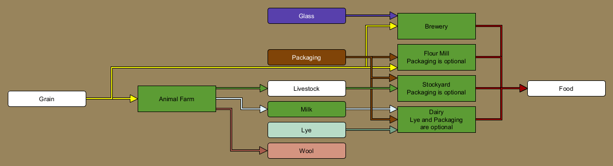

### Fruits and Bioenergy

Renewable raw materials have become more important since the second half of the 20th century. One example is the recycling of biomass, organic waste, in the energy sector. 

Color in the industry charts of this documentation: &nbsp;&nbsp;&nbsp;&nbsp;&nbsp;&nbsp;

#### Cargos

* [Biomass](#cargo_BIOM)
* [Fruits](#cargo_FRUT)

#### Industries introduced

* [Biorefinery](#industry_15)
* [Fruit Plantation](#industry_86)

#### Industries modified

* [Animal Farm](#industry_11)
* [Animal Farm](#industry_12)
* [Biorefinery](#industry_15)
* [Farm](#industry_63)
* [Farm](#industry_64)
* [Farm](#industry_65)
* [Food Processing Plant](#industry_77)
* [Food Processing Plant](#industry_78)
* [Food Processing Plant](#industry_79)
* [Food Processing Plant](#industry_80)
* [Fruit Plantation](#industry_86)
* [General Store](#industry_92)
* [Hotel](#industry_98)
* [Power Station](#industry_190)
* [Power Station](#industry_191)
* [Sawmill](#industry_198)
* [Steamreformer](#industry_207)

### Glass

Glass is an ubiquitous material used in everyday life. The extension adds cargos and industries related to glass production and adapts various industries to require glass, most importantly for packaging needs. 

Color in the industry charts of this documentation: &nbsp;&nbsp;&nbsp;&nbsp;&nbsp;&nbsp;

#### Cargos

* [Glass](#cargo_GLAS)
* [Quicklime](#cargo_QLME)

#### Industries introduced

* [Glass Works](#industry_93)
* [Glass Works](#industry_94)
* [Glass Works](#industry_95)
* [Glass Works](#industry_96)
* [Lime Kiln](#industry_116)
* [Lime Kiln](#industry_117)
* [Recycling Depot](#industry_194)

#### Industries modified

* [Brewery](#industry_17)
* [Component Factory](#industry_38)
* [Component Factory](#industry_39)
* [Component Factory](#industry_42)
* [Component Factory](#industry_43)
* [Glass Works](#industry_93)
* [Glass Works](#industry_94)
* [Glass Works](#industry_95)
* [Glass Works](#industry_96)
* [Integrated Steel Mill](#industry_100)
* [Integrated Steel Mill](#industry_102)
* [Integrated Steel Mill](#industry_104)
* [Integrated Steel Mill](#industry_106)
* [Integrated Steel Mill](#industry_108)
* [Integrated Steel Mill](#industry_110)
* [Integrated Steel Mill](#industry_112)
* [Integrated Steel Mill](#industry_114)
* [Lime Kiln](#industry_116)
* [Lime Kiln](#industry_117)
* [Packaging Plant](#industry_135)
* [Packaging Plant](#industry_136)
* [Packaging Plant](#industry_139)
* [Packaging Plant](#industry_140)
* [Recycling Depot](#industry_194)
* [Vehicle Factory](#industry_226)
* [Vehicle Factory](#industry_227)
* [Vehicle Factory](#industry_228)
* [Vehicle Factory](#industry_229)
* [Vehicle Factory](#industry_232)
* [Vehicle Factory](#industry_233)

### Metallurgy

Metal processing has been an important craft since ancient times. Smiths produced tools and weapons, for example. With the industrialization, demand for high quality metal parts skyrocketed, be it rails, cog wheels or engine blocks. 

Color in the industry charts of this documentation: &nbsp;&nbsp;&nbsp;&nbsp;&nbsp;&nbsp;

#### Cargos

* [Machine Parts](#cargo_ENSP)
* [Metal Sheets](#cargo_STSH)
* [Wire/Cables](#cargo_STWR)

#### Industries introduced

* [Appliance Factory](#industry_13)
* [Appliance Factory](#industry_14)
* [Foundry/Forge](#industry_82)
* [Foundry/Forge](#industry_83)
* [Foundry/Forge](#industry_84)
* [Foundry/Forge](#industry_85)
* [Sheet Mill](#industry_200)
* [Sheet Mill](#industry_201)
* [Sheet Mill](#industry_202)
* [Sheet Mill](#industry_203)
* [Wire Mill](#industry_235)
* [Wire Mill](#industry_236)
* [Wire Mill](#industry_237)
* [Wire Mill](#industry_238)

#### Industries modified

* [Appliance Factory](#industry_13)
* [Appliance Factory](#industry_14)
* [Component Factory](#industry_40)
* [Component Factory](#industry_41)
* [Component Factory](#industry_42)
* [Component Factory](#industry_43)
* [Engine Factory](#industry_58)
* [Engine Factory](#industry_59)
* [Foundry/Forge](#industry_82)
* [Foundry/Forge](#industry_83)
* [Foundry/Forge](#industry_84)
* [Foundry/Forge](#industry_85)
* [Sheet Mill](#industry_200)
* [Sheet Mill](#industry_201)
* [Sheet Mill](#industry_202)
* [Sheet Mill](#industry_203)
* [Vehicle Body Factory](#industry_218)
* [Vehicle Body Factory](#industry_219)
* [Vehicle Factory](#industry_230)
* [Vehicle Factory](#industry_231)
* [Vehicle Factory](#industry_232)
* [Vehicle Factory](#industry_233)
* [Wire Mill](#industry_235)
* [Wire Mill](#industry_236)
* [Wire Mill](#industry_237)
* [Wire Mill](#industry_238)

### Organic Chemistry

Organic chemistry is the science of carbohydrates, compounds consisting of carbon and hydrogen. The base materials (coal and most importantly crude oil) were created from organic matter (e.g. plants) over millions of years. In the 20th century crude oil became one of the most important resources of mankind, as it is indispensable for the production of fuels and plastics. Each day, several billions of liters of crude oil are consumed for industrial purposes. 

Color in the industry charts of this documentation: &nbsp;&nbsp;&nbsp;&nbsp;&nbsp;&nbsp;

#### Cargos

* [Ethylene](#cargo_C2H4)
* [Naphtha](#cargo_RFPR)
* [Petrol](#cargo_PETR)

#### Industries introduced

* [Coal Liquefaction Plant](#industry_33)
* [Oil Refinery](#industry_121)
* [Oil Refinery](#industry_122)
* [Steamcracker](#industry_205)
* [Steamreformer](#industry_206)
* [Steamreformer](#industry_207)

#### Industries modified

* [Carbon Black Plant](#industry_22)
* [Carbon Black Plant](#industry_24)
* [Coal Liquefaction Plant](#industry_33)
* [Oil Refinery](#industry_121)
* [Oil Refinery](#industry_122)
* [Pharmaceutical Plant](#industry_150)
* [Pharmaceutical Plant](#industry_151)
* [Pharmaceutical Plant](#industry_154)
* [Pharmaceutical Plant](#industry_155)
* [Pharmaceutical Plant](#industry_158)
* [Pharmaceutical Plant](#industry_159)
* [Pharmaceutical Plant](#industry_162)
* [Pharmaceutical Plant](#industry_163)
* [Plastics Plant](#industry_168)
* [Plastics Plant](#industry_169)
* [Plastics Plant](#industry_170)
* [Plastics Plant](#industry_171)
* [Steamcracker](#industry_205)
* [Steamreformer](#industry_206)
* [Steamreformer](#industry_207)
* [Synthetic Rubber Plant](#industry_209)

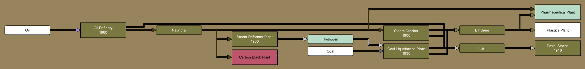

### Packaging Industries

Packaging industries produce all sorts of materials, be it cardboard boxes or aluminium cans for drinks, to contain practically anything that needs protection during transport. The packaging extension adds an additional layer of complexity to the production of food and goods. 

Color in the industry charts of this documentation: &nbsp;&nbsp;&nbsp;&nbsp;&nbsp;&nbsp;

#### Cargos

* [Packaging](#cargo_MNSP)

#### Industries introduced

* [Packaging Plant](#industry_133)
* [Packaging Plant](#industry_134)
* [Packaging Plant](#industry_135)
* [Packaging Plant](#industry_136)
* [Packaging Plant](#industry_137)
* [Packaging Plant](#industry_138)
* [Packaging Plant](#industry_139)
* [Packaging Plant](#industry_140)

#### Industries modified

* [Appliance Factory](#industry_14)
* [Cleaning Products Factory](#industry_29)
* [Cleaning Products Factory](#industry_30)
* [Clothing Plant](#industry_32)
* [Dairy](#industry_53)
* [Dairy](#industry_54)
* [Flour Mill](#industry_68)
* [Food Processing Plant](#industry_73)
* [Food Processing Plant](#industry_74)
* [Food Processing Plant](#industry_75)
* [Food Processing Plant](#industry_76)
* [Food Processing Plant](#industry_79)
* [Food Processing Plant](#industry_80)
* [Furniture Factory](#industry_89)
* [Furniture Factory](#industry_90)
* [Meatpacking Plant](#industry_120)
* [Packaging Plant](#industry_133)
* [Packaging Plant](#industry_134)
* [Packaging Plant](#industry_135)
* [Packaging Plant](#industry_136)
* [Packaging Plant](#industry_137)
* [Packaging Plant](#industry_138)
* [Packaging Plant](#industry_139)
* [Packaging Plant](#industry_140)
* [Pharmaceutical Plant](#industry_149)
* [Pharmaceutical Plant](#industry_151)
* [Pharmaceutical Plant](#industry_153)
* [Pharmaceutical Plant](#industry_155)
* [Pharmaceutical Plant](#industry_157)
* [Pharmaceutical Plant](#industry_159)
* [Pharmaceutical Plant](#industry_161)
* [Pharmaceutical Plant](#industry_163)
* [Printing Works](#industry_193)

### Painting Industries

For thousands of years, paints and pigments such as Indigo had been produced from plants and various powders, which made it prohibitely expensive for industrial scale uses. The production of artificial colors was one of the first important uses of the chemical industry. In fact, some of the biggest chemical companies in Germany started as producers of paints and dyes, such as Agfa and BASF (both derived parts of their name from Anilin, a base chemical used in the production of paints). In 1925 the biggest German chemical companies joined together in the so-called I.G. Farben (literally "interest group paint industries"), which became the biggest chemical company in the world prior to World War 2. Even today, paints, dyes, pigments and related products are a staple of the chemical industry and see wide uses in many other areas, be it textile, plastics production, construction or in the automobile sector. 

Color in the industry charts of this documentation: &nbsp;&nbsp;&nbsp;&nbsp;&nbsp;&nbsp;

#### Cargos

* [Carbon Black](#cargo_CBLK)
* [Copper](#cargo_COPR)
* [Copper Ore](#cargo_CORE)
* [Paint](#cargo_COAT)

#### Industries introduced

* [Carbon Black Plant](#industry_21)
* [Carbon Black Plant](#industry_22)
* [Carbon Black Plant](#industry_23)
* [Carbon Black Plant](#industry_24)
* [Copper Ore Mine](#industry_44)
* [Copper Ore Mine](#industry_45)
* [Copper Smelter](#industry_46)
* [Copper Smelter](#industry_47)
* [Copper Smelter](#industry_48)
* [Copper Smelter](#industry_49)
* [Paint Factory](#industry_141)
* [Paint Factory](#industry_142)
* [Paint Factory](#industry_143)
* [Paint Factory](#industry_144)

#### Industries modified

* [Carbon Black Plant](#industry_21)
* [Carbon Black Plant](#industry_22)
* [Carbon Black Plant](#industry_23)
* [Carbon Black Plant](#industry_24)
* [Copper Ore Mine](#industry_44)
* [Copper Ore Mine](#industry_45)
* [Copper Smelter](#industry_46)
* [Copper Smelter](#industry_47)
* [Copper Smelter](#industry_48)
* [Copper Smelter](#industry_49)
* [Ore Smelter](#industry_126)
* [Ore Smelter](#industry_128)
* [Ore Smelter](#industry_130)
* [Ore Smelter](#industry_132)
* [Paint Factory](#industry_141)
* [Paint Factory](#industry_142)
* [Paint Factory](#industry_143)
* [Paint Factory](#industry_144)
* [Plastics Plant](#industry_166)
* [Plastics Plant](#industry_167)
* [Plastics Plant](#industry_170)
* [Plastics Plant](#industry_171)
* [Port](#industry_174)
* [Port](#industry_175)
* [Port](#industry_178)
* [Port](#industry_179)
* [Port](#industry_182)
* [Port](#industry_183)
* [Port](#industry_186)
* [Port](#industry_187)
* [Textile Mill](#industry_211)
* [Tyre Plant](#industry_213)
* [Vehicle Body Factory](#industry_215)
* [Vehicle Body Factory](#industry_217)
* [Vehicle Body Factory](#industry_219)
* [Vehicle Factory](#industry_224)
* [Vehicle Factory](#industry_225)
* [Vehicle Factory](#industry_228)
* [Vehicle Factory](#industry_229)
* [Vehicle Factory](#industry_231)
* [Vehicle Factory](#industry_233)

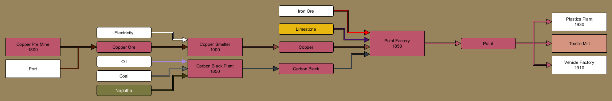

### Paper

Paper is an ubiquitous material used in everyday life. The extension adds cargos and industries related to paper production and adapts various industries to require paper, most importantly for packaging needs. 

Color in the industry charts of this documentation: &nbsp;&nbsp;&nbsp;&nbsp;&nbsp;&nbsp;

#### Cargos

* [Paper](#cargo_PAPR)

#### Industries introduced

* [Paper Mill](#industry_145)
* [Paper Mill](#industry_146)
* [Printing Works](#industry_192)
* [Printing Works](#industry_193)
* [Recycling Depot](#industry_194)

#### Industries modified

* [Packaging Plant](#industry_137)
* [Packaging Plant](#industry_138)
* [Packaging Plant](#industry_139)
* [Packaging Plant](#industry_140)
* [Paper Mill](#industry_145)
* [Paper Mill](#industry_146)
* [Printing Works](#industry_192)
* [Printing Works](#industry_193)
* [Recycling Depot](#industry_194)

### Recycling

Reusing existing materials from scraps - recycling - became ever more important since the second half of the 20th century. It reduces the amount of waste, but also impacts the amount of expensive and rare raw materials that are needed. In some industries like glass or paper production recycling is pretty much a standard process. 

Color in the industry charts of this documentation: &nbsp;&nbsp;&nbsp;&nbsp;&nbsp;&nbsp;

#### Cargos

* [Recyclables](#cargo_RCYC)
* [Scrap Metal](#cargo_SCMT)

#### Industries introduced

* [Recycling Depot](#industry_194)
* [Scrap Yard](#industry_199)

#### Industries modified

* [Aluminium Plant](#industry_6)
* [Aluminium Plant](#industry_7)
* [Copper Smelter](#industry_48)
* [Copper Smelter](#industry_49)
* [Foundry/Forge](#industry_84)
* [Foundry/Forge](#industry_85)
* [Glass Works](#industry_95)
* [Glass Works](#industry_96)
* [Integrated Steel Mill](#industry_107)
* [Integrated Steel Mill](#industry_108)
* [Integrated Steel Mill](#industry_109)
* [Integrated Steel Mill](#industry_110)
* [Integrated Steel Mill](#industry_111)
* [Integrated Steel Mill](#industry_112)
* [Integrated Steel Mill](#industry_113)
* [Integrated Steel Mill](#industry_114)
* [Paper Mill](#industry_146)
* [Recycling Depot](#industry_194)
* [Scrap Yard](#industry_199)
* [Sheet Mill](#industry_202)
* [Sheet Mill](#industry_203)
* [Wire Mill](#industry_237)
* [Wire Mill](#industry_238)

### Textile Industries

The production of yarns and textiles to create clothes was one of the very first cultural achievements of mankind. Sources for the production include various natural sources such as wool from sheep and other animals as well as cotton and other plants. With the innovations of the chemical industry in the 20th century, artificial fibers such as polyester became available. 

Textile manufacturing was a laborious process and was among the first to be affected heavily by industrialization in the 18th century in England. Germany also had a strong textile manufacturing industry in Saxony and Silesia, which in turn benefitted from industrialization. Chemnitz in Saxony became a center of mechanical engineering with a focus on the production of machines for the textile industry. However, since the middle of the 20th century, the industry is shrinking, and nowadays most of the textile industry has moved to Asia for cost-related reasons. 

Color in the industry charts of this documentation: &nbsp;&nbsp;&nbsp;&nbsp;&nbsp;&nbsp;

#### Cargos

* [Textiles](#cargo_TEXT)
* [Wool](#cargo_WOOL)

#### Industries introduced

* [Clothing Plant](#industry_31)
* [Clothing Plant](#industry_32)
* [Textile Mill](#industry_210)
* [Textile Mill](#industry_211)

#### Industries modified

* [Animal Farm](#industry_10)
* [Animal Farm](#industry_12)
* [Clothing Plant](#industry_31)
* [Clothing Plant](#industry_32)
* [Component Factory](#industry_37)
* [Component Factory](#industry_39)
* [Component Factory](#industry_41)
* [Component Factory](#industry_43)
* [Farm](#industry_60)
* [Farm](#industry_63)
* [Furniture Factory](#industry_87)
* [Furniture Factory](#industry_89)
* [Textile Mill](#industry_210)
* [Textile Mill](#industry_211)

### Vehicle Industries

Vehicle production is one of the most important branches of Germany's economy. Germany, in fact, is not only the birthplace of the automobile, but also the country where countless relevant technologies have been developed. Names like Carl Benz, Rudolf Diesel or Ferdinand Porsche - among many others - wrote history. Companies like Mercedes-Benz, BMW, Audi or Porsche are renowned worldwide and were a huge part in creating the good reputation of cars made in Germany. 

Color in the industry charts of this documentation: &nbsp;&nbsp;&nbsp;&nbsp;&nbsp;&nbsp;

#### Cargos

* [Rubber](#cargo_RUBR)
* [Tyres](#cargo_TYRE)
* [Vehicle Bodies](#cargo_VBOD)
* [Vehicle Engines](#cargo_VENG)
* [Vehicle Parts](#cargo_VPTS)
* [Zinc](#cargo_ZINC)

#### Industries introduced

* [Component Factory](#industry_36)
* [Component Factory](#industry_37)
* [Component Factory](#industry_38)
* [Component Factory](#industry_39)
* [Component Factory](#industry_40)
* [Component Factory](#industry_41)
* [Component Factory](#industry_42)
* [Component Factory](#industry_43)
* [Engine Factory](#industry_56)
* [Engine Factory](#industry_57)
* [Engine Factory](#industry_58)
* [Engine Factory](#industry_59)
* [Synthetic Rubber Plant](#industry_208)
* [Synthetic Rubber Plant](#industry_209)
* [Tyre Plant](#industry_212)
* [Tyre Plant](#industry_213)
* [Vehicle Body Factory](#industry_214)
* [Vehicle Body Factory](#industry_215)
* [Vehicle Body Factory](#industry_216)
* [Vehicle Body Factory](#industry_217)
* [Vehicle Body Factory](#industry_218)
* [Vehicle Body Factory](#industry_219)

#### Industries modified

* [Component Factory](#industry_36)
* [Component Factory](#industry_37)
* [Component Factory](#industry_38)
* [Component Factory](#industry_39)
* [Component Factory](#industry_40)
* [Component Factory](#industry_41)
* [Component Factory](#industry_42)
* [Component Factory](#industry_43)
* [Engine Factory](#industry_56)
* [Engine Factory](#industry_57)
* [Engine Factory](#industry_58)
* [Engine Factory](#industry_59)
* [Ore Smelter](#industry_129)
* [Ore Smelter](#industry_130)
* [Ore Smelter](#industry_131)
* [Ore Smelter](#industry_132)
* [Port](#industry_180)
* [Port](#industry_181)
* [Port](#industry_182)
* [Port](#industry_183)
* [Port](#industry_184)
* [Port](#industry_185)
* [Port](#industry_186)
* [Port](#industry_187)
* [Synthetic Rubber Plant](#industry_208)
* [Synthetic Rubber Plant](#industry_209)
* [Tyre Plant](#industry_212)
* [Tyre Plant](#industry_213)
* [Vehicle Body Factory](#industry_214)
* [Vehicle Body Factory](#industry_215)
* [Vehicle Body Factory](#industry_216)
* [Vehicle Body Factory](#industry_217)
* [Vehicle Body Factory](#industry_218)
* [Vehicle Body Factory](#industry_219)
* [Vehicle Distributor](#industry_221)
* [Vehicle Factory](#industry_234)

## Cargos

The set contains 60 cargos as listed below.

### Acid

Acids are a type of chemical compound that can react aggressively with other compounds, leading to their destruction. This also means they are dangerous for humans and can be deadly hazards. Chlorine for example was used in chemical warfare, as it reacts to hydrochloric acid when in the lungs, causing chemical burns. This strong reaction with many chemicals is required for countless industrial purposes, for example in the production of fertilizers and pigments, but also in metallurgy. The most important acid for industrial usage is sulfuric acid, but one also finds other acids on a daily base, such as carbonic acid (in various fizzy drinks). 

Cargo Table Entry: ACID

Part of extension: [Coke and Sulphur](#extension_4)

Cargo classes: Hazardous, Liquid

Color in the industry chain view: &nbsp;&nbsp;&nbsp;&nbsp;&nbsp;&nbsp;

| Produced by | Required by |
| -- | -- |
| [Acid Plant](#industry_0) | [Cleaning Products Factory](#industry_28) |
| [Acid Plant](#industry_1) | [Cleaning Products Factory](#industry_30) |
| [Acid Plant](#industry_2) | [Copper Smelter](#industry_47) |
| [Acid Plant](#industry_3) | [Copper Smelter](#industry_49) |
|  | [Paint Factory](#industry_143) |
|  | [Paint Factory](#industry_144) |
|  | [Pharmaceutical Plant](#industry_152) |
|  | [Pharmaceutical Plant](#industry_153) |
|  | [Pharmaceutical Plant](#industry_154) |
|  | [Pharmaceutical Plant](#industry_155) |
|  | [Pharmaceutical Plant](#industry_160) |
|  | [Pharmaceutical Plant](#industry_161) |
|  | [Pharmaceutical Plant](#industry_162) |
|  | [Pharmaceutical Plant](#industry_163) |
|  | [Sheet Mill](#industry_200) |
|  | [Sheet Mill](#industry_201) |
|  | [Sheet Mill](#industry_202) |
|  | [Sheet Mill](#industry_203) |
|  | [Vehicle Body Factory](#industry_214) |
|  | [Vehicle Body Factory](#industry_215) |
|  | [Vehicle Body Factory](#industry_216) |
|  | [Vehicle Body Factory](#industry_217) |
|  | [Vehicle Body Factory](#industry_218) |
|  | [Vehicle Body Factory](#industry_219) |
|  | [Wire Mill](#industry_235) |
|  | [Wire Mill](#industry_236) |
|  | [Wire Mill](#industry_237) |
|  | [Wire Mill](#industry_238) |

### Aluminium

Aluminium is a light metal that is widely used everywhere, where steel is too heavy. It is relevant for building airplanes and cars, but also household items like aluminium foil or cans. Although it is rather ubiquitous on Earth, it is difficult to produce pure aluminium or alloys for technical use. Widespread usage only began in the early 20th century. Germany is one of the largest producers of Aluminium in Europe (and the biggest consumer), even though energy costs are comparably high. 

Cargo Table Entry: ALUM

Part of extension: [Aluminium](#extension_0)

Cargo classes: Piece goods

Color in the industry chain view: &nbsp;&nbsp;&nbsp;&nbsp;&nbsp;&nbsp;

| Produced by | Required by |
| -- | -- |
| [Aluminium Plant](#industry_4) | [Engine Factory](#industry_57) |
| [Aluminium Plant](#industry_5) | [Engine Factory](#industry_59) |
| [Aluminium Plant](#industry_6) | [Foundry/Forge](#industry_83) |
| [Aluminium Plant](#industry_7) | [Foundry/Forge](#industry_85) |
|  | [Packaging Plant](#industry_134) |
|  | [Packaging Plant](#industry_136) |
|  | [Packaging Plant](#industry_138) |
|  | [Packaging Plant](#industry_140) |
|  | [Sheet Mill](#industry_201) |
|  | [Sheet Mill](#industry_203) |
|  | [Vehicle Body Factory](#industry_216) |
|  | [Vehicle Body Factory](#industry_217) |
|  | [Vehicle Factory](#industry_223) |
|  | [Vehicle Factory](#industry_225) |
|  | [Vehicle Factory](#industry_227) |
|  | [Vehicle Factory](#industry_229) |
|  | [Wire Mill](#industry_236) |
|  | [Wire Mill](#industry_238) |

### Ammonia

Ammonia is a chemical compound of hydrogen and nitrogen. It is a base chemical for industrial purposes and essential for the production of fertilizers, among others. While this was already understood in the 19th century, it took until the early 20th century to invent the technical processes for industrial production. Nowadays, ammonia is among the chemicals with the highest production volume in the world, mostly required for fertilizers. Besides that, urea is produced from it, which is not just a relevant fertilizer, but also sees use for the reduction of emissions from the combustion of diesel fuel. 

Cargo Table Entry: NH3_

Part of extension: [Ammonia](#extension_1)

Cargo classes: Liquid

Color in the industry chain view: &nbsp;&nbsp;&nbsp;&nbsp;&nbsp;&nbsp;

| Produced by | Required by |
| -- | -- |
| [Ammonia Plant](#industry_8) | [Acid Plant](#industry_2) |
|  | [Acid Plant](#industry_3) |
|  | [Pharmaceutical Plant](#industry_156) |
|  | [Pharmaceutical Plant](#industry_157) |
|  | [Pharmaceutical Plant](#industry_158) |
|  | [Pharmaceutical Plant](#industry_159) |
|  | [Pharmaceutical Plant](#industry_160) |
|  | [Pharmaceutical Plant](#industry_161) |
|  | [Pharmaceutical Plant](#industry_162) |
|  | [Pharmaceutical Plant](#industry_163) |
|  | [Solvay Plant](#industry_204) |

### Bauxite

Bauxite is the ore out of which aluminium is produced. Germany does not have any sources of bauxite, it is all imported. 

Cargo Table Entry: AORE

Part of extension: [Aluminium](#extension_0)

Cargo classes: Bulk

Color in the industry chain view: &nbsp;&nbsp;&nbsp;&nbsp;&nbsp;&nbsp;

| Produced by | Required by |
| -- | -- |
| [Port](#industry_173) | [Aluminium Plant](#industry_4) |
| [Port](#industry_175) | [Aluminium Plant](#industry_5) |
| [Port](#industry_177) | [Aluminium Plant](#industry_6) |
| [Port](#industry_179) | [Aluminium Plant](#industry_7) |
| [Port](#industry_181) |  |
| [Port](#industry_183) |  |
| [Port](#industry_185) |  |
| [Port](#industry_187) |  |

### Biomass

Biomass is, in the context of this set, the sum of organic materials that can be used to create energy or chemicals. Among others, this is mainly organic agricultural waste. 

Cargo Table Entry: BIOM

Part of extension: [Fruits and Bioenergy](#extension_6)

Cargo classes: Bulk

Color in the industry chain view: &nbsp;&nbsp;&nbsp;&nbsp;&nbsp;&nbsp;

| Produced by | Required by |
| -- | -- |
| [Animal Farm](#industry_11) | [Biorefinery](#industry_15) |
| [Animal Farm](#industry_12) | [Power Station](#industry_190) |
| [Farm](#industry_63) | [Power Station](#industry_191) |
| [Farm](#industry_64) | [Steamreformer](#industry_207) |
| [Farm](#industry_65) |  |
| [Sawmill](#industry_198) |  |

### Bricks

Bricks have been used for all sorts of masonry construction since ancient times. With the onset of industrialization in the 19th century, demand arose for mass-produced cheap bricks to build factory buildings, bridges and many other structures. Even today, bricks are still relevant, although they cannot be used for skyscrapers for structural reasons. 

Cargo Table Entry: BDMT

Part of extension: [Building Industries](#extension_3)

Cargo classes: Piece goods

Color in the industry chain view: &nbsp;&nbsp;&nbsp;&nbsp;&nbsp;&nbsp;

| Produced by | Required by |
| -- | -- |
| [Brickworks](#industry_18) | [Builders Yard](#industry_19) |

### Carbon Black

Carbon black is a powder of practically pure elemental carbon. It is used as a black pigment in paints, inks and plastics. The main use is in the production of rubber for automobile tires. 

Cargo Table Entry: CBLK

Part of extension: [Painting Industries](#extension_11)

Cargo classes: Bulk, Covered, Piece goods, Powderized

Color in the industry chain view: &nbsp;&nbsp;&nbsp;&nbsp;&nbsp;&nbsp;

| Produced by | Required by |
| -- | -- |
| [Carbon Black Plant](#industry_21) | [Paint Factory](#industry_141) |
| [Carbon Black Plant](#industry_22) | [Paint Factory](#industry_142) |
| [Carbon Black Plant](#industry_23) | [Paint Factory](#industry_143) |
| [Carbon Black Plant](#industry_24) | [Paint Factory](#industry_144) |
|  | [Tyre Plant](#industry_213) |

### Cement

Cement is a key ingredient in the production of mortar and concrete, which are the most widely used material in existence and one of the most consumed resources in the world. Without it, none of the modern skyscrapers could be built. 

Cargo Table Entry: CMNT

Part of extension: [Building Industries](#extension_3)

Cargo classes: Bulk, Covered, Powderized

Color in the industry chain view: &nbsp;&nbsp;&nbsp;&nbsp;&nbsp;&nbsp;

| Produced by | Required by |
| -- | -- |
| [Cement Plant](#industry_25) | [Builders Yard](#industry_19) |

### Chlorine

Chlorine is a highly reactive chemical element which is relevant for bleaching (e.g. in the production of paper) and disinfecting. Additionally, it is also required for many processes in the chemical industry in general, most importantly to produce a wide range of plastics such as PVC. In higher concentrations chlorine is highly dangerous and poisonous to most living organisms and has historically been used in chemical warfare. Since the early 20th century chlorine is mainly produced by splitting salt using electrolysis in the so-called chloralkali process. 

Cargo Table Entry: CHLO

Part of extension: [Basic Inorganic Chemistry](#extension_2)

Cargo classes: Hazardous, Liquid

Color in the industry chain view: &nbsp;&nbsp;&nbsp;&nbsp;&nbsp;&nbsp;

| Produced by | Required by |
| -- | -- |
| [Chloralkali Process Plant](#industry_26) | [Acid Plant](#industry_1) |
|  | [Acid Plant](#industry_3) |
|  | [Paper Mill](#industry_145) |
|  | [Paper Mill](#industry_146) |
|  | [Pharmaceutical Plant](#industry_148) |
|  | [Pharmaceutical Plant](#industry_149) |
|  | [Pharmaceutical Plant](#industry_150) |
|  | [Pharmaceutical Plant](#industry_151) |
|  | [Pharmaceutical Plant](#industry_152) |
|  | [Pharmaceutical Plant](#industry_153) |
|  | [Pharmaceutical Plant](#industry_154) |
|  | [Pharmaceutical Plant](#industry_155) |
|  | [Pharmaceutical Plant](#industry_156) |
|  | [Pharmaceutical Plant](#industry_157) |
|  | [Pharmaceutical Plant](#industry_158) |
|  | [Pharmaceutical Plant](#industry_159) |
|  | [Pharmaceutical Plant](#industry_160) |
|  | [Pharmaceutical Plant](#industry_161) |
|  | [Pharmaceutical Plant](#industry_162) |
|  | [Pharmaceutical Plant](#industry_163) |
|  | [Plastics Plant](#industry_165) |
|  | [Plastics Plant](#industry_167) |
|  | [Plastics Plant](#industry_169) |
|  | [Plastics Plant](#industry_171) |

### Coal

Coal was the main driver of industrializaton in the 19th century, being required to power steam engines. With the introduction of railway steam engines and later on power plants to produce electricity, the demand for coal rose rapidly. 

Germany had relevant coal deposits, and the areas were coal was mined became industrial centers, such as the Ruhr area and Silesia. Coal remained important throughout the 20th century, but it was phased out in many areas for environmental reasons. 

Cargo Table Entry: COAL

Cargo classes: Bulk

Color in the industry chain view: &nbsp;&nbsp;&nbsp;&nbsp;&nbsp;&nbsp;

| Produced by | Required by |
| -- | -- |
| [Coal Mine](#industry_34) | [Brickworks](#industry_18) |
| [Port](#industry_172) | [Carbon Black Plant](#industry_21) |
| [Port](#industry_173) | [Carbon Black Plant](#industry_22) |
| [Port](#industry_174) | [Carbon Black Plant](#industry_23) |
| [Port](#industry_175) | [Carbon Black Plant](#industry_24) |
| [Port](#industry_176) | [Coal Liquefaction Plant](#industry_33) |
| [Port](#industry_177) | [Coke Oven](#industry_35) |
| [Port](#industry_178) | [Integrated Steel Mill](#industry_99) |
| [Port](#industry_179) | [Integrated Steel Mill](#industry_100) |
| [Port](#industry_180) | [Integrated Steel Mill](#industry_103) |
| [Port](#industry_181) | [Integrated Steel Mill](#industry_104) |
| [Port](#industry_182) | [Integrated Steel Mill](#industry_107) |
| [Port](#industry_183) | [Integrated Steel Mill](#industry_108) |
| [Port](#industry_184) | [Integrated Steel Mill](#industry_111) |
| [Port](#industry_185) | [Integrated Steel Mill](#industry_112) |
| [Port](#industry_186) | [Power Station](#industry_188) |
| [Port](#industry_187) | [Power Station](#industry_189) |
|  | [Power Station](#industry_190) |
|  | [Power Station](#industry_191) |

### Coke

Coke is practically pure carbon, which has been produced from coal by means of pyrolysis. That means the coal is heated in absence of oxygen, so that it cannot burn. This removes various impurities such as sulphur and various carbohydrates. Coke has been produced first in the early 18th century in England and replaced charcoal for usage in blast furnaces in the early 19th century. With that, an efficient production of large quantities of iron became possible. 

Cargo Table Entry: COKE

Part of extension: [Coke and Sulphur](#extension_4)

Cargo classes: Bulk

Color in the industry chain view: &nbsp;&nbsp;&nbsp;&nbsp;&nbsp;&nbsp;

| Produced by | Required by |
| -- | -- |
| [Coke Oven](#industry_35) | [Foundry/Forge](#industry_82) |
|  | [Foundry/Forge](#industry_83) |
|  | [Foundry/Forge](#industry_84) |
|  | [Foundry/Forge](#industry_85) |
|  | [Integrated Steel Mill](#industry_101) |
|  | [Integrated Steel Mill](#industry_102) |
|  | [Integrated Steel Mill](#industry_105) |
|  | [Integrated Steel Mill](#industry_106) |
|  | [Integrated Steel Mill](#industry_109) |
|  | [Integrated Steel Mill](#industry_110) |
|  | [Integrated Steel Mill](#industry_113) |
|  | [Integrated Steel Mill](#industry_114) |
|  | [Lime Kiln](#industry_117) |
|  | [Ore Smelter](#industry_125) |
|  | [Ore Smelter](#industry_126) |
|  | [Ore Smelter](#industry_127) |
|  | [Ore Smelter](#industry_128) |
|  | [Ore Smelter](#industry_129) |
|  | [Ore Smelter](#industry_130) |
|  | [Ore Smelter](#industry_131) |
|  | [Ore Smelter](#industry_132) |

### Copper

Copper is a metal which has been known for thousands of years and was among the first metals to be used by mankind. It is easy to shape and form and has a wide range of applications: today it is mainly used for wiring, cables and all sorts of electrical equipment. Historically it has been used to create paints and as material for rooftops. 

Cargo Table Entry: COPR

Part of extension: [Painting Industries](#extension_11)

Cargo classes: Piece goods

Color in the industry chain view: &nbsp;&nbsp;&nbsp;&nbsp;&nbsp;&nbsp;

| Produced by | Required by |
| -- | -- |
| [Copper Smelter](#industry_46) | [Paint Factory](#industry_141) |
| [Copper Smelter](#industry_47) | [Paint Factory](#industry_142) |
| [Copper Smelter](#industry_48) | [Paint Factory](#industry_143) |
| [Copper Smelter](#industry_49) | [Paint Factory](#industry_144) |
|  | [Wire Mill](#industry_235) |
|  | [Wire Mill](#industry_236) |
|  | [Wire Mill](#industry_237) |
|  | [Wire Mill](#industry_238) |

### Copper Ore

Copper ore describes a variety of ores from which copper can be extracted. Mining for copper ore can be dated back thousands of years to the so-called copper age. Nowadays, copper ore is of central importance due to copper being one of the most important metals for industrial production. 

Germany does not have a lot of copper ores, still mining was done until the late 20th century, mainly in Eastern Germany where there was only limited access to the world market. Still, even today, Germany has the largest capacities of copper producing industries, requiring imports of copper ore. 

Cargo Table Entry: CORE

Part of extension: [Painting Industries](#extension_11)

Cargo classes: Bulk

Color in the industry chain view: &nbsp;&nbsp;&nbsp;&nbsp;&nbsp;&nbsp;

| Produced by | Required by |
| -- | -- |
| [Copper Ore Mine](#industry_44) | [Copper Smelter](#industry_46) |
| [Ore Smelter](#industry_126) | [Copper Smelter](#industry_47) |
| [Ore Smelter](#industry_128) | [Copper Smelter](#industry_48) |
| [Ore Smelter](#industry_130) | [Copper Smelter](#industry_49) |
| [Ore Smelter](#industry_132) |  |
| [Port](#industry_174) |  |
| [Port](#industry_175) |  |
| [Port](#industry_182) |  |
| [Port](#industry_183) |  |

### Ethylene

Ethylene is a carbohydrate, which is one of the most important base chemicals in the industry, with a production volume of more than 100 million tons per year. About half of it is needed in the production of polyethylene, a plastic. The typical way to produce ethylene is by using the process of steam cracking. Other processes like coal liquefaction or using biomass are also in use. 

While there are various pipelines in Europe to transport ethylene e.g. between Rotterdam/Antwerp and Ludwigshafen, the player has to figure out the transportation themselves. 

Cargo Table Entry: C2H4

Part of extension: [Organic Chemistry](#extension_9)

Cargo classes: Hazardous, Liquid

Color in the industry chain view: &nbsp;&nbsp;&nbsp;&nbsp;&nbsp;&nbsp;

| Produced by | Required by |
| -- | -- |
| [Biorefinery](#industry_15) | [Pharmaceutical Plant](#industry_150) |
| [Coal Liquefaction Plant](#industry_33) | [Pharmaceutical Plant](#industry_151) |
| [Steamcracker](#industry_205) | [Pharmaceutical Plant](#industry_154) |
|  | [Pharmaceutical Plant](#industry_155) |
|  | [Pharmaceutical Plant](#industry_158) |
|  | [Pharmaceutical Plant](#industry_159) |
|  | [Pharmaceutical Plant](#industry_162) |
|  | [Pharmaceutical Plant](#industry_163) |
|  | [Plastics Plant](#industry_168) |
|  | [Plastics Plant](#industry_169) |
|  | [Plastics Plant](#industry_170) |
|  | [Plastics Plant](#industry_171) |
|  | [Synthetic Rubber Plant](#industry_209) |

### Fish

Mankind has been fishing since ancient times. In the game, fish makes for interesting transport chains from boats via harbors across the land into the cities or production plants. 

Cargo Table Entry: FISH

Cargo classes: Express, Refrigerated

Color in the industry chain view: &nbsp;&nbsp;&nbsp;&nbsp;&nbsp;&nbsp;

| Produced by | Required by |
| -- | -- |
| [Fishing Grounds](#industry_66) | [Food Processing Plant](#industry_69) |
|  | [Food Processing Plant](#industry_70) |
|  | [Food Processing Plant](#industry_71) |
|  | [Food Processing Plant](#industry_72) |
|  | [Food Processing Plant](#industry_73) |
|  | [Food Processing Plant](#industry_74) |
|  | [Food Processing Plant](#industry_75) |
|  | [Food Processing Plant](#industry_76) |
|  | [Food Processing Plant](#industry_77) |
|  | [Food Processing Plant](#industry_78) |
|  | [Food Processing Plant](#industry_79) |
|  | [Food Processing Plant](#industry_80) |

### Food

People need to eat, and ever since people started living in cities there was a demand to transport all sorts of food into cities. Even today, fresh fruit and other local food can be bought on market places, while most of the industrially produced food is transported from production plants to supermarkets. 

Cargo Table Entry: FOOD

Cargo classes: Express, Refrigerated

Color in the industry chain view: &nbsp;&nbsp;&nbsp;&nbsp;&nbsp;&nbsp;

| Produced by | Required by |
| -- | -- |
| [Brewery](#industry_16) | [General Store](#industry_91) |
| [Brewery](#industry_17) | [General Store](#industry_92) |
| [Dairy](#industry_51) | [Hotel](#industry_97) |
| [Dairy](#industry_52) | [Hotel](#industry_98) |
| [Dairy](#industry_53) |  |
| [Dairy](#industry_54) |  |
| [Flour Mill](#industry_67) |  |
| [Flour Mill](#industry_68) |  |
| [Food Processing Plant](#industry_69) |  |
| [Food Processing Plant](#industry_70) |  |
| [Food Processing Plant](#industry_71) |  |
| [Food Processing Plant](#industry_72) |  |
| [Food Processing Plant](#industry_73) |  |
| [Food Processing Plant](#industry_74) |  |
| [Food Processing Plant](#industry_75) |  |
| [Food Processing Plant](#industry_76) |  |
| [Food Processing Plant](#industry_77) |  |
| [Food Processing Plant](#industry_78) |  |
| [Food Processing Plant](#industry_79) |  |
| [Food Processing Plant](#industry_80) |  |
| [Meatpacking Plant](#industry_119) |  |
| [Meatpacking Plant](#industry_120) |  |

### Fruits

Fruits have been a staple of human diet and are a challenging cargo, as they easily rot and need to be transported fast. Historically, transportation of fruits like bananas from South America to Europe required specialized vehicles. 

Cargo Table Entry: FRUT

Part of extension: [Fruits and Bioenergy](#extension_6)

Cargo classes: Express, Piece goods, Refrigerated

Color in the industry chain view: &nbsp;&nbsp;&nbsp;&nbsp;&nbsp;&nbsp;

| Produced by | Required by |
| -- | -- |
| [Fruit Plantation](#industry_86) | [Biorefinery](#industry_15) |
|  | [Food Processing Plant](#industry_77) |
|  | [Food Processing Plant](#industry_78) |
|  | [Food Processing Plant](#industry_79) |
|  | [Food Processing Plant](#industry_80) |
|  | [General Store](#industry_92) |
|  | [Hotel](#industry_98) |

### Glass

Glass is the common name for a group of materials that have puzzling physical properties. Many solid matters exhibit an ordered molecular structure, some sort of grid if you will. Glass however, does not follow this character, it keeps an unordered molecular structure, which is usually only found in liquids. Though it's not really understood on physical level even today, glass has been known for thousands of years. 

Typically, when talking about glass, one talks about transparent material made from silica. It is extremly stable in a chemical sense, making it a prime material for all sorts of containers of liquids, even hazardous ones. In fact, glass is ubiquitous in todays life. It is used for windows, for bottles and glasses, and of course in optical equipment such as lenses, mirrors, and last but not least glasses for eyesight correction. 

Cargo Table Entry: GLAS

Part of extension: [Glass](#extension_7)

Cargo classes: Piece goods

Color in the industry chain view: &nbsp;&nbsp;&nbsp;&nbsp;&nbsp;&nbsp;

| Produced by | Required by |
| -- | -- |
| [Glass Works](#industry_93) | [Brewery](#industry_17) |
| [Glass Works](#industry_94) | [Component Factory](#industry_38) |
| [Glass Works](#industry_95) | [Component Factory](#industry_39) |
| [Glass Works](#industry_96) | [Component Factory](#industry_42) |
|  | [Component Factory](#industry_43) |
|  | [Packaging Plant](#industry_135) |
|  | [Packaging Plant](#industry_136) |
|  | [Packaging Plant](#industry_139) |
|  | [Packaging Plant](#industry_140) |
|  | [Vehicle Factory](#industry_226) |
|  | [Vehicle Factory](#industry_227) |
|  | [Vehicle Factory](#industry_228) |
|  | [Vehicle Factory](#industry_229) |
|  | [Vehicle Factory](#industry_232) |
|  | [Vehicle Factory](#industry_233) |

### Goods

In the game, Goods are an abstraction of basically anything that is produced in various plants to be sold to people living in cities. As such, goods could be anything from furniture, household items, clothing or toys. 

Cargo Table Entry: GOOD

Cargo classes: Express

Color in the industry chain view: &nbsp;&nbsp;&nbsp;&nbsp;&nbsp;&nbsp;

| Produced by | Required by |
| -- | -- |
| [Appliance Factory](#industry_13) | [Department Store](#industry_55) |
| [Appliance Factory](#industry_14) | [Port](#industry_172) |
| [Cleaning Products Factory](#industry_27) | [Port](#industry_173) |
| [Cleaning Products Factory](#industry_28) | [Port](#industry_174) |
| [Cleaning Products Factory](#industry_29) | [Port](#industry_175) |
| [Cleaning Products Factory](#industry_30) | [Port](#industry_176) |
| [Clothing Plant](#industry_31) | [Port](#industry_177) |
| [Clothing Plant](#industry_32) | [Port](#industry_178) |
| [Furniture Factory](#industry_87) | [Port](#industry_179) |
| [Furniture Factory](#industry_88) | [Port](#industry_180) |
| [Furniture Factory](#industry_89) | [Port](#industry_181) |
| [Furniture Factory](#industry_90) | [Port](#industry_182) |
| [Pharmaceutical Plant](#industry_148) | [Port](#industry_183) |
| [Pharmaceutical Plant](#industry_149) | [Port](#industry_184) |
| [Pharmaceutical Plant](#industry_150) | [Port](#industry_185) |
| [Pharmaceutical Plant](#industry_151) | [Port](#industry_186) |
| [Pharmaceutical Plant](#industry_152) | [Port](#industry_187) |
| [Pharmaceutical Plant](#industry_153) |  |
| [Pharmaceutical Plant](#industry_154) |  |
| [Pharmaceutical Plant](#industry_155) |  |
| [Pharmaceutical Plant](#industry_156) |  |
| [Pharmaceutical Plant](#industry_157) |  |
| [Pharmaceutical Plant](#industry_158) |  |
| [Pharmaceutical Plant](#industry_159) |  |
| [Pharmaceutical Plant](#industry_160) |  |
| [Pharmaceutical Plant](#industry_161) |  |
| [Pharmaceutical Plant](#industry_162) |  |
| [Pharmaceutical Plant](#industry_163) |  |
| [Printing Works](#industry_192) |  |
| [Printing Works](#industry_193) |  |

### Grain

Germany is equally famous for the variety in bread and beer, both of which are produced from grain. It is also one of the biggest producers of grain in Europe, being able to fully cover domestic demand. A large quantity of grain is simply used for feeding livestock, only about a fifth is actually used to create food, and less than 10% are needed to make beer. On top of that, lots of grain is exported, especially wheat. 

Cargo Table Entry: GRAI

Cargo classes: Bulk

Color in the industry chain view: &nbsp;&nbsp;&nbsp;&nbsp;&nbsp;&nbsp;

| Produced by | Required by |
| -- | -- |
| [Farm](#industry_60) | [Animal Farm](#industry_10) |
| [Farm](#industry_61) | [Animal Farm](#industry_12) |
| [Farm](#industry_62) | [Brewery](#industry_16) |
| [Farm](#industry_63) | [Brewery](#industry_17) |
| [Farm](#industry_64) | [Flour Mill](#industry_67) |
| [Farm](#industry_65) | [Flour Mill](#industry_68) |
|  | [Food Processing Plant](#industry_69) |
|  | [Food Processing Plant](#industry_70) |
|  | [Food Processing Plant](#industry_73) |
|  | [Food Processing Plant](#industry_75) |
|  | [Food Processing Plant](#industry_77) |
|  | [Food Processing Plant](#industry_79) |

### Hydrogen

Hydrogen is the most basic and most common chemical element in the universe. On Earth, it is mostly found in compounds, most notably water and hydrocarbons such as oil. It sees a wide range of applications in the chemical industry, most importantly in the production of ammonia. Apart from that, it is used as rocket fuel, but also has applications as coolant and in cryogenics. 

Cargo Table Entry: H2__

Part of extension: [Basic Inorganic Chemistry](#extension_2)

Cargo classes: Hazardous, Liquid

Color in the industry chain view: &nbsp;&nbsp;&nbsp;&nbsp;&nbsp;&nbsp;

| Produced by | Required by |
| -- | -- |
| [Chloralkali Process Plant](#industry_26) | [Acid Plant](#industry_1) |
| [Steamreformer](#industry_206) | [Acid Plant](#industry_3) |
| [Steamreformer](#industry_207) | [Ammonia Plant](#industry_8) |
|  | [Coal Liquefaction Plant](#industry_33) |
|  | [Pharmaceutical Plant](#industry_148) |
|  | [Pharmaceutical Plant](#industry_149) |
|  | [Pharmaceutical Plant](#industry_150) |
|  | [Pharmaceutical Plant](#industry_151) |
|  | [Pharmaceutical Plant](#industry_152) |
|  | [Pharmaceutical Plant](#industry_153) |
|  | [Pharmaceutical Plant](#industry_154) |
|  | [Pharmaceutical Plant](#industry_155) |
|  | [Pharmaceutical Plant](#industry_156) |
|  | [Pharmaceutical Plant](#industry_157) |
|  | [Pharmaceutical Plant](#industry_158) |
|  | [Pharmaceutical Plant](#industry_159) |
|  | [Pharmaceutical Plant](#industry_160) |
|  | [Pharmaceutical Plant](#industry_161) |
|  | [Pharmaceutical Plant](#industry_162) |
|  | [Pharmaceutical Plant](#industry_163) |

### Iron Ore

Mankind has been using iron since the, well, Iron Age, some 3000 years ago. It is almost exclusively used to produce steel, which in turn is one of the single most important materials in global economy. 

Germany has only ever had scarce resources of iron ore, and was always dependent on importing iron ore from e.g. Sweden. 

Cargo Table Entry: IORE

Cargo classes: Bulk

Color in the industry chain view: &nbsp;&nbsp;&nbsp;&nbsp;&nbsp;&nbsp;

| Produced by | Required by |
| -- | -- |
| [Iron Ore Mine](#industry_115) | [Integrated Steel Mill](#industry_99) |
| [Ore Smelter](#industry_125) | [Integrated Steel Mill](#industry_100) |
| [Ore Smelter](#industry_126) | [Integrated Steel Mill](#industry_101) |
| [Ore Smelter](#industry_127) | [Integrated Steel Mill](#industry_102) |
| [Ore Smelter](#industry_128) | [Integrated Steel Mill](#industry_103) |
| [Ore Smelter](#industry_129) | [Integrated Steel Mill](#industry_104) |
| [Ore Smelter](#industry_130) | [Integrated Steel Mill](#industry_105) |
| [Ore Smelter](#industry_131) | [Integrated Steel Mill](#industry_106) |
| [Ore Smelter](#industry_132) | [Integrated Steel Mill](#industry_107) |
| [Port](#industry_172) | [Integrated Steel Mill](#industry_108) |
| [Port](#industry_173) | [Integrated Steel Mill](#industry_109) |
| [Port](#industry_174) | [Integrated Steel Mill](#industry_110) |
| [Port](#industry_175) | [Integrated Steel Mill](#industry_111) |
| [Port](#industry_176) | [Integrated Steel Mill](#industry_112) |
| [Port](#industry_177) | [Integrated Steel Mill](#industry_113) |
| [Port](#industry_178) | [Integrated Steel Mill](#industry_114) |
| [Port](#industry_179) | [Paint Factory](#industry_141) |
| [Port](#industry_180) | [Paint Factory](#industry_142) |
| [Port](#industry_181) | [Paint Factory](#industry_143) |
| [Port](#industry_182) | [Paint Factory](#industry_144) |
| [Port](#industry_183) |  |
| [Port](#industry_184) |  |
| [Port](#industry_185) |  |
| [Port](#industry_186) |  |
| [Port](#industry_187) |  |

### Limestone

Limestone is a type of rock that is composed mainly of calcium carbonate. It is relevant for the production of cement, but can also be used as building material directly. Moreover, it has many uses as raw material in the chemical industry and is also essential in the production of steel and glass. 

Cargo Table Entry: LIME

Part of extension: [Building Industries](#extension_3)

Cargo classes: Bulk

Color in the industry chain view: &nbsp;&nbsp;&nbsp;&nbsp;&nbsp;&nbsp;

| Produced by | Required by |
| -- | -- |
| [Limestone Mine](#industry_118) | [Cement Plant](#industry_25) |
|  | [Lime Kiln](#industry_116) |
|  | [Lime Kiln](#industry_117) |
|  | [Paint Factory](#industry_142) |
|  | [Paint Factory](#industry_144) |
|  | [Solvay Plant](#industry_204) |

### Livestock

Meat was and still is an important part of human diet, and as such livestock farming is an important part of the food production. Transporting livestock also provides for specific challenges in the game, often requiring dedicated rolling stock. 

Cargo Table Entry: LVST

Cargo classes: Piece goods

Color in the industry chain view: &nbsp;&nbsp;&nbsp;&nbsp;&nbsp;&nbsp;

| Produced by | Required by |
| -- | -- |
| [Animal Farm](#industry_9) | [Food Processing Plant](#industry_69) |
| [Animal Farm](#industry_10) | [Food Processing Plant](#industry_70) |
| [Animal Farm](#industry_11) | [Food Processing Plant](#industry_73) |
| [Animal Farm](#industry_12) | [Food Processing Plant](#industry_75) |
| [Farm](#industry_60) | [Food Processing Plant](#industry_77) |
| [Farm](#industry_61) | [Food Processing Plant](#industry_79) |
| [Farm](#industry_63) | [Meatpacking Plant](#industry_119) |
| [Farm](#industry_64) | [Meatpacking Plant](#industry_120) |

### Lye

Lye is the common name for various alkaline solutions. They have a wide range of applications in the creation of cleaning agents and soaps, but also in the food industry. A huge percentage of lye is industrially used in the paper industry, but it also sees widespread application in the production of dyes and bleaches. Lye, at least in the form of sodium hydroxide, is produced by splitting salt using electrolysis in the so-called chloralkali process. 

Cargo Table Entry: LYE_

Part of extension: [Basic Inorganic Chemistry](#extension_2)

Cargo classes: Hazardous, Liquid

Color in the industry chain view: &nbsp;&nbsp;&nbsp;&nbsp;&nbsp;&nbsp;

| Produced by | Required by |
| -- | -- |
| [Chloralkali Process Plant](#industry_26) | [Aluminium Plant](#industry_5) |
|  | [Aluminium Plant](#industry_7) |
|  | [Dairy](#industry_52) |
|  | [Dairy](#industry_54) |
|  | [Food Processing Plant](#industry_70) |
|  | [Food Processing Plant](#industry_72) |
|  | [Food Processing Plant](#industry_75) |
|  | [Food Processing Plant](#industry_76) |
|  | [Food Processing Plant](#industry_77) |
|  | [Food Processing Plant](#industry_78) |
|  | [Food Processing Plant](#industry_79) |
|  | [Food Processing Plant](#industry_80) |
|  | [Paper Mill](#industry_145) |
|  | [Paper Mill](#industry_146) |
|  | [Sheet Mill](#industry_200) |
|  | [Sheet Mill](#industry_201) |
|  | [Sheet Mill](#industry_202) |
|  | [Sheet Mill](#industry_203) |
|  | [Wire Mill](#industry_235) |
|  | [Wire Mill](#industry_236) |
|  | [Wire Mill](#industry_237) |
|  | [Wire Mill](#industry_238) |

### Machine Parts

With the introduction of complex technical devices such as steam engines, combustion engines or electric household appliances, not to mention vehicles, a specialized industry for machine part production developed as well. Be it cogwheels, valves or specialized assemblies, no technical devices can be made without them. 

Cargo Table Entry: ENSP

Part of extension: [Metallurgy](#extension_8)

Cargo classes: Piece goods

Color in the industry chain view: &nbsp;&nbsp;&nbsp;&nbsp;&nbsp;&nbsp;

| Produced by | Required by |
| -- | -- |
| [Foundry/Forge](#industry_82) | [Appliance Factory](#industry_13) |
| [Foundry/Forge](#industry_83) | [Appliance Factory](#industry_14) |
| [Foundry/Forge](#industry_84) | [Engine Factory](#industry_58) |
| [Foundry/Forge](#industry_85) | [Engine Factory](#industry_59) |
|  | [Vehicle Factory](#industry_230) |
|  | [Vehicle Factory](#industry_231) |
|  | [Vehicle Factory](#industry_232) |
|  | [Vehicle Factory](#industry_233) |

### Mail

Transporting mail has always been one of the main tasks of any transportation network. Mail coaches had been in use for hundreds of years, only to be replaced by railway lines and later on by trucks. While the number of letters and postcards being sent has been declining in the 21st century - being replaced by phone calls and message services via Internet - mail carriers are now in more demand than ever to transport packages from online shopping. 

Cargo Table Entry: MAIL

Cargo classes: Mail

Color in the industry chain view: &nbsp;&nbsp;&nbsp;&nbsp;&nbsp;&nbsp;

| Produced by | Required by |
| -- | -- |

### Metal Sheets

Sheet metal is a specialized product of the metal industries and are needed in large quantities especially for vehicle manufacturing. 

Cargo Table Entry: STSH

Part of extension: [Metallurgy](#extension_8)

Cargo classes: Piece goods

Color in the industry chain view: &nbsp;&nbsp;&nbsp;&nbsp;&nbsp;&nbsp;

| Produced by | Required by |
| -- | -- |
| [Sheet Mill](#industry_200) | [Vehicle Body Factory](#industry_218) |
| [Sheet Mill](#industry_201) | [Vehicle Body Factory](#industry_219) |
| [Sheet Mill](#industry_202) | [Vehicle Factory](#industry_230) |
| [Sheet Mill](#industry_203) | [Vehicle Factory](#industry_231) |
|  | [Vehicle Factory](#industry_232) |
|  | [Vehicle Factory](#industry_233) |

### Milk

Milk collected from animals has been used as food for thousands of years. It's not only a drink, but also used to produce other food such as cheese, butter, yogurt or ice cream. 

Cargo Table Entry: MILK

Part of extension: [Food Industries](#extension_5)

Cargo classes: Express, Liquid, Refrigerated

Color in the industry chain view: &nbsp;&nbsp;&nbsp;&nbsp;&nbsp;&nbsp;

| Produced by | Required by |
| -- | -- |
| [Animal Farm](#industry_9) | [Dairy](#industry_51) |
| [Animal Farm](#industry_10) | [Dairy](#industry_52) |
| [Animal Farm](#industry_11) | [Dairy](#industry_53) |
| [Animal Farm](#industry_12) | [Dairy](#industry_54) |

### Naphtha

Naphtha is a product of refining crude oil. It consists of various carbohydrates which can be separated in additional steps after the first refinery step. This makes it a fundamental intermediate substance for producing fuels and lubricants, but also in the production of ethylene. 

Cargo Table Entry: RFPR

Part of extension: [Organic Chemistry](#extension_9)

Cargo classes: Hazardous, Liquid

Color in the industry chain view: &nbsp;&nbsp;&nbsp;&nbsp;&nbsp;&nbsp;

| Produced by | Required by |
| -- | -- |
| [Oil Refinery](#industry_121) | [Carbon Black Plant](#industry_22) |
| [Oil Refinery](#industry_122) | [Carbon Black Plant](#industry_24) |
|  | [Pharmaceutical Plant](#industry_150) |
|  | [Pharmaceutical Plant](#industry_151) |
|  | [Pharmaceutical Plant](#industry_154) |
|  | [Pharmaceutical Plant](#industry_155) |
|  | [Pharmaceutical Plant](#industry_158) |
|  | [Pharmaceutical Plant](#industry_159) |
|  | [Pharmaceutical Plant](#industry_162) |
|  | [Pharmaceutical Plant](#industry_163) |
|  | [Steamcracker](#industry_205) |
|  | [Steamreformer](#industry_206) |
|  | [Steamreformer](#industry_207) |

### Nitrogen

Nitrogen is a chemical element and abundant in the Earth's atmosphere. It is essential for organic life, plants for example require huge amounts of nitrogen for their growth. In the 19th century this led to the development of nitrogen based fertilizers. Besides that, nitrogen is part of nitric acid and has countless uses in the production of explosives. On the other hand, nitrogen is inert - it does not react with other chemicals. This makes it relevant in situations where normal air would create a fire hazard, such as in tires of airplanes or in lamps. 

Cargo Table Entry: N2__

Part of extension: [Ammonia](#extension_1)

Cargo classes: Liquid

Color in the industry chain view: &nbsp;&nbsp;&nbsp;&nbsp;&nbsp;&nbsp;

| Produced by | Required by |
| -- | -- |
| [Cryo Plant](#industry_50) | [Ammonia Plant](#industry_8) |

### Oil

Oil was already known in ancient Babylon. During the 19th century it was mainly used to produce petroleum, which in turn was used as lamp oil. It was only with the invention of internal combustion engines and their dependence on fuel that crude oil became the economic and political factor that it is today. 

Apart from being used as fuel and simply being burned, oil of course is the base for what became known as petrochemicals. This started in the 1920s with synthetic rubber for tyres, in the late 1930s nylon fibers were invented, and today oil based plastics can be found just about everywhere. 

With so many uses, demand was ever increasing, and today the German industry is almost entirely dependent on oil imports, which is not only an economic issue, but also has great political implications. 

Cargo Table Entry: OIL_

Cargo classes: Liquid

Color in the industry chain view: &nbsp;&nbsp;&nbsp;&nbsp;&nbsp;&nbsp;

| Produced by | Required by |
| -- | -- |
| [Oil Rig](#industry_123) | [Carbon Black Plant](#industry_21) |
| [Oil Wells](#industry_124) | [Carbon Black Plant](#industry_23) |
| [Port](#industry_172) | [Oil Refinery](#industry_121) |
| [Port](#industry_173) | [Oil Refinery](#industry_122) |
| [Port](#industry_174) | [Plastics Plant](#industry_164) |
| [Port](#industry_175) | [Plastics Plant](#industry_165) |
| [Port](#industry_176) | [Plastics Plant](#industry_166) |
| [Port](#industry_177) | [Plastics Plant](#industry_167) |
| [Port](#industry_178) | [Power Station](#industry_188) |
| [Port](#industry_179) | [Power Station](#industry_189) |
| [Port](#industry_180) | [Power Station](#industry_190) |
| [Port](#industry_181) | [Power Station](#industry_191) |
| [Port](#industry_182) | [Synthetic Rubber Plant](#industry_208) |
| [Port](#industry_183) |  |
| [Port](#industry_184) |  |
| [Port](#industry_185) |  |
| [Port](#industry_186) |  |
| [Port](#industry_187) |  |

### Oxygen

Oxygen is one of the most abundant chemical elements on Earth. It is part of the air and is part of countless compounds, especially as water. Most organisms require oxygen for cellular respiration. It also sees widespread industrial usage: It is essential for all sorts of processes, where things have to be burned at high temperatures. As such it is essential for metallurgy, but also in a wide range of chemical processes such as the production of acids. 

Cargo Table Entry: O2__

Part of extension: [Ammonia](#extension_1)

Cargo classes: Liquid

Color in the industry chain view: &nbsp;&nbsp;&nbsp;&nbsp;&nbsp;&nbsp;

| Produced by | Required by |
| -- | -- |
| [Cryo Plant](#industry_50) | [Acid Plant](#industry_2) |
|  | [Acid Plant](#industry_3) |
|  | [Carbon Black Plant](#industry_23) |
|  | [Carbon Black Plant](#industry_24) |
|  | [Integrated Steel Mill](#industry_103) |
|  | [Integrated Steel Mill](#industry_104) |
|  | [Integrated Steel Mill](#industry_105) |
|  | [Integrated Steel Mill](#industry_106) |
|  | [Integrated Steel Mill](#industry_111) |
|  | [Integrated Steel Mill](#industry_112) |
|  | [Integrated Steel Mill](#industry_113) |
|  | [Integrated Steel Mill](#industry_114) |
|  | [Ore Smelter](#industry_127) |
|  | [Ore Smelter](#industry_128) |
|  | [Ore Smelter](#industry_131) |
|  | [Ore Smelter](#industry_132) |
|  | [Pharmaceutical Plant](#industry_156) |
|  | [Pharmaceutical Plant](#industry_157) |
|  | [Pharmaceutical Plant](#industry_158) |
|  | [Pharmaceutical Plant](#industry_159) |
|  | [Pharmaceutical Plant](#industry_160) |
|  | [Pharmaceutical Plant](#industry_161) |
|  | [Pharmaceutical Plant](#industry_162) |
|  | [Pharmaceutical Plant](#industry_163) |

### Packaging

Packaging is a necessary evil for transporting goods and foods. It protects the contents from damage, but it also produces a lot of waste. In the set, packaging provides an additional element of complexity in the transport chains. 

Cargo Table Entry: MNSP

Part of extension: [Packaging Industries](#extension_10)

Cargo classes: Piece goods

Color in the industry chain view: &nbsp;&nbsp;&nbsp;&nbsp;&nbsp;&nbsp;

| Produced by | Required by |
| -- | -- |
| [Packaging Plant](#industry_133) | [Appliance Factory](#industry_14) |
| [Packaging Plant](#industry_134) | [Cleaning Products Factory](#industry_30) |
| [Packaging Plant](#industry_135) | [Clothing Plant](#industry_32) |
| [Packaging Plant](#industry_136) | [Dairy](#industry_53) |
| [Packaging Plant](#industry_137) | [Dairy](#industry_54) |
| [Packaging Plant](#industry_138) | [Flour Mill](#industry_68) |
| [Packaging Plant](#industry_139) | [Food Processing Plant](#industry_73) |
| [Packaging Plant](#industry_140) | [Food Processing Plant](#industry_74) |
|  | [Food Processing Plant](#industry_75) |
|  | [Food Processing Plant](#industry_76) |
|  | [Food Processing Plant](#industry_79) |
|  | [Food Processing Plant](#industry_80) |
|  | [Furniture Factory](#industry_89) |
|  | [Furniture Factory](#industry_90) |
|  | [Meatpacking Plant](#industry_120) |
|  | [Pharmaceutical Plant](#industry_149) |
|  | [Pharmaceutical Plant](#industry_151) |
|  | [Pharmaceutical Plant](#industry_153) |
|  | [Pharmaceutical Plant](#industry_155) |
|  | [Pharmaceutical Plant](#industry_157) |
|  | [Pharmaceutical Plant](#industry_159) |
|  | [Pharmaceutical Plant](#industry_161) |
|  | [Pharmaceutical Plant](#industry_163) |
|  | [Printing Works](#industry_193) |

### Paint

Paints are as old as mankind, having been used already to create cave-paintings tens of thousands of years ago. Lots of different paints have been known since ancient times, often times being very expensive due to the rarity of the organic ingredients like plant leaves. With the development of modern chemistry, all sorts of compounds were developed to create synthetic paints and dyes, which see a wide range of applications. Just to name a few, lots of paints and coatings are needed in the automobile industry, while dyes are used in the textile industry, among many others. They are also simply household items, as paints are used to color walls and inks are used for writing. 

Cargo Table Entry: COAT

Part of extension: [Painting Industries](#extension_11)

Cargo classes: Liquid, Piece goods

Color in the industry chain view: &nbsp;&nbsp;&nbsp;&nbsp;&nbsp;&nbsp;

| Produced by | Required by |
| -- | -- |
| [Paint Factory](#industry_141) | [Plastics Plant](#industry_166) |
| [Paint Factory](#industry_142) | [Plastics Plant](#industry_167) |
| [Paint Factory](#industry_143) | [Plastics Plant](#industry_170) |
| [Paint Factory](#industry_144) | [Plastics Plant](#industry_171) |
|  | [Textile Mill](#industry_211) |
|  | [Vehicle Body Factory](#industry_215) |
|  | [Vehicle Body Factory](#industry_217) |
|  | [Vehicle Body Factory](#industry_219) |
|  | [Vehicle Factory](#industry_224) |
|  | [Vehicle Factory](#industry_225) |
|  | [Vehicle Factory](#industry_228) |
|  | [Vehicle Factory](#industry_229) |
|  | [Vehicle Factory](#industry_231) |
|  | [Vehicle Factory](#industry_233) |

### Paper

Paper consists of dried cellulose fibers and has been known since papyrus has been used in ancient times. It took until the 19th century and various advances in chemistry to be able to get cellulose fibers from wood. This allowed a cheap mass production of many different sorts of paper. Today, paper is around everywhere, be it high quality paper for letters, common place paper for the printer in the office, thin papers for newspaper production, more stable variants for packaging and of course toilet paper. 

Cargo Table Entry: PAPR

Part of extension: [Paper](#extension_12)

Cargo classes: Piece goods

Color in the industry chain view: &nbsp;&nbsp;&nbsp;&nbsp;&nbsp;&nbsp;

| Produced by | Required by |
| -- | -- |
| [Paper Mill](#industry_145) | [Packaging Plant](#industry_137) |
| [Paper Mill](#industry_146) | [Packaging Plant](#industry_138) |
|  | [Packaging Plant](#industry_139) |
|  | [Packaging Plant](#industry_140) |
|  | [Printing Works](#industry_192) |
|  | [Printing Works](#industry_193) |

### Passengers

Whether it's business trips or vacation - people need and want to travel. For centuries travelling was limited to walking or riding, so technical innovations were mainly driven by increasing travel speed. This led to building harbors, road and railway networks, and finally airports. Travel not only became faster, but also cheaper - allowing trips that were unthinkable not so long ago. 

Cargo Table Entry: PASS

Cargo classes: Passengers

Color in the industry chain view: &nbsp;&nbsp;&nbsp;&nbsp;&nbsp;&nbsp;

| Produced by | Required by |
| -- | -- |
| [Hotel](#industry_97) | [Hotel](#industry_97) |
| [Hotel](#industry_98) | [Hotel](#industry_98) |
| [Oil Rig](#industry_123) | [Oil Rig](#industry_123) |

### Petrol

Petrol or fuel is the generic term for any kind of fuel used to run road vehicles, airplanes or other machinery. Petrol is typically created out of crude oil, with alternative processes to e.g. generate it out of biomass become more important in the 21st century. The whole economy, especially the transportation sector, therefore fully depends on the availability of crude oil. 

Cargo Table Entry: PETR

Part of extension: [Organic Chemistry](#extension_9)

Cargo classes: Hazardous, Liquid

Color in the industry chain view: &nbsp;&nbsp;&nbsp;&nbsp;&nbsp;&nbsp;

| Produced by | Required by |
| -- | -- |
| [Biorefinery](#industry_15) | [Petrol Station](#industry_147) |
| [Coal Liquefaction Plant](#industry_33) |  |
| [Oil Refinery](#industry_121) |  |
| [Oil Refinery](#industry_122) |  |
| [Steamcracker](#industry_205) |  |

### Plastics

Plastics are a range of synthetic materials created mainly from crude oil. They were invented in the early 20th century and provided cheap, lightweight and durable materials for just about anything imaginable. Most of it is used for packaging, but it is also used for construction (pipes), in all sorts of machinery from hoovers to cars as well as furniture and toys - Lego bricks for example. 

In the set, this also incorporate synthetic materials that do not have the characteristic plasticity, so it also includes fibers which are relevant for clothing, like nylon and polyester. 

Cargo Table Entry: PLAS

Cargo classes: Bulk, Covered

Color in the industry chain view: &nbsp;&nbsp;&nbsp;&nbsp;&nbsp;&nbsp;

| Produced by | Required by |
| -- | -- |
| [Plastics Plant](#industry_164) | [Appliance Factory](#industry_13) |
| [Plastics Plant](#industry_165) | [Appliance Factory](#industry_14) |
| [Plastics Plant](#industry_166) | [Component Factory](#industry_36) |
| [Plastics Plant](#industry_167) | [Component Factory](#industry_37) |
| [Plastics Plant](#industry_168) | [Component Factory](#industry_38) |
| [Plastics Plant](#industry_169) | [Component Factory](#industry_39) |
| [Plastics Plant](#industry_170) | [Component Factory](#industry_40) |
| [Plastics Plant](#industry_171) | [Component Factory](#industry_41) |
|  | [Component Factory](#industry_42) |
|  | [Component Factory](#industry_43) |
|  | [Furniture Factory](#industry_87) |
|  | [Furniture Factory](#industry_88) |
|  | [Furniture Factory](#industry_89) |
|  | [Furniture Factory](#industry_90) |
|  | [Packaging Plant](#industry_133) |
|  | [Packaging Plant](#industry_134) |
|  | [Packaging Plant](#industry_135) |
|  | [Packaging Plant](#industry_136) |
|  | [Packaging Plant](#industry_137) |
|  | [Packaging Plant](#industry_138) |
|  | [Packaging Plant](#industry_139) |
|  | [Packaging Plant](#industry_140) |
|  | [Textile Mill](#industry_210) |
|  | [Textile Mill](#industry_211) |
|  | [Vehicle Factory](#industry_222) |
|  | [Vehicle Factory](#industry_223) |
|  | [Vehicle Factory](#industry_224) |
|  | [Vehicle Factory](#industry_225) |
|  | [Vehicle Factory](#industry_226) |
|  | [Vehicle Factory](#industry_227) |
|  | [Vehicle Factory](#industry_228) |
|  | [Vehicle Factory](#industry_229) |
|  | [Vehicle Factory](#industry_230) |
|  | [Vehicle Factory](#industry_231) |
|  | [Vehicle Factory](#industry_232) |
|  | [Vehicle Factory](#industry_233) |

### Pyrite Ore

Copper is most often found in compounds with other elements. One typical copper mineral is chalkopyrite, a compound consisting of copper, iron and sulphur. This is one of the most relevant minerals for copper production. 

Cargo Table Entry: PORE

Part of extension: [Coke and Sulphur](#extension_4)

Cargo classes: Bulk

Color in the industry chain view: &nbsp;&nbsp;&nbsp;&nbsp;&nbsp;&nbsp;

| Produced by | Required by |
| -- | -- |
| [Copper Ore Mine](#industry_45) | [Ore Smelter](#industry_125) |
| [Port](#industry_176) | [Ore Smelter](#industry_126) |
| [Port](#industry_177) | [Ore Smelter](#industry_127) |
| [Port](#industry_178) | [Ore Smelter](#industry_128) |
| [Port](#industry_179) | [Ore Smelter](#industry_129) |
| [Port](#industry_184) | [Ore Smelter](#industry_130) |
| [Port](#industry_185) | [Ore Smelter](#industry_131) |
| [Port](#industry_186) | [Ore Smelter](#industry_132) |
| [Port](#industry_187) |  |

### Quicklime

Quicklime, chemically speaking, is calcium oxide. The substance is highly reactive with moisture in the air. Similarly, it will react with moisture on human skin, causing dangerous chemical burns. The reaction also emits heat, which makes it a relevant fire hazard. It is a key ingredient in the creation of mortars and cement, but also sees use as fertilizer or desinfectant. The most important use is in the steel production where it is used to remove sulphur from the intermediate iron products. 

Cargo Table Entry: QLME

Part of extension: [Glass](#extension_7)

Cargo classes: Bulk, Covered

Color in the industry chain view: &nbsp;&nbsp;&nbsp;&nbsp;&nbsp;&nbsp;

| Produced by | Required by |
| -- | -- |
| [Lime Kiln](#industry_116) | [Glass Works](#industry_93) |
| [Lime Kiln](#industry_117) | [Glass Works](#industry_94) |
|  | [Glass Works](#industry_95) |
|  | [Glass Works](#industry_96) |
|  | [Integrated Steel Mill](#industry_100) |
|  | [Integrated Steel Mill](#industry_102) |
|  | [Integrated Steel Mill](#industry_104) |
|  | [Integrated Steel Mill](#industry_106) |
|  | [Integrated Steel Mill](#industry_108) |
|  | [Integrated Steel Mill](#industry_110) |
|  | [Integrated Steel Mill](#industry_112) |
|  | [Integrated Steel Mill](#industry_114) |

### Recyclables

Recyclables are not just waste, but raw materials that can be, as the name suggests, recycled and reused in the industry. Typical examples are glass and paper. Reusing of recyclable materials also saves a lot of ressources in production. 

Cargo Table Entry: RCYC

Part of extension: [Recycling](#extension_13)

Cargo classes: Bulk, Piece goods

Color in the industry chain view: &nbsp;&nbsp;&nbsp;&nbsp;&nbsp;&nbsp;

| Produced by | Required by |
| -- | -- |
| [Recycling Depot](#industry_194) | [Glass Works](#industry_95) |
|  | [Glass Works](#industry_96) |
|  | [Paper Mill](#industry_146) |

### Rubber

Natural rubber is especially relevant for the production of tyres and all sorts of other elastic pieces like rubber bands. As such, it is hugely important for modern economy. As the production of natural rubber does not fulfill the industrial demands, synthetic rubber has been developed to fill the gap. 

Cargo Table Entry: RUBR

Part of extension: [Vehicle Industries](#extension_15)

Cargo classes: Liquid

Color in the industry chain view: &nbsp;&nbsp;&nbsp;&nbsp;&nbsp;&nbsp;

| Produced by | Required by |
| -- | -- |
| [Port](#industry_180) | [Tyre Plant](#industry_212) |
| [Port](#industry_181) | [Tyre Plant](#industry_213) |
| [Port](#industry_182) |  |
| [Port](#industry_183) |  |
| [Port](#industry_184) |  |
| [Port](#industry_185) |  |
| [Port](#industry_186) |  |
| [Port](#industry_187) |  |
| [Synthetic Rubber Plant](#industry_208) |  |
| [Synthetic Rubber Plant](#industry_209) |  |

### Salt

Salt has been used since ancient times to conserve food. Up until the end of middle ages, salt was treated as white gold and it played a pivotal role in trade, taxes and economy in general. This only changed when mining salt became possible due to improved technical means in the 19th century. Additionally, with the progress of science and chemistry in the 19th century, salt became an all-important raw material to produce chlorine, lye and soda, which in turn are some of the most important basic chemicals for industrial purposes. Today, about 80% of the salt mined in Germany is used for industrial purposes, less than 5% are used in the food industry. 

Cargo Table Entry: SALT

Part of extension: [Basic Inorganic Chemistry](#extension_2)

Cargo classes: Bulk, Covered

Color in the industry chain view: &nbsp;&nbsp;&nbsp;&nbsp;&nbsp;&nbsp;

| Produced by | Required by |
| -- | -- |
| [Salt Mine](#industry_195) | [Chloralkali Process Plant](#industry_26) |
|  | [Food Processing Plant](#industry_70) |
|  | [Food Processing Plant](#industry_72) |
|  | [Food Processing Plant](#industry_75) |
|  | [Food Processing Plant](#industry_76) |
|  | [Food Processing Plant](#industry_77) |
|  | [Food Processing Plant](#industry_78) |
|  | [Food Processing Plant](#industry_79) |
|  | [Food Processing Plant](#industry_80) |
|  | [Solvay Plant](#industry_204) |

### Sand

Sand is a granular material found all over the world. It mainly consists of silica in the form of particles of varying size. Sand is widely used in many industries, especially in the creation of bricks, mortar and concrete, but also as a source for silicon which has widespread uses in electronics. 

Cargo Table Entry: SAND

Cargo classes: Bulk

Color in the industry chain view: &nbsp;&nbsp;&nbsp;&nbsp;&nbsp;&nbsp;

| Produced by | Required by |
| -- | -- |
| [Sand Pit](#industry_196) | [Builders Yard](#industry_19) |
|  | [Cement Plant](#industry_25) |
|  | [Glass Works](#industry_93) |
|  | [Glass Works](#industry_94) |
|  | [Glass Works](#industry_95) |
|  | [Glass Works](#industry_96) |

### Scrap Metal

Scrap metal comes in a lot of varieties, be it waste in metallurgic processes or in large quantities on scrap yards. It is an important raw material for metal producing industries, also reducing the energy costs for producing. 

Cargo Table Entry: SCMT

Part of extension: [Recycling](#extension_13)

Cargo classes: Bulk, Non-Pourable

Color in the industry chain view: &nbsp;&nbsp;&nbsp;&nbsp;&nbsp;&nbsp;

| Produced by | Required by |
| -- | -- |
| [Foundry/Forge](#industry_84) | [Aluminium Plant](#industry_6) |
| [Foundry/Forge](#industry_85) | [Aluminium Plant](#industry_7) |
| [Scrap Yard](#industry_199) | [Copper Smelter](#industry_48) |
| [Sheet Mill](#industry_202) | [Copper Smelter](#industry_49) |
| [Sheet Mill](#industry_203) | [Integrated Steel Mill](#industry_107) |
| [Wire Mill](#industry_237) | [Integrated Steel Mill](#industry_108) |
| [Wire Mill](#industry_238) | [Integrated Steel Mill](#industry_109) |
|  | [Integrated Steel Mill](#industry_110) |
|  | [Integrated Steel Mill](#industry_111) |
|  | [Integrated Steel Mill](#industry_112) |
|  | [Integrated Steel Mill](#industry_113) |
|  | [Integrated Steel Mill](#industry_114) |

### Soda Ash

Soda ash, chemically correct sodium carbonate, is a chemical compound that is essential in the production of glass and soap. Technical production of soda ash was one of the first applications of technical chemistry. Today, soda ash is an important base chemical, Germany produces it at a volume of millions of tons per year. It has a wide range of applications, most importantly in the glass industry, but also in metallurgy and as a base for many cleaning products. 

Cargo Table Entry: SASH

Part of extension: [Ammonia](#extension_1)

Cargo classes: Bulk, Covered

Color in the industry chain view: &nbsp;&nbsp;&nbsp;&nbsp;&nbsp;&nbsp;

| Produced by | Required by |
| -- | -- |
| [Solvay Plant](#industry_204) | [Cleaning Products Factory](#industry_27) |
|  | [Cleaning Products Factory](#industry_28) |
|  | [Cleaning Products Factory](#industry_29) |
|  | [Cleaning Products Factory](#industry_30) |
|  | [Glass Works](#industry_94) |
|  | [Glass Works](#industry_96) |

### Steel

Steel, which is an alloy of iron and carbon, has already been produced more than 2000 years ago, mainly in Asia. In the 16th and 17th century, industrial steel production began in Europe, especially in England. Technical innovations in the 19th century led to a process of converting pig iron to steel, allowing a cheap mass production of high quality steel. Likewise, demand increased exponentially, as steel was needed for railways, replaced wood to build bigger ships, and is also needed for buildings, bridges and many other structures. 

The first steel production plant in Germany was founded in the early 19th century in Essen in the middle of the Ruhr area, which later evolved into the Krupp steelworks company. Today, Germany is by far the biggest producer of steel in Europe. 

Cargo Table Entry: STEL

Cargo classes: Piece goods

Color in the industry chain view: &nbsp;&nbsp;&nbsp;&nbsp;&nbsp;&nbsp;

| Produced by | Required by |
| -- | -- |
| [Integrated Steel Mill](#industry_99) | [Component Factory](#industry_36) |
| [Integrated Steel Mill](#industry_100) | [Component Factory](#industry_37) |
| [Integrated Steel Mill](#industry_101) | [Component Factory](#industry_38) |
| [Integrated Steel Mill](#industry_102) | [Component Factory](#industry_39) |
| [Integrated Steel Mill](#industry_103) | [Component Factory](#industry_40) |
| [Integrated Steel Mill](#industry_104) | [Component Factory](#industry_41) |
| [Integrated Steel Mill](#industry_105) | [Component Factory](#industry_42) |
| [Integrated Steel Mill](#industry_106) | [Component Factory](#industry_43) |
| [Integrated Steel Mill](#industry_107) | [Engine Factory](#industry_56) |
| [Integrated Steel Mill](#industry_108) | [Engine Factory](#industry_57) |
| [Integrated Steel Mill](#industry_109) | [Engine Factory](#industry_58) |
| [Integrated Steel Mill](#industry_110) | [Engine Factory](#industry_59) |
| [Integrated Steel Mill](#industry_111) | [Foundry/Forge](#industry_82) |
| [Integrated Steel Mill](#industry_112) | [Foundry/Forge](#industry_83) |
| [Integrated Steel Mill](#industry_113) | [Foundry/Forge](#industry_84) |
| [Integrated Steel Mill](#industry_114) | [Foundry/Forge](#industry_85) |
|  | [Sheet Mill](#industry_200) |
|  | [Sheet Mill](#industry_201) |
|  | [Sheet Mill](#industry_202) |
|  | [Sheet Mill](#industry_203) |
|  | [Vehicle Body Factory](#industry_214) |
|  | [Vehicle Body Factory](#industry_215) |
|  | [Vehicle Body Factory](#industry_216) |
|  | [Vehicle Body Factory](#industry_217) |
|  | [Vehicle Factory](#industry_222) |
|  | [Vehicle Factory](#industry_223) |
|  | [Vehicle Factory](#industry_224) |
|  | [Vehicle Factory](#industry_225) |
|  | [Vehicle Factory](#industry_226) |
|  | [Vehicle Factory](#industry_227) |
|  | [Vehicle Factory](#industry_228) |
|  | [Vehicle Factory](#industry_229) |

### Sulphur

Sulphur has been known since ancient times. It has been used as desinfectant, but also in warfare. Sulphur is an ingredient in gunpowder and was widely used in alchemy. In the early 19th century it was finally found out that sulphur is a chemical element. It is, unsurprisingly, part of sulfuric acid, which is important in all kinds of industries. Sulphur itself plays a huge role in the production of rubber for tires. 

Cargo Table Entry: SULP

Part of extension: [Coke and Sulphur](#extension_4)

Cargo classes: Bulk, Covered, Liquid

Color in the industry chain view: &nbsp;&nbsp;&nbsp;&nbsp;&nbsp;&nbsp;

| Produced by | Required by |
| -- | -- |
| [Coke Oven](#industry_35) | [Acid Plant](#industry_0) |
| [Oil Refinery](#industry_122) | [Acid Plant](#industry_1) |
| [Ore Smelter](#industry_125) | [Acid Plant](#industry_2) |
| [Ore Smelter](#industry_126) | [Acid Plant](#industry_3) |
| [Ore Smelter](#industry_127) | [Tyre Plant](#industry_212) |
| [Ore Smelter](#industry_128) | [Tyre Plant](#industry_213) |
| [Ore Smelter](#industry_129) |  |
| [Ore Smelter](#industry_130) |  |
| [Ore Smelter](#industry_131) |  |
| [Ore Smelter](#industry_132) |  |
| [Power Station](#industry_189) |  |
| [Power Station](#industry_191) |  |

### Textiles

Textile is an umbrella term for various fiber-based materials such as yarns, threads and various types of fabric. Textiles are mainly used to produce clothing, but they also see use in producing furniture, curtains, carpets and other household items. Additionally, there are industrial textiles used to for e.g. car seatbelts or medical textiles for e.g. bandages, among many other uses. In the set, textiles are used as material for various goods-producing industries. 

Cargo Table Entry: TEXT

Part of extension: [Textile Industries](#extension_14)

Cargo classes: Covered, Piece goods

Color in the industry chain view: &nbsp;&nbsp;&nbsp;&nbsp;&nbsp;&nbsp;

| Produced by | Required by |
| -- | -- |
| [Textile Mill](#industry_210) | [Clothing Plant](#industry_31) |
| [Textile Mill](#industry_211) | [Clothing Plant](#industry_32) |
|  | [Component Factory](#industry_37) |
|  | [Component Factory](#industry_39) |
|  | [Component Factory](#industry_41) |
|  | [Component Factory](#industry_43) |
|  | [Furniture Factory](#industry_87) |
|  | [Furniture Factory](#industry_89) |

### Timber

Wood in the form of trees cannot be used directly, it has to be cut into various shapes and forms to be used as building material or for use in the industry, e.g. to create furniture. In the set, timber is encompassing all sorts of wood that has been processed for use in construction, i.e. cut into beams or planks. As such, it is transported from sawmills to builders yards in the cities. 

Cargo Table Entry: WDPR

Cargo classes: Piece goods

Color in the industry chain view: &nbsp;&nbsp;&nbsp;&nbsp;&nbsp;&nbsp;

| Produced by | Required by |
| -- | -- |
| [Sawmill](#industry_197) | [Builders Yard](#industry_19) |
| [Sawmill](#industry_198) | [Builders Yard](#industry_20) |
|  | [Furniture Factory](#industry_87) |
|  | [Furniture Factory](#industry_88) |
|  | [Furniture Factory](#industry_89) |
|  | [Furniture Factory](#industry_90) |

### Tyres

Tyres are a relevant parts for cars, trucks, bicycles and many other means of transportation. Billions of tyres are produced every year. 

Cargo Table Entry: TYRE

Part of extension: [Vehicle Industries](#extension_15)

Cargo classes: Piece goods

Color in the industry chain view: &nbsp;&nbsp;&nbsp;&nbsp;&nbsp;&nbsp;

| Produced by | Required by |
| -- | -- |
| [Tyre Plant](#industry_212) | [Vehicle Distributor](#industry_221) |
| [Tyre Plant](#industry_213) | [Vehicle Factory](#industry_234) |

### Vehicle Bodies

Vehicle bodies are, as the name suggests, the hull into which all the machinery is built, to finally get that hull to be able to move. 

Cargo Table Entry: VBOD

Part of extension: [Vehicle Industries](#extension_15)

Cargo classes: Oversized, Piece goods

Color in the industry chain view: &nbsp;&nbsp;&nbsp;&nbsp;&nbsp;&nbsp;

| Produced by | Required by |
| -- | -- |
| [Vehicle Body Factory](#industry_214) | [Vehicle Factory](#industry_234) |
| [Vehicle Body Factory](#industry_215) |  |
| [Vehicle Body Factory](#industry_216) |  |
| [Vehicle Body Factory](#industry_217) |  |
| [Vehicle Body Factory](#industry_218) |  |
| [Vehicle Body Factory](#industry_219) |  |

### Vehicle Engines

Engines are integral parts of vehicles, especially cars. Internal combustion engines were mainly developed in Germany. 

Cargo Table Entry: VENG

Part of extension: [Vehicle Industries](#extension_15)

Cargo classes: Piece goods

Color in the industry chain view: &nbsp;&nbsp;&nbsp;&nbsp;&nbsp;&nbsp;

| Produced by | Required by |
| -- | -- |
| [Engine Factory](#industry_56) | [Vehicle Factory](#industry_234) |
| [Engine Factory](#industry_57) |  |
| [Engine Factory](#industry_58) |  |
| [Engine Factory](#industry_59) |  |

### Vehicle Parts

Vehicle parts can be anything that is built into cars, from carburetors and batteries to gearboxes, seats, steering wheels and all sorts of electronic equipment. 

Cargo Table Entry: VPTS

Part of extension: [Vehicle Industries](#extension_15)

Cargo classes: Piece goods

Color in the industry chain view: &nbsp;&nbsp;&nbsp;&nbsp;&nbsp;&nbsp;

| Produced by | Required by |
| -- | -- |
| [Component Factory](#industry_36) | [Vehicle Distributor](#industry_221) |
| [Component Factory](#industry_37) | [Vehicle Factory](#industry_234) |
| [Component Factory](#industry_38) |  |
| [Component Factory](#industry_39) |  |
| [Component Factory](#industry_40) |  |
| [Component Factory](#industry_41) |  |
| [Component Factory](#industry_42) |  |
| [Component Factory](#industry_43) |  |

### Vehicles

In the broadest sense, a vehicle is a self-propelled land-vehicle used to transport people and/or cargo. In the game, it basically means cars. 

These are produced by vehicle factories and need to be transported to dealerships and to harbours for export. Cars are one of the most important goods to be produced and exported in Germany. From the point of gameplay, they also offer a specific challenge, since they require specific railcars and trucks for transportation. 

Cargo Table Entry: VEHI

Cargo classes: Oversized, Piece goods

Color in the industry chain view: &nbsp;&nbsp;&nbsp;&nbsp;&nbsp;&nbsp;

| Produced by | Required by |
| -- | -- |
| [Vehicle Factory](#industry_222) | [Port](#industry_172) |
| [Vehicle Factory](#industry_223) | [Port](#industry_173) |
| [Vehicle Factory](#industry_224) | [Port](#industry_174) |
| [Vehicle Factory](#industry_225) | [Port](#industry_175) |
| [Vehicle Factory](#industry_226) | [Port](#industry_176) |
| [Vehicle Factory](#industry_227) | [Port](#industry_177) |
| [Vehicle Factory](#industry_228) | [Port](#industry_178) |
| [Vehicle Factory](#industry_229) | [Port](#industry_179) |
| [Vehicle Factory](#industry_230) | [Port](#industry_180) |
| [Vehicle Factory](#industry_231) | [Port](#industry_181) |
| [Vehicle Factory](#industry_232) | [Port](#industry_182) |
| [Vehicle Factory](#industry_233) | [Port](#industry_183) |
| [Vehicle Factory](#industry_234) | [Port](#industry_184) |
|  | [Port](#industry_185) |
|  | [Port](#industry_186) |
|  | [Port](#industry_187) |
|  | [Vehicle Distributor](#industry_220) |
|  | [Vehicle Distributor](#industry_221) |

### Wire/Cables

Cables and wires make all modern electric appliances work. Vehicles also contain lots of electrical components, therefore kilometers of wires are built into them as well. 

Cargo Table Entry: STWR

Part of extension: [Metallurgy](#extension_8)

Cargo classes: Piece goods

Color in the industry chain view: &nbsp;&nbsp;&nbsp;&nbsp;&nbsp;&nbsp;

| Produced by | Required by |
| -- | -- |
| [Wire Mill](#industry_235) | [Appliance Factory](#industry_13) |
| [Wire Mill](#industry_236) | [Appliance Factory](#industry_14) |
| [Wire Mill](#industry_237) | [Component Factory](#industry_40) |
| [Wire Mill](#industry_238) | [Component Factory](#industry_41) |
|  | [Component Factory](#industry_42) |
|  | [Component Factory](#industry_43) |
|  | [Engine Factory](#industry_58) |
|  | [Engine Factory](#industry_59) |
|  | [Vehicle Factory](#industry_230) |
|  | [Vehicle Factory](#industry_231) |
|  | [Vehicle Factory](#industry_232) |
|  | [Vehicle Factory](#industry_233) |

### Wood

Wood has been used by the first humans already, be it to build hunting spears or to kindle fires. Then buildings were made of wood, ships were built, and it was figured out how to produce paper. Today, wood is still an important resource, gaining new importance due to its regenerative nature. 

Germany always had lots of forests and thus wood always was an economic factor. Today, Germany is the biggest producer of paper in Europe and also has a relevant furniture industry. 

Cargo Table Entry: WOOD

Cargo classes: Piece goods

Color in the industry chain view: &nbsp;&nbsp;&nbsp;&nbsp;&nbsp;&nbsp;

| Produced by | Required by |
| -- | -- |
| [Forest](#industry_81) | [Paper Mill](#industry_145) |
|  | [Paper Mill](#industry_146) |
|  | [Sawmill](#industry_197) |
|  | [Sawmill](#industry_198) |

### Wool

Wool is a textile fiber obtained mainly from sheep and used to produces yarn, out of which textiles are produced. In the set, it is produced by farms and can be transported to textile mills. 

Cargo Table Entry: WOOL

Part of extension: [Textile Industries](#extension_14)

Cargo classes: Covered, Piece goods

Color in the industry chain view: &nbsp;&nbsp;&nbsp;&nbsp;&nbsp;&nbsp;

| Produced by | Required by |
| -- | -- |
| [Animal Farm](#industry_10) | [Textile Mill](#industry_210) |
| [Animal Farm](#industry_12) | [Textile Mill](#industry_211) |
| [Farm](#industry_60) |  |
| [Farm](#industry_63) |  |

### Zinc

Zinc is a base metal that plays an important role in industry, as it is used in large quantities for rust protection (galvanizing of sheet metal). 

Cargo Table Entry: ZINC

Part of extension: [Vehicle Industries](#extension_15)

Cargo classes: Piece goods

Color in the industry chain view: &nbsp;&nbsp;&nbsp;&nbsp;&nbsp;&nbsp;

| Produced by | Required by |
| -- | -- |
| [Ore Smelter](#industry_129) | [Vehicle Body Factory](#industry_214) |
| [Ore Smelter](#industry_130) | [Vehicle Body Factory](#industry_215) |
| [Ore Smelter](#industry_131) | [Vehicle Body Factory](#industry_216) |
| [Ore Smelter](#industry_132) | [Vehicle Body Factory](#industry_217) |
|  | [Vehicle Body Factory](#industry_218) |
|  | [Vehicle Body Factory](#industry_219) |

## Industries

### Acid Plant

Sulphuric acid is one of the most important basic chemicals for industrial purposes, produced in a range of millions of tons per year in Germany. Typically, acids produced in industrial plants are used directly in the same plant to avoid transportation of the dangerous compounds. In the set, the acid plant can produce different types of acid depending on available raw materials, which are all grouped as the same product. 

Industry requires extension(s): [Coke and Sulphur](#extension_4) 

Industry is not available with these extension: [Basic Inorganic Chemistry](#extension_2) [Ammonia](#extension_1) 

Industry will only spawn after 1800.
This restriction is also valid for funding the industry.

Color in the overview map: &nbsp;&nbsp;&nbsp;&nbsp;&nbsp;&nbsp;

| Requires | Produces |
| -- | -- |
| [Sulphur](#cargo_SULP) | [Acid](#cargo_ACID) |

### Acid Plant

Sulphuric acid is one of the most important basic chemicals for industrial purposes, produced in a range of millions of tons per year in Germany. Typically, acids produced in industrial plants are used directly in the same plant to avoid transportation of the dangerous compounds. In the set, the acid plant can produce different types of acid depending on available raw materials, which are all grouped as the same product. 

Industry requires extension(s): [Coke and Sulphur](#extension_4) [Basic Inorganic Chemistry](#extension_2) 

Industry is not available with these extension: [Ammonia](#extension_1) 

Industry will only spawn after 1800.
This restriction is also valid for funding the industry.

Color in the overview map: &nbsp;&nbsp;&nbsp;&nbsp;&nbsp;&nbsp;

| Requires | Produces |
| -- | -- |
| [Chlorine](#cargo_CHLO) | [Acid](#cargo_ACID) |
| [Hydrogen](#cargo_H2__) |  |
| [Sulphur](#cargo_SULP) |  |

### Acid Plant

Sulphuric acid is one of the most important basic chemicals for industrial purposes, produced in a range of millions of tons per year in Germany. Typically, acids produced in industrial plants are used directly in the same plant to avoid transportation of the dangerous compounds. In the set, the acid plant can produce different types of acid depending on available raw materials, which are all grouped as the same product. 

Industry requires extension(s): [Coke and Sulphur](#extension_4) [Ammonia](#extension_1) 

Industry is not available with these extension: [Basic Inorganic Chemistry](#extension_2) 

Industry will only spawn after 1800.
This restriction is also valid for funding the industry.

Color in the overview map: &nbsp;&nbsp;&nbsp;&nbsp;&nbsp;&nbsp;

| Requires | Produces |
| -- | -- |
| [Ammonia](#cargo_NH3_) | [Acid](#cargo_ACID) |
| [Oxygen](#cargo_O2__) |  |
| [Sulphur](#cargo_SULP) |  |

### Acid Plant

Sulphuric acid is one of the most important basic chemicals for industrial purposes, produced in a range of millions of tons per year in Germany. Typically, acids produced in industrial plants are used directly in the same plant to avoid transportation of the dangerous compounds. In the set, the acid plant can produce different types of acid depending on available raw materials, which are all grouped as the same product. 

Industry requires extension(s): [Coke and Sulphur](#extension_4) [Basic Inorganic Chemistry](#extension_2) [Ammonia](#extension_1) 

Industry will only spawn after 1800.
This restriction is also valid for funding the industry.

Color in the overview map: &nbsp;&nbsp;&nbsp;&nbsp;&nbsp;&nbsp;

| Requires | Produces |
| -- | -- |
| [Chlorine](#cargo_CHLO) | [Acid](#cargo_ACID) |
| [Hydrogen](#cargo_H2__) |  |
| [Ammonia](#cargo_NH3_) |  |
| [Oxygen](#cargo_O2__) |  |
| [Sulphur](#cargo_SULP) |  |

### Aluminium Plant

The aluminium plant produces aluminium out of bauxite, an aluminium ore. This process consists of two steps, in the first one the bauxite is split up in a chemical process to get rid of impurities in the ore before creating aluminium oxide. The second step then splits up the aluminium oxide using elektrolysis. This requires lots of electricity and produces huge amounts of carbon dioxide. This makes production only viable in places where cheap electricity is available. 

In Germany, there is only one actual company left that still produces Aluminium. It operates three plants which mainly produce Aluminium from scrap metal. 

Industry requires extension(s): [Aluminium](#extension_0) 

Industry is not available with these extension: [Basic Inorganic Chemistry](#extension_2) [Recycling](#extension_13) 

Industry will only spawn after 1900.
This restriction is also valid for funding the industry.

Color in the overview map: &nbsp;&nbsp;&nbsp;&nbsp;&nbsp;&nbsp;

Industry requires the raw materials printed in black to produce anything. Raw materials printed in white will increase the maximum production level.

Industry requires electricity to produce anything. See [Electricity](#electricty).

| Requires | Produces |
| -- | -- |
| [Bauxite](#cargo_AORE) | [Aluminium](#cargo_ALUM) |

### Aluminium Plant

The aluminium plant produces aluminium out of bauxite, an aluminium ore. This process consists of two steps, in the first one the bauxite is split up in a chemical process to get rid of impurities in the ore before creating aluminium oxide. The second step then splits up the aluminium oxide using elektrolysis. This requires lots of electricity and produces huge amounts of carbon dioxide. This makes production only viable in places where cheap electricity is available. 

In Germany, there is only one actual company left that still produces Aluminium. It operates three plants which mainly produce Aluminium from scrap metal. 

Industry requires extension(s): [Aluminium](#extension_0) [Basic Inorganic Chemistry](#extension_2) 

Industry is not available with these extension: [Recycling](#extension_13) 

Industry will only spawn after 1900.
This restriction is also valid for funding the industry.

Color in the overview map: &nbsp;&nbsp;&nbsp;&nbsp;&nbsp;&nbsp;

Industry requires electricity to produce anything. See [Electricity](#electricty).

| Requires | Produces |
| -- | -- |
| [Bauxite](#cargo_AORE) | [Aluminium](#cargo_ALUM) |
| [Lye](#cargo_LYE_) |  |

### Aluminium Plant

The aluminium plant produces aluminium out of bauxite, an aluminium ore. This process consists of two steps, in the first one the bauxite is split up in a chemical process to get rid of impurities in the ore before creating aluminium oxide. The second step then splits up the aluminium oxide using elektrolysis. This requires lots of electricity and produces huge amounts of carbon dioxide. This makes production only viable in places where cheap electricity is available. 

In Germany, there is only one actual company left that still produces Aluminium. It operates three plants which mainly produce Aluminium from scrap metal. 

Industry requires extension(s): [Aluminium](#extension_0) [Recycling](#extension_13) 

Industry is not available with these extension: [Basic Inorganic Chemistry](#extension_2) 

Industry will only spawn after 1900.
This restriction is also valid for funding the industry.

Color in the overview map: &nbsp;&nbsp;&nbsp;&nbsp;&nbsp;&nbsp;

Industry requires electricity to produce anything. See [Electricity](#electricty).

| Requires | Produces |
| -- | -- |
| [Bauxite](#cargo_AORE) | [Aluminium](#cargo_ALUM) |
| [Scrap Metal](#cargo_SCMT) |  |

### Aluminium Plant

The aluminium plant produces aluminium out of bauxite, an aluminium ore. This process consists of two steps, in the first one the bauxite is split up in a chemical process to get rid of impurities in the ore before creating aluminium oxide. The second step then splits up the aluminium oxide using elektrolysis. This requires lots of electricity and produces huge amounts of carbon dioxide. This makes production only viable in places where cheap electricity is available. 

In Germany, there is only one actual company left that still produces Aluminium. It operates three plants which mainly produce Aluminium from scrap metal. 

Industry requires extension(s): [Aluminium](#extension_0) [Basic Inorganic Chemistry](#extension_2) [Recycling](#extension_13) 

Industry will only spawn after 1900.
This restriction is also valid for funding the industry.

Color in the overview map: &nbsp;&nbsp;&nbsp;&nbsp;&nbsp;&nbsp;

Industry requires electricity to produce anything. See [Electricity](#electricty).

| Requires | Produces |
| -- | -- |
| [Bauxite](#cargo_AORE) | [Aluminium](#cargo_ALUM) |
| [Lye](#cargo_LYE_) |  |
| [Scrap Metal](#cargo_SCMT) |  |

### Ammonia Plant

Industrial production of ammonia only became possible with the Haber-Bosch-process in the early 20th century. This was vital for Germany in relation to World War I and the relevance of ammonia for the production of explosives. Supported by the government, the first plants were built by BASF in Ludwigshafen, Leuna and Bitterfeld. After the end of the war, similar plants were built in the rest of the world as well. In the 1930s, the German I.G. Farben was still the biggest producer of ammonia in the world. Even today, Germany is one of the biggest producers in Europe. 

Industry requires extension(s): [Ammonia](#extension_1) 

Industry will only spawn after 1910.
This restriction is also valid for funding the industry.

Color in the overview map: &nbsp;&nbsp;&nbsp;&nbsp;&nbsp;&nbsp;

Industry will start producing as soon as any of the required cargos is available. Productivity increases with the number of different available cargos.

| Requires | Produces |
| -- | -- |
| [Hydrogen](#cargo_H2__) | [Ammonia](#cargo_NH3_) |
| [Nitrogen](#cargo_N2__) |  |

### Animal Farm

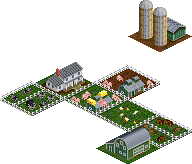

Animal farms are a specific form of an agricultural industry focusing on raising livestock and producing related products such as milk or wool. While one can further distinguish these farms into dairy farms, poultry and pig farms or in various other ways, in the scope of the set all of these are combined into one type of animal farm. 

Industry requires extension(s): [Food Industries](#extension_5) 

Industry is not available with these extension: [Textile Industries](#extension_14) [Fruits and Bioenergy](#extension_6) 

Color in the overview map: &nbsp;&nbsp;&nbsp;&nbsp;&nbsp;&nbsp;

| Requires | Produces |
| -- | -- |
|  | [Livestock](#cargo_LVST) |
|  | [Milk](#cargo_MILK) |

### Animal Farm

Animal farms are a specific form of an agricultural industry focusing on raising livestock and producing related products such as milk or wool. While one can further distinguish these farms into dairy farms, poultry and pig farms or in various other ways, in the scope of the set all of these are combined into one type of animal farm. 

Industry requires extension(s): [Food Industries](#extension_5) [Textile Industries](#extension_14) 

Industry is not available with these extension: [Fruits and Bioenergy](#extension_6) 

Color in the overview map: &nbsp;&nbsp;&nbsp;&nbsp;&nbsp;&nbsp;

| Requires | Produces |
| -- | -- |
| [Grain](#cargo_GRAI) | [Livestock](#cargo_LVST) |
|  | [Milk](#cargo_MILK) |
|  | [Wool](#cargo_WOOL) |

### Animal Farm

Animal farms are a specific form of an agricultural industry focusing on raising livestock and producing related products such as milk or wool. While one can further distinguish these farms into dairy farms, poultry and pig farms or in various other ways, in the scope of the set all of these are combined into one type of animal farm. 

Industry requires extension(s): [Food Industries](#extension_5) [Fruits and Bioenergy](#extension_6) 

Industry is not available with these extension: [Textile Industries](#extension_14) 

Color in the overview map: &nbsp;&nbsp;&nbsp;&nbsp;&nbsp;&nbsp;

| Requires | Produces |
| -- | -- |
|  | [Biomass](#cargo_BIOM) |
|  | [Livestock](#cargo_LVST) |
|  | [Milk](#cargo_MILK) |

### Animal Farm

Animal farms are a specific form of an agricultural industry focusing on raising livestock and producing related products such as milk or wool. While one can further distinguish these farms into dairy farms, poultry and pig farms or in various other ways, in the scope of the set all of these are combined into one type of animal farm. 

Industry requires extension(s): [Food Industries](#extension_5) [Textile Industries](#extension_14) [Fruits and Bioenergy](#extension_6) 

Color in the overview map: &nbsp;&nbsp;&nbsp;&nbsp;&nbsp;&nbsp;

| Requires | Produces |
| -- | -- |
| [Grain](#cargo_GRAI) | [Biomass](#cargo_BIOM) |
|  | [Livestock](#cargo_LVST) |
|  | [Milk](#cargo_MILK) |
|  | [Wool](#cargo_WOOL) |

### Appliance Factory

Electric household appliances like washing machines, fridges or TV sets are commonplace since the mid-20th century. They are built in the appliance factory. Producing them requires several raw materials, which have to be created first. 

Industry requires extension(s): [Metallurgy](#extension_8) 

Industry is not available with these extension: [Packaging Industries](#extension_10) 

Industry will only spawn after 1800.
This restriction is also valid for funding the industry.

Color in the overview map: &nbsp;&nbsp;&nbsp;&nbsp;&nbsp;&nbsp;

Industry requires the raw materials printed in black to produce anything. Raw materials printed in white will increase the maximum production level.

| Requires | Produces |
| -- | -- |
| [Machine Parts](#cargo_ENSP) | [Goods](#cargo_GOOD) |
| [Plastics](#cargo_PLAS) |  |
| [Wire/Cables](#cargo_STWR) |  |

### Appliance Factory

Electric household appliances like washing machines, fridges or TV sets are commonplace since the mid-20th century. They are built in the appliance factory. Producing them requires several raw materials, which have to be created first. 

Industry requires extension(s): [Metallurgy](#extension_8) [Packaging Industries](#extension_10) 

Industry will only spawn after 1800.
This restriction is also valid for funding the industry.

Color in the overview map: &nbsp;&nbsp;&nbsp;&nbsp;&nbsp;&nbsp;

Industry requires the raw materials printed in black to produce anything. Raw materials printed in white will increase the maximum production level.

| Requires | Produces |
| -- | -- |
| [Machine Parts](#cargo_ENSP) | [Goods](#cargo_GOOD) |
| [Packaging](#cargo_MNSP) |  |
| [Plastics](#cargo_PLAS) |  |
| [Wire/Cables](#cargo_STWR) |  |

### Biorefinery

Basic chemicals can be extracted from biomass and fruits. This approach is much better for the environment, compared to the usual ways requiring crude oil. 

Industry requires extension(s): [Fruits and Bioenergy](#extension_6) 

Industry will only spawn after 1900.
This restriction is also valid for funding the industry.

Color in the overview map: &nbsp;&nbsp;&nbsp;&nbsp;&nbsp;&nbsp;

Industry will start producing as soon as any of the required cargos is available. Productivity increases with the number of different available cargos.

| Requires | Produces |
| -- | -- |
| [Biomass](#cargo_BIOM) | [Ethylene](#cargo_C2H4) |
| [Fruits](#cargo_FRUT) | [Petrol](#cargo_PETR) |

### Brewery

The production of beer has been known for thousands of years. Often called liquid bread, beer was and is a common part of the human diet. In the middle ages, monasteries were the typical locations where beer was produced. During Industrial Revolution, with the introduction of better materials such as stainless steel, the number of breweries as well as the production volume of beer increased dramatically. The breakthrough technology was the invention of a refrigeration machine in the 19th century, allowing beer to be produced in higher summer temperatures. Before that, beer was produced during winter and then stored in cellars to shield it from summer heat. 

Germany has a long tradition of brewing beer, and beer is a large part of German culture. It is one of the largest producers and consumers of beer in Europe There a famous regulations dictating that only hops, certain types of grain, yeast and water must be used in the production of beer. Still, there are countless breweries, especially in Franconia, which has the highest density of breweries in the world. About 5000 different beer types are produced across some 1500 breweries, half of which are located in Bavaria. Beer festivals are also famous, among them the Oktoberfest in Munich or the Bergkirchweih in Erlangen. 

In the set, beer is not an extra type of freight, but it is simply labeled as food. 

Industry requires extension(s): [Food Industries](#extension_5) 

Industry is not available with these extension: [Glass](#extension_7) 

Color in the overview map: &nbsp;&nbsp;&nbsp;&nbsp;&nbsp;&nbsp;

| Requires | Produces |
| -- | -- |
| [Grain](#cargo_GRAI) | [Food](#cargo_FOOD) |

### Brewery

The production of beer has been known for thousands of years. Often called liquid bread, beer was and is a common part of the human diet. In the middle ages, monasteries were the typical locations where beer was produced. During Industrial Revolution, with the introduction of better materials such as stainless steel, the number of breweries as well as the production volume of beer increased dramatically. The breakthrough technology was the invention of a refrigeration machine in the 19th century, allowing beer to be produced in higher summer temperatures. Before that, beer was produced during winter and then stored in cellars to shield it from summer heat. 

Germany has a long tradition of brewing beer, and beer is a large part of German culture. It is one of the largest producers and consumers of beer in Europe There a famous regulations dictating that only hops, certain types of grain, yeast and water must be used in the production of beer. Still, there are countless breweries, especially in Franconia, which has the highest density of breweries in the world. About 5000 different beer types are produced across some 1500 breweries, half of which are located in Bavaria. Beer festivals are also famous, among them the Oktoberfest in Munich or the Bergkirchweih in Erlangen. 

In the set, beer is not an extra type of freight, but it is simply labeled as food. 

Industry requires extension(s): [Food Industries](#extension_5) [Glass](#extension_7) 

Color in the overview map: &nbsp;&nbsp;&nbsp;&nbsp;&nbsp;&nbsp;

Industry requires any of the raw materials printed in black to produce anything. Maximum production level is limited by the number of different raw materials available. Raw materials printed in white will increase the maximum production level.

| Requires | Produces |
| -- | -- |
| [Glass](#cargo_GLAS) | [Food](#cargo_FOOD) |
| [Grain](#cargo_GRAI) |  |

### Brickworks

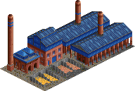

The effective mass production of bricks began in the 19th century with the onset of the industrial revolution. Many manufacturing plants had to be built, and new railway lines often required huge bridges. 

In the real world, bricks have been produced for millenia, often burning wood as source material for creating the required heat. In the set, the modern variant is present which uses coal instead of wood. 

Industry requires extension(s): [Building Industries](#extension_3) 

Industry will only spawn after 1800.
This restriction is also valid for funding the industry.

Color in the overview map: &nbsp;&nbsp;&nbsp;&nbsp;&nbsp;&nbsp;

| Requires | Produces |
| -- | -- |
| [Coal](#cargo_COAL) | [Bricks](#cargo_BDMT) |

### Builders Yard

The builders yard provides building supplies to a nearby town and its citizens. Game-wise it is actually more like a hardware store, i.e. a place where to buy building materials and tools. Additionally, in Germany there are locations to store building materials for community services as well, so this also would also fit the description. 

Industry requires extension(s): [Building Industries](#extension_3) 

Color in the overview map: &nbsp;&nbsp;&nbsp;&nbsp;&nbsp;&nbsp;

| Requires | Produces |
| -- | -- |
| [Bricks](#cargo_BDMT) |  |
| [Cement](#cargo_CMNT) |  |
| [Sand](#cargo_SAND) |  |
| [Timber](#cargo_WDPR) |  |

### Builders Yard

The builders yard provides building supplies to a nearby town and its citizens. Game-wise it is actually more like a hardware store, i.e. a place where to buy building materials and tools. Additionally, in Germany there are locations to store building materials for community services as well, so this also would also fit the description. 

Industry is not available with these extension: [Building Industries](#extension_3) 

Color in the overview map: &nbsp;&nbsp;&nbsp;&nbsp;&nbsp;&nbsp;

| Requires | Produces |
| -- | -- |
| [Timber](#cargo_WDPR) |  |

### Carbon Black Plant

The carbon black plant is basically speaking taking carbon-based compounds such as coal or oil and reduces them to almost pure carbon powder. Typically, the raw materials used for this are residues and heavy fractions from oil destillations. Depending on the actual process used, carbon dioxide is a usual byproduct. However, recent research resulted in new processes that do not result in unwanted byproducts, breaking down the hydrocarbons completely into carbon and Hydrogen, considerably reducing the ecological footprint. 

Industry requires extension(s): [Painting Industries](#extension_11) 

Industry is not available with these extension: [Organic Chemistry](#extension_9) [Ammonia](#extension_1) 

Industry will only spawn after 1850.
This restriction is also valid for funding the industry.

Color in the overview map: &nbsp;&nbsp;&nbsp;&nbsp;&nbsp;&nbsp;

Industry will start producing as soon as any of the required cargos is available. Productivity increases with the number of different available cargos.

| Requires | Produces |
| -- | -- |
| [Coal](#cargo_COAL) | [Carbon Black](#cargo_CBLK) |
| [Oil](#cargo_OIL_) |  |

### Carbon Black Plant

The carbon black plant is basically speaking taking carbon-based compounds such as coal or oil and reduces them to almost pure carbon powder. Typically, the raw materials used for this are residues and heavy fractions from oil destillations. Depending on the actual process used, carbon dioxide is a usual byproduct. However, recent research resulted in new processes that do not result in unwanted byproducts, breaking down the hydrocarbons completely into carbon and Hydrogen, considerably reducing the ecological footprint. 

Industry requires extension(s): [Painting Industries](#extension_11) [Organic Chemistry](#extension_9) 

Industry is not available with these extension: [Ammonia](#extension_1) 

Industry will only spawn after 1850.
This restriction is also valid for funding the industry.

Color in the overview map: &nbsp;&nbsp;&nbsp;&nbsp;&nbsp;&nbsp;

Industry will start producing as soon as any of the required cargos is available. Productivity increases with the number of different available cargos.

| Requires | Produces |
| -- | -- |
| [Coal](#cargo_COAL) | [Carbon Black](#cargo_CBLK) |
| [Naphtha](#cargo_RFPR) |  |

### Carbon Black Plant

The carbon black plant is basically speaking taking carbon-based compounds such as coal or oil and reduces them to almost pure carbon powder. Typically, the raw materials used for this are residues and heavy fractions from oil destillations. Depending on the actual process used, carbon dioxide is a usual byproduct. However, recent research resulted in new processes that do not result in unwanted byproducts, breaking down the hydrocarbons completely into carbon and Hydrogen, considerably reducing the ecological footprint. 

Industry requires extension(s): [Painting Industries](#extension_11) [Ammonia](#extension_1) 

Industry is not available with these extension: [Organic Chemistry](#extension_9) 

Industry will only spawn after 1850.
This restriction is also valid for funding the industry.

Color in the overview map: &nbsp;&nbsp;&nbsp;&nbsp;&nbsp;&nbsp;

Industry requires any of the raw materials printed in black to produce anything. Maximum production level is limited by the number of different raw materials available. Raw materials printed in white will increase the maximum production level.

| Requires | Produces |
| -- | -- |
| [Coal](#cargo_COAL) | [Carbon Black](#cargo_CBLK) |
| [Oxygen](#cargo_O2__) |  |
| [Oil](#cargo_OIL_) |  |

### Carbon Black Plant

The carbon black plant is basically speaking taking carbon-based compounds such as coal or oil and reduces them to almost pure carbon powder. Typically, the raw materials used for this are residues and heavy fractions from oil destillations. Depending on the actual process used, carbon dioxide is a usual byproduct. However, recent research resulted in new processes that do not result in unwanted byproducts, breaking down the hydrocarbons completely into carbon and Hydrogen, considerably reducing the ecological footprint. 

Industry requires extension(s): [Painting Industries](#extension_11) [Organic Chemistry](#extension_9) [Ammonia](#extension_1) 

Industry will only spawn after 1850.
This restriction is also valid for funding the industry.

Color in the overview map: &nbsp;&nbsp;&nbsp;&nbsp;&nbsp;&nbsp;

Industry requires any of the raw materials printed in black to produce anything. Maximum production level is limited by the number of different raw materials available. Raw materials printed in white will increase the maximum production level.

| Requires | Produces |
| -- | -- |
| [Coal](#cargo_COAL) | [Carbon Black](#cargo_CBLK) |
| [Oxygen](#cargo_O2__) |  |
| [Naphtha](#cargo_RFPR) |  |

### Cement Plant

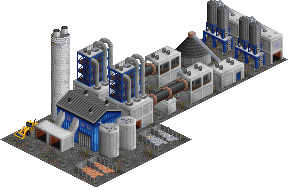

The first cement plants in Germany date back to the early 19th century. In the second half of the 19th century, the industry saw a lot of standardization in terms of production processes and quality requirements. Today, more than 50 plants operate in Germany, making it the largest producer in Europe. 

Industry requires extension(s): [Building Industries](#extension_3) 

Industry will only spawn after 1800.
This restriction is also valid for funding the industry.

Color in the overview map: &nbsp;&nbsp;&nbsp;&nbsp;&nbsp;&nbsp;

| Requires | Produces |
| -- | -- |
| [Limestone](#cargo_LIME) | [Cement](#cargo_CMNT) |
| [Sand](#cargo_SAND) |  |

### Chloralkali Process Plant

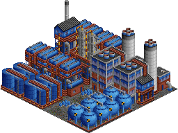

The chloralkali plant uses electrolysis to split up salt into chlorine and sodium hydroxide. As a byproduct hydrogen is produced. This process was developed in the late 19th century and is one of the most important basic technical processes in the chemical industry, as both the main products chlorine and sodium hydroxide are needed practically everywhere in the chemical industry. The reaction requires a lot of electric energy. The first plants to implement this process were built around 1890, with multiple plants in Germany, Spain, France and Russia. Today, almost 20 plants are running all over Germany, located mostly in the classic centers of chemical industry such as Ludwigshafen (BASF) and Schkopau (Dow Chemicals), with the biggest plant being located in Stade in northern Germany. 

Industry requires extension(s): [Basic Inorganic Chemistry](#extension_2) 

Industry will only spawn after 1900.
This restriction is also valid for funding the industry.

Color in the overview map: &nbsp;&nbsp;&nbsp;&nbsp;&nbsp;&nbsp;

Industry requires electricity to produce anything. See [Electricity](#electricty).

| Requires | Produces |
| -- | -- |
| [Salt](#cargo_SALT) | [Chlorine](#cargo_CHLO) |
|  | [Hydrogen](#cargo_H2__) |
|  | [Lye](#cargo_LYE_) |

### Cleaning Products Factory

Cleaning products such as soaps and detergents were some of the first commercial products of the young chemical industry. Already in the second half of the 19th century companies specializing in such products were founded. Some of them, such as Henkel, belong to the biggest chemical companies in the world and operate globally. Many developments and improvements in this area were developed in Germany, such as the first fully synthetic laundry detergent in the 1930s. 

Industry requires extension(s): [Ammonia](#extension_1) 

Industry is not available with these extension: [Coke and Sulphur](#extension_4) [Packaging Industries](#extension_10) 

Industry will only spawn after 1860.
This restriction is also valid for funding the industry.

Color in the overview map: &nbsp;&nbsp;&nbsp;&nbsp;&nbsp;&nbsp;

Industry requires the raw materials printed in black to produce anything. Raw materials printed in white will increase the maximum production level.

| Requires | Produces |
| -- | -- |
| [Soda Ash](#cargo_SASH) | [Goods](#cargo_GOOD) |

### Cleaning Products Factory

Cleaning products such as soaps and detergents were some of the first commercial products of the young chemical industry. Already in the second half of the 19th century companies specializing in such products were founded. Some of them, such as Henkel, belong to the biggest chemical companies in the world and operate globally. Many developments and improvements in this area were developed in Germany, such as the first fully synthetic laundry detergent in the 1930s. 

Industry requires extension(s): [Ammonia](#extension_1) [Coke and Sulphur](#extension_4) 

Industry is not available with these extension: [Packaging Industries](#extension_10) 

Industry will only spawn after 1860.
This restriction is also valid for funding the industry.

Color in the overview map: &nbsp;&nbsp;&nbsp;&nbsp;&nbsp;&nbsp;

Industry will start producing as soon as any of the required cargos is available. Productivity increases with the number of different available cargos.

| Requires | Produces |
| -- | -- |
| [Acid](#cargo_ACID) | [Goods](#cargo_GOOD) |
| [Soda Ash](#cargo_SASH) |  |

### Cleaning Products Factory

Cleaning products such as soaps and detergents were some of the first commercial products of the young chemical industry. Already in the second half of the 19th century companies specializing in such products were founded. Some of them, such as Henkel, belong to the biggest chemical companies in the world and operate globally. Many developments and improvements in this area were developed in Germany, such as the first fully synthetic laundry detergent in the 1930s. 

Industry requires extension(s): [Ammonia](#extension_1) [Packaging Industries](#extension_10) 

Industry is not available with these extension: [Coke and Sulphur](#extension_4) 

Industry will only spawn after 1860.
This restriction is also valid for funding the industry.

Color in the overview map: &nbsp;&nbsp;&nbsp;&nbsp;&nbsp;&nbsp;

Industry requires the raw materials printed in black to produce anything. Raw materials printed in white will increase the maximum production level.

| Requires | Produces |
| -- | -- |
| [Soda Ash](#cargo_SASH) | [Goods](#cargo_GOOD) |

### Cleaning Products Factory

Cleaning products such as soaps and detergents were some of the first commercial products of the young chemical industry. Already in the second half of the 19th century companies specializing in such products were founded. Some of them, such as Henkel, belong to the biggest chemical companies in the world and operate globally. Many developments and improvements in this area were developed in Germany, such as the first fully synthetic laundry detergent in the 1930s. 

Industry requires extension(s): [Ammonia](#extension_1) [Coke and Sulphur](#extension_4) [Packaging Industries](#extension_10) 

Industry will only spawn after 1860.
This restriction is also valid for funding the industry.

Color in the overview map: &nbsp;&nbsp;&nbsp;&nbsp;&nbsp;&nbsp;

Industry requires any of the raw materials printed in black to produce anything. Maximum production level is limited by the number of different raw materials available. Raw materials printed in white will increase the maximum production level.

| Requires | Produces |
| -- | -- |
| [Acid](#cargo_ACID) | [Goods](#cargo_GOOD) |
| [Packaging](#cargo_MNSP) |  |
| [Soda Ash](#cargo_SASH) |  |

### Clothing Plant

The clothing plant is the place where textiles are turned into clothing by means of tailoring and sewing. Historically, there was a rich history of clothing manufacturing in Europe, which has been replaced almost completely by cheaper Asian competitors, although high quality tailors still have their niche. Germany had a considerable clothing manufacturing industry in the 19th century, mainly located in Silesia and Saxony. Today, many different companies exist, some of which are well known internationally like Boss, Triumph or adidas, but production typically has been outsourced to Asia. 

Industry requires extension(s): [Textile Industries](#extension_14) 

Color in the overview map: &nbsp;&nbsp;&nbsp;&nbsp;&nbsp;&nbsp;

| Requires | Produces |
| -- | -- |
| [Textiles](#cargo_TEXT) | [Goods](#cargo_GOOD) |

### Clothing Plant

The clothing plant is the place where textiles are turned into clothing by means of tailoring and sewing. Historically, there was a rich history of clothing manufacturing in Europe, which has been replaced almost completely by cheaper Asian competitors, although high quality tailors still have their niche. Germany had a considerable clothing manufacturing industry in the 19th century, mainly located in Silesia and Saxony. Today, many different companies exist, some of which are well known internationally like Boss, Triumph or adidas, but production typically has been outsourced to Asia. 

Industry requires extension(s): [Textile Industries](#extension_14) [Packaging Industries](#extension_10) 

Color in the overview map: &nbsp;&nbsp;&nbsp;&nbsp;&nbsp;&nbsp;

Industry requires the raw materials printed in black to produce anything. Raw materials printed in white will increase the maximum production level.

| Requires | Produces |
| -- | -- |
| [Packaging](#cargo_MNSP) | [Goods](#cargo_GOOD) |
| [Textiles](#cargo_TEXT) |  |

### Coal Liquefaction Plant

Creating fuels by liquifying coal in combination with hydrogen is a bit of a special case in the German history of chemistry. As Germany does not have own reserves of crude oil, it was a political goal since the early 20th century to overcome this dependency. The first fuel created synthetically this way was the so-called Leuna-Benzin ("Leuna-fuel"), named after the location of the plant. These plants were important for the preparation of World War II in Nazi Germany and thus were extended heavily. After the end of the war the relevance of this process practically vanished, since fuels can be produced much cheaper from oil, which was now available in abundance via imports. However, in the 21st century many countries see that this process may be a way to reduce the dependency on oil imports, with all its political implications. 

Industry requires extension(s): [Organic Chemistry](#extension_9) 

Industry will only spawn after 1930.
This restriction is also valid for funding the industry.

Color in the overview map: &nbsp;&nbsp;&nbsp;&nbsp;&nbsp;&nbsp;

| Requires | Produces |
| -- | -- |
| [Coal](#cargo_COAL) | [Ethylene](#cargo_C2H4) |
| [Hydrogen](#cargo_H2__) | [Petrol](#cargo_PETR) |

### Coal Mine

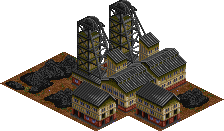

Coal mining became one of the most important industries during the Industrial Revolution of the early 19th century, as coal was needed to power steam engines. Steam engines were used to power just about anything, from water pumps in mines to mechanized looms. With the invention of railway steam engines and the introduction of steam shipping the demand of coal rose once more. 

Germany's coal mining industry developed mainly in the Ruhr area and in upper Silesia, but also in the Saar region, areas which became the first centers of heavy industrialization. In the early 20th century production increased significantly due to the introduction of improved jackhammers and mechanization. At the time, Germany was one of the largest producers of coal in the world. After World War 2 production peaked in the 1950s. However, rising costs made coal mining unprofitable and the industry slowly declined from 1960 onwards, existing on subsidies for decades. The last coal mines closed in 2018. 

Industry will only spawn from 1800 to 1950.
This restriction is also valid for funding the industry.

Color in the overview map: &nbsp;&nbsp;&nbsp;&nbsp;&nbsp;&nbsp;

Industry is generated with limited resources and will close down once these are depleted. See [Resource depletion](#resource_depletion).

| Requires | Produces |
| -- | -- |
|  | [Coal](#cargo_COAL) |

### Coke Oven

Coal contains sulphur and other impurities, which can cause problems, depending on intended usage. For example, it has a negative impact on the quality of pig iron in the scope of steel production. The solution to that problem is the conversion of coal to coke, which removes the sulphur and results in practically pure carbon. In the past, many coke ovens were in use in Germany, typically tied to the steel production plants. They produce not only coke, but also make use of the other chemicals that are removed from the coal. Nowadays, only a handful of coke ovens are left in the Ruhr area, while many other plants have closed down due to the structural shifts in economy. 

Industry requires extension(s): [Coke and Sulphur](#extension_4) 

Industry will only spawn after 1800.
This restriction is also valid for funding the industry.

Color in the overview map: &nbsp;&nbsp;&nbsp;&nbsp;&nbsp;&nbsp;

| Requires | Produces |
| -- | -- |
| [Coal](#cargo_COAL) | [Coke](#cargo_COKE) |
|  | [Sulphur](#cargo_SULP) |

### Component Factory

Building parts to supply vehicle factories is a huge industry by itself. All sorts of parts are produced, be it seats, steering wheels, gearboxes or electronics. The vehicle parts plant is the standin for all sorts of suppliers, which are economically important especially in Germany. 

Industry requires extension(s): [Vehicle Industries](#extension_15) 

Industry is not available with these extension: [Textile Industries](#extension_14) [Glass](#extension_7) [Metallurgy](#extension_8) 

Industry will only spawn after 1910.
This restriction is also valid for funding the industry.

Color in the overview map: &nbsp;&nbsp;&nbsp;&nbsp;&nbsp;&nbsp;

| Requires | Produces |
| -- | -- |
| [Plastics](#cargo_PLAS) | [Vehicle Parts](#cargo_VPTS) |
| [Steel](#cargo_STEL) |  |

### Component Factory

Building parts to supply vehicle factories is a huge industry by itself. All sorts of parts are produced, be it seats, steering wheels, gearboxes or electronics. The vehicle parts plant is the standin for all sorts of suppliers, which are economically important especially in Germany. 

Industry requires extension(s): [Vehicle Industries](#extension_15) [Textile Industries](#extension_14) 

Industry is not available with these extension: [Glass](#extension_7) [Metallurgy](#extension_8) 

Industry will only spawn after 1910.
This restriction is also valid for funding the industry.

Color in the overview map: &nbsp;&nbsp;&nbsp;&nbsp;&nbsp;&nbsp;

Industry will start producing as soon as any of the required cargos is available. Productivity increases with the number of different available cargos.

| Requires | Produces |
| -- | -- |
| [Plastics](#cargo_PLAS) | [Vehicle Parts](#cargo_VPTS) |
| [Steel](#cargo_STEL) |  |
| [Textiles](#cargo_TEXT) |  |

### Component Factory

Building parts to supply vehicle factories is a huge industry by itself. All sorts of parts are produced, be it seats, steering wheels, gearboxes or electronics. The vehicle parts plant is the standin for all sorts of suppliers, which are economically important especially in Germany. 

Industry requires extension(s): [Vehicle Industries](#extension_15) [Glass](#extension_7) 

Industry is not available with these extension: [Textile Industries](#extension_14) [Metallurgy](#extension_8) 

Industry will only spawn after 1910.
This restriction is also valid for funding the industry.

Color in the overview map: &nbsp;&nbsp;&nbsp;&nbsp;&nbsp;&nbsp;

Industry will start producing as soon as any of the required cargos is available. Productivity increases with the number of different available cargos.

| Requires | Produces |
| -- | -- |
| [Glass](#cargo_GLAS) | [Vehicle Parts](#cargo_VPTS) |
| [Plastics](#cargo_PLAS) |  |
| [Steel](#cargo_STEL) |  |

### Component Factory

Building parts to supply vehicle factories is a huge industry by itself. All sorts of parts are produced, be it seats, steering wheels, gearboxes or electronics. The vehicle parts plant is the standin for all sorts of suppliers, which are economically important especially in Germany. 

Industry requires extension(s): [Vehicle Industries](#extension_15) [Textile Industries](#extension_14) [Glass](#extension_7) 

Industry is not available with these extension: [Metallurgy](#extension_8) 

Industry will only spawn after 1910.
This restriction is also valid for funding the industry.

Color in the overview map: &nbsp;&nbsp;&nbsp;&nbsp;&nbsp;&nbsp;

Industry will start producing as soon as any of the required cargos is available. Productivity increases with the number of different available cargos.

| Requires | Produces |
| -- | -- |
| [Glass](#cargo_GLAS) | [Vehicle Parts](#cargo_VPTS) |
| [Plastics](#cargo_PLAS) |  |
| [Steel](#cargo_STEL) |  |
| [Textiles](#cargo_TEXT) |  |

### Component Factory

Building parts to supply vehicle factories is a huge industry by itself. All sorts of parts are produced, be it seats, steering wheels, gearboxes or electronics. The vehicle parts plant is the standin for all sorts of suppliers, which are economically important especially in Germany. 

Industry requires extension(s): [Vehicle Industries](#extension_15) [Metallurgy](#extension_8) 

Industry is not available with these extension: [Textile Industries](#extension_14) [Glass](#extension_7) 

Industry will only spawn after 1910.
This restriction is also valid for funding the industry.

Color in the overview map: &nbsp;&nbsp;&nbsp;&nbsp;&nbsp;&nbsp;

Industry will start producing as soon as any of the required cargos is available. Productivity increases with the number of different available cargos.

| Requires | Produces |
| -- | -- |
| [Plastics](#cargo_PLAS) | [Vehicle Parts](#cargo_VPTS) |
| [Steel](#cargo_STEL) |  |
| [Wire/Cables](#cargo_STWR) |  |

### Component Factory

Building parts to supply vehicle factories is a huge industry by itself. All sorts of parts are produced, be it seats, steering wheels, gearboxes or electronics. The vehicle parts plant is the standin for all sorts of suppliers, which are economically important especially in Germany. 

Industry requires extension(s): [Vehicle Industries](#extension_15) [Textile Industries](#extension_14) [Metallurgy](#extension_8) 

Industry is not available with these extension: [Glass](#extension_7) 

Industry will only spawn after 1910.
This restriction is also valid for funding the industry.

Color in the overview map: &nbsp;&nbsp;&nbsp;&nbsp;&nbsp;&nbsp;

Industry will start producing as soon as any of the required cargos is available. Productivity increases with the number of different available cargos.

| Requires | Produces |
| -- | -- |
| [Plastics](#cargo_PLAS) | [Vehicle Parts](#cargo_VPTS) |
| [Steel](#cargo_STEL) |  |
| [Wire/Cables](#cargo_STWR) |  |
| [Textiles](#cargo_TEXT) |  |

### Component Factory

Building parts to supply vehicle factories is a huge industry by itself. All sorts of parts are produced, be it seats, steering wheels, gearboxes or electronics. The vehicle parts plant is the standin for all sorts of suppliers, which are economically important especially in Germany. 

Industry requires extension(s): [Vehicle Industries](#extension_15) [Glass](#extension_7) [Metallurgy](#extension_8) 

Industry is not available with these extension: [Textile Industries](#extension_14) 

Industry will only spawn after 1910.
This restriction is also valid for funding the industry.

Color in the overview map: &nbsp;&nbsp;&nbsp;&nbsp;&nbsp;&nbsp;

Industry will start producing as soon as any of the required cargos is available. Productivity increases with the number of different available cargos.

| Requires | Produces |
| -- | -- |
| [Glass](#cargo_GLAS) | [Vehicle Parts](#cargo_VPTS) |
| [Plastics](#cargo_PLAS) |  |
| [Steel](#cargo_STEL) |  |
| [Wire/Cables](#cargo_STWR) |  |

### Component Factory

Building parts to supply vehicle factories is a huge industry by itself. All sorts of parts are produced, be it seats, steering wheels, gearboxes or electronics. The vehicle parts plant is the standin for all sorts of suppliers, which are economically important especially in Germany. 

Industry requires extension(s): [Vehicle Industries](#extension_15) [Textile Industries](#extension_14) [Glass](#extension_7) [Metallurgy](#extension_8) 

Industry will only spawn after 1910.
This restriction is also valid for funding the industry.

Color in the overview map: &nbsp;&nbsp;&nbsp;&nbsp;&nbsp;&nbsp;

Industry will start producing as soon as any of the required cargos is available. Productivity increases with the number of different available cargos.

| Requires | Produces |
| -- | -- |
| [Glass](#cargo_GLAS) | [Vehicle Parts](#cargo_VPTS) |
| [Plastics](#cargo_PLAS) |  |
| [Steel](#cargo_STEL) |  |
| [Wire/Cables](#cargo_STWR) |  |
| [Textiles](#cargo_TEXT) |  |

### Copper Ore Mine

Mining copper ore has been done since ancient times. In the set, as with all mining, the starting time is set way later in order to simulate the improved mining technologies required to do really deep mining. Europe in general does not contain a lot of copper ore, mining was done in central Germany, but the reserves were already depleted even before the industrial revolution. The last copper ore mines were in production until the middle of the 20th century, but that had at least partially political reasons, with East Germany not having access to copper on the world market. Today, copper is mainly produced from imported ore and by recycling scrap metal. 

Industry requires extension(s): [Painting Industries](#extension_11) 

Industry is not available with these extension: [Coke and Sulphur](#extension_4) 

Industry will only spawn from 1800 to 1930.
This restriction is also valid for funding the industry.

Color in the overview map: &nbsp;&nbsp;&nbsp;&nbsp;&nbsp;&nbsp;

Industry is generated with limited resources and will close down once these are depleted. See [Resource depletion](#resource_depletion).

| Requires | Produces |
| -- | -- |
|  | [Copper Ore](#cargo_CORE) |

### Copper Ore Mine

Mining copper ore has been done since ancient times. In the set, as with all mining, the starting time is set way later in order to simulate the improved mining technologies required to do really deep mining. Europe in general does not contain a lot of copper ore, mining was done in central Germany, but the reserves were already depleted even before the industrial revolution. The last copper ore mines were in production until the middle of the 20th century, but that had at least partially political reasons, with East Germany not having access to copper on the world market. Today, copper is mainly produced from imported ore and by recycling scrap metal. 

Industry requires extension(s): [Painting Industries](#extension_11) [Coke and Sulphur](#extension_4) 

Industry will only spawn from 1800 to 1930.
This restriction is also valid for funding the industry.

Color in the overview map: &nbsp;&nbsp;&nbsp;&nbsp;&nbsp;&nbsp;

Industry is generated with limited resources and will close down once these are depleted. See [Resource depletion](#resource_depletion).

| Requires | Produces |
| -- | -- |
|  | [Pyrite Ore](#cargo_PORE) |

### Copper Smelter

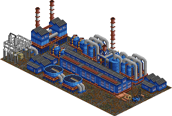

The production of copper from copper ore is an energy-intense multi-step process requiring electrolysis. Byproducts of the process are certain other metal ores, as well as sulphur, depending on the quality of the ore used as input material. In the set, it is assumed that high quality ore with little impurity is used, while low-quality ores with sulphur are part of a different extension. The largest producer in Europe is located in Hamburg, Germany, producing copper from imported copper ore and scrap metal. 

Industry requires extension(s): [Painting Industries](#extension_11) 

Industry is not available with these extension: [Coke and Sulphur](#extension_4) [Recycling](#extension_13) 

Industry will only spawn after 1900.
This restriction is also valid for funding the industry.

Color in the overview map: &nbsp;&nbsp;&nbsp;&nbsp;&nbsp;&nbsp;

Industry requires the raw materials printed in black to produce anything. Raw materials printed in white will increase the maximum production level.

Industry requires electricity to produce anything. See [Electricity](#electricty).

| Requires | Produces |
| -- | -- |
| [Copper Ore](#cargo_CORE) | [Copper](#cargo_COPR) |

### Copper Smelter

The production of copper from copper ore is an energy-intense multi-step process requiring electrolysis. Byproducts of the process are certain other metal ores, as well as sulphur, depending on the quality of the ore used as input material. In the set, it is assumed that high quality ore with little impurity is used, while low-quality ores with sulphur are part of a different extension. The largest producer in Europe is located in Hamburg, Germany, producing copper from imported copper ore and scrap metal. 

Industry requires extension(s): [Painting Industries](#extension_11) [Coke and Sulphur](#extension_4) 

Industry is not available with these extension: [Recycling](#extension_13) 

Industry will only spawn after 1900.
This restriction is also valid for funding the industry.

Color in the overview map: &nbsp;&nbsp;&nbsp;&nbsp;&nbsp;&nbsp;

Industry requires electricity to produce anything. See [Electricity](#electricty).

| Requires | Produces |
| -- | -- |
| [Acid](#cargo_ACID) | [Copper](#cargo_COPR) |
| [Copper Ore](#cargo_CORE) |  |

### Copper Smelter

The production of copper from copper ore is an energy-intense multi-step process requiring electrolysis. Byproducts of the process are certain other metal ores, as well as sulphur, depending on the quality of the ore used as input material. In the set, it is assumed that high quality ore with little impurity is used, while low-quality ores with sulphur are part of a different extension. The largest producer in Europe is located in Hamburg, Germany, producing copper from imported copper ore and scrap metal. 

Industry requires extension(s): [Painting Industries](#extension_11) [Recycling](#extension_13) 

Industry is not available with these extension: [Coke and Sulphur](#extension_4) 

Industry will only spawn after 1900.
This restriction is also valid for funding the industry.

Color in the overview map: &nbsp;&nbsp;&nbsp;&nbsp;&nbsp;&nbsp;

Industry requires electricity to produce anything. See [Electricity](#electricty).

| Requires | Produces |
| -- | -- |
| [Copper Ore](#cargo_CORE) | [Copper](#cargo_COPR) |
| [Scrap Metal](#cargo_SCMT) |  |

### Copper Smelter

The production of copper from copper ore is an energy-intense multi-step process requiring electrolysis. Byproducts of the process are certain other metal ores, as well as sulphur, depending on the quality of the ore used as input material. In the set, it is assumed that high quality ore with little impurity is used, while low-quality ores with sulphur are part of a different extension. The largest producer in Europe is located in Hamburg, Germany, producing copper from imported copper ore and scrap metal. 

Industry requires extension(s): [Painting Industries](#extension_11) [Coke and Sulphur](#extension_4) [Recycling](#extension_13) 

Industry will only spawn after 1900.
This restriction is also valid for funding the industry.

Color in the overview map: &nbsp;&nbsp;&nbsp;&nbsp;&nbsp;&nbsp;

Industry requires electricity to produce anything. See [Electricity](#electricty).

| Requires | Produces |
| -- | -- |
| [Acid](#cargo_ACID) | [Copper](#cargo_COPR) |
| [Copper Ore](#cargo_CORE) |  |
| [Scrap Metal](#cargo_SCMT) |  |

### Cryo Plant

Many industrial processes required pure oxygen or pure nitrogen. Since the beginning of the 20th century this is done by cooling air until it liquifies. Then the different parts can be segregated based on their boiling temperatures. 

Industry requires extension(s): [Ammonia](#extension_1) 

Industry will only spawn after 1900.
This restriction is also valid for funding the industry.

Color in the overview map: &nbsp;&nbsp;&nbsp;&nbsp;&nbsp;&nbsp;

| Requires | Produces |
| -- | -- |
|  | [Nitrogen](#cargo_N2__) |
|  | [Oxygen](#cargo_O2__) |

### Dairy

A dairy is, at least in the terminology used for this set, an industry that produces milk-based food, such as butter and cheese. The milk is produced from cattle in animal farms. 

Industry requires extension(s): [Food Industries](#extension_5) 

Industry is not available with these extension: [Basic Inorganic Chemistry](#extension_2) [Packaging Industries](#extension_10) 

Color in the overview map: &nbsp;&nbsp;&nbsp;&nbsp;&nbsp;&nbsp;

| Requires | Produces |
| -- | -- |
| [Milk](#cargo_MILK) | [Food](#cargo_FOOD) |

### Dairy

A dairy is, at least in the terminology used for this set, an industry that produces milk-based food, such as butter and cheese. The milk is produced from cattle in animal farms. 

Industry requires extension(s): [Food Industries](#extension_5) [Basic Inorganic Chemistry](#extension_2) 

Industry is not available with these extension: [Packaging Industries](#extension_10) 

Color in the overview map: &nbsp;&nbsp;&nbsp;&nbsp;&nbsp;&nbsp;

Industry requires the raw materials printed in black to produce anything. Raw materials printed in white will increase the maximum production level.

| Requires | Produces |
| -- | -- |
| [Lye](#cargo_LYE_) | [Food](#cargo_FOOD) |
| [Milk](#cargo_MILK) |  |

### Dairy

A dairy is, at least in the terminology used for this set, an industry that produces milk-based food, such as butter and cheese. The milk is produced from cattle in animal farms. 

Industry requires extension(s): [Food Industries](#extension_5) [Packaging Industries](#extension_10) 

Industry is not available with these extension: [Basic Inorganic Chemistry](#extension_2) 

Color in the overview map: &nbsp;&nbsp;&nbsp;&nbsp;&nbsp;&nbsp;

Industry requires the raw materials printed in black to produce anything. Raw materials printed in white will increase the maximum production level.

| Requires | Produces |
| -- | -- |
| [Milk](#cargo_MILK) | [Food](#cargo_FOOD) |
| [Packaging](#cargo_MNSP) |  |

### Dairy

A dairy is, at least in the terminology used for this set, an industry that produces milk-based food, such as butter and cheese. The milk is produced from cattle in animal farms. 

Industry requires extension(s): [Food Industries](#extension_5) [Basic Inorganic Chemistry](#extension_2) [Packaging Industries](#extension_10) 

Color in the overview map: &nbsp;&nbsp;&nbsp;&nbsp;&nbsp;&nbsp;

Industry requires the raw materials printed in black to produce anything. Raw materials printed in white will increase the maximum production level.

| Requires | Produces |
| -- | -- |
| [Lye](#cargo_LYE_) | [Food](#cargo_FOOD) |
| [Milk](#cargo_MILK) |  |
| [Packaging](#cargo_MNSP) |  |

### Department Store

The department store implements the concept of generic stores where you can buy any sort of item in the household, be it clothing, books, household applications like washing machines, toys and whatever else. They are introduced to avoid the problem that small towns typically do not accept goods until they have grown to a certain size and to avoid a fluctuation in accepted cargo for your stations. 

Color in the overview map: &nbsp;&nbsp;&nbsp;&nbsp;&nbsp;&nbsp;

| Requires | Produces |
| -- | -- |
| [Goods](#cargo_GOOD) |  |

### Engine Factory

In many cases, engines are built in specialized factories and are then transported into another factory to be placed into cars. Historically, there were quite a number of pure engine factories in Germany, especially for airplane engines or big industrial machines. For example, the Maschinenfabrik Augsburg-Nürnberg (today known as MAN) is known as the birthplace of the Diesel engine, and in Munich there were multiple plane engine factories from which a company known as BMW emerged. 

Industry requires extension(s): [Vehicle Industries](#extension_15) 

Industry is not available with these extension: [Aluminium](#extension_0) [Metallurgy](#extension_8) 

Industry will only spawn after 1910.
This restriction is also valid for funding the industry.

Color in the overview map: &nbsp;&nbsp;&nbsp;&nbsp;&nbsp;&nbsp;

| Requires | Produces |
| -- | -- |
| [Steel](#cargo_STEL) | [Vehicle Engines](#cargo_VENG) |

### Engine Factory

In many cases, engines are built in specialized factories and are then transported into another factory to be placed into cars. Historically, there were quite a number of pure engine factories in Germany, especially for airplane engines or big industrial machines. For example, the Maschinenfabrik Augsburg-Nürnberg (today known as MAN) is known as the birthplace of the Diesel engine, and in Munich there were multiple plane engine factories from which a company known as BMW emerged. 

Industry requires extension(s): [Vehicle Industries](#extension_15) [Aluminium](#extension_0) 

Industry is not available with these extension: [Metallurgy](#extension_8) 

Industry will only spawn after 1910.
This restriction is also valid for funding the industry.

Color in the overview map: &nbsp;&nbsp;&nbsp;&nbsp;&nbsp;&nbsp;

| Requires | Produces |
| -- | -- |
| [Aluminium](#cargo_ALUM) | [Vehicle Engines](#cargo_VENG) |
| [Steel](#cargo_STEL) |  |

### Engine Factory

In many cases, engines are built in specialized factories and are then transported into another factory to be placed into cars. Historically, there were quite a number of pure engine factories in Germany, especially for airplane engines or big industrial machines. For example, the Maschinenfabrik Augsburg-Nürnberg (today known as MAN) is known as the birthplace of the Diesel engine, and in Munich there were multiple plane engine factories from which a company known as BMW emerged. 

Industry requires extension(s): [Vehicle Industries](#extension_15) [Metallurgy](#extension_8) 

Industry is not available with these extension: [Aluminium](#extension_0) 

Industry will only spawn after 1910.
This restriction is also valid for funding the industry.

Color in the overview map: &nbsp;&nbsp;&nbsp;&nbsp;&nbsp;&nbsp;

| Requires | Produces |
| -- | -- |
| [Machine Parts](#cargo_ENSP) | [Vehicle Engines](#cargo_VENG) |
| [Steel](#cargo_STEL) |  |
| [Wire/Cables](#cargo_STWR) |  |

### Engine Factory

In many cases, engines are built in specialized factories and are then transported into another factory to be placed into cars. Historically, there were quite a number of pure engine factories in Germany, especially for airplane engines or big industrial machines. For example, the Maschinenfabrik Augsburg-Nürnberg (today known as MAN) is known as the birthplace of the Diesel engine, and in Munich there were multiple plane engine factories from which a company known as BMW emerged. 

Industry requires extension(s): [Vehicle Industries](#extension_15) [Aluminium](#extension_0) [Metallurgy](#extension_8) 

Industry will only spawn after 1910.
This restriction is also valid for funding the industry.

Color in the overview map: &nbsp;&nbsp;&nbsp;&nbsp;&nbsp;&nbsp;

| Requires | Produces |
| -- | -- |
| [Aluminium](#cargo_ALUM) | [Vehicle Engines](#cargo_VENG) |
| [Machine Parts](#cargo_ENSP) |  |
| [Steel](#cargo_STEL) |  |
| [Wire/Cables](#cargo_STWR) |  |

### Farm

Farms are the main agricultural industry in the set, producing grain and livestock. Both are inputs for the food industry. 

Industry requires extension(s): [Textile Industries](#extension_14) 

Industry is not available with these extension: [Food Industries](#extension_5) [Fruits and Bioenergy](#extension_6) 

Color in the overview map: &nbsp;&nbsp;&nbsp;&nbsp;&nbsp;&nbsp;

| Requires | Produces |
| -- | -- |
|  | [Grain](#cargo_GRAI) |
|  | [Livestock](#cargo_LVST) |
|  | [Wool](#cargo_WOOL) |

### Farm

Farms are the main agricultural industry in the set, producing grain and livestock. Both are inputs for the food industry. 

Industry is not available with these extension: [Textile Industries](#extension_14) [Food Industries](#extension_5) [Fruits and Bioenergy](#extension_6) 

Color in the overview map: &nbsp;&nbsp;&nbsp;&nbsp;&nbsp;&nbsp;

| Requires | Produces |
| -- | -- |
|  | [Grain](#cargo_GRAI) |
|  | [Livestock](#cargo_LVST) |

### Farm

Farms are the main agricultural industry in the set, producing grain and livestock. Both are inputs for the food industry. 

Industry requires extension(s): [Food Industries](#extension_5) 

Industry is not available with these extension: [Fruits and Bioenergy](#extension_6) 

Color in the overview map: &nbsp;&nbsp;&nbsp;&nbsp;&nbsp;&nbsp;

| Requires | Produces |
| -- | -- |
|  | [Grain](#cargo_GRAI) |

### Farm

Farms are the main agricultural industry in the set, producing grain and livestock. Both are inputs for the food industry. 

Industry requires extension(s): [Textile Industries](#extension_14) [Fruits and Bioenergy](#extension_6) 

Industry is not available with these extension: [Food Industries](#extension_5) 

Color in the overview map: &nbsp;&nbsp;&nbsp;&nbsp;&nbsp;&nbsp;

| Requires | Produces |
| -- | -- |
|  | [Biomass](#cargo_BIOM) |
|  | [Grain](#cargo_GRAI) |
|  | [Livestock](#cargo_LVST) |
|  | [Wool](#cargo_WOOL) |

### Farm

Farms are the main agricultural industry in the set, producing grain and livestock. Both are inputs for the food industry. 

Industry requires extension(s): [Fruits and Bioenergy](#extension_6) 

Industry is not available with these extension: [Textile Industries](#extension_14) [Food Industries](#extension_5) 

Color in the overview map: &nbsp;&nbsp;&nbsp;&nbsp;&nbsp;&nbsp;

| Requires | Produces |
| -- | -- |
|  | [Biomass](#cargo_BIOM) |
|  | [Grain](#cargo_GRAI) |
|  | [Livestock](#cargo_LVST) |

### Farm

Farms are the main agricultural industry in the set, producing grain and livestock. Both are inputs for the food industry. 

Industry requires extension(s): [Food Industries](#extension_5) [Fruits and Bioenergy](#extension_6) 

Color in the overview map: &nbsp;&nbsp;&nbsp;&nbsp;&nbsp;&nbsp;

| Requires | Produces |
| -- | -- |
|  | [Biomass](#cargo_BIOM) |
|  | [Grain](#cargo_GRAI) |

### Fishing Grounds

Fish has to be caught out on sea, which provides for an interesting transportation challenge, requiring ships and possibly transfers from ships to other means of transportation at ports. Although Germany has access to the North Sea and Baltic Sea, it imports most fish from elsewhere. In fact, Germany is one of the biggest importers of fish in Europe. 

Color in the overview map: &nbsp;&nbsp;&nbsp;&nbsp;&nbsp;&nbsp;

| Requires | Produces |
| -- | -- |
|  | [Fish](#cargo_FISH) |

### Flour Mill

Flour mills have been around for thousands of years. They grind grain into flour, which is an all-important ingredient for many types of food. This grinding involved a rotating stone, the millstone, which was typically achieved by using water or wind for power. Mills were ubiquitous, as is the surname Miller, which was derived from the job of running the mill. Industrialization changed the process of creating flour considerably, providing new power sources and allowing much larger production volumes. 

Industry requires extension(s): [Food Industries](#extension_5) 

Industry is not available with these extension: [Packaging Industries](#extension_10) 

Color in the overview map: &nbsp;&nbsp;&nbsp;&nbsp;&nbsp;&nbsp;

| Requires | Produces |
| -- | -- |
| [Grain](#cargo_GRAI) | [Food](#cargo_FOOD) |

### Flour Mill

Flour mills have been around for thousands of years. They grind grain into flour, which is an all-important ingredient for many types of food. This grinding involved a rotating stone, the millstone, which was typically achieved by using water or wind for power. Mills were ubiquitous, as is the surname Miller, which was derived from the job of running the mill. Industrialization changed the process of creating flour considerably, providing new power sources and allowing much larger production volumes. 

Industry requires extension(s): [Food Industries](#extension_5) [Packaging Industries](#extension_10) 

Color in the overview map: &nbsp;&nbsp;&nbsp;&nbsp;&nbsp;&nbsp;

Industry requires the raw materials printed in black to produce anything. Raw materials printed in white will increase the maximum production level.

| Requires | Produces |
| -- | -- |
| [Grain](#cargo_GRAI) | [Food](#cargo_FOOD) |
| [Packaging](#cargo_MNSP) |  |

### Food Processing Plant

The food processor is an abstraction of various food-production related industries. Whether it is bakery products, canned fish or any other sort of food, it is produced here, to be transported to the supermarket shelves. 

Industry is not available with these extension: [Basic Inorganic Chemistry](#extension_2) [Food Industries](#extension_5) [Packaging Industries](#extension_10) 

Color in the overview map: &nbsp;&nbsp;&nbsp;&nbsp;&nbsp;&nbsp;

Industry will start producing as soon as any of the required cargos is available. Productivity increases with the number of different available cargos.

| Requires | Produces |
| -- | -- |
| [Fish](#cargo_FISH) | [Food](#cargo_FOOD) |
| [Grain](#cargo_GRAI) |  |
| [Livestock](#cargo_LVST) |  |

### Food Processing Plant

The food processor is an abstraction of various food-production related industries. Whether it is bakery products, canned fish or any other sort of food, it is produced here, to be transported to the supermarket shelves. 

Industry requires extension(s): [Basic Inorganic Chemistry](#extension_2) 

Industry is not available with these extension: [Food Industries](#extension_5) [Packaging Industries](#extension_10) [Fruits and Bioenergy](#extension_6) 

Color in the overview map: &nbsp;&nbsp;&nbsp;&nbsp;&nbsp;&nbsp;

Industry requires any of the raw materials printed in black to produce anything. Maximum production level is limited by the number of different raw materials available. Raw materials printed in white will increase the maximum production level.

| Requires | Produces |
| -- | -- |
| [Fish](#cargo_FISH) | [Food](#cargo_FOOD) |
| [Grain](#cargo_GRAI) |  |
| [Livestock](#cargo_LVST) |  |
| [Lye](#cargo_LYE_) |  |
| [Salt](#cargo_SALT) |  |

### Food Processing Plant

The food processor is an abstraction of various food-production related industries. Whether it is bakery products, canned fish or any other sort of food, it is produced here, to be transported to the supermarket shelves. 

Industry requires extension(s): [Food Industries](#extension_5) 

Industry is not available with these extension: [Basic Inorganic Chemistry](#extension_2) [Packaging Industries](#extension_10) 

Color in the overview map: &nbsp;&nbsp;&nbsp;&nbsp;&nbsp;&nbsp;

Industry will start producing as soon as any of the required cargos is available. Productivity increases with the number of different available cargos.

| Requires | Produces |
| -- | -- |
| [Fish](#cargo_FISH) | [Food](#cargo_FOOD) |

### Food Processing Plant

The food processor is an abstraction of various food-production related industries. Whether it is bakery products, canned fish or any other sort of food, it is produced here, to be transported to the supermarket shelves. 

Industry requires extension(s): [Basic Inorganic Chemistry](#extension_2) [Food Industries](#extension_5) 

Industry is not available with these extension: [Packaging Industries](#extension_10) [Fruits and Bioenergy](#extension_6) 

Color in the overview map: &nbsp;&nbsp;&nbsp;&nbsp;&nbsp;&nbsp;

Industry requires the raw materials printed in black to produce anything. Raw materials printed in white will increase the maximum production level.

| Requires | Produces |
| -- | -- |
| [Fish](#cargo_FISH) | [Food](#cargo_FOOD) |
| [Lye](#cargo_LYE_) |  |
| [Salt](#cargo_SALT) |  |

### Food Processing Plant

The food processor is an abstraction of various food-production related industries. Whether it is bakery products, canned fish or any other sort of food, it is produced here, to be transported to the supermarket shelves. 

Industry requires extension(s): [Packaging Industries](#extension_10) 

Industry is not available with these extension: [Basic Inorganic Chemistry](#extension_2) [Food Industries](#extension_5) 

Color in the overview map: &nbsp;&nbsp;&nbsp;&nbsp;&nbsp;&nbsp;

Industry requires any of the raw materials printed in black to produce anything. Maximum production level is limited by the number of different raw materials available. Raw materials printed in white will increase the maximum production level.

| Requires | Produces |
| -- | -- |
| [Fish](#cargo_FISH) | [Food](#cargo_FOOD) |
| [Grain](#cargo_GRAI) |  |
| [Livestock](#cargo_LVST) |  |
| [Packaging](#cargo_MNSP) |  |

### Food Processing Plant

The food processor is an abstraction of various food-production related industries. Whether it is bakery products, canned fish or any other sort of food, it is produced here, to be transported to the supermarket shelves. 

Industry requires extension(s): [Food Industries](#extension_5) [Packaging Industries](#extension_10) 

Industry is not available with these extension: [Basic Inorganic Chemistry](#extension_2) 

Color in the overview map: &nbsp;&nbsp;&nbsp;&nbsp;&nbsp;&nbsp;

Industry requires the raw materials printed in black to produce anything. Raw materials printed in white will increase the maximum production level.

| Requires | Produces |
| -- | -- |
| [Fish](#cargo_FISH) | [Food](#cargo_FOOD) |
| [Packaging](#cargo_MNSP) |  |

### Food Processing Plant

The food processor is an abstraction of various food-production related industries. Whether it is bakery products, canned fish or any other sort of food, it is produced here, to be transported to the supermarket shelves. 

Industry requires extension(s): [Basic Inorganic Chemistry](#extension_2) [Packaging Industries](#extension_10) 

Industry is not available with these extension: [Food Industries](#extension_5) [Fruits and Bioenergy](#extension_6) 

Color in the overview map: &nbsp;&nbsp;&nbsp;&nbsp;&nbsp;&nbsp;

Industry requires any of the raw materials printed in black to produce anything. Maximum production level is limited by the number of different raw materials available. Raw materials printed in white will increase the maximum production level.

| Requires | Produces |
| -- | -- |
| [Fish](#cargo_FISH) | [Food](#cargo_FOOD) |
| [Grain](#cargo_GRAI) |  |
| [Livestock](#cargo_LVST) |  |
| [Lye](#cargo_LYE_) |  |
| [Packaging](#cargo_MNSP) |  |
| [Salt](#cargo_SALT) |  |

### Food Processing Plant

The food processor is an abstraction of various food-production related industries. Whether it is bakery products, canned fish or any other sort of food, it is produced here, to be transported to the supermarket shelves. 

Industry requires extension(s): [Basic Inorganic Chemistry](#extension_2) [Food Industries](#extension_5) [Packaging Industries](#extension_10) 

Industry is not available with these extension: [Fruits and Bioenergy](#extension_6) 

Color in the overview map: &nbsp;&nbsp;&nbsp;&nbsp;&nbsp;&nbsp;

Industry requires the raw materials printed in black to produce anything. Raw materials printed in white will increase the maximum production level.

| Requires | Produces |
| -- | -- |
| [Fish](#cargo_FISH) | [Food](#cargo_FOOD) |
| [Lye](#cargo_LYE_) |  |
| [Packaging](#cargo_MNSP) |  |
| [Salt](#cargo_SALT) |  |

### Food Processing Plant

The food processor is an abstraction of various food-production related industries. Whether it is bakery products, canned fish or any other sort of food, it is produced here, to be transported to the supermarket shelves. 

Industry requires extension(s): [Basic Inorganic Chemistry](#extension_2) [Fruits and Bioenergy](#extension_6) 

Industry is not available with these extension: [Food Industries](#extension_5) [Packaging Industries](#extension_10) 

Color in the overview map: &nbsp;&nbsp;&nbsp;&nbsp;&nbsp;&nbsp;

Industry requires any of the raw materials printed in black to produce anything. Maximum production level is limited by the number of different raw materials available. Raw materials printed in white will increase the maximum production level.

| Requires | Produces |
| -- | -- |
| [Fish](#cargo_FISH) | [Food](#cargo_FOOD) |
| [Fruits](#cargo_FRUT) |  |
| [Grain](#cargo_GRAI) |  |
| [Livestock](#cargo_LVST) |  |
| [Lye](#cargo_LYE_) |  |
| [Salt](#cargo_SALT) |  |

### Food Processing Plant

The food processor is an abstraction of various food-production related industries. Whether it is bakery products, canned fish or any other sort of food, it is produced here, to be transported to the supermarket shelves. 

Industry requires extension(s): [Basic Inorganic Chemistry](#extension_2) [Food Industries](#extension_5) [Fruits and Bioenergy](#extension_6) 

Industry is not available with these extension: [Packaging Industries](#extension_10) 

Color in the overview map: &nbsp;&nbsp;&nbsp;&nbsp;&nbsp;&nbsp;

Industry requires the raw materials printed in black to produce anything. Raw materials printed in white will increase the maximum production level.

| Requires | Produces |
| -- | -- |
| [Fish](#cargo_FISH) | [Food](#cargo_FOOD) |
| [Fruits](#cargo_FRUT) |  |
| [Lye](#cargo_LYE_) |  |
| [Salt](#cargo_SALT) |  |

### Food Processing Plant

The food processor is an abstraction of various food-production related industries. Whether it is bakery products, canned fish or any other sort of food, it is produced here, to be transported to the supermarket shelves. 

Industry requires extension(s): [Basic Inorganic Chemistry](#extension_2) [Packaging Industries](#extension_10) [Fruits and Bioenergy](#extension_6) 

Industry is not available with these extension: [Food Industries](#extension_5) 

Color in the overview map: &nbsp;&nbsp;&nbsp;&nbsp;&nbsp;&nbsp;

Industry requires any of the raw materials printed in black to produce anything. Maximum production level is limited by the number of different raw materials available. Raw materials printed in white will increase the maximum production level.

| Requires | Produces |
| -- | -- |
| [Fish](#cargo_FISH) | [Food](#cargo_FOOD) |
| [Fruits](#cargo_FRUT) |  |
| [Grain](#cargo_GRAI) |  |
| [Livestock](#cargo_LVST) |  |
| [Lye](#cargo_LYE_) |  |
| [Packaging](#cargo_MNSP) |  |
| [Salt](#cargo_SALT) |  |

### Food Processing Plant

The food processor is an abstraction of various food-production related industries. Whether it is bakery products, canned fish or any other sort of food, it is produced here, to be transported to the supermarket shelves. 

Industry requires extension(s): [Basic Inorganic Chemistry](#extension_2) [Food Industries](#extension_5) [Packaging Industries](#extension_10) [Fruits and Bioenergy](#extension_6) 

Color in the overview map: &nbsp;&nbsp;&nbsp;&nbsp;&nbsp;&nbsp;

Industry requires the raw materials printed in black to produce anything. Raw materials printed in white will increase the maximum production level.

| Requires | Produces |
| -- | -- |
| [Fish](#cargo_FISH) | [Food](#cargo_FOOD) |
| [Fruits](#cargo_FRUT) |  |
| [Lye](#cargo_LYE_) |  |
| [Packaging](#cargo_MNSP) |  |
| [Salt](#cargo_SALT) |  |

### Forest

Forests have been used as a source for wood since the first humans hunted with spears and built their first houses. With various industrial uses for wood, paper production among them, woods are an important industry in reality as well as in the game. In contrast to mining industries, they are renewable, meaning they cannot run out of materials. 

Color in the overview map: &nbsp;&nbsp;&nbsp;&nbsp;&nbsp;&nbsp;

| Requires | Produces |
| -- | -- |
|  | [Wood](#cargo_WOOD) |

### Foundry/Forge

Casting and smithing are techniques to form metal into complex structures for technical or other applications. While smithing has been known for centuries and has traditionally been important for creating weaponry, casting is a comparably new method. Nevertheless, it is important for modern engineering, engine blocks for example are made by casting. 

Industry requires extension(s): [Metallurgy](#extension_8) 

Industry is not available with these extension: [Aluminium](#extension_0) [Recycling](#extension_13) 

Industry will only spawn after 1800.
This restriction is also valid for funding the industry.

Color in the overview map: &nbsp;&nbsp;&nbsp;&nbsp;&nbsp;&nbsp;

| Requires | Produces |
| -- | -- |
| [Coke](#cargo_COKE) | [Machine Parts](#cargo_ENSP) |
| [Steel](#cargo_STEL) |  |

### Foundry/Forge

Casting and smithing are techniques to form metal into complex structures for technical or other applications. While smithing has been known for centuries and has traditionally been important for creating weaponry, casting is a comparably new method. Nevertheless, it is important for modern engineering, engine blocks for example are made by casting. 

Industry requires extension(s): [Metallurgy](#extension_8) [Aluminium](#extension_0) 

Industry is not available with these extension: [Recycling](#extension_13) 

Industry will only spawn after 1800.
This restriction is also valid for funding the industry.

Color in the overview map: &nbsp;&nbsp;&nbsp;&nbsp;&nbsp;&nbsp;

| Requires | Produces |
| -- | -- |
| [Aluminium](#cargo_ALUM) | [Machine Parts](#cargo_ENSP) |
| [Coke](#cargo_COKE) |  |
| [Steel](#cargo_STEL) |  |

### Foundry/Forge

Casting and smithing are techniques to form metal into complex structures for technical or other applications. While smithing has been known for centuries and has traditionally been important for creating weaponry, casting is a comparably new method. Nevertheless, it is important for modern engineering, engine blocks for example are made by casting. 

Industry requires extension(s): [Metallurgy](#extension_8) [Recycling](#extension_13) 

Industry is not available with these extension: [Aluminium](#extension_0) 

Industry will only spawn after 1800.
This restriction is also valid for funding the industry.

Color in the overview map: &nbsp;&nbsp;&nbsp;&nbsp;&nbsp;&nbsp;

| Requires | Produces |
| -- | -- |
| [Coke](#cargo_COKE) | [Machine Parts](#cargo_ENSP) |
| [Steel](#cargo_STEL) | [Scrap Metal](#cargo_SCMT) |

### Foundry/Forge

Casting and smithing are techniques to form metal into complex structures for technical or other applications. While smithing has been known for centuries and has traditionally been important for creating weaponry, casting is a comparably new method. Nevertheless, it is important for modern engineering, engine blocks for example are made by casting. 

Industry requires extension(s): [Metallurgy](#extension_8) [Aluminium](#extension_0) [Recycling](#extension_13) 

Industry will only spawn after 1800.
This restriction is also valid for funding the industry.

Color in the overview map: &nbsp;&nbsp;&nbsp;&nbsp;&nbsp;&nbsp;

| Requires | Produces |
| -- | -- |
| [Aluminium](#cargo_ALUM) | [Machine Parts](#cargo_ENSP) |
| [Coke](#cargo_COKE) | [Scrap Metal](#cargo_SCMT) |
| [Steel](#cargo_STEL) |  |

### Fruit Plantation

Fruit plantations are a common sight in Northern Germany. Still, a lot of fruit is being imported from other countries where the climate is more suited to growing certain fruits. 

Industry requires extension(s): [Fruits and Bioenergy](#extension_6) 

Color in the overview map: &nbsp;&nbsp;&nbsp;&nbsp;&nbsp;&nbsp;

| Requires | Produces |
| -- | -- |
|  | [Fruits](#cargo_FRUT) |

### Furniture Factory

The furniture industry is quite big in Germany, with IKEA being the market leader. Mostly, furniture is sold via a handful of companies who own dozens or hundreds of discount furniture stores across the whole country. Classic furniture fabrication by specialized carpenters has practically ceased to exist. 

Industry requires extension(s): [Textile Industries](#extension_14) 

Industry is not available with these extension: [Packaging Industries](#extension_10) 

Color in the overview map: &nbsp;&nbsp;&nbsp;&nbsp;&nbsp;&nbsp;

Industry will start producing as soon as any of the required cargos is available. Productivity increases with the number of different available cargos.

| Requires | Produces |
| -- | -- |
| [Plastics](#cargo_PLAS) | [Goods](#cargo_GOOD) |
| [Textiles](#cargo_TEXT) |  |
| [Timber](#cargo_WDPR) |  |

### Furniture Factory

The furniture industry is quite big in Germany, with IKEA being the market leader. Mostly, furniture is sold via a handful of companies who own dozens or hundreds of discount furniture stores across the whole country. Classic furniture fabrication by specialized carpenters has practically ceased to exist. 

Industry is not available with these extension: [Textile Industries](#extension_14) [Packaging Industries](#extension_10) 

Color in the overview map: &nbsp;&nbsp;&nbsp;&nbsp;&nbsp;&nbsp;

Industry will start producing as soon as any of the required cargos is available. Productivity increases with the number of different available cargos.

| Requires | Produces |
| -- | -- |
| [Plastics](#cargo_PLAS) | [Goods](#cargo_GOOD) |
| [Timber](#cargo_WDPR) |  |

### Furniture Factory

The furniture industry is quite big in Germany, with IKEA being the market leader. Mostly, furniture is sold via a handful of companies who own dozens or hundreds of discount furniture stores across the whole country. Classic furniture fabrication by specialized carpenters has practically ceased to exist. 

Industry requires extension(s): [Textile Industries](#extension_14) [Packaging Industries](#extension_10) 

Color in the overview map: &nbsp;&nbsp;&nbsp;&nbsp;&nbsp;&nbsp;

Industry requires any of the raw materials printed in black to produce anything. Maximum production level is limited by the number of different raw materials available. Raw materials printed in white will increase the maximum production level.

| Requires | Produces |
| -- | -- |
| [Packaging](#cargo_MNSP) | [Goods](#cargo_GOOD) |
| [Plastics](#cargo_PLAS) |  |
| [Textiles](#cargo_TEXT) |  |
| [Timber](#cargo_WDPR) |  |

### Furniture Factory

The furniture industry is quite big in Germany, with IKEA being the market leader. Mostly, furniture is sold via a handful of companies who own dozens or hundreds of discount furniture stores across the whole country. Classic furniture fabrication by specialized carpenters has practically ceased to exist. 

Industry requires extension(s): [Packaging Industries](#extension_10) 

Industry is not available with these extension: [Textile Industries](#extension_14) 

Color in the overview map: &nbsp;&nbsp;&nbsp;&nbsp;&nbsp;&nbsp;

Industry requires any of the raw materials printed in black to produce anything. Maximum production level is limited by the number of different raw materials available. Raw materials printed in white will increase the maximum production level.

| Requires | Produces |
| -- | -- |
| [Packaging](#cargo_MNSP) | [Goods](#cargo_GOOD) |
| [Plastics](#cargo_PLAS) |  |
| [Timber](#cargo_WDPR) |  |

### General Store

The general store is the location where food is bought in cities. You could also simply say it's the supermarket, but the modern supermarket only evolved in the latter half of the 20th century. 

Industry is not available with these extension: [Fruits and Bioenergy](#extension_6) 

Color in the overview map: &nbsp;&nbsp;&nbsp;&nbsp;&nbsp;&nbsp;

| Requires | Produces |
| -- | -- |
| [Food](#cargo_FOOD) |  |

### General Store

The general store is the location where food is bought in cities. You could also simply say it's the supermarket, but the modern supermarket only evolved in the latter half of the 20th century. 

Industry requires extension(s): [Fruits and Bioenergy](#extension_6) 

Color in the overview map: &nbsp;&nbsp;&nbsp;&nbsp;&nbsp;&nbsp;

| Requires | Produces |
| -- | -- |
| [Food](#cargo_FOOD) |  |
| [Fruits](#cargo_FRUT) |  |

### Glass Works

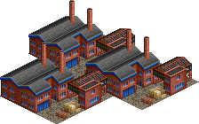

Glass is produced by creating a molten mixture of various materials, forming it into the desired shape and then cooling it in a specific speed. Depending on the form of the product such as sheet glass for windows or container forms such as bottles, the process is highly automated. Some more intricate forms are still created by handcrafting, specifically by glassblowing. The properties of the glass depend on the raw materials used and their exact mixture. 

Industry requires extension(s): [Glass](#extension_7) 

Industry is not available with these extension: [Ammonia](#extension_1) [Recycling](#extension_13) 

Color in the overview map: &nbsp;&nbsp;&nbsp;&nbsp;&nbsp;&nbsp;

| Requires | Produces |
| -- | -- |
| [Quicklime](#cargo_QLME) | [Glass](#cargo_GLAS) |
| [Sand](#cargo_SAND) |  |

### Glass Works

Glass is produced by creating a molten mixture of various materials, forming it into the desired shape and then cooling it in a specific speed. Depending on the form of the product such as sheet glass for windows or container forms such as bottles, the process is highly automated. Some more intricate forms are still created by handcrafting, specifically by glassblowing. The properties of the glass depend on the raw materials used and their exact mixture. 

Industry requires extension(s): [Glass](#extension_7) [Ammonia](#extension_1) 

Industry is not available with these extension: [Recycling](#extension_13) 

Color in the overview map: &nbsp;&nbsp;&nbsp;&nbsp;&nbsp;&nbsp;

| Requires | Produces |
| -- | -- |
| [Quicklime](#cargo_QLME) | [Glass](#cargo_GLAS) |
| [Sand](#cargo_SAND) |  |
| [Soda Ash](#cargo_SASH) |  |

### Glass Works

Glass is produced by creating a molten mixture of various materials, forming it into the desired shape and then cooling it in a specific speed. Depending on the form of the product such as sheet glass for windows or container forms such as bottles, the process is highly automated. Some more intricate forms are still created by handcrafting, specifically by glassblowing. The properties of the glass depend on the raw materials used and their exact mixture. 

Industry requires extension(s): [Glass](#extension_7) [Recycling](#extension_13) 

Industry is not available with these extension: [Ammonia](#extension_1) 

Color in the overview map: &nbsp;&nbsp;&nbsp;&nbsp;&nbsp;&nbsp;

Industry requires the raw materials printed in black to produce anything. Raw materials printed in white will increase the maximum production level.

| Requires | Produces |
| -- | -- |
| [Quicklime](#cargo_QLME) | [Glass](#cargo_GLAS) |
| [Recyclables](#cargo_RCYC) |  |
| [Sand](#cargo_SAND) |  |

### Glass Works

Glass is produced by creating a molten mixture of various materials, forming it into the desired shape and then cooling it in a specific speed. Depending on the form of the product such as sheet glass for windows or container forms such as bottles, the process is highly automated. Some more intricate forms are still created by handcrafting, specifically by glassblowing. The properties of the glass depend on the raw materials used and their exact mixture. 

Industry requires extension(s): [Glass](#extension_7) [Ammonia](#extension_1) [Recycling](#extension_13) 

Color in the overview map: &nbsp;&nbsp;&nbsp;&nbsp;&nbsp;&nbsp;

Industry requires the raw materials printed in black to produce anything. Raw materials printed in white will increase the maximum production level.

| Requires | Produces |
| -- | -- |
| [Quicklime](#cargo_QLME) | [Glass](#cargo_GLAS) |
| [Recyclables](#cargo_RCYC) |  |
| [Sand](#cargo_SAND) |  |
| [Soda Ash](#cargo_SASH) |  |

### Hotel

Whether it is for recreational purposes or for business trips, hotels play an important role in the economy. In some region like at the coast of the Baltic Sea they are the biggest economic factors. Huge cities like Frankfurt and Munich also boast a huge array of hotels to accomodate various trade fairs and festivities. 

In the set, hotels "produce" as many passengers as are deliver to them, which simply models that people who check in will eventually also check out. 

Industry is not available with these extension: [Fruits and Bioenergy](#extension_6) 

Color in the overview map: &nbsp;&nbsp;&nbsp;&nbsp;&nbsp;&nbsp;

| Requires | Produces |
| -- | -- |
| [Food](#cargo_FOOD) | [Passengers](#cargo_PASS) |
| [Passengers](#cargo_PASS) |  |

### Hotel

Whether it is for recreational purposes or for business trips, hotels play an important role in the economy. In some region like at the coast of the Baltic Sea they are the biggest economic factors. Huge cities like Frankfurt and Munich also boast a huge array of hotels to accomodate various trade fairs and festivities. 

In the set, hotels "produce" as many passengers as are deliver to them, which simply models that people who check in will eventually also check out. 

Industry requires extension(s): [Fruits and Bioenergy](#extension_6) 

Color in the overview map: &nbsp;&nbsp;&nbsp;&nbsp;&nbsp;&nbsp;

| Requires | Produces |
| -- | -- |
| [Food](#cargo_FOOD) | [Passengers](#cargo_PASS) |
| [Fruits](#cargo_FRUT) |  |
| [Passengers](#cargo_PASS) |  |

### Integrated Steel Mill

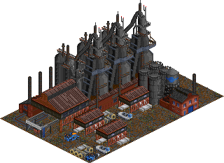

Historically, steel production was a key driver of industrialization in the 19th century, especially with the introduction of railways. In Germany, the biggest steel industry centers were located in the Ruhr and Saar regions, where coal was abundant, while iron ore was imported. Nowadays, steel production is still an important part of the economy, requiring iron ore transportation from the ports at the North Sea coast to the mills in the Ruhr area and in Lower Saxony. 

While there are multiple different variants of producing steel out of iron ore, this set only contains the modern variant of the integrated steel mill. There are several steps to create steel out of iron ore, starting with a blast furnace, but molten pig iron is not transported over long distances, and as such it is not relevant in the scope of the game. 

Industry is not available with these extension: [Glass](#extension_7) [Coke and Sulphur](#extension_4) [Ammonia](#extension_1) [Recycling](#extension_13) 

Industry will only spawn after 1800.
This restriction is also valid for funding the industry.

Color in the overview map: &nbsp;&nbsp;&nbsp;&nbsp;&nbsp;&nbsp;

| Requires | Produces |
| -- | -- |
| [Coal](#cargo_COAL) | [Steel](#cargo_STEL) |
| [Iron Ore](#cargo_IORE) |  |

### Integrated Steel Mill

Historically, steel production was a key driver of industrialization in the 19th century, especially with the introduction of railways. In Germany, the biggest steel industry centers were located in the Ruhr and Saar regions, where coal was abundant, while iron ore was imported. Nowadays, steel production is still an important part of the economy, requiring iron ore transportation from the ports at the North Sea coast to the mills in the Ruhr area and in Lower Saxony. 

While there are multiple different variants of producing steel out of iron ore, this set only contains the modern variant of the integrated steel mill. There are several steps to create steel out of iron ore, starting with a blast furnace, but molten pig iron is not transported over long distances, and as such it is not relevant in the scope of the game. 

Industry requires extension(s): [Glass](#extension_7) 

Industry is not available with these extension: [Coke and Sulphur](#extension_4) [Ammonia](#extension_1) [Recycling](#extension_13) 

Industry will only spawn after 1800.
This restriction is also valid for funding the industry.

Color in the overview map: &nbsp;&nbsp;&nbsp;&nbsp;&nbsp;&nbsp;

| Requires | Produces |
| -- | -- |
| [Coal](#cargo_COAL) | [Steel](#cargo_STEL) |
| [Iron Ore](#cargo_IORE) |  |
| [Quicklime](#cargo_QLME) |  |

### Integrated Steel Mill

Historically, steel production was a key driver of industrialization in the 19th century, especially with the introduction of railways. In Germany, the biggest steel industry centers were located in the Ruhr and Saar regions, where coal was abundant, while iron ore was imported. Nowadays, steel production is still an important part of the economy, requiring iron ore transportation from the ports at the North Sea coast to the mills in the Ruhr area and in Lower Saxony. 

While there are multiple different variants of producing steel out of iron ore, this set only contains the modern variant of the integrated steel mill. There are several steps to create steel out of iron ore, starting with a blast furnace, but molten pig iron is not transported over long distances, and as such it is not relevant in the scope of the game. 

Industry requires extension(s): [Coke and Sulphur](#extension_4) 

Industry is not available with these extension: [Glass](#extension_7) [Ammonia](#extension_1) [Recycling](#extension_13) 

Industry will only spawn after 1800.
This restriction is also valid for funding the industry.

Color in the overview map: &nbsp;&nbsp;&nbsp;&nbsp;&nbsp;&nbsp;

| Requires | Produces |
| -- | -- |
| [Coke](#cargo_COKE) | [Steel](#cargo_STEL) |
| [Iron Ore](#cargo_IORE) |  |

### Integrated Steel Mill

Historically, steel production was a key driver of industrialization in the 19th century, especially with the introduction of railways. In Germany, the biggest steel industry centers were located in the Ruhr and Saar regions, where coal was abundant, while iron ore was imported. Nowadays, steel production is still an important part of the economy, requiring iron ore transportation from the ports at the North Sea coast to the mills in the Ruhr area and in Lower Saxony. 

While there are multiple different variants of producing steel out of iron ore, this set only contains the modern variant of the integrated steel mill. There are several steps to create steel out of iron ore, starting with a blast furnace, but molten pig iron is not transported over long distances, and as such it is not relevant in the scope of the game. 

Industry requires extension(s): [Glass](#extension_7) [Coke and Sulphur](#extension_4) 

Industry is not available with these extension: [Ammonia](#extension_1) [Recycling](#extension_13) 

Industry will only spawn after 1800.
This restriction is also valid for funding the industry.

Color in the overview map: &nbsp;&nbsp;&nbsp;&nbsp;&nbsp;&nbsp;

Industry requires the raw materials printed in black to produce anything. Raw materials printed in white will increase the maximum production level.

| Requires | Produces |
| -- | -- |
| [Coke](#cargo_COKE) | [Steel](#cargo_STEL) |
| [Iron Ore](#cargo_IORE) |  |
| [Quicklime](#cargo_QLME) |  |

### Integrated Steel Mill

Historically, steel production was a key driver of industrialization in the 19th century, especially with the introduction of railways. In Germany, the biggest steel industry centers were located in the Ruhr and Saar regions, where coal was abundant, while iron ore was imported. Nowadays, steel production is still an important part of the economy, requiring iron ore transportation from the ports at the North Sea coast to the mills in the Ruhr area and in Lower Saxony. 

While there are multiple different variants of producing steel out of iron ore, this set only contains the modern variant of the integrated steel mill. There are several steps to create steel out of iron ore, starting with a blast furnace, but molten pig iron is not transported over long distances, and as such it is not relevant in the scope of the game. 

Industry requires extension(s): [Ammonia](#extension_1) 

Industry is not available with these extension: [Glass](#extension_7) [Coke and Sulphur](#extension_4) [Recycling](#extension_13) 

Industry will only spawn after 1800.
This restriction is also valid for funding the industry.

Color in the overview map: &nbsp;&nbsp;&nbsp;&nbsp;&nbsp;&nbsp;

| Requires | Produces |
| -- | -- |
| [Coal](#cargo_COAL) | [Steel](#cargo_STEL) |
| [Iron Ore](#cargo_IORE) |  |
| [Oxygen](#cargo_O2__) |  |

### Integrated Steel Mill

Historically, steel production was a key driver of industrialization in the 19th century, especially with the introduction of railways. In Germany, the biggest steel industry centers were located in the Ruhr and Saar regions, where coal was abundant, while iron ore was imported. Nowadays, steel production is still an important part of the economy, requiring iron ore transportation from the ports at the North Sea coast to the mills in the Ruhr area and in Lower Saxony. 

While there are multiple different variants of producing steel out of iron ore, this set only contains the modern variant of the integrated steel mill. There are several steps to create steel out of iron ore, starting with a blast furnace, but molten pig iron is not transported over long distances, and as such it is not relevant in the scope of the game. 

Industry requires extension(s): [Glass](#extension_7) [Ammonia](#extension_1) 

Industry is not available with these extension: [Coke and Sulphur](#extension_4) [Recycling](#extension_13) 

Industry will only spawn after 1800.
This restriction is also valid for funding the industry.

Color in the overview map: &nbsp;&nbsp;&nbsp;&nbsp;&nbsp;&nbsp;

| Requires | Produces |
| -- | -- |
| [Coal](#cargo_COAL) | [Steel](#cargo_STEL) |
| [Iron Ore](#cargo_IORE) |  |
| [Oxygen](#cargo_O2__) |  |
| [Quicklime](#cargo_QLME) |  |

### Integrated Steel Mill

Historically, steel production was a key driver of industrialization in the 19th century, especially with the introduction of railways. In Germany, the biggest steel industry centers were located in the Ruhr and Saar regions, where coal was abundant, while iron ore was imported. Nowadays, steel production is still an important part of the economy, requiring iron ore transportation from the ports at the North Sea coast to the mills in the Ruhr area and in Lower Saxony. 

While there are multiple different variants of producing steel out of iron ore, this set only contains the modern variant of the integrated steel mill. There are several steps to create steel out of iron ore, starting with a blast furnace, but molten pig iron is not transported over long distances, and as such it is not relevant in the scope of the game. 

Industry requires extension(s): [Coke and Sulphur](#extension_4) [Ammonia](#extension_1) 

Industry is not available with these extension: [Glass](#extension_7) [Recycling](#extension_13) 

Industry will only spawn after 1800.
This restriction is also valid for funding the industry.

Color in the overview map: &nbsp;&nbsp;&nbsp;&nbsp;&nbsp;&nbsp;

| Requires | Produces |
| -- | -- |
| [Coke](#cargo_COKE) | [Steel](#cargo_STEL) |
| [Iron Ore](#cargo_IORE) |  |
| [Oxygen](#cargo_O2__) |  |

### Integrated Steel Mill

Historically, steel production was a key driver of industrialization in the 19th century, especially with the introduction of railways. In Germany, the biggest steel industry centers were located in the Ruhr and Saar regions, where coal was abundant, while iron ore was imported. Nowadays, steel production is still an important part of the economy, requiring iron ore transportation from the ports at the North Sea coast to the mills in the Ruhr area and in Lower Saxony. 

While there are multiple different variants of producing steel out of iron ore, this set only contains the modern variant of the integrated steel mill. There are several steps to create steel out of iron ore, starting with a blast furnace, but molten pig iron is not transported over long distances, and as such it is not relevant in the scope of the game. 

Industry requires extension(s): [Glass](#extension_7) [Coke and Sulphur](#extension_4) [Ammonia](#extension_1) 

Industry is not available with these extension: [Recycling](#extension_13) 

Industry will only spawn after 1800.
This restriction is also valid for funding the industry.

Color in the overview map: &nbsp;&nbsp;&nbsp;&nbsp;&nbsp;&nbsp;

| Requires | Produces |
| -- | -- |
| [Coke](#cargo_COKE) | [Steel](#cargo_STEL) |
| [Iron Ore](#cargo_IORE) |  |
| [Oxygen](#cargo_O2__) |  |
| [Quicklime](#cargo_QLME) |  |

### Integrated Steel Mill

Historically, steel production was a key driver of industrialization in the 19th century, especially with the introduction of railways. In Germany, the biggest steel industry centers were located in the Ruhr and Saar regions, where coal was abundant, while iron ore was imported. Nowadays, steel production is still an important part of the economy, requiring iron ore transportation from the ports at the North Sea coast to the mills in the Ruhr area and in Lower Saxony. 

While there are multiple different variants of producing steel out of iron ore, this set only contains the modern variant of the integrated steel mill. There are several steps to create steel out of iron ore, starting with a blast furnace, but molten pig iron is not transported over long distances, and as such it is not relevant in the scope of the game. 

Industry requires extension(s): [Recycling](#extension_13) 

Industry is not available with these extension: [Glass](#extension_7) [Coke and Sulphur](#extension_4) [Ammonia](#extension_1) 

Industry will only spawn after 1800.
This restriction is also valid for funding the industry.

Color in the overview map: &nbsp;&nbsp;&nbsp;&nbsp;&nbsp;&nbsp;

| Requires | Produces |
| -- | -- |
| [Coal](#cargo_COAL) | [Steel](#cargo_STEL) |
| [Iron Ore](#cargo_IORE) |  |
| [Scrap Metal](#cargo_SCMT) |  |

### Integrated Steel Mill

Historically, steel production was a key driver of industrialization in the 19th century, especially with the introduction of railways. In Germany, the biggest steel industry centers were located in the Ruhr and Saar regions, where coal was abundant, while iron ore was imported. Nowadays, steel production is still an important part of the economy, requiring iron ore transportation from the ports at the North Sea coast to the mills in the Ruhr area and in Lower Saxony. 

While there are multiple different variants of producing steel out of iron ore, this set only contains the modern variant of the integrated steel mill. There are several steps to create steel out of iron ore, starting with a blast furnace, but molten pig iron is not transported over long distances, and as such it is not relevant in the scope of the game. 

Industry requires extension(s): [Glass](#extension_7) [Recycling](#extension_13) 

Industry is not available with these extension: [Coke and Sulphur](#extension_4) [Ammonia](#extension_1) 

Industry will only spawn after 1800.
This restriction is also valid for funding the industry.

Color in the overview map: &nbsp;&nbsp;&nbsp;&nbsp;&nbsp;&nbsp;

| Requires | Produces |
| -- | -- |
| [Coal](#cargo_COAL) | [Steel](#cargo_STEL) |
| [Iron Ore](#cargo_IORE) |  |
| [Quicklime](#cargo_QLME) |  |
| [Scrap Metal](#cargo_SCMT) |  |

### Integrated Steel Mill

Historically, steel production was a key driver of industrialization in the 19th century, especially with the introduction of railways. In Germany, the biggest steel industry centers were located in the Ruhr and Saar regions, where coal was abundant, while iron ore was imported. Nowadays, steel production is still an important part of the economy, requiring iron ore transportation from the ports at the North Sea coast to the mills in the Ruhr area and in Lower Saxony. 

While there are multiple different variants of producing steel out of iron ore, this set only contains the modern variant of the integrated steel mill. There are several steps to create steel out of iron ore, starting with a blast furnace, but molten pig iron is not transported over long distances, and as such it is not relevant in the scope of the game. 

Industry requires extension(s): [Coke and Sulphur](#extension_4) [Recycling](#extension_13) 

Industry is not available with these extension: [Glass](#extension_7) [Ammonia](#extension_1) 

Industry will only spawn after 1800.
This restriction is also valid for funding the industry.

Color in the overview map: &nbsp;&nbsp;&nbsp;&nbsp;&nbsp;&nbsp;

| Requires | Produces |
| -- | -- |
| [Coke](#cargo_COKE) | [Steel](#cargo_STEL) |
| [Iron Ore](#cargo_IORE) |  |
| [Scrap Metal](#cargo_SCMT) |  |

### Integrated Steel Mill

Historically, steel production was a key driver of industrialization in the 19th century, especially with the introduction of railways. In Germany, the biggest steel industry centers were located in the Ruhr and Saar regions, where coal was abundant, while iron ore was imported. Nowadays, steel production is still an important part of the economy, requiring iron ore transportation from the ports at the North Sea coast to the mills in the Ruhr area and in Lower Saxony. 

While there are multiple different variants of producing steel out of iron ore, this set only contains the modern variant of the integrated steel mill. There are several steps to create steel out of iron ore, starting with a blast furnace, but molten pig iron is not transported over long distances, and as such it is not relevant in the scope of the game. 

Industry requires extension(s): [Glass](#extension_7) [Coke and Sulphur](#extension_4) [Recycling](#extension_13) 

Industry is not available with these extension: [Ammonia](#extension_1) 

Industry will only spawn after 1800.
This restriction is also valid for funding the industry.

Color in the overview map: &nbsp;&nbsp;&nbsp;&nbsp;&nbsp;&nbsp;

Industry requires the raw materials printed in black to produce anything. Raw materials printed in white will increase the maximum production level.

| Requires | Produces |
| -- | -- |
| [Coke](#cargo_COKE) | [Steel](#cargo_STEL) |
| [Iron Ore](#cargo_IORE) |  |
| [Quicklime](#cargo_QLME) |  |
| [Scrap Metal](#cargo_SCMT) |  |

### Integrated Steel Mill

Historically, steel production was a key driver of industrialization in the 19th century, especially with the introduction of railways. In Germany, the biggest steel industry centers were located in the Ruhr and Saar regions, where coal was abundant, while iron ore was imported. Nowadays, steel production is still an important part of the economy, requiring iron ore transportation from the ports at the North Sea coast to the mills in the Ruhr area and in Lower Saxony. 

While there are multiple different variants of producing steel out of iron ore, this set only contains the modern variant of the integrated steel mill. There are several steps to create steel out of iron ore, starting with a blast furnace, but molten pig iron is not transported over long distances, and as such it is not relevant in the scope of the game. 

Industry requires extension(s): [Ammonia](#extension_1) [Recycling](#extension_13) 

Industry is not available with these extension: [Glass](#extension_7) [Coke and Sulphur](#extension_4) 

Industry will only spawn after 1800.
This restriction is also valid for funding the industry.

Color in the overview map: &nbsp;&nbsp;&nbsp;&nbsp;&nbsp;&nbsp;

| Requires | Produces |
| -- | -- |
| [Coal](#cargo_COAL) | [Steel](#cargo_STEL) |
| [Iron Ore](#cargo_IORE) |  |
| [Oxygen](#cargo_O2__) |  |
| [Scrap Metal](#cargo_SCMT) |  |

### Integrated Steel Mill

Historically, steel production was a key driver of industrialization in the 19th century, especially with the introduction of railways. In Germany, the biggest steel industry centers were located in the Ruhr and Saar regions, where coal was abundant, while iron ore was imported. Nowadays, steel production is still an important part of the economy, requiring iron ore transportation from the ports at the North Sea coast to the mills in the Ruhr area and in Lower Saxony. 

While there are multiple different variants of producing steel out of iron ore, this set only contains the modern variant of the integrated steel mill. There are several steps to create steel out of iron ore, starting with a blast furnace, but molten pig iron is not transported over long distances, and as such it is not relevant in the scope of the game. 

Industry requires extension(s): [Glass](#extension_7) [Ammonia](#extension_1) [Recycling](#extension_13) 

Industry is not available with these extension: [Coke and Sulphur](#extension_4) 

Industry will only spawn after 1800.
This restriction is also valid for funding the industry.

Color in the overview map: &nbsp;&nbsp;&nbsp;&nbsp;&nbsp;&nbsp;

| Requires | Produces |
| -- | -- |
| [Coal](#cargo_COAL) | [Steel](#cargo_STEL) |
| [Iron Ore](#cargo_IORE) |  |
| [Oxygen](#cargo_O2__) |  |
| [Quicklime](#cargo_QLME) |  |
| [Scrap Metal](#cargo_SCMT) |  |

### Integrated Steel Mill

Historically, steel production was a key driver of industrialization in the 19th century, especially with the introduction of railways. In Germany, the biggest steel industry centers were located in the Ruhr and Saar regions, where coal was abundant, while iron ore was imported. Nowadays, steel production is still an important part of the economy, requiring iron ore transportation from the ports at the North Sea coast to the mills in the Ruhr area and in Lower Saxony. 

While there are multiple different variants of producing steel out of iron ore, this set only contains the modern variant of the integrated steel mill. There are several steps to create steel out of iron ore, starting with a blast furnace, but molten pig iron is not transported over long distances, and as such it is not relevant in the scope of the game. 

Industry requires extension(s): [Coke and Sulphur](#extension_4) [Ammonia](#extension_1) [Recycling](#extension_13) 

Industry is not available with these extension: [Glass](#extension_7) 

Industry will only spawn after 1800.
This restriction is also valid for funding the industry.

Color in the overview map: &nbsp;&nbsp;&nbsp;&nbsp;&nbsp;&nbsp;

| Requires | Produces |
| -- | -- |
| [Coke](#cargo_COKE) | [Steel](#cargo_STEL) |
| [Iron Ore](#cargo_IORE) |  |
| [Oxygen](#cargo_O2__) |  |
| [Scrap Metal](#cargo_SCMT) |  |

### Integrated Steel Mill

Historically, steel production was a key driver of industrialization in the 19th century, especially with the introduction of railways. In Germany, the biggest steel industry centers were located in the Ruhr and Saar regions, where coal was abundant, while iron ore was imported. Nowadays, steel production is still an important part of the economy, requiring iron ore transportation from the ports at the North Sea coast to the mills in the Ruhr area and in Lower Saxony. 

While there are multiple different variants of producing steel out of iron ore, this set only contains the modern variant of the integrated steel mill. There are several steps to create steel out of iron ore, starting with a blast furnace, but molten pig iron is not transported over long distances, and as such it is not relevant in the scope of the game. 

Industry requires extension(s): [Glass](#extension_7) [Coke and Sulphur](#extension_4) [Ammonia](#extension_1) [Recycling](#extension_13) 

Industry will only spawn after 1800.
This restriction is also valid for funding the industry.

Color in the overview map: &nbsp;&nbsp;&nbsp;&nbsp;&nbsp;&nbsp;

| Requires | Produces |
| -- | -- |
| [Coke](#cargo_COKE) | [Steel](#cargo_STEL) |
| [Iron Ore](#cargo_IORE) |  |
| [Oxygen](#cargo_O2__) |  |
| [Quicklime](#cargo_QLME) |  |
| [Scrap Metal](#cargo_SCMT) |  |

### Iron Ore Mine

Iron ore mining has already been done in ancient times. With the invention of cheap processes to produce steel and the increasing demand, especially for railways, it became a key industry during the industrial revolution of the 19th century. 

Germany did ore mining until the middle of the 20th century, but generally speaking, it always depended on importing the ore from elsewhere. 

Industry will only spawn from 1800 to 1930.
This restriction is also valid for funding the industry.

Color in the overview map: &nbsp;&nbsp;&nbsp;&nbsp;&nbsp;&nbsp;

Industry is generated with limited resources and will close down once these are depleted. See [Resource depletion](#resource_depletion).

| Requires | Produces |
| -- | -- |
|  | [Iron Ore](#cargo_IORE) |

### Lime Kiln

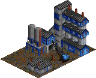

A lime kiln is a kind of oven used for the process of calcination of limestone. This reaction turns limestone into so-called quicklime. Chemically speaking, calcium carbonate is turned into calcium oxide. Note that the lime is not burned, but merely subjected to lots of heat. This process has been known for thousands of years, with quicklime being a key ingredient in the production of cement. The kiln is typically heated by burning all sorts of fossil fuels, which adds to the already sum of carbon dioxide emissions inherent to the reaction. 

Industry requires extension(s): [Glass](#extension_7) 

Industry is not available with these extension: [Coke and Sulphur](#extension_4) 

Color in the overview map: &nbsp;&nbsp;&nbsp;&nbsp;&nbsp;&nbsp;

| Requires | Produces |
| -- | -- |
| [Limestone](#cargo_LIME) | [Quicklime](#cargo_QLME) |

### Lime Kiln

A lime kiln is a kind of oven used for the process of calcination of limestone. This reaction turns limestone into so-called quicklime. Chemically speaking, calcium carbonate is turned into calcium oxide. Note that the lime is not burned, but merely subjected to lots of heat. This process has been known for thousands of years, with quicklime being a key ingredient in the production of cement. The kiln is typically heated by burning all sorts of fossil fuels, which adds to the already sum of carbon dioxide emissions inherent to the reaction. 

Industry requires extension(s): [Glass](#extension_7) [Coke and Sulphur](#extension_4) 

Color in the overview map: &nbsp;&nbsp;&nbsp;&nbsp;&nbsp;&nbsp;

| Requires | Produces |
| -- | -- |
| [Coke](#cargo_COKE) | [Quicklime](#cargo_QLME) |
| [Limestone](#cargo_LIME) |  |

### Limestone Mine

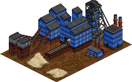

Limestone mining dates back centuries in Germany. Nowadays, mining is typically done in quarries or with open pit mining. 

Industry requires extension(s): [Building Industries](#extension_3) 

Industry will only spawn after 1800.
This restriction is also valid for funding the industry.

Color in the overview map: &nbsp;&nbsp;&nbsp;&nbsp;&nbsp;&nbsp;

Industry is generated with limited resources and will close down once these are depleted. See [Resource depletion](#resource_depletion).

| Requires | Produces |
| -- | -- |
|  | [Limestone](#cargo_LIME) |

### Meatpacking Plant

Meatpacking plants, in the scope of the set, are industries where livestock is slaughtered and processed, mainly resulting in meat for human consumption. While slaughtering animals for the production of meat has been done for thousands of years, the industrialized mass production that began in the 19th century introduced a new level of production volume. The introduction of effective cooling allowed the transportation of meat over long distances, in turn allowing the concentration of the production to large centralized stockyards. 

Industry requires extension(s): [Food Industries](#extension_5) 

Industry is not available with these extension: [Packaging Industries](#extension_10) 

Color in the overview map: &nbsp;&nbsp;&nbsp;&nbsp;&nbsp;&nbsp;

| Requires | Produces |
| -- | -- |
| [Livestock](#cargo_LVST) | [Food](#cargo_FOOD) |

### Meatpacking Plant

Meatpacking plants, in the scope of the set, are industries where livestock is slaughtered and processed, mainly resulting in meat for human consumption. While slaughtering animals for the production of meat has been done for thousands of years, the industrialized mass production that began in the 19th century introduced a new level of production volume. The introduction of effective cooling allowed the transportation of meat over long distances, in turn allowing the concentration of the production to large centralized stockyards. 

Industry requires extension(s): [Food Industries](#extension_5) [Packaging Industries](#extension_10) 

Color in the overview map: &nbsp;&nbsp;&nbsp;&nbsp;&nbsp;&nbsp;

Industry requires the raw materials printed in black to produce anything. Raw materials printed in white will increase the maximum production level.

| Requires | Produces |
| -- | -- |
| [Livestock](#cargo_LVST) | [Food](#cargo_FOOD) |
| [Packaging](#cargo_MNSP) |  |

### Oil Refinery

Oil refineries split up crude oil into its different components, which in turn are relevant base materials for the chemical industry. The refineries not only produce a variety of fuels, but also liquid gas, lubricants and heating oil. Additionally, the crude oil is filtered and sulphuric compounds are removed. A real refinery then has subsequent steps and processes to further split up the products of the first stage, so that a refinery can produce a huge variety of compounts. In the set, these additional steps have been moved out into their own industries (steam reformer and steam cracker), so that the player can control how much fuel, hydrogen and ethylen are to be produced. 

Industry requires extension(s): [Organic Chemistry](#extension_9) 

Industry is not available with these extension: [Coke and Sulphur](#extension_4) 

Industry will only spawn after 1860.
This restriction is also valid for funding the industry.

Color in the overview map: &nbsp;&nbsp;&nbsp;&nbsp;&nbsp;&nbsp;

| Requires | Produces |
| -- | -- |
| [Oil](#cargo_OIL_) | [Petrol](#cargo_PETR) |
|  | [Naphtha](#cargo_RFPR) |

### Oil Refinery

Oil refineries split up crude oil into its different components, which in turn are relevant base materials for the chemical industry. The refineries not only produce a variety of fuels, but also liquid gas, lubricants and heating oil. Additionally, the crude oil is filtered and sulphuric compounds are removed. A real refinery then has subsequent steps and processes to further split up the products of the first stage, so that a refinery can produce a huge variety of compounts. In the set, these additional steps have been moved out into their own industries (steam reformer and steam cracker), so that the player can control how much fuel, hydrogen and ethylen are to be produced. 

Industry requires extension(s): [Organic Chemistry](#extension_9) [Coke and Sulphur](#extension_4) 

Industry will only spawn after 1860.
This restriction is also valid for funding the industry.

Color in the overview map: &nbsp;&nbsp;&nbsp;&nbsp;&nbsp;&nbsp;

| Requires | Produces |
| -- | -- |
| [Oil](#cargo_OIL_) | [Petrol](#cargo_PETR) |
|  | [Naphtha](#cargo_RFPR) |
|  | [Sulphur](#cargo_SULP) |

### Oil Rig

Oil rigs or offshore platforms are used to drill for oil underneath the ocean. Many such resources have been found in the North Sea, and starting in the mid 1980s Germany exploited oil fields as well. However, in general, production is in a steady decline since the 1990s. 

In the set, oil rigs produce a constant number of passengers, which simulates the workers that work on the platform. 

Industry will only spawn after 1985.
This restriction is also valid for funding the industry.

Color in the overview map: &nbsp;&nbsp;&nbsp;&nbsp;&nbsp;&nbsp;

Industry is generated with limited resources and will close down once these are depleted. See [Resource depletion](#resource_depletion).

| Requires | Produces |
| -- | -- |
| [Passengers](#cargo_PASS) | [Oil](#cargo_OIL_) |
|  | [Passengers](#cargo_PASS) |

### Oil Wells

It's a little known fact that the first actual deep drilling for oil happened in Germany in the late 1850s, even before an oil boom started in North America. Oil wells are still running in some places in Northern Germany (mainly in Lower Saxony), but many locations have been closed already in the 1960s, with oil imports becoming increasingly cheaper. 

Industry will only spawn from 1860 to 1985.
This restriction is also valid for funding the industry.

Color in the overview map: &nbsp;&nbsp;&nbsp;&nbsp;&nbsp;&nbsp;

Industry is generated with limited resources and will close down once these are depleted. See [Resource depletion](#resource_depletion).

| Requires | Produces |
| -- | -- |
|  | [Oil](#cargo_OIL_) |

### Ore Smelter

Copper compounds contain other substances such as sulphur and iron, which have to be split up to get pure copper. This is achieved in the ore smelter. This process results in iron-sulphur compounds and basic copper, which is then further refined using electrolysis to pure copper. In real plants, both process steps are combined to reduce energy consumption. In the game, both steps are split into their own industries to better simulate the transport tasks for each step. 

Industry requires extension(s): [Coke and Sulphur](#extension_4) 

Industry is not available with these extension: [Painting Industries](#extension_11) [Ammonia](#extension_1) [Vehicle Industries](#extension_15) 

Industry will only spawn after 1800.
This restriction is also valid for funding the industry.

Color in the overview map: &nbsp;&nbsp;&nbsp;&nbsp;&nbsp;&nbsp;

| Requires | Produces |
| -- | -- |
| [Coke](#cargo_COKE) | [Iron Ore](#cargo_IORE) |
| [Pyrite Ore](#cargo_PORE) | [Sulphur](#cargo_SULP) |

### Ore Smelter

Copper compounds contain other substances such as sulphur and iron, which have to be split up to get pure copper. This is achieved in the ore smelter. This process results in iron-sulphur compounds and basic copper, which is then further refined using electrolysis to pure copper. In real plants, both process steps are combined to reduce energy consumption. In the game, both steps are split into their own industries to better simulate the transport tasks for each step. 

Industry requires extension(s): [Coke and Sulphur](#extension_4) [Painting Industries](#extension_11) 

Industry is not available with these extension: [Ammonia](#extension_1) [Vehicle Industries](#extension_15) 

Industry will only spawn after 1800.
This restriction is also valid for funding the industry.

Color in the overview map: &nbsp;&nbsp;&nbsp;&nbsp;&nbsp;&nbsp;

| Requires | Produces |
| -- | -- |
| [Coke](#cargo_COKE) | [Copper Ore](#cargo_CORE) |
| [Pyrite Ore](#cargo_PORE) | [Iron Ore](#cargo_IORE) |
|  | [Sulphur](#cargo_SULP) |

### Ore Smelter

Copper compounds contain other substances such as sulphur and iron, which have to be split up to get pure copper. This is achieved in the ore smelter. This process results in iron-sulphur compounds and basic copper, which is then further refined using electrolysis to pure copper. In real plants, both process steps are combined to reduce energy consumption. In the game, both steps are split into their own industries to better simulate the transport tasks for each step. 

Industry requires extension(s): [Coke and Sulphur](#extension_4) [Ammonia](#extension_1) 

Industry is not available with these extension: [Painting Industries](#extension_11) [Vehicle Industries](#extension_15) 

Industry will only spawn after 1800.
This restriction is also valid for funding the industry.

Color in the overview map: &nbsp;&nbsp;&nbsp;&nbsp;&nbsp;&nbsp;

| Requires | Produces |
| -- | -- |
| [Coke](#cargo_COKE) | [Iron Ore](#cargo_IORE) |
| [Oxygen](#cargo_O2__) | [Sulphur](#cargo_SULP) |
| [Pyrite Ore](#cargo_PORE) |  |

### Ore Smelter

Copper compounds contain other substances such as sulphur and iron, which have to be split up to get pure copper. This is achieved in the ore smelter. This process results in iron-sulphur compounds and basic copper, which is then further refined using electrolysis to pure copper. In real plants, both process steps are combined to reduce energy consumption. In the game, both steps are split into their own industries to better simulate the transport tasks for each step. 

Industry requires extension(s): [Coke and Sulphur](#extension_4) [Painting Industries](#extension_11) [Ammonia](#extension_1) 

Industry is not available with these extension: [Vehicle Industries](#extension_15) 

Industry will only spawn after 1800.
This restriction is also valid for funding the industry.

Color in the overview map: &nbsp;&nbsp;&nbsp;&nbsp;&nbsp;&nbsp;

| Requires | Produces |
| -- | -- |
| [Coke](#cargo_COKE) | [Copper Ore](#cargo_CORE) |
| [Oxygen](#cargo_O2__) | [Iron Ore](#cargo_IORE) |
| [Pyrite Ore](#cargo_PORE) | [Sulphur](#cargo_SULP) |

### Ore Smelter

Copper compounds contain other substances such as sulphur and iron, which have to be split up to get pure copper. This is achieved in the ore smelter. This process results in iron-sulphur compounds and basic copper, which is then further refined using electrolysis to pure copper. In real plants, both process steps are combined to reduce energy consumption. In the game, both steps are split into their own industries to better simulate the transport tasks for each step. 

Industry requires extension(s): [Coke and Sulphur](#extension_4) [Vehicle Industries](#extension_15) 

Industry is not available with these extension: [Painting Industries](#extension_11) [Ammonia](#extension_1) 

Industry will only spawn after 1800.
This restriction is also valid for funding the industry.

Color in the overview map: &nbsp;&nbsp;&nbsp;&nbsp;&nbsp;&nbsp;

| Requires | Produces |
| -- | -- |
| [Coke](#cargo_COKE) | [Iron Ore](#cargo_IORE) |
| [Pyrite Ore](#cargo_PORE) | [Sulphur](#cargo_SULP) |
|  | [Zinc](#cargo_ZINC) |

### Ore Smelter

Copper compounds contain other substances such as sulphur and iron, which have to be split up to get pure copper. This is achieved in the ore smelter. This process results in iron-sulphur compounds and basic copper, which is then further refined using electrolysis to pure copper. In real plants, both process steps are combined to reduce energy consumption. In the game, both steps are split into their own industries to better simulate the transport tasks for each step. 

Industry requires extension(s): [Coke and Sulphur](#extension_4) [Painting Industries](#extension_11) [Vehicle Industries](#extension_15) 

Industry is not available with these extension: [Ammonia](#extension_1) 

Industry will only spawn after 1800.
This restriction is also valid for funding the industry.

Color in the overview map: &nbsp;&nbsp;&nbsp;&nbsp;&nbsp;&nbsp;

| Requires | Produces |
| -- | -- |
| [Coke](#cargo_COKE) | [Copper Ore](#cargo_CORE) |
| [Pyrite Ore](#cargo_PORE) | [Iron Ore](#cargo_IORE) |
|  | [Sulphur](#cargo_SULP) |
|  | [Zinc](#cargo_ZINC) |

### Ore Smelter

Copper compounds contain other substances such as sulphur and iron, which have to be split up to get pure copper. This is achieved in the ore smelter. This process results in iron-sulphur compounds and basic copper, which is then further refined using electrolysis to pure copper. In real plants, both process steps are combined to reduce energy consumption. In the game, both steps are split into their own industries to better simulate the transport tasks for each step. 

Industry requires extension(s): [Coke and Sulphur](#extension_4) [Ammonia](#extension_1) [Vehicle Industries](#extension_15) 

Industry is not available with these extension: [Painting Industries](#extension_11) 

Industry will only spawn after 1800.
This restriction is also valid for funding the industry.

Color in the overview map: &nbsp;&nbsp;&nbsp;&nbsp;&nbsp;&nbsp;

| Requires | Produces |
| -- | -- |
| [Coke](#cargo_COKE) | [Iron Ore](#cargo_IORE) |
| [Oxygen](#cargo_O2__) | [Sulphur](#cargo_SULP) |
| [Pyrite Ore](#cargo_PORE) | [Zinc](#cargo_ZINC) |

### Ore Smelter

Copper compounds contain other substances such as sulphur and iron, which have to be split up to get pure copper. This is achieved in the ore smelter. This process results in iron-sulphur compounds and basic copper, which is then further refined using electrolysis to pure copper. In real plants, both process steps are combined to reduce energy consumption. In the game, both steps are split into their own industries to better simulate the transport tasks for each step. 

Industry requires extension(s): [Coke and Sulphur](#extension_4) [Painting Industries](#extension_11) [Ammonia](#extension_1) [Vehicle Industries](#extension_15) 

Industry will only spawn after 1800.
This restriction is also valid for funding the industry.

Color in the overview map: &nbsp;&nbsp;&nbsp;&nbsp;&nbsp;&nbsp;

| Requires | Produces |
| -- | -- |
| [Coke](#cargo_COKE) | [Copper Ore](#cargo_CORE) |
| [Oxygen](#cargo_O2__) | [Iron Ore](#cargo_IORE) |
| [Pyrite Ore](#cargo_PORE) | [Sulphur](#cargo_SULP) |
|  | [Zinc](#cargo_ZINC) |

### Packaging Plant

The packaging plant produces all sorts of packaging from various materials, be it plastics or aluminium. This plant is therefore paramount in ensuring maximum production levels for a variety of other industries, as with packaging, their output will be reduced considerably. 

Industry requires extension(s): [Packaging Industries](#extension_10) 

Industry is not available with these extension: [Aluminium](#extension_0) [Glass](#extension_7) [Paper](#extension_12) 

Industry will only spawn after 1930.
This restriction is also valid for funding the industry.

Color in the overview map: &nbsp;&nbsp;&nbsp;&nbsp;&nbsp;&nbsp;

Industry will start producing as soon as any of the required cargos is available. Productivity increases with the number of different available cargos.

| Requires | Produces |
| -- | -- |
| [Plastics](#cargo_PLAS) | [Packaging](#cargo_MNSP) |

### Packaging Plant

The packaging plant produces all sorts of packaging from various materials, be it plastics or aluminium. This plant is therefore paramount in ensuring maximum production levels for a variety of other industries, as with packaging, their output will be reduced considerably. 

Industry requires extension(s): [Packaging Industries](#extension_10) [Aluminium](#extension_0) 

Industry is not available with these extension: [Glass](#extension_7) [Paper](#extension_12) 

Industry will only spawn after 1930.
This restriction is also valid for funding the industry.

Color in the overview map: &nbsp;&nbsp;&nbsp;&nbsp;&nbsp;&nbsp;

Industry will start producing as soon as any of the required cargos is available. Productivity increases with the number of different available cargos.

| Requires | Produces |
| -- | -- |
| [Aluminium](#cargo_ALUM) | [Packaging](#cargo_MNSP) |
| [Plastics](#cargo_PLAS) |  |

### Packaging Plant

The packaging plant produces all sorts of packaging from various materials, be it plastics or aluminium. This plant is therefore paramount in ensuring maximum production levels for a variety of other industries, as with packaging, their output will be reduced considerably. 

Industry requires extension(s): [Packaging Industries](#extension_10) [Glass](#extension_7) 

Industry is not available with these extension: [Aluminium](#extension_0) [Paper](#extension_12) 

Industry will only spawn after 1930.
This restriction is also valid for funding the industry.

Color in the overview map: &nbsp;&nbsp;&nbsp;&nbsp;&nbsp;&nbsp;

Industry will start producing as soon as any of the required cargos is available. Productivity increases with the number of different available cargos.

| Requires | Produces |
| -- | -- |
| [Glass](#cargo_GLAS) | [Packaging](#cargo_MNSP) |
| [Plastics](#cargo_PLAS) |  |

### Packaging Plant

The packaging plant produces all sorts of packaging from various materials, be it plastics or aluminium. This plant is therefore paramount in ensuring maximum production levels for a variety of other industries, as with packaging, their output will be reduced considerably. 

Industry requires extension(s): [Packaging Industries](#extension_10) [Aluminium](#extension_0) [Glass](#extension_7) 

Industry is not available with these extension: [Paper](#extension_12) 

Industry will only spawn after 1930.
This restriction is also valid for funding the industry.

Color in the overview map: &nbsp;&nbsp;&nbsp;&nbsp;&nbsp;&nbsp;

Industry will start producing as soon as any of the required cargos is available. Productivity increases with the number of different available cargos.

| Requires | Produces |
| -- | -- |
| [Aluminium](#cargo_ALUM) | [Packaging](#cargo_MNSP) |
| [Glass](#cargo_GLAS) |  |
| [Plastics](#cargo_PLAS) |  |

### Packaging Plant

The packaging plant produces all sorts of packaging from various materials, be it plastics or aluminium. This plant is therefore paramount in ensuring maximum production levels for a variety of other industries, as with packaging, their output will be reduced considerably. 

Industry requires extension(s): [Packaging Industries](#extension_10) [Paper](#extension_12) 

Industry is not available with these extension: [Aluminium](#extension_0) [Glass](#extension_7) 

Industry will only spawn after 1930.
This restriction is also valid for funding the industry.

Color in the overview map: &nbsp;&nbsp;&nbsp;&nbsp;&nbsp;&nbsp;

Industry will start producing as soon as any of the required cargos is available. Productivity increases with the number of different available cargos.

| Requires | Produces |
| -- | -- |
| [Paper](#cargo_PAPR) | [Packaging](#cargo_MNSP) |
| [Plastics](#cargo_PLAS) |  |

### Packaging Plant

The packaging plant produces all sorts of packaging from various materials, be it plastics or aluminium. This plant is therefore paramount in ensuring maximum production levels for a variety of other industries, as with packaging, their output will be reduced considerably. 

Industry requires extension(s): [Packaging Industries](#extension_10) [Aluminium](#extension_0) [Paper](#extension_12) 

Industry is not available with these extension: [Glass](#extension_7) 

Industry will only spawn after 1930.
This restriction is also valid for funding the industry.

Color in the overview map: &nbsp;&nbsp;&nbsp;&nbsp;&nbsp;&nbsp;

Industry will start producing as soon as any of the required cargos is available. Productivity increases with the number of different available cargos.

| Requires | Produces |
| -- | -- |
| [Aluminium](#cargo_ALUM) | [Packaging](#cargo_MNSP) |
| [Paper](#cargo_PAPR) |  |
| [Plastics](#cargo_PLAS) |  |

### Packaging Plant

The packaging plant produces all sorts of packaging from various materials, be it plastics or aluminium. This plant is therefore paramount in ensuring maximum production levels for a variety of other industries, as with packaging, their output will be reduced considerably. 

Industry requires extension(s): [Packaging Industries](#extension_10) [Glass](#extension_7) [Paper](#extension_12) 

Industry is not available with these extension: [Aluminium](#extension_0) 

Industry will only spawn after 1930.
This restriction is also valid for funding the industry.

Color in the overview map: &nbsp;&nbsp;&nbsp;&nbsp;&nbsp;&nbsp;

Industry will start producing as soon as any of the required cargos is available. Productivity increases with the number of different available cargos.

| Requires | Produces |
| -- | -- |
| [Glass](#cargo_GLAS) | [Packaging](#cargo_MNSP) |
| [Paper](#cargo_PAPR) |  |
| [Plastics](#cargo_PLAS) |  |

### Packaging Plant

The packaging plant produces all sorts of packaging from various materials, be it plastics or aluminium. This plant is therefore paramount in ensuring maximum production levels for a variety of other industries, as with packaging, their output will be reduced considerably. 

Industry requires extension(s): [Packaging Industries](#extension_10) [Aluminium](#extension_0) [Glass](#extension_7) [Paper](#extension_12) 

Industry will only spawn after 1930.
This restriction is also valid for funding the industry.

Color in the overview map: &nbsp;&nbsp;&nbsp;&nbsp;&nbsp;&nbsp;

Industry will start producing as soon as any of the required cargos is available. Productivity increases with the number of different available cargos.

| Requires | Produces |
| -- | -- |
| [Aluminium](#cargo_ALUM) | [Packaging](#cargo_MNSP) |
| [Glass](#cargo_GLAS) |  |
| [Paper](#cargo_PAPR) |  |
| [Plastics](#cargo_PLAS) |  |

### Paint Factory

Historically, factories producing paint, dyes, pigments and related products have always been a huge part of the chemical industry in Germany. Some of the most well-known chemical companies (e.g. Agfa, BASF, Bayer, Hoechst) started as paint producers or had or still have at least a huge portfolio including painting related products. These companies belong(ed) to the largest chemical companies in the world and are a relevant economic power in Germany. As such, these sorts of factories just have to be present in this set. 

Industry requires extension(s): [Painting Industries](#extension_11) 

Industry is not available with these extension: [Building Industries](#extension_3) [Coke and Sulphur](#extension_4) 

Industry will only spawn after 1850.
This restriction is also valid for funding the industry.

Color in the overview map: &nbsp;&nbsp;&nbsp;&nbsp;&nbsp;&nbsp;

Industry will start producing as soon as any of the required cargos is available. Productivity increases with the number of different available cargos.

| Requires | Produces |
| -- | -- |
| [Carbon Black](#cargo_CBLK) | [Paint](#cargo_COAT) |
| [Copper](#cargo_COPR) |  |
| [Iron Ore](#cargo_IORE) |  |

### Paint Factory

Historically, factories producing paint, dyes, pigments and related products have always been a huge part of the chemical industry in Germany. Some of the most well-known chemical companies (e.g. Agfa, BASF, Bayer, Hoechst) started as paint producers or had or still have at least a huge portfolio including painting related products. These companies belong(ed) to the largest chemical companies in the world and are a relevant economic power in Germany. As such, these sorts of factories just have to be present in this set. 

Industry requires extension(s): [Painting Industries](#extension_11) [Building Industries](#extension_3) 

Industry is not available with these extension: [Coke and Sulphur](#extension_4) 

Industry will only spawn after 1850.
This restriction is also valid for funding the industry.

Color in the overview map: &nbsp;&nbsp;&nbsp;&nbsp;&nbsp;&nbsp;

Industry will start producing as soon as any of the required cargos is available. Productivity increases with the number of different available cargos.

| Requires | Produces |
| -- | -- |
| [Carbon Black](#cargo_CBLK) | [Paint](#cargo_COAT) |
| [Copper](#cargo_COPR) |  |
| [Iron Ore](#cargo_IORE) |  |
| [Limestone](#cargo_LIME) |  |

### Paint Factory

Historically, factories producing paint, dyes, pigments and related products have always been a huge part of the chemical industry in Germany. Some of the most well-known chemical companies (e.g. Agfa, BASF, Bayer, Hoechst) started as paint producers or had or still have at least a huge portfolio including painting related products. These companies belong(ed) to the largest chemical companies in the world and are a relevant economic power in Germany. As such, these sorts of factories just have to be present in this set. 

Industry requires extension(s): [Painting Industries](#extension_11) [Coke and Sulphur](#extension_4) 

Industry is not available with these extension: [Building Industries](#extension_3) 

Industry will only spawn after 1850.
This restriction is also valid for funding the industry.

Color in the overview map: &nbsp;&nbsp;&nbsp;&nbsp;&nbsp;&nbsp;

Industry will start producing as soon as any of the required cargos is available. Productivity increases with the number of different available cargos.

| Requires | Produces |
| -- | -- |
| [Acid](#cargo_ACID) | [Paint](#cargo_COAT) |
| [Carbon Black](#cargo_CBLK) |  |
| [Copper](#cargo_COPR) |  |
| [Iron Ore](#cargo_IORE) |  |

### Paint Factory

Historically, factories producing paint, dyes, pigments and related products have always been a huge part of the chemical industry in Germany. Some of the most well-known chemical companies (e.g. Agfa, BASF, Bayer, Hoechst) started as paint producers or had or still have at least a huge portfolio including painting related products. These companies belong(ed) to the largest chemical companies in the world and are a relevant economic power in Germany. As such, these sorts of factories just have to be present in this set. 

Industry requires extension(s): [Painting Industries](#extension_11) [Building Industries](#extension_3) [Coke and Sulphur](#extension_4) 

Industry will only spawn after 1850.
This restriction is also valid for funding the industry.

Color in the overview map: &nbsp;&nbsp;&nbsp;&nbsp;&nbsp;&nbsp;

Industry will start producing as soon as any of the required cargos is available. Productivity increases with the number of different available cargos.

| Requires | Produces |
| -- | -- |
| [Acid](#cargo_ACID) | [Paint](#cargo_COAT) |
| [Carbon Black](#cargo_CBLK) |  |
| [Copper](#cargo_COPR) |  |
| [Iron Ore](#cargo_IORE) |  |
| [Limestone](#cargo_LIME) |  |

### Paper Mill

The paper mill splits up wood using various chemicals, to retrieve cellulose fibers which are the basis for the production of paper. The process of making paper has been known for thousands of years, but the modern paper production only started in the late 19th century with advances in chemistry. Germany is one of the biggest producers of paper in the world, and the biggest one in Europe. The paper mill in the set shows such a paper mill that uses chemicals to break down the wood and to bleach the resulting paper. 

Industry requires extension(s): [Paper](#extension_12) 

Industry is not available with these extension: [Recycling](#extension_13) 

Industry will only spawn after 1900.
This restriction is also valid for funding the industry.

Color in the overview map: &nbsp;&nbsp;&nbsp;&nbsp;&nbsp;&nbsp;

| Requires | Produces |
| -- | -- |
| [Chlorine](#cargo_CHLO) | [Paper](#cargo_PAPR) |
| [Lye](#cargo_LYE_) |  |
| [Wood](#cargo_WOOD) |  |

### Paper Mill

The paper mill splits up wood using various chemicals, to retrieve cellulose fibers which are the basis for the production of paper. The process of making paper has been known for thousands of years, but the modern paper production only started in the late 19th century with advances in chemistry. Germany is one of the biggest producers of paper in the world, and the biggest one in Europe. The paper mill in the set shows such a paper mill that uses chemicals to break down the wood and to bleach the resulting paper. 

Industry requires extension(s): [Paper](#extension_12) [Recycling](#extension_13) 

Industry will only spawn after 1900.
This restriction is also valid for funding the industry.

Color in the overview map: &nbsp;&nbsp;&nbsp;&nbsp;&nbsp;&nbsp;

Industry requires the raw materials printed in black to produce anything. Raw materials printed in white will increase the maximum production level.

| Requires | Produces |
| -- | -- |
| [Chlorine](#cargo_CHLO) | [Paper](#cargo_PAPR) |
| [Lye](#cargo_LYE_) |  |
| [Recyclables](#cargo_RCYC) |  |
| [Wood](#cargo_WOOD) |  |

### Petrol Station

The first petrol station was a pharmacy in Wiesloch in southwest Germany - Bertha Benz bought some light fuel there when she did the first lengthy travel from Mannheim to Pforzheim in 1888. The first actual petrol stations as we know them today were built after World War I, but then spread rapidly throughout the world. At the time, it was usual to have service personnel fueling the car, and also checking the oil and coolants as well as cleaning the windshield. Today, a dense network of petrol stations is one of the most important parts of industrial infrastructure. 

Industry will only spawn after 1910.
This restriction is also valid for funding the industry.

Color in the overview map: &nbsp;&nbsp;&nbsp;&nbsp;&nbsp;&nbsp;

| Requires | Produces |
| -- | -- |
| [Petrol](#cargo_PETR) |  |

### Pharmaceutical Plant

Pharmaceutical products such as medications and vaccines are a major economic factor in Germany. This goes back to the late 19th century, when breakthroughs in chemistry allowed for the creation of various new drugs. To give just one example: Bayer, a company that had started by producting dyes, developed Aspirin - today they are one of the largest producers of pharmaceuticals in the world. 

Industry requires extension(s): [Basic Inorganic Chemistry](#extension_2) 

Industry is not available with these extension: [Packaging Industries](#extension_10) [Organic Chemistry](#extension_9) [Coke and Sulphur](#extension_4) [Ammonia](#extension_1) 

Industry will only spawn after 1900.
This restriction is also valid for funding the industry.

Color in the overview map: &nbsp;&nbsp;&nbsp;&nbsp;&nbsp;&nbsp;

Industry will start producing as soon as any of the required cargos is available. Productivity increases with the number of different available cargos.

| Requires | Produces |
| -- | -- |
| [Chlorine](#cargo_CHLO) | [Goods](#cargo_GOOD) |
| [Hydrogen](#cargo_H2__) |  |

### Pharmaceutical Plant

Pharmaceutical products such as medications and vaccines are a major economic factor in Germany. This goes back to the late 19th century, when breakthroughs in chemistry allowed for the creation of various new drugs. To give just one example: Bayer, a company that had started by producting dyes, developed Aspirin - today they are one of the largest producers of pharmaceuticals in the world. 

Industry requires extension(s): [Basic Inorganic Chemistry](#extension_2) [Packaging Industries](#extension_10) 

Industry is not available with these extension: [Organic Chemistry](#extension_9) [Coke and Sulphur](#extension_4) [Ammonia](#extension_1) 

Industry will only spawn after 1900.
This restriction is also valid for funding the industry.

Color in the overview map: &nbsp;&nbsp;&nbsp;&nbsp;&nbsp;&nbsp;

Industry requires any of the raw materials printed in black to produce anything. Maximum production level is limited by the number of different raw materials available. Raw materials printed in white will increase the maximum production level.

| Requires | Produces |
| -- | -- |
| [Chlorine](#cargo_CHLO) | [Goods](#cargo_GOOD) |
| [Hydrogen](#cargo_H2__) |  |
| [Packaging](#cargo_MNSP) |  |

### Pharmaceutical Plant

Pharmaceutical products such as medications and vaccines are a major economic factor in Germany. This goes back to the late 19th century, when breakthroughs in chemistry allowed for the creation of various new drugs. To give just one example: Bayer, a company that had started by producting dyes, developed Aspirin - today they are one of the largest producers of pharmaceuticals in the world. 

Industry requires extension(s): [Basic Inorganic Chemistry](#extension_2) [Organic Chemistry](#extension_9) 

Industry is not available with these extension: [Packaging Industries](#extension_10) [Coke and Sulphur](#extension_4) [Ammonia](#extension_1) 

Industry will only spawn after 1900.
This restriction is also valid for funding the industry.

Color in the overview map: &nbsp;&nbsp;&nbsp;&nbsp;&nbsp;&nbsp;

Industry will start producing as soon as any of the required cargos is available. Productivity increases with the number of different available cargos.

| Requires | Produces |
| -- | -- |
| [Ethylene](#cargo_C2H4) | [Goods](#cargo_GOOD) |
| [Chlorine](#cargo_CHLO) |  |
| [Hydrogen](#cargo_H2__) |  |
| [Naphtha](#cargo_RFPR) |  |

### Pharmaceutical Plant

Pharmaceutical products such as medications and vaccines are a major economic factor in Germany. This goes back to the late 19th century, when breakthroughs in chemistry allowed for the creation of various new drugs. To give just one example: Bayer, a company that had started by producting dyes, developed Aspirin - today they are one of the largest producers of pharmaceuticals in the world. 

Industry requires extension(s): [Basic Inorganic Chemistry](#extension_2) [Packaging Industries](#extension_10) [Organic Chemistry](#extension_9) 

Industry is not available with these extension: [Coke and Sulphur](#extension_4) [Ammonia](#extension_1) 

Industry will only spawn after 1900.
This restriction is also valid for funding the industry.

Color in the overview map: &nbsp;&nbsp;&nbsp;&nbsp;&nbsp;&nbsp;

Industry requires any of the raw materials printed in black to produce anything. Maximum production level is limited by the number of different raw materials available. Raw materials printed in white will increase the maximum production level.

| Requires | Produces |
| -- | -- |
| [Ethylene](#cargo_C2H4) | [Goods](#cargo_GOOD) |
| [Chlorine](#cargo_CHLO) |  |
| [Hydrogen](#cargo_H2__) |  |
| [Packaging](#cargo_MNSP) |  |
| [Naphtha](#cargo_RFPR) |  |

### Pharmaceutical Plant

Pharmaceutical products such as medications and vaccines are a major economic factor in Germany. This goes back to the late 19th century, when breakthroughs in chemistry allowed for the creation of various new drugs. To give just one example: Bayer, a company that had started by producting dyes, developed Aspirin - today they are one of the largest producers of pharmaceuticals in the world. 

Industry requires extension(s): [Basic Inorganic Chemistry](#extension_2) [Coke and Sulphur](#extension_4) 

Industry is not available with these extension: [Packaging Industries](#extension_10) [Organic Chemistry](#extension_9) [Ammonia](#extension_1) 

Industry will only spawn after 1900.
This restriction is also valid for funding the industry.

Color in the overview map: &nbsp;&nbsp;&nbsp;&nbsp;&nbsp;&nbsp;

Industry will start producing as soon as any of the required cargos is available. Productivity increases with the number of different available cargos.

| Requires | Produces |
| -- | -- |
| [Acid](#cargo_ACID) | [Goods](#cargo_GOOD) |
| [Chlorine](#cargo_CHLO) |  |
| [Hydrogen](#cargo_H2__) |  |

### Pharmaceutical Plant

Pharmaceutical products such as medications and vaccines are a major economic factor in Germany. This goes back to the late 19th century, when breakthroughs in chemistry allowed for the creation of various new drugs. To give just one example: Bayer, a company that had started by producting dyes, developed Aspirin - today they are one of the largest producers of pharmaceuticals in the world. 

Industry requires extension(s): [Basic Inorganic Chemistry](#extension_2) [Packaging Industries](#extension_10) [Coke and Sulphur](#extension_4) 

Industry is not available with these extension: [Organic Chemistry](#extension_9) [Ammonia](#extension_1) 

Industry will only spawn after 1900.
This restriction is also valid for funding the industry.

Color in the overview map: &nbsp;&nbsp;&nbsp;&nbsp;&nbsp;&nbsp;

Industry requires any of the raw materials printed in black to produce anything. Maximum production level is limited by the number of different raw materials available. Raw materials printed in white will increase the maximum production level.

| Requires | Produces |
| -- | -- |
| [Acid](#cargo_ACID) | [Goods](#cargo_GOOD) |
| [Chlorine](#cargo_CHLO) |  |
| [Hydrogen](#cargo_H2__) |  |
| [Packaging](#cargo_MNSP) |  |

### Pharmaceutical Plant

Pharmaceutical products such as medications and vaccines are a major economic factor in Germany. This goes back to the late 19th century, when breakthroughs in chemistry allowed for the creation of various new drugs. To give just one example: Bayer, a company that had started by producting dyes, developed Aspirin - today they are one of the largest producers of pharmaceuticals in the world. 

Industry requires extension(s): [Basic Inorganic Chemistry](#extension_2) [Organic Chemistry](#extension_9) [Coke and Sulphur](#extension_4) 

Industry is not available with these extension: [Packaging Industries](#extension_10) [Ammonia](#extension_1) 

Industry will only spawn after 1900.
This restriction is also valid for funding the industry.

Color in the overview map: &nbsp;&nbsp;&nbsp;&nbsp;&nbsp;&nbsp;

Industry will start producing as soon as any of the required cargos is available. Productivity increases with the number of different available cargos.

| Requires | Produces |
| -- | -- |
| [Acid](#cargo_ACID) | [Goods](#cargo_GOOD) |
| [Ethylene](#cargo_C2H4) |  |
| [Chlorine](#cargo_CHLO) |  |
| [Hydrogen](#cargo_H2__) |  |
| [Naphtha](#cargo_RFPR) |  |

### Pharmaceutical Plant

Pharmaceutical products such as medications and vaccines are a major economic factor in Germany. This goes back to the late 19th century, when breakthroughs in chemistry allowed for the creation of various new drugs. To give just one example: Bayer, a company that had started by producting dyes, developed Aspirin - today they are one of the largest producers of pharmaceuticals in the world. 

Industry requires extension(s): [Basic Inorganic Chemistry](#extension_2) [Packaging Industries](#extension_10) [Organic Chemistry](#extension_9) [Coke and Sulphur](#extension_4) 

Industry is not available with these extension: [Ammonia](#extension_1) 

Industry will only spawn after 1900.
This restriction is also valid for funding the industry.

Color in the overview map: &nbsp;&nbsp;&nbsp;&nbsp;&nbsp;&nbsp;

Industry requires any of the raw materials printed in black to produce anything. Maximum production level is limited by the number of different raw materials available. Raw materials printed in white will increase the maximum production level.

| Requires | Produces |
| -- | -- |
| [Acid](#cargo_ACID) | [Goods](#cargo_GOOD) |
| [Ethylene](#cargo_C2H4) |  |
| [Chlorine](#cargo_CHLO) |  |
| [Hydrogen](#cargo_H2__) |  |
| [Packaging](#cargo_MNSP) |  |
| [Naphtha](#cargo_RFPR) |  |

### Pharmaceutical Plant

Pharmaceutical products such as medications and vaccines are a major economic factor in Germany. This goes back to the late 19th century, when breakthroughs in chemistry allowed for the creation of various new drugs. To give just one example: Bayer, a company that had started by producting dyes, developed Aspirin - today they are one of the largest producers of pharmaceuticals in the world. 

Industry requires extension(s): [Basic Inorganic Chemistry](#extension_2) [Ammonia](#extension_1) 

Industry is not available with these extension: [Packaging Industries](#extension_10) [Organic Chemistry](#extension_9) [Coke and Sulphur](#extension_4) 

Industry will only spawn after 1900.
This restriction is also valid for funding the industry.

Color in the overview map: &nbsp;&nbsp;&nbsp;&nbsp;&nbsp;&nbsp;

Industry will start producing as soon as any of the required cargos is available. Productivity increases with the number of different available cargos.

| Requires | Produces |
| -- | -- |
| [Chlorine](#cargo_CHLO) | [Goods](#cargo_GOOD) |
| [Hydrogen](#cargo_H2__) |  |
| [Ammonia](#cargo_NH3_) |  |
| [Oxygen](#cargo_O2__) |  |

### Pharmaceutical Plant

Pharmaceutical products such as medications and vaccines are a major economic factor in Germany. This goes back to the late 19th century, when breakthroughs in chemistry allowed for the creation of various new drugs. To give just one example: Bayer, a company that had started by producting dyes, developed Aspirin - today they are one of the largest producers of pharmaceuticals in the world. 

Industry requires extension(s): [Basic Inorganic Chemistry](#extension_2) [Packaging Industries](#extension_10) [Ammonia](#extension_1) 

Industry is not available with these extension: [Organic Chemistry](#extension_9) [Coke and Sulphur](#extension_4) 

Industry will only spawn after 1900.
This restriction is also valid for funding the industry.

Color in the overview map: &nbsp;&nbsp;&nbsp;&nbsp;&nbsp;&nbsp;

Industry requires any of the raw materials printed in black to produce anything. Maximum production level is limited by the number of different raw materials available. Raw materials printed in white will increase the maximum production level.

| Requires | Produces |
| -- | -- |
| [Chlorine](#cargo_CHLO) | [Goods](#cargo_GOOD) |
| [Hydrogen](#cargo_H2__) |  |
| [Packaging](#cargo_MNSP) |  |
| [Ammonia](#cargo_NH3_) |  |
| [Oxygen](#cargo_O2__) |  |

### Pharmaceutical Plant

Pharmaceutical products such as medications and vaccines are a major economic factor in Germany. This goes back to the late 19th century, when breakthroughs in chemistry allowed for the creation of various new drugs. To give just one example: Bayer, a company that had started by producting dyes, developed Aspirin - today they are one of the largest producers of pharmaceuticals in the world. 

Industry requires extension(s): [Basic Inorganic Chemistry](#extension_2) [Organic Chemistry](#extension_9) [Ammonia](#extension_1) 

Industry is not available with these extension: [Packaging Industries](#extension_10) [Coke and Sulphur](#extension_4) 

Industry will only spawn after 1900.
This restriction is also valid for funding the industry.

Color in the overview map: &nbsp;&nbsp;&nbsp;&nbsp;&nbsp;&nbsp;

Industry will start producing as soon as any of the required cargos is available. Productivity increases with the number of different available cargos.

| Requires | Produces |
| -- | -- |
| [Ethylene](#cargo_C2H4) | [Goods](#cargo_GOOD) |
| [Chlorine](#cargo_CHLO) |  |
| [Hydrogen](#cargo_H2__) |  |
| [Ammonia](#cargo_NH3_) |  |
| [Oxygen](#cargo_O2__) |  |
| [Naphtha](#cargo_RFPR) |  |

### Pharmaceutical Plant

Pharmaceutical products such as medications and vaccines are a major economic factor in Germany. This goes back to the late 19th century, when breakthroughs in chemistry allowed for the creation of various new drugs. To give just one example: Bayer, a company that had started by producting dyes, developed Aspirin - today they are one of the largest producers of pharmaceuticals in the world. 

Industry requires extension(s): [Basic Inorganic Chemistry](#extension_2) [Packaging Industries](#extension_10) [Organic Chemistry](#extension_9) [Ammonia](#extension_1) 

Industry is not available with these extension: [Coke and Sulphur](#extension_4) 

Industry will only spawn after 1900.
This restriction is also valid for funding the industry.

Color in the overview map: &nbsp;&nbsp;&nbsp;&nbsp;&nbsp;&nbsp;

Industry requires any of the raw materials printed in black to produce anything. Maximum production level is limited by the number of different raw materials available. Raw materials printed in white will increase the maximum production level.

| Requires | Produces |
| -- | -- |
| [Ethylene](#cargo_C2H4) | [Goods](#cargo_GOOD) |
| [Chlorine](#cargo_CHLO) |  |
| [Hydrogen](#cargo_H2__) |  |
| [Packaging](#cargo_MNSP) |  |
| [Ammonia](#cargo_NH3_) |  |
| [Oxygen](#cargo_O2__) |  |
| [Naphtha](#cargo_RFPR) |  |

### Pharmaceutical Plant

Pharmaceutical products such as medications and vaccines are a major economic factor in Germany. This goes back to the late 19th century, when breakthroughs in chemistry allowed for the creation of various new drugs. To give just one example: Bayer, a company that had started by producting dyes, developed Aspirin - today they are one of the largest producers of pharmaceuticals in the world. 

Industry requires extension(s): [Basic Inorganic Chemistry](#extension_2) [Coke and Sulphur](#extension_4) [Ammonia](#extension_1) 

Industry is not available with these extension: [Packaging Industries](#extension_10) [Organic Chemistry](#extension_9) 

Industry will only spawn after 1900.
This restriction is also valid for funding the industry.

Color in the overview map: &nbsp;&nbsp;&nbsp;&nbsp;&nbsp;&nbsp;

Industry will start producing as soon as any of the required cargos is available. Productivity increases with the number of different available cargos.

| Requires | Produces |
| -- | -- |
| [Acid](#cargo_ACID) | [Goods](#cargo_GOOD) |
| [Chlorine](#cargo_CHLO) |  |
| [Hydrogen](#cargo_H2__) |  |
| [Ammonia](#cargo_NH3_) |  |
| [Oxygen](#cargo_O2__) |  |

### Pharmaceutical Plant

Pharmaceutical products such as medications and vaccines are a major economic factor in Germany. This goes back to the late 19th century, when breakthroughs in chemistry allowed for the creation of various new drugs. To give just one example: Bayer, a company that had started by producting dyes, developed Aspirin - today they are one of the largest producers of pharmaceuticals in the world. 

Industry requires extension(s): [Basic Inorganic Chemistry](#extension_2) [Packaging Industries](#extension_10) [Coke and Sulphur](#extension_4) [Ammonia](#extension_1) 

Industry is not available with these extension: [Organic Chemistry](#extension_9) 

Industry will only spawn after 1900.
This restriction is also valid for funding the industry.

Color in the overview map: &nbsp;&nbsp;&nbsp;&nbsp;&nbsp;&nbsp;

Industry requires any of the raw materials printed in black to produce anything. Maximum production level is limited by the number of different raw materials available. Raw materials printed in white will increase the maximum production level.

| Requires | Produces |
| -- | -- |
| [Acid](#cargo_ACID) | [Goods](#cargo_GOOD) |
| [Chlorine](#cargo_CHLO) |  |
| [Hydrogen](#cargo_H2__) |  |
| [Packaging](#cargo_MNSP) |  |
| [Ammonia](#cargo_NH3_) |  |
| [Oxygen](#cargo_O2__) |  |

### Pharmaceutical Plant

Pharmaceutical products such as medications and vaccines are a major economic factor in Germany. This goes back to the late 19th century, when breakthroughs in chemistry allowed for the creation of various new drugs. To give just one example: Bayer, a company that had started by producting dyes, developed Aspirin - today they are one of the largest producers of pharmaceuticals in the world. 

Industry requires extension(s): [Basic Inorganic Chemistry](#extension_2) [Organic Chemistry](#extension_9) [Coke and Sulphur](#extension_4) [Ammonia](#extension_1) 

Industry is not available with these extension: [Packaging Industries](#extension_10) 

Industry will only spawn after 1900.
This restriction is also valid for funding the industry.

Color in the overview map: &nbsp;&nbsp;&nbsp;&nbsp;&nbsp;&nbsp;

Industry will start producing as soon as any of the required cargos is available. Productivity increases with the number of different available cargos.

| Requires | Produces |
| -- | -- |
| [Acid](#cargo_ACID) | [Goods](#cargo_GOOD) |
| [Ethylene](#cargo_C2H4) |  |
| [Chlorine](#cargo_CHLO) |  |
| [Hydrogen](#cargo_H2__) |  |
| [Ammonia](#cargo_NH3_) |  |
| [Oxygen](#cargo_O2__) |  |
| [Naphtha](#cargo_RFPR) |  |

### Pharmaceutical Plant

Pharmaceutical products such as medications and vaccines are a major economic factor in Germany. This goes back to the late 19th century, when breakthroughs in chemistry allowed for the creation of various new drugs. To give just one example: Bayer, a company that had started by producting dyes, developed Aspirin - today they are one of the largest producers of pharmaceuticals in the world. 

Industry requires extension(s): [Basic Inorganic Chemistry](#extension_2) [Packaging Industries](#extension_10) [Organic Chemistry](#extension_9) [Coke and Sulphur](#extension_4) [Ammonia](#extension_1) 

Industry will only spawn after 1900.
This restriction is also valid for funding the industry.

Color in the overview map: &nbsp;&nbsp;&nbsp;&nbsp;&nbsp;&nbsp;

Industry requires any of the raw materials printed in black to produce anything. Maximum production level is limited by the number of different raw materials available. Raw materials printed in white will increase the maximum production level.

| Requires | Produces |
| -- | -- |
| [Acid](#cargo_ACID) | [Goods](#cargo_GOOD) |
| [Ethylene](#cargo_C2H4) |  |
| [Chlorine](#cargo_CHLO) |  |
| [Hydrogen](#cargo_H2__) |  |
| [Packaging](#cargo_MNSP) |  |
| [Ammonia](#cargo_NH3_) |  |
| [Oxygen](#cargo_O2__) |  |
| [Naphtha](#cargo_RFPR) |  |

### Plastics Plant

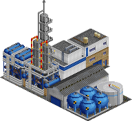

The plastics plant produces all varieties of synthesized compounds, be it PVC or polyethylene. In Germany, production of synthetic rubber, called Buna, started in the 1930s. The plant site still exists today, belongs to Dow Chemical and still produces plastics. BASF, one of the biggest chemical companies in the world, also invented various plastics throughout the 20th century. 

Industry is not available with these extension: [Basic Inorganic Chemistry](#extension_2) [Painting Industries](#extension_11) [Organic Chemistry](#extension_9) 

Industry will only spawn after 1930.
This restriction is also valid for funding the industry.

Color in the overview map: &nbsp;&nbsp;&nbsp;&nbsp;&nbsp;&nbsp;

| Requires | Produces |
| -- | -- |
| [Oil](#cargo_OIL_) | [Plastics](#cargo_PLAS) |

### Plastics Plant

The plastics plant produces all varieties of synthesized compounds, be it PVC or polyethylene. In Germany, production of synthetic rubber, called Buna, started in the 1930s. The plant site still exists today, belongs to Dow Chemical and still produces plastics. BASF, one of the biggest chemical companies in the world, also invented various plastics throughout the 20th century. 

Industry requires extension(s): [Basic Inorganic Chemistry](#extension_2) 

Industry is not available with these extension: [Painting Industries](#extension_11) [Organic Chemistry](#extension_9) 

Industry will only spawn after 1930.
This restriction is also valid for funding the industry.

Color in the overview map: &nbsp;&nbsp;&nbsp;&nbsp;&nbsp;&nbsp;

| Requires | Produces |
| -- | -- |
| [Chlorine](#cargo_CHLO) | [Plastics](#cargo_PLAS) |
| [Oil](#cargo_OIL_) |  |

### Plastics Plant

The plastics plant produces all varieties of synthesized compounds, be it PVC or polyethylene. In Germany, production of synthetic rubber, called Buna, started in the 1930s. The plant site still exists today, belongs to Dow Chemical and still produces plastics. BASF, one of the biggest chemical companies in the world, also invented various plastics throughout the 20th century. 

Industry requires extension(s): [Painting Industries](#extension_11) 

Industry is not available with these extension: [Basic Inorganic Chemistry](#extension_2) [Organic Chemistry](#extension_9) 

Industry will only spawn after 1930.
This restriction is also valid for funding the industry.

Color in the overview map: &nbsp;&nbsp;&nbsp;&nbsp;&nbsp;&nbsp;

| Requires | Produces |
| -- | -- |
| [Paint](#cargo_COAT) | [Plastics](#cargo_PLAS) |
| [Oil](#cargo_OIL_) |  |

### Plastics Plant

The plastics plant produces all varieties of synthesized compounds, be it PVC or polyethylene. In Germany, production of synthetic rubber, called Buna, started in the 1930s. The plant site still exists today, belongs to Dow Chemical and still produces plastics. BASF, one of the biggest chemical companies in the world, also invented various plastics throughout the 20th century. 

Industry requires extension(s): [Basic Inorganic Chemistry](#extension_2) [Painting Industries](#extension_11) 

Industry is not available with these extension: [Organic Chemistry](#extension_9) 

Industry will only spawn after 1930.
This restriction is also valid for funding the industry.

Color in the overview map: &nbsp;&nbsp;&nbsp;&nbsp;&nbsp;&nbsp;

| Requires | Produces |
| -- | -- |
| [Chlorine](#cargo_CHLO) | [Plastics](#cargo_PLAS) |
| [Paint](#cargo_COAT) |  |
| [Oil](#cargo_OIL_) |  |

### Plastics Plant

The plastics plant produces all varieties of synthesized compounds, be it PVC or polyethylene. In Germany, production of synthetic rubber, called Buna, started in the 1930s. The plant site still exists today, belongs to Dow Chemical and still produces plastics. BASF, one of the biggest chemical companies in the world, also invented various plastics throughout the 20th century. 

Industry requires extension(s): [Organic Chemistry](#extension_9) 

Industry is not available with these extension: [Basic Inorganic Chemistry](#extension_2) [Painting Industries](#extension_11) 

Industry will only spawn after 1930.
This restriction is also valid for funding the industry.

Color in the overview map: &nbsp;&nbsp;&nbsp;&nbsp;&nbsp;&nbsp;

| Requires | Produces |
| -- | -- |
| [Ethylene](#cargo_C2H4) | [Plastics](#cargo_PLAS) |

### Plastics Plant

The plastics plant produces all varieties of synthesized compounds, be it PVC or polyethylene. In Germany, production of synthetic rubber, called Buna, started in the 1930s. The plant site still exists today, belongs to Dow Chemical and still produces plastics. BASF, one of the biggest chemical companies in the world, also invented various plastics throughout the 20th century. 

Industry requires extension(s): [Basic Inorganic Chemistry](#extension_2) [Organic Chemistry](#extension_9) 

Industry is not available with these extension: [Painting Industries](#extension_11) 

Industry will only spawn after 1930.
This restriction is also valid for funding the industry.

Color in the overview map: &nbsp;&nbsp;&nbsp;&nbsp;&nbsp;&nbsp;

| Requires | Produces |
| -- | -- |
| [Ethylene](#cargo_C2H4) | [Plastics](#cargo_PLAS) |
| [Chlorine](#cargo_CHLO) |  |

### Plastics Plant

The plastics plant produces all varieties of synthesized compounds, be it PVC or polyethylene. In Germany, production of synthetic rubber, called Buna, started in the 1930s. The plant site still exists today, belongs to Dow Chemical and still produces plastics. BASF, one of the biggest chemical companies in the world, also invented various plastics throughout the 20th century. 

Industry requires extension(s): [Painting Industries](#extension_11) [Organic Chemistry](#extension_9) 

Industry is not available with these extension: [Basic Inorganic Chemistry](#extension_2) 

Industry will only spawn after 1930.
This restriction is also valid for funding the industry.

Color in the overview map: &nbsp;&nbsp;&nbsp;&nbsp;&nbsp;&nbsp;

| Requires | Produces |
| -- | -- |
| [Ethylene](#cargo_C2H4) | [Plastics](#cargo_PLAS) |
| [Paint](#cargo_COAT) |  |

### Plastics Plant

The plastics plant produces all varieties of synthesized compounds, be it PVC or polyethylene. In Germany, production of synthetic rubber, called Buna, started in the 1930s. The plant site still exists today, belongs to Dow Chemical and still produces plastics. BASF, one of the biggest chemical companies in the world, also invented various plastics throughout the 20th century. 

Industry requires extension(s): [Basic Inorganic Chemistry](#extension_2) [Painting Industries](#extension_11) [Organic Chemistry](#extension_9) 

Industry will only spawn after 1930.
This restriction is also valid for funding the industry.

Color in the overview map: &nbsp;&nbsp;&nbsp;&nbsp;&nbsp;&nbsp;

| Requires | Produces |
| -- | -- |
| [Ethylene](#cargo_C2H4) | [Plastics](#cargo_PLAS) |
| [Chlorine](#cargo_CHLO) |  |
| [Paint](#cargo_COAT) |  |

### Port

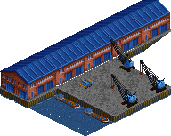

Ports are centers of trade, and with the German industry dependent on importing many raw materials and exporting lots of goods, it is only natural to also model this in the set. German ports at the North Sea and the Baltic sea already played pivotal roles in medieval times, when the Hanse ensured that cities like Hamburg and Lübeck (among many others) prospered. Today, Hamburg still is the busiest port in Germany. 

In the set, the maximum production of harbors is constantly increasing as time goes on. This reflects the fact that ships got bigger and innovations like the switch to containerized transport took place. 

Industry is not available with these extension: [Aluminium](#extension_0) [Painting Industries](#extension_11) [Coke and Sulphur](#extension_4) [Vehicle Industries](#extension_15) 

Color in the overview map: &nbsp;&nbsp;&nbsp;&nbsp;&nbsp;&nbsp;

| Requires | Produces |
| -- | -- |
| [Goods](#cargo_GOOD) | [Coal](#cargo_COAL) |
| [Vehicles](#cargo_VEHI) | [Iron Ore](#cargo_IORE) |
|  | [Oil](#cargo_OIL_) |

### Port

Ports are centers of trade, and with the German industry dependent on importing many raw materials and exporting lots of goods, it is only natural to also model this in the set. German ports at the North Sea and the Baltic sea already played pivotal roles in medieval times, when the Hanse ensured that cities like Hamburg and Lübeck (among many others) prospered. Today, Hamburg still is the busiest port in Germany. 

In the set, the maximum production of harbors is constantly increasing as time goes on. This reflects the fact that ships got bigger and innovations like the switch to containerized transport took place. 

Industry requires extension(s): [Aluminium](#extension_0) 

Industry is not available with these extension: [Painting Industries](#extension_11) [Coke and Sulphur](#extension_4) [Vehicle Industries](#extension_15) 

Color in the overview map: &nbsp;&nbsp;&nbsp;&nbsp;&nbsp;&nbsp;

| Requires | Produces |
| -- | -- |
| [Goods](#cargo_GOOD) | [Bauxite](#cargo_AORE) |
| [Vehicles](#cargo_VEHI) | [Coal](#cargo_COAL) |
|  | [Iron Ore](#cargo_IORE) |
|  | [Oil](#cargo_OIL_) |

### Port

Ports are centers of trade, and with the German industry dependent on importing many raw materials and exporting lots of goods, it is only natural to also model this in the set. German ports at the North Sea and the Baltic sea already played pivotal roles in medieval times, when the Hanse ensured that cities like Hamburg and Lübeck (among many others) prospered. Today, Hamburg still is the busiest port in Germany. 

In the set, the maximum production of harbors is constantly increasing as time goes on. This reflects the fact that ships got bigger and innovations like the switch to containerized transport took place. 

Industry requires extension(s): [Painting Industries](#extension_11) 

Industry is not available with these extension: [Aluminium](#extension_0) [Coke and Sulphur](#extension_4) [Vehicle Industries](#extension_15) 

Color in the overview map: &nbsp;&nbsp;&nbsp;&nbsp;&nbsp;&nbsp;

| Requires | Produces |
| -- | -- |
| [Goods](#cargo_GOOD) | [Coal](#cargo_COAL) |
| [Vehicles](#cargo_VEHI) | [Copper Ore](#cargo_CORE) |
|  | [Iron Ore](#cargo_IORE) |
|  | [Oil](#cargo_OIL_) |

### Port

Ports are centers of trade, and with the German industry dependent on importing many raw materials and exporting lots of goods, it is only natural to also model this in the set. German ports at the North Sea and the Baltic sea already played pivotal roles in medieval times, when the Hanse ensured that cities like Hamburg and Lübeck (among many others) prospered. Today, Hamburg still is the busiest port in Germany. 

In the set, the maximum production of harbors is constantly increasing as time goes on. This reflects the fact that ships got bigger and innovations like the switch to containerized transport took place. 

Industry requires extension(s): [Aluminium](#extension_0) [Painting Industries](#extension_11) 

Industry is not available with these extension: [Coke and Sulphur](#extension_4) [Vehicle Industries](#extension_15) 

Color in the overview map: &nbsp;&nbsp;&nbsp;&nbsp;&nbsp;&nbsp;

| Requires | Produces |
| -- | -- |
| [Goods](#cargo_GOOD) | [Bauxite](#cargo_AORE) |
| [Vehicles](#cargo_VEHI) | [Coal](#cargo_COAL) |
|  | [Copper Ore](#cargo_CORE) |
|  | [Iron Ore](#cargo_IORE) |
|  | [Oil](#cargo_OIL_) |

### Port

Ports are centers of trade, and with the German industry dependent on importing many raw materials and exporting lots of goods, it is only natural to also model this in the set. German ports at the North Sea and the Baltic sea already played pivotal roles in medieval times, when the Hanse ensured that cities like Hamburg and Lübeck (among many others) prospered. Today, Hamburg still is the busiest port in Germany. 

In the set, the maximum production of harbors is constantly increasing as time goes on. This reflects the fact that ships got bigger and innovations like the switch to containerized transport took place. 

Industry requires extension(s): [Coke and Sulphur](#extension_4) 

Industry is not available with these extension: [Aluminium](#extension_0) [Painting Industries](#extension_11) [Vehicle Industries](#extension_15) 

Color in the overview map: &nbsp;&nbsp;&nbsp;&nbsp;&nbsp;&nbsp;

| Requires | Produces |
| -- | -- |
| [Goods](#cargo_GOOD) | [Coal](#cargo_COAL) |
| [Vehicles](#cargo_VEHI) | [Iron Ore](#cargo_IORE) |
|  | [Oil](#cargo_OIL_) |
|  | [Pyrite Ore](#cargo_PORE) |

### Port

Ports are centers of trade, and with the German industry dependent on importing many raw materials and exporting lots of goods, it is only natural to also model this in the set. German ports at the North Sea and the Baltic sea already played pivotal roles in medieval times, when the Hanse ensured that cities like Hamburg and Lübeck (among many others) prospered. Today, Hamburg still is the busiest port in Germany. 

In the set, the maximum production of harbors is constantly increasing as time goes on. This reflects the fact that ships got bigger and innovations like the switch to containerized transport took place. 

Industry requires extension(s): [Aluminium](#extension_0) [Coke and Sulphur](#extension_4) 

Industry is not available with these extension: [Painting Industries](#extension_11) [Vehicle Industries](#extension_15) 

Color in the overview map: &nbsp;&nbsp;&nbsp;&nbsp;&nbsp;&nbsp;

| Requires | Produces |
| -- | -- |
| [Goods](#cargo_GOOD) | [Bauxite](#cargo_AORE) |
| [Vehicles](#cargo_VEHI) | [Coal](#cargo_COAL) |
|  | [Iron Ore](#cargo_IORE) |
|  | [Oil](#cargo_OIL_) |
|  | [Pyrite Ore](#cargo_PORE) |

### Port

Ports are centers of trade, and with the German industry dependent on importing many raw materials and exporting lots of goods, it is only natural to also model this in the set. German ports at the North Sea and the Baltic sea already played pivotal roles in medieval times, when the Hanse ensured that cities like Hamburg and Lübeck (among many others) prospered. Today, Hamburg still is the busiest port in Germany. 

In the set, the maximum production of harbors is constantly increasing as time goes on. This reflects the fact that ships got bigger and innovations like the switch to containerized transport took place. 

Industry requires extension(s): [Painting Industries](#extension_11) [Coke and Sulphur](#extension_4) 

Industry is not available with these extension: [Aluminium](#extension_0) [Vehicle Industries](#extension_15) 

Color in the overview map: &nbsp;&nbsp;&nbsp;&nbsp;&nbsp;&nbsp;

| Requires | Produces |
| -- | -- |
| [Goods](#cargo_GOOD) | [Coal](#cargo_COAL) |
| [Vehicles](#cargo_VEHI) | [Iron Ore](#cargo_IORE) |
|  | [Oil](#cargo_OIL_) |
|  | [Pyrite Ore](#cargo_PORE) |

### Port

Ports are centers of trade, and with the German industry dependent on importing many raw materials and exporting lots of goods, it is only natural to also model this in the set. German ports at the North Sea and the Baltic sea already played pivotal roles in medieval times, when the Hanse ensured that cities like Hamburg and Lübeck (among many others) prospered. Today, Hamburg still is the busiest port in Germany. 

In the set, the maximum production of harbors is constantly increasing as time goes on. This reflects the fact that ships got bigger and innovations like the switch to containerized transport took place. 

Industry requires extension(s): [Aluminium](#extension_0) [Painting Industries](#extension_11) [Coke and Sulphur](#extension_4) 

Industry is not available with these extension: [Vehicle Industries](#extension_15) 

Color in the overview map: &nbsp;&nbsp;&nbsp;&nbsp;&nbsp;&nbsp;

| Requires | Produces |
| -- | -- |
| [Goods](#cargo_GOOD) | [Bauxite](#cargo_AORE) |
| [Vehicles](#cargo_VEHI) | [Coal](#cargo_COAL) |
|  | [Iron Ore](#cargo_IORE) |
|  | [Oil](#cargo_OIL_) |
|  | [Pyrite Ore](#cargo_PORE) |

### Port

Ports are centers of trade, and with the German industry dependent on importing many raw materials and exporting lots of goods, it is only natural to also model this in the set. German ports at the North Sea and the Baltic sea already played pivotal roles in medieval times, when the Hanse ensured that cities like Hamburg and Lübeck (among many others) prospered. Today, Hamburg still is the busiest port in Germany. 

In the set, the maximum production of harbors is constantly increasing as time goes on. This reflects the fact that ships got bigger and innovations like the switch to containerized transport took place. 

Industry requires extension(s): [Vehicle Industries](#extension_15) 

Industry is not available with these extension: [Aluminium](#extension_0) [Painting Industries](#extension_11) [Coke and Sulphur](#extension_4) 

Color in the overview map: &nbsp;&nbsp;&nbsp;&nbsp;&nbsp;&nbsp;

| Requires | Produces |
| -- | -- |
| [Goods](#cargo_GOOD) | [Coal](#cargo_COAL) |
| [Vehicles](#cargo_VEHI) | [Iron Ore](#cargo_IORE) |
|  | [Oil](#cargo_OIL_) |
|  | [Rubber](#cargo_RUBR) |

### Port

Ports are centers of trade, and with the German industry dependent on importing many raw materials and exporting lots of goods, it is only natural to also model this in the set. German ports at the North Sea and the Baltic sea already played pivotal roles in medieval times, when the Hanse ensured that cities like Hamburg and Lübeck (among many others) prospered. Today, Hamburg still is the busiest port in Germany. 

In the set, the maximum production of harbors is constantly increasing as time goes on. This reflects the fact that ships got bigger and innovations like the switch to containerized transport took place. 

Industry requires extension(s): [Aluminium](#extension_0) [Vehicle Industries](#extension_15) 

Industry is not available with these extension: [Painting Industries](#extension_11) [Coke and Sulphur](#extension_4) 

Color in the overview map: &nbsp;&nbsp;&nbsp;&nbsp;&nbsp;&nbsp;

| Requires | Produces |
| -- | -- |
| [Goods](#cargo_GOOD) | [Bauxite](#cargo_AORE) |
| [Vehicles](#cargo_VEHI) | [Coal](#cargo_COAL) |
|  | [Iron Ore](#cargo_IORE) |
|  | [Oil](#cargo_OIL_) |
|  | [Rubber](#cargo_RUBR) |

### Port

Ports are centers of trade, and with the German industry dependent on importing many raw materials and exporting lots of goods, it is only natural to also model this in the set. German ports at the North Sea and the Baltic sea already played pivotal roles in medieval times, when the Hanse ensured that cities like Hamburg and Lübeck (among many others) prospered. Today, Hamburg still is the busiest port in Germany. 

In the set, the maximum production of harbors is constantly increasing as time goes on. This reflects the fact that ships got bigger and innovations like the switch to containerized transport took place. 

Industry requires extension(s): [Painting Industries](#extension_11) [Vehicle Industries](#extension_15) 

Industry is not available with these extension: [Aluminium](#extension_0) [Coke and Sulphur](#extension_4) 

Color in the overview map: &nbsp;&nbsp;&nbsp;&nbsp;&nbsp;&nbsp;

| Requires | Produces |
| -- | -- |
| [Goods](#cargo_GOOD) | [Coal](#cargo_COAL) |
| [Vehicles](#cargo_VEHI) | [Copper Ore](#cargo_CORE) |
|  | [Iron Ore](#cargo_IORE) |
|  | [Oil](#cargo_OIL_) |
|  | [Rubber](#cargo_RUBR) |

### Port

Ports are centers of trade, and with the German industry dependent on importing many raw materials and exporting lots of goods, it is only natural to also model this in the set. German ports at the North Sea and the Baltic sea already played pivotal roles in medieval times, when the Hanse ensured that cities like Hamburg and Lübeck (among many others) prospered. Today, Hamburg still is the busiest port in Germany. 

In the set, the maximum production of harbors is constantly increasing as time goes on. This reflects the fact that ships got bigger and innovations like the switch to containerized transport took place. 

Industry requires extension(s): [Aluminium](#extension_0) [Painting Industries](#extension_11) [Vehicle Industries](#extension_15) 

Industry is not available with these extension: [Coke and Sulphur](#extension_4) 

Color in the overview map: &nbsp;&nbsp;&nbsp;&nbsp;&nbsp;&nbsp;

| Requires | Produces |
| -- | -- |
| [Goods](#cargo_GOOD) | [Bauxite](#cargo_AORE) |
| [Vehicles](#cargo_VEHI) | [Coal](#cargo_COAL) |
|  | [Copper Ore](#cargo_CORE) |
|  | [Iron Ore](#cargo_IORE) |
|  | [Oil](#cargo_OIL_) |
|  | [Rubber](#cargo_RUBR) |

### Port

Ports are centers of trade, and with the German industry dependent on importing many raw materials and exporting lots of goods, it is only natural to also model this in the set. German ports at the North Sea and the Baltic sea already played pivotal roles in medieval times, when the Hanse ensured that cities like Hamburg and Lübeck (among many others) prospered. Today, Hamburg still is the busiest port in Germany. 

In the set, the maximum production of harbors is constantly increasing as time goes on. This reflects the fact that ships got bigger and innovations like the switch to containerized transport took place. 

Industry requires extension(s): [Coke and Sulphur](#extension_4) [Vehicle Industries](#extension_15) 

Industry is not available with these extension: [Aluminium](#extension_0) [Painting Industries](#extension_11) 

Color in the overview map: &nbsp;&nbsp;&nbsp;&nbsp;&nbsp;&nbsp;

| Requires | Produces |
| -- | -- |
| [Goods](#cargo_GOOD) | [Coal](#cargo_COAL) |
| [Vehicles](#cargo_VEHI) | [Iron Ore](#cargo_IORE) |
|  | [Oil](#cargo_OIL_) |
|  | [Pyrite Ore](#cargo_PORE) |
|  | [Rubber](#cargo_RUBR) |

### Port

Ports are centers of trade, and with the German industry dependent on importing many raw materials and exporting lots of goods, it is only natural to also model this in the set. German ports at the North Sea and the Baltic sea already played pivotal roles in medieval times, when the Hanse ensured that cities like Hamburg and Lübeck (among many others) prospered. Today, Hamburg still is the busiest port in Germany. 

In the set, the maximum production of harbors is constantly increasing as time goes on. This reflects the fact that ships got bigger and innovations like the switch to containerized transport took place. 

Industry requires extension(s): [Aluminium](#extension_0) [Coke and Sulphur](#extension_4) [Vehicle Industries](#extension_15) 

Industry is not available with these extension: [Painting Industries](#extension_11) 

Color in the overview map: &nbsp;&nbsp;&nbsp;&nbsp;&nbsp;&nbsp;

| Requires | Produces |
| -- | -- |
| [Goods](#cargo_GOOD) | [Bauxite](#cargo_AORE) |
| [Vehicles](#cargo_VEHI) | [Coal](#cargo_COAL) |
|  | [Iron Ore](#cargo_IORE) |
|  | [Oil](#cargo_OIL_) |
|  | [Pyrite Ore](#cargo_PORE) |
|  | [Rubber](#cargo_RUBR) |

### Port

Ports are centers of trade, and with the German industry dependent on importing many raw materials and exporting lots of goods, it is only natural to also model this in the set. German ports at the North Sea and the Baltic sea already played pivotal roles in medieval times, when the Hanse ensured that cities like Hamburg and Lübeck (among many others) prospered. Today, Hamburg still is the busiest port in Germany. 

In the set, the maximum production of harbors is constantly increasing as time goes on. This reflects the fact that ships got bigger and innovations like the switch to containerized transport took place. 

Industry requires extension(s): [Painting Industries](#extension_11) [Coke and Sulphur](#extension_4) [Vehicle Industries](#extension_15) 

Industry is not available with these extension: [Aluminium](#extension_0) 

Color in the overview map: &nbsp;&nbsp;&nbsp;&nbsp;&nbsp;&nbsp;

| Requires | Produces |
| -- | -- |
| [Goods](#cargo_GOOD) | [Coal](#cargo_COAL) |
| [Vehicles](#cargo_VEHI) | [Iron Ore](#cargo_IORE) |
|  | [Oil](#cargo_OIL_) |
|  | [Pyrite Ore](#cargo_PORE) |
|  | [Rubber](#cargo_RUBR) |

### Port

Ports are centers of trade, and with the German industry dependent on importing many raw materials and exporting lots of goods, it is only natural to also model this in the set. German ports at the North Sea and the Baltic sea already played pivotal roles in medieval times, when the Hanse ensured that cities like Hamburg and Lübeck (among many others) prospered. Today, Hamburg still is the busiest port in Germany. 

In the set, the maximum production of harbors is constantly increasing as time goes on. This reflects the fact that ships got bigger and innovations like the switch to containerized transport took place. 

Industry requires extension(s): [Aluminium](#extension_0) [Painting Industries](#extension_11) [Coke and Sulphur](#extension_4) [Vehicle Industries](#extension_15) 

Color in the overview map: &nbsp;&nbsp;&nbsp;&nbsp;&nbsp;&nbsp;

| Requires | Produces |
| -- | -- |
| [Goods](#cargo_GOOD) | [Bauxite](#cargo_AORE) |
| [Vehicles](#cargo_VEHI) | [Coal](#cargo_COAL) |
|  | [Iron Ore](#cargo_IORE) |
|  | [Oil](#cargo_OIL_) |
|  | [Pyrite Ore](#cargo_PORE) |
|  | [Rubber](#cargo_RUBR) |

### Power Station

Power plants create electricity, typically by boiling water and using the resulting steam to turn turbines which are coupled with generators. This basic principle is also used in nuclear power plants, whereas hydroplants use the water directly for the turbines. Since it is a transportation game, the set concentrates on fossil power plants that require a constant delivery of coal and/or oil to be burned in order to create electricity. 

Industry is not available with these extension: [Coke and Sulphur](#extension_4) [Fruits and Bioenergy](#extension_6) 

Industry will only spawn after 1880.
This restriction is also valid for funding the industry.

Color in the overview map: &nbsp;&nbsp;&nbsp;&nbsp;&nbsp;&nbsp;

| Requires | Produces |
| -- | -- |
| [Coal](#cargo_COAL) |  |
| [Oil](#cargo_OIL_) |  |

### Power Station

Power plants create electricity, typically by boiling water and using the resulting steam to turn turbines which are coupled with generators. This basic principle is also used in nuclear power plants, whereas hydroplants use the water directly for the turbines. Since it is a transportation game, the set concentrates on fossil power plants that require a constant delivery of coal and/or oil to be burned in order to create electricity. 

Industry requires extension(s): [Coke and Sulphur](#extension_4) 

Industry is not available with these extension: [Fruits and Bioenergy](#extension_6) 

Industry will only spawn after 1880.
This restriction is also valid for funding the industry.

Color in the overview map: &nbsp;&nbsp;&nbsp;&nbsp;&nbsp;&nbsp;

| Requires | Produces |
| -- | -- |
| [Coal](#cargo_COAL) | [Sulphur](#cargo_SULP) |
| [Oil](#cargo_OIL_) |  |

### Power Station

Power plants create electricity, typically by boiling water and using the resulting steam to turn turbines which are coupled with generators. This basic principle is also used in nuclear power plants, whereas hydroplants use the water directly for the turbines. Since it is a transportation game, the set concentrates on fossil power plants that require a constant delivery of coal and/or oil to be burned in order to create electricity. 

Industry requires extension(s): [Fruits and Bioenergy](#extension_6) 

Industry is not available with these extension: [Coke and Sulphur](#extension_4) 

Industry will only spawn after 1880.
This restriction is also valid for funding the industry.

Color in the overview map: &nbsp;&nbsp;&nbsp;&nbsp;&nbsp;&nbsp;

| Requires | Produces |
| -- | -- |
| [Biomass](#cargo_BIOM) |  |
| [Coal](#cargo_COAL) |  |
| [Oil](#cargo_OIL_) |  |

### Power Station

Power plants create electricity, typically by boiling water and using the resulting steam to turn turbines which are coupled with generators. This basic principle is also used in nuclear power plants, whereas hydroplants use the water directly for the turbines. Since it is a transportation game, the set concentrates on fossil power plants that require a constant delivery of coal and/or oil to be burned in order to create electricity. 

Industry requires extension(s): [Coke and Sulphur](#extension_4) [Fruits and Bioenergy](#extension_6) 

Industry will only spawn after 1880.
This restriction is also valid for funding the industry.

Color in the overview map: &nbsp;&nbsp;&nbsp;&nbsp;&nbsp;&nbsp;

| Requires | Produces |
| -- | -- |
| [Biomass](#cargo_BIOM) | [Sulphur](#cargo_SULP) |
| [Coal](#cargo_COAL) |  |
| [Oil](#cargo_OIL_) |  |

### Printing Works

Modern printing was invented in the 16th century in Germany. In the following centuries, printing newspapers become commonplace, and in the 19th century reading for fun became a pastime for educated citizens. Nowadays, pretty much anyone can get their own book printed on demand. 

Industry requires extension(s): [Paper](#extension_12) 

Industry is not available with these extension: [Packaging Industries](#extension_10) 

Industry will only spawn after 1900.
This restriction is also valid for funding the industry.

Color in the overview map: &nbsp;&nbsp;&nbsp;&nbsp;&nbsp;&nbsp;

| Requires | Produces |
| -- | -- |
| [Paper](#cargo_PAPR) | [Goods](#cargo_GOOD) |

### Printing Works

Modern printing was invented in the 16th century in Germany. In the following centuries, printing newspapers become commonplace, and in the 19th century reading for fun became a pastime for educated citizens. Nowadays, pretty much anyone can get their own book printed on demand. 

Industry requires extension(s): [Paper](#extension_12) [Packaging Industries](#extension_10) 

Industry will only spawn after 1900.
This restriction is also valid for funding the industry.

Color in the overview map: &nbsp;&nbsp;&nbsp;&nbsp;&nbsp;&nbsp;

| Requires | Produces |
| -- | -- |
| [Packaging](#cargo_MNSP) | [Goods](#cargo_GOOD) |
| [Paper](#cargo_PAPR) |  |

### Recycling Depot

The recycling depot provides recyclables which are not just waste, but valuable raw materials to be used again, such as glass and scrap paper. The production level of the recycling depot is linked to the size of the city, the larger the city, the higher the production level. 

Industry requires extension(s): [Recycling](#extension_13) [Glass](#extension_7) [Paper](#extension_12) 

Color in the overview map: &nbsp;&nbsp;&nbsp;&nbsp;&nbsp;&nbsp;

| Requires | Produces |
| -- | -- |
|  | [Recyclables](#cargo_RCYC) |

### Salt Mine

Due to the geological processes there are huge amounts of salt located underground in northern and central Germany. There are various springs where salt dissolved in water can be found on ground level, which have been used for centuries to produce salt by simply evaporating the water. However, a major change in the production of salt were the first actual mines which were created in the 19th century The first actual salt mine was created in Staßfurt, then Prussia, in 1855. The whole area today belongs to a district literally named salt land, with a huge mine located in neighboring Bernburg being active since about 1920. Other mines exist in Lower Saxony and in Southern Germany. To this day, Germany is by far the largest producer of salt in Europe, with the salt being a major economic factor due to its relevance for the chemical industry. 

Industry requires extension(s): [Basic Inorganic Chemistry](#extension_2) 

Industry will only spawn after 1800.
This restriction is also valid for funding the industry.

Color in the overview map: &nbsp;&nbsp;&nbsp;&nbsp;&nbsp;&nbsp;

Industry is generated with limited resources and will close down once these are depleted. See [Resource depletion](#resource_depletion).

| Requires | Produces |
| -- | -- |
|  | [Salt](#cargo_SALT) |

### Sand Pit

Sand is mined in open pits. Due to the geological processes that shaped the Earth over millions of years, sand pits are mainly found in the plains of Northern Germany, but also near the Alps. 

Industry requires extension(s): [Building Industries](#extension_3) 

Color in the overview map: &nbsp;&nbsp;&nbsp;&nbsp;&nbsp;&nbsp;

Industry is generated with limited resources and will close down once these are depleted. See [Resource depletion](#resource_depletion).

| Requires | Produces |
| -- | -- |
|  | [Sand](#cargo_SAND) |

### Sawmill

Sawmills cut wood into normalized sizes and shapes, such that the resulting beams and planks can be used for various industries. As such, they are a necessary step to provide materials used in construction, furniture industries and other applications. 

Industry is not available with these extension: [Fruits and Bioenergy](#extension_6) 

Color in the overview map: &nbsp;&nbsp;&nbsp;&nbsp;&nbsp;&nbsp;

| Requires | Produces |
| -- | -- |
| [Wood](#cargo_WOOD) | [Timber](#cargo_WDPR) |

### Sawmill

Sawmills cut wood into normalized sizes and shapes, such that the resulting beams and planks can be used for various industries. As such, they are a necessary step to provide materials used in construction, furniture industries and other applications. 

Industry requires extension(s): [Fruits and Bioenergy](#extension_6) 

Color in the overview map: &nbsp;&nbsp;&nbsp;&nbsp;&nbsp;&nbsp;

| Requires | Produces |
| -- | -- |
| [Wood](#cargo_WOOD) | [Biomass](#cargo_BIOM) |
|  | [Timber](#cargo_WDPR) |

### Scrap Yard

The scrap yard provides scrap metal, which in turn is essential for metal producing industries as it can be reused. This also reduces production cost especially for copper and aluminium. 

Industry requires extension(s): [Recycling](#extension_13) 

Color in the overview map: &nbsp;&nbsp;&nbsp;&nbsp;&nbsp;&nbsp;

| Requires | Produces |
| -- | -- |
|  | [Scrap Metal](#cargo_SCMT) |

### Sheet Mill

Sheet mills form metal into sheets which are needed for vehicle production. These sheets can be produced from steel or aluminium. 

Industry requires extension(s): [Metallurgy](#extension_8) 

Industry is not available with these extension: [Aluminium](#extension_0) [Recycling](#extension_13) 

Industry will only spawn after 1800.
This restriction is also valid for funding the industry.

Color in the overview map: &nbsp;&nbsp;&nbsp;&nbsp;&nbsp;&nbsp;

| Requires | Produces |
| -- | -- |
| [Acid](#cargo_ACID) | [Metal Sheets](#cargo_STSH) |
| [Lye](#cargo_LYE_) |  |
| [Steel](#cargo_STEL) |  |

### Sheet Mill

Sheet mills form metal into sheets which are needed for vehicle production. These sheets can be produced from steel or aluminium. 

Industry requires extension(s): [Metallurgy](#extension_8) [Aluminium](#extension_0) 

Industry is not available with these extension: [Recycling](#extension_13) 

Industry will only spawn after 1800.
This restriction is also valid for funding the industry.

Color in the overview map: &nbsp;&nbsp;&nbsp;&nbsp;&nbsp;&nbsp;

Industry requires any of the raw materials printed in black to produce anything. Maximum production level is limited by the number of different raw materials available. Raw materials printed in white will increase the maximum production level.

| Requires | Produces |
| -- | -- |
| [Acid](#cargo_ACID) | [Metal Sheets](#cargo_STSH) |
| [Aluminium](#cargo_ALUM) |  |
| [Lye](#cargo_LYE_) |  |
| [Steel](#cargo_STEL) |  |

### Sheet Mill

Sheet mills form metal into sheets which are needed for vehicle production. These sheets can be produced from steel or aluminium. 

Industry requires extension(s): [Metallurgy](#extension_8) [Recycling](#extension_13) 

Industry is not available with these extension: [Aluminium](#extension_0) 

Industry will only spawn after 1800.
This restriction is also valid for funding the industry.

Color in the overview map: &nbsp;&nbsp;&nbsp;&nbsp;&nbsp;&nbsp;

| Requires | Produces |
| -- | -- |
| [Acid](#cargo_ACID) | [Scrap Metal](#cargo_SCMT) |
| [Lye](#cargo_LYE_) | [Metal Sheets](#cargo_STSH) |
| [Steel](#cargo_STEL) |  |

### Sheet Mill

Sheet mills form metal into sheets which are needed for vehicle production. These sheets can be produced from steel or aluminium. 

Industry requires extension(s): [Metallurgy](#extension_8) [Aluminium](#extension_0) [Recycling](#extension_13) 

Industry will only spawn after 1800.
This restriction is also valid for funding the industry.

Color in the overview map: &nbsp;&nbsp;&nbsp;&nbsp;&nbsp;&nbsp;

Industry requires any of the raw materials printed in black to produce anything. Maximum production level is limited by the number of different raw materials available. Raw materials printed in white will increase the maximum production level.

| Requires | Produces |
| -- | -- |
| [Acid](#cargo_ACID) | [Scrap Metal](#cargo_SCMT) |
| [Aluminium](#cargo_ALUM) | [Metal Sheets](#cargo_STSH) |
| [Lye](#cargo_LYE_) |  |
| [Steel](#cargo_STEL) |  |

### Solvay Plant

Production of soda ash in relevant quantities was one of the first breakthroughs for technical application of chemistry and dates back to the late 18th century. The Solvay process, which is the standard process until today, was developed in 1860. Over the next decades, plants operating in this way were built all over the world, usually licensed from the Solvay company as patent holder. Other companies were also founded, such as BASF, where the S stands for soda ash. The Solvay Plant in Bernburg in central Germany was the largest producer just before World War II, and in the neighboring city of Staßfurt another Solvay plant is located, both of which are now among the biggest in Europe. 

Industry requires extension(s): [Ammonia](#extension_1) 

Industry will only spawn after 1800.
This restriction is also valid for funding the industry.

Color in the overview map: &nbsp;&nbsp;&nbsp;&nbsp;&nbsp;&nbsp;

Industry requires the raw materials printed in black to produce anything. Raw materials printed in white will increase the maximum production level.

| Requires | Produces |
| -- | -- |
| [Limestone](#cargo_LIME) | [Soda Ash](#cargo_SASH) |
| [Ammonia](#cargo_NH3_) |  |
| [Salt](#cargo_SALT) |  |

### Steamcracker

Oil refineries produce large amounts of so-called naphtha, or crude oil. The chemical industry however, requires lots of compounds that can be won out of naphtha. To do that, it has to be heated to above 800°C, so that the naphtha is actually in a gaseous state, hence the name of the process. The products of the process are a variety of carbohydrates which are essential for the production of plastics, among other things. 

Industry requires extension(s): [Organic Chemistry](#extension_9) 

Industry will only spawn after 1900.
This restriction is also valid for funding the industry.

Color in the overview map: &nbsp;&nbsp;&nbsp;&nbsp;&nbsp;&nbsp;

| Requires | Produces |
| -- | -- |
| [Naphtha](#cargo_RFPR) | [Ethylene](#cargo_C2H4) |
|  | [Petrol](#cargo_PETR) |

### Steamreformer

Steam reforming is based on an idea by Carl Bosch, who was looking for a cheap way to produce hydrogen. The process basically consists of splitting carbohydrates, usually natural gas, into carbon dioxide and hydrogen by adding heat and water. About 50% of the hydrogen needed for industrial purposes are produced this way. About 60% of this hydrogen is then used for the synthesis of ammonia. 

Since natural gas is not part of the set, naphtha, a crude oil, is used as a base. 

Industry requires extension(s): [Organic Chemistry](#extension_9) 

Industry is not available with these extension: [Fruits and Bioenergy](#extension_6) 

Industry will only spawn after 1900.
This restriction is also valid for funding the industry.

Color in the overview map: &nbsp;&nbsp;&nbsp;&nbsp;&nbsp;&nbsp;

| Requires | Produces |
| -- | -- |
| [Naphtha](#cargo_RFPR) | [Hydrogen](#cargo_H2__) |

### Steamreformer

Steam reforming is based on an idea by Carl Bosch, who was looking for a cheap way to produce hydrogen. The process basically consists of splitting carbohydrates, usually natural gas, into carbon dioxide and hydrogen by adding heat and water. About 50% of the hydrogen needed for industrial purposes are produced this way. About 60% of this hydrogen is then used for the synthesis of ammonia. 

Since natural gas is not part of the set, naphtha, a crude oil, is used as a base. 

Industry requires extension(s): [Organic Chemistry](#extension_9) [Fruits and Bioenergy](#extension_6) 

Industry will only spawn after 1900.
This restriction is also valid for funding the industry.

Color in the overview map: &nbsp;&nbsp;&nbsp;&nbsp;&nbsp;&nbsp;

Industry will start producing as soon as any of the required cargos is available. Productivity increases with the number of different available cargos.

| Requires | Produces |
| -- | -- |
| [Biomass](#cargo_BIOM) | [Hydrogen](#cargo_H2__) |
| [Naphtha](#cargo_RFPR) |  |

### Synthetic Rubber Plant

Rubber is a natural product, but it can only be harvested in South America and Southeast Asio. Germany always had to import it, making it strategically important. Therefore research took place in the early 20th century to synthesize rubber. This resulted in the late 1920s with the so-called Buna-Rubber which is based on hydrocarbons. These are readily available in the chemical industry. 

Today, two thirds of global demand are satisfied using synthetic rubber. Biggest user is the tyre industry. 

Industry requires extension(s): [Vehicle Industries](#extension_15) 

Industry is not available with these extension: [Organic Chemistry](#extension_9) 

Industry will only spawn after 1910.
This restriction is also valid for funding the industry.

Color in the overview map: &nbsp;&nbsp;&nbsp;&nbsp;&nbsp;&nbsp;

| Requires | Produces |
| -- | -- |
| [Oil](#cargo_OIL_) | [Rubber](#cargo_RUBR) |

### Synthetic Rubber Plant

Rubber is a natural product, but it can only be harvested in South America and Southeast Asio. Germany always had to import it, making it strategically important. Therefore research took place in the early 20th century to synthesize rubber. This resulted in the late 1920s with the so-called Buna-Rubber which is based on hydrocarbons. These are readily available in the chemical industry. 

Today, two thirds of global demand are satisfied using synthetic rubber. Biggest user is the tyre industry. 

Industry requires extension(s): [Vehicle Industries](#extension_15) [Organic Chemistry](#extension_9) 

Industry will only spawn after 1910.
This restriction is also valid for funding the industry.

Color in the overview map: &nbsp;&nbsp;&nbsp;&nbsp;&nbsp;&nbsp;

| Requires | Produces |
| -- | -- |
| [Ethylene](#cargo_C2H4) | [Rubber](#cargo_RUBR) |

### Textile Mill

Textile mills are the representation of multiple real world industries that are focused on the creation of yarns and fabrics. This has been done since ancient times in household work before it became mechanized in the 18th and 19th century. In fact, looms were among the first mechanized items to be developed to improve production speed. In the set, this industry combines the steps of preparing cotton and synthetic fibres into yarn (spinning), and then turning them into textiles (e.g. by weaving) in a second step. The resulting textiles are then used by other industries to manufacture goods. 

Industry requires extension(s): [Textile Industries](#extension_14) 

Industry is not available with these extension: [Painting Industries](#extension_11) 

Color in the overview map: &nbsp;&nbsp;&nbsp;&nbsp;&nbsp;&nbsp;

Industry requires the raw materials printed in black to produce anything. Raw materials printed in white will increase the maximum production level.

| Requires | Produces |
| -- | -- |
| [Plastics](#cargo_PLAS) | [Textiles](#cargo_TEXT) |
| [Wool](#cargo_WOOL) |  |

### Textile Mill

Textile mills are the representation of multiple real world industries that are focused on the creation of yarns and fabrics. This has been done since ancient times in household work before it became mechanized in the 18th and 19th century. In fact, looms were among the first mechanized items to be developed to improve production speed. In the set, this industry combines the steps of preparing cotton and synthetic fibres into yarn (spinning), and then turning them into textiles (e.g. by weaving) in a second step. The resulting textiles are then used by other industries to manufacture goods. 

Industry requires extension(s): [Textile Industries](#extension_14) [Painting Industries](#extension_11) 

Color in the overview map: &nbsp;&nbsp;&nbsp;&nbsp;&nbsp;&nbsp;

Industry requires the raw materials printed in black to produce anything. Raw materials printed in white will increase the maximum production level.

| Requires | Produces |
| -- | -- |
| [Paint](#cargo_COAT) | [Textiles](#cargo_TEXT) |
| [Plastics](#cargo_PLAS) |  |
| [Wool](#cargo_WOOL) |  |

### Tyre Plant

The first cars already used rubber-based tyres, and parallel to the developing car industry the tyre industry boomed as well. Today, billions of tyres are built yearly, with the simple beginnings by technology pioneers (Charles Goodyear developed vulcanisation, Édouard Michelin invented economically successful tyres) turning into multibillion dollar corporations. One of the biggest names in tyre business is the Continental AG located in Germany, which presented the first treaded tyres for vehicles back in 1904. The Lego Group on the other side is the biggest tyre producer by numbers - they produce four times the number of tyres than Bridgestone. 

Industry requires extension(s): [Vehicle Industries](#extension_15) 

Industry is not available with these extension: [Painting Industries](#extension_11) 

Industry will only spawn after 1910.
This restriction is also valid for funding the industry.

Color in the overview map: &nbsp;&nbsp;&nbsp;&nbsp;&nbsp;&nbsp;

| Requires | Produces |
| -- | -- |
| [Rubber](#cargo_RUBR) | [Tyres](#cargo_TYRE) |
| [Sulphur](#cargo_SULP) |  |

### Tyre Plant

The first cars already used rubber-based tyres, and parallel to the developing car industry the tyre industry boomed as well. Today, billions of tyres are built yearly, with the simple beginnings by technology pioneers (Charles Goodyear developed vulcanisation, Édouard Michelin invented economically successful tyres) turning into multibillion dollar corporations. One of the biggest names in tyre business is the Continental AG located in Germany, which presented the first treaded tyres for vehicles back in 1904. The Lego Group on the other side is the biggest tyre producer by numbers - they produce four times the number of tyres than Bridgestone. 

Industry requires extension(s): [Vehicle Industries](#extension_15) [Painting Industries](#extension_11) 

Industry will only spawn after 1910.
This restriction is also valid for funding the industry.

Color in the overview map: &nbsp;&nbsp;&nbsp;&nbsp;&nbsp;&nbsp;

| Requires | Produces |
| -- | -- |
| [Carbon Black](#cargo_CBLK) | [Tyres](#cargo_TYRE) |
| [Rubber](#cargo_RUBR) |  |
| [Sulphur](#cargo_SULP) |  |

### Vehicle Body Factory

With modern distributed vehicle building logistics, vehicle bodies are often created in specialized factories, which are highly automated. Robots weld and glue metal sheets, which are galvanized and painted to create a vehicle body. These are then transported into other plants to build the actual vehicle. 

Industry requires extension(s): [Vehicle Industries](#extension_15) 

Industry is not available with these extension: [Painting Industries](#extension_11) [Aluminium](#extension_0) [Metallurgy](#extension_8) 

Industry will only spawn after 1910.
This restriction is also valid for funding the industry.

Color in the overview map: &nbsp;&nbsp;&nbsp;&nbsp;&nbsp;&nbsp;

Industry requires the raw materials printed in black to produce anything. Raw materials printed in white will increase the maximum production level.

| Requires | Produces |
| -- | -- |
| [Acid](#cargo_ACID) | [Vehicle Bodies](#cargo_VBOD) |
| [Steel](#cargo_STEL) |  |
| [Zinc](#cargo_ZINC) |  |

### Vehicle Body Factory

With modern distributed vehicle building logistics, vehicle bodies are often created in specialized factories, which are highly automated. Robots weld and glue metal sheets, which are galvanized and painted to create a vehicle body. These are then transported into other plants to build the actual vehicle. 

Industry requires extension(s): [Vehicle Industries](#extension_15) [Painting Industries](#extension_11) 

Industry is not available with these extension: [Aluminium](#extension_0) [Metallurgy](#extension_8) 

Industry will only spawn after 1910.
This restriction is also valid for funding the industry.

Color in the overview map: &nbsp;&nbsp;&nbsp;&nbsp;&nbsp;&nbsp;

Industry requires the raw materials printed in black to produce anything. Raw materials printed in white will increase the maximum production level.

| Requires | Produces |
| -- | -- |
| [Acid](#cargo_ACID) | [Vehicle Bodies](#cargo_VBOD) |
| [Paint](#cargo_COAT) |  |
| [Steel](#cargo_STEL) |  |
| [Zinc](#cargo_ZINC) |  |

### Vehicle Body Factory

With modern distributed vehicle building logistics, vehicle bodies are often created in specialized factories, which are highly automated. Robots weld and glue metal sheets, which are galvanized and painted to create a vehicle body. These are then transported into other plants to build the actual vehicle. 

Industry requires extension(s): [Vehicle Industries](#extension_15) [Aluminium](#extension_0) 

Industry is not available with these extension: [Painting Industries](#extension_11) [Metallurgy](#extension_8) 

Industry will only spawn after 1910.
This restriction is also valid for funding the industry.

Color in the overview map: &nbsp;&nbsp;&nbsp;&nbsp;&nbsp;&nbsp;

Industry requires the raw materials printed in black to produce anything. Raw materials printed in white will increase the maximum production level.

| Requires | Produces |
| -- | -- |
| [Acid](#cargo_ACID) | [Vehicle Bodies](#cargo_VBOD) |
| [Aluminium](#cargo_ALUM) |  |
| [Steel](#cargo_STEL) |  |
| [Zinc](#cargo_ZINC) |  |

### Vehicle Body Factory

With modern distributed vehicle building logistics, vehicle bodies are often created in specialized factories, which are highly automated. Robots weld and glue metal sheets, which are galvanized and painted to create a vehicle body. These are then transported into other plants to build the actual vehicle. 

Industry requires extension(s): [Vehicle Industries](#extension_15) [Painting Industries](#extension_11) [Aluminium](#extension_0) 

Industry is not available with these extension: [Metallurgy](#extension_8) 

Industry will only spawn after 1910.
This restriction is also valid for funding the industry.

Color in the overview map: &nbsp;&nbsp;&nbsp;&nbsp;&nbsp;&nbsp;

Industry requires the raw materials printed in black to produce anything. Raw materials printed in white will increase the maximum production level.

| Requires | Produces |
| -- | -- |
| [Acid](#cargo_ACID) | [Vehicle Bodies](#cargo_VBOD) |
| [Aluminium](#cargo_ALUM) |  |
| [Paint](#cargo_COAT) |  |
| [Steel](#cargo_STEL) |  |
| [Zinc](#cargo_ZINC) |  |

### Vehicle Body Factory

With modern distributed vehicle building logistics, vehicle bodies are often created in specialized factories, which are highly automated. Robots weld and glue metal sheets, which are galvanized and painted to create a vehicle body. These are then transported into other plants to build the actual vehicle. 

Industry requires extension(s): [Vehicle Industries](#extension_15) [Metallurgy](#extension_8) 

Industry is not available with these extension: [Painting Industries](#extension_11) 

Industry will only spawn after 1910.
This restriction is also valid for funding the industry.

Color in the overview map: &nbsp;&nbsp;&nbsp;&nbsp;&nbsp;&nbsp;

Industry requires the raw materials printed in black to produce anything. Raw materials printed in white will increase the maximum production level.

| Requires | Produces |
| -- | -- |
| [Acid](#cargo_ACID) | [Vehicle Bodies](#cargo_VBOD) |
| [Metal Sheets](#cargo_STSH) |  |
| [Zinc](#cargo_ZINC) |  |

### Vehicle Body Factory

With modern distributed vehicle building logistics, vehicle bodies are often created in specialized factories, which are highly automated. Robots weld and glue metal sheets, which are galvanized and painted to create a vehicle body. These are then transported into other plants to build the actual vehicle. 

Industry requires extension(s): [Vehicle Industries](#extension_15) [Painting Industries](#extension_11) [Metallurgy](#extension_8) 

Industry will only spawn after 1910.
This restriction is also valid for funding the industry.

Color in the overview map: &nbsp;&nbsp;&nbsp;&nbsp;&nbsp;&nbsp;

Industry requires the raw materials printed in black to produce anything. Raw materials printed in white will increase the maximum production level.

| Requires | Produces |
| -- | -- |
| [Acid](#cargo_ACID) | [Vehicle Bodies](#cargo_VBOD) |
| [Paint](#cargo_COAT) |  |
| [Metal Sheets](#cargo_STSH) |  |
| [Zinc](#cargo_ZINC) |  |

### Vehicle Distributor

Vehicle distributors, or rather, car dealership sell vehicles in the cities. Typically they also provide services around vehicles such as repairing parts and switching tyres. 

Industry is not available with these extension: [Vehicle Industries](#extension_15) 

Industry will only spawn after 1800.
This restriction is also valid for funding the industry.

Color in the overview map: &nbsp;&nbsp;&nbsp;&nbsp;&nbsp;&nbsp;

| Requires | Produces |
| -- | -- |
| [Vehicles](#cargo_VEHI) |  |

### Vehicle Distributor

Vehicle distributors, or rather, car dealership sell vehicles in the cities. Typically they also provide services around vehicles such as repairing parts and switching tyres. 

Industry requires extension(s): [Vehicle Industries](#extension_15) 

Industry will only spawn after 1800.
This restriction is also valid for funding the industry.

Color in the overview map: &nbsp;&nbsp;&nbsp;&nbsp;&nbsp;&nbsp;

| Requires | Produces |
| -- | -- |
| [Tyres](#cargo_TYRE) |  |
| [Vehicles](#cargo_VEHI) |  |
| [Vehicle Parts](#cargo_VPTS) |  |

### Vehicle Factory

Germany is renowned for its automotive industry. After all, the key inventions in car development happened in Germany in the late 19th century. Mass motorization in Germany started after World War 2, mainly driven by the Volkswagen Beetle, one of the most mass-produced vehicles ever. Nowadays, cars are one of the key export goods of the German industry. The automotive industry is one of the most important industries, with companies like Mercedes-Benz, BMW, Audi or Porsche being known throughout the world. 

Industry is not available with these extension: [Aluminium](#extension_0) [Painting Industries](#extension_11) [Glass](#extension_7) [Metallurgy](#extension_8) [Vehicle Industries](#extension_15) 

Industry will only spawn after 1910.
This restriction is also valid for funding the industry.

Color in the overview map: &nbsp;&nbsp;&nbsp;&nbsp;&nbsp;&nbsp;

Industry requires the raw materials printed in black to produce anything. Raw materials printed in white will increase the maximum production level.

Industry requires electricity to produce anything. See [Electricity](#electricty).

| Requires | Produces |
| -- | -- |
| [Plastics](#cargo_PLAS) | [Vehicles](#cargo_VEHI) |
| [Steel](#cargo_STEL) |  |

### Vehicle Factory

Germany is renowned for its automotive industry. After all, the key inventions in car development happened in Germany in the late 19th century. Mass motorization in Germany started after World War 2, mainly driven by the Volkswagen Beetle, one of the most mass-produced vehicles ever. Nowadays, cars are one of the key export goods of the German industry. The automotive industry is one of the most important industries, with companies like Mercedes-Benz, BMW, Audi or Porsche being known throughout the world. 

Industry requires extension(s): [Aluminium](#extension_0) 

Industry is not available with these extension: [Painting Industries](#extension_11) [Glass](#extension_7) [Metallurgy](#extension_8) [Vehicle Industries](#extension_15) 

Industry will only spawn after 1910.
This restriction is also valid for funding the industry.

Color in the overview map: &nbsp;&nbsp;&nbsp;&nbsp;&nbsp;&nbsp;

Industry requires electricity to produce anything. See [Electricity](#electricty).

| Requires | Produces |
| -- | -- |
| [Aluminium](#cargo_ALUM) | [Vehicles](#cargo_VEHI) |
| [Plastics](#cargo_PLAS) |  |
| [Steel](#cargo_STEL) |  |

### Vehicle Factory

Germany is renowned for its automotive industry. After all, the key inventions in car development happened in Germany in the late 19th century. Mass motorization in Germany started after World War 2, mainly driven by the Volkswagen Beetle, one of the most mass-produced vehicles ever. Nowadays, cars are one of the key export goods of the German industry. The automotive industry is one of the most important industries, with companies like Mercedes-Benz, BMW, Audi or Porsche being known throughout the world. 

Industry requires extension(s): [Painting Industries](#extension_11) 

Industry is not available with these extension: [Aluminium](#extension_0) [Glass](#extension_7) [Metallurgy](#extension_8) [Vehicle Industries](#extension_15) 

Industry will only spawn after 1910.
This restriction is also valid for funding the industry.

Color in the overview map: &nbsp;&nbsp;&nbsp;&nbsp;&nbsp;&nbsp;

Industry requires electricity to produce anything. See [Electricity](#electricty).

| Requires | Produces |
| -- | -- |
| [Paint](#cargo_COAT) | [Vehicles](#cargo_VEHI) |
| [Plastics](#cargo_PLAS) |  |
| [Steel](#cargo_STEL) |  |

### Vehicle Factory

Germany is renowned for its automotive industry. After all, the key inventions in car development happened in Germany in the late 19th century. Mass motorization in Germany started after World War 2, mainly driven by the Volkswagen Beetle, one of the most mass-produced vehicles ever. Nowadays, cars are one of the key export goods of the German industry. The automotive industry is one of the most important industries, with companies like Mercedes-Benz, BMW, Audi or Porsche being known throughout the world. 

Industry requires extension(s): [Aluminium](#extension_0) [Painting Industries](#extension_11) 

Industry is not available with these extension: [Glass](#extension_7) [Metallurgy](#extension_8) [Vehicle Industries](#extension_15) 

Industry will only spawn after 1910.
This restriction is also valid for funding the industry.

Color in the overview map: &nbsp;&nbsp;&nbsp;&nbsp;&nbsp;&nbsp;

Industry requires electricity to produce anything. See [Electricity](#electricty).

| Requires | Produces |
| -- | -- |
| [Aluminium](#cargo_ALUM) | [Vehicles](#cargo_VEHI) |
| [Paint](#cargo_COAT) |  |
| [Plastics](#cargo_PLAS) |  |
| [Steel](#cargo_STEL) |  |

### Vehicle Factory

Germany is renowned for its automotive industry. After all, the key inventions in car development happened in Germany in the late 19th century. Mass motorization in Germany started after World War 2, mainly driven by the Volkswagen Beetle, one of the most mass-produced vehicles ever. Nowadays, cars are one of the key export goods of the German industry. The automotive industry is one of the most important industries, with companies like Mercedes-Benz, BMW, Audi or Porsche being known throughout the world. 

Industry requires extension(s): [Glass](#extension_7) 

Industry is not available with these extension: [Aluminium](#extension_0) [Painting Industries](#extension_11) [Metallurgy](#extension_8) [Vehicle Industries](#extension_15) 

Industry will only spawn after 1910.
This restriction is also valid for funding the industry.

Color in the overview map: &nbsp;&nbsp;&nbsp;&nbsp;&nbsp;&nbsp;

Industry requires electricity to produce anything. See [Electricity](#electricty).

| Requires | Produces |
| -- | -- |
| [Glass](#cargo_GLAS) | [Vehicles](#cargo_VEHI) |
| [Plastics](#cargo_PLAS) |  |
| [Steel](#cargo_STEL) |  |

### Vehicle Factory

Germany is renowned for its automotive industry. After all, the key inventions in car development happened in Germany in the late 19th century. Mass motorization in Germany started after World War 2, mainly driven by the Volkswagen Beetle, one of the most mass-produced vehicles ever. Nowadays, cars are one of the key export goods of the German industry. The automotive industry is one of the most important industries, with companies like Mercedes-Benz, BMW, Audi or Porsche being known throughout the world. 

Industry requires extension(s): [Aluminium](#extension_0) [Glass](#extension_7) 

Industry is not available with these extension: [Painting Industries](#extension_11) [Metallurgy](#extension_8) [Vehicle Industries](#extension_15) 

Industry will only spawn after 1910.
This restriction is also valid for funding the industry.

Color in the overview map: &nbsp;&nbsp;&nbsp;&nbsp;&nbsp;&nbsp;

Industry requires electricity to produce anything. See [Electricity](#electricty).

| Requires | Produces |
| -- | -- |
| [Aluminium](#cargo_ALUM) | [Vehicles](#cargo_VEHI) |
| [Glass](#cargo_GLAS) |  |
| [Plastics](#cargo_PLAS) |  |
| [Steel](#cargo_STEL) |  |

### Vehicle Factory

Germany is renowned for its automotive industry. After all, the key inventions in car development happened in Germany in the late 19th century. Mass motorization in Germany started after World War 2, mainly driven by the Volkswagen Beetle, one of the most mass-produced vehicles ever. Nowadays, cars are one of the key export goods of the German industry. The automotive industry is one of the most important industries, with companies like Mercedes-Benz, BMW, Audi or Porsche being known throughout the world. 

Industry requires extension(s): [Painting Industries](#extension_11) [Glass](#extension_7) 

Industry is not available with these extension: [Aluminium](#extension_0) [Metallurgy](#extension_8) [Vehicle Industries](#extension_15) 

Industry will only spawn after 1910.
This restriction is also valid for funding the industry.

Color in the overview map: &nbsp;&nbsp;&nbsp;&nbsp;&nbsp;&nbsp;

Industry requires electricity to produce anything. See [Electricity](#electricty).

| Requires | Produces |
| -- | -- |
| [Paint](#cargo_COAT) | [Vehicles](#cargo_VEHI) |
| [Glass](#cargo_GLAS) |  |
| [Plastics](#cargo_PLAS) |  |
| [Steel](#cargo_STEL) |  |

### Vehicle Factory

Germany is renowned for its automotive industry. After all, the key inventions in car development happened in Germany in the late 19th century. Mass motorization in Germany started after World War 2, mainly driven by the Volkswagen Beetle, one of the most mass-produced vehicles ever. Nowadays, cars are one of the key export goods of the German industry. The automotive industry is one of the most important industries, with companies like Mercedes-Benz, BMW, Audi or Porsche being known throughout the world. 

Industry requires extension(s): [Aluminium](#extension_0) [Painting Industries](#extension_11) [Glass](#extension_7) 

Industry is not available with these extension: [Metallurgy](#extension_8) [Vehicle Industries](#extension_15) 

Industry will only spawn after 1910.
This restriction is also valid for funding the industry.

Color in the overview map: &nbsp;&nbsp;&nbsp;&nbsp;&nbsp;&nbsp;

Industry requires electricity to produce anything. See [Electricity](#electricty).

| Requires | Produces |
| -- | -- |
| [Aluminium](#cargo_ALUM) | [Vehicles](#cargo_VEHI) |
| [Paint](#cargo_COAT) |  |
| [Glass](#cargo_GLAS) |  |
| [Plastics](#cargo_PLAS) |  |
| [Steel](#cargo_STEL) |  |

### Vehicle Factory

Germany is renowned for its automotive industry. After all, the key inventions in car development happened in Germany in the late 19th century. Mass motorization in Germany started after World War 2, mainly driven by the Volkswagen Beetle, one of the most mass-produced vehicles ever. Nowadays, cars are one of the key export goods of the German industry. The automotive industry is one of the most important industries, with companies like Mercedes-Benz, BMW, Audi or Porsche being known throughout the world. 

Industry requires extension(s): [Metallurgy](#extension_8) 

Industry is not available with these extension: [Painting Industries](#extension_11) [Glass](#extension_7) [Vehicle Industries](#extension_15) 

Industry will only spawn after 1910.
This restriction is also valid for funding the industry.

Color in the overview map: &nbsp;&nbsp;&nbsp;&nbsp;&nbsp;&nbsp;

Industry requires electricity to produce anything. See [Electricity](#electricty).

| Requires | Produces |
| -- | -- |
| [Machine Parts](#cargo_ENSP) | [Vehicles](#cargo_VEHI) |
| [Plastics](#cargo_PLAS) |  |
| [Metal Sheets](#cargo_STSH) |  |
| [Wire/Cables](#cargo_STWR) |  |

### Vehicle Factory

Germany is renowned for its automotive industry. After all, the key inventions in car development happened in Germany in the late 19th century. Mass motorization in Germany started after World War 2, mainly driven by the Volkswagen Beetle, one of the most mass-produced vehicles ever. Nowadays, cars are one of the key export goods of the German industry. The automotive industry is one of the most important industries, with companies like Mercedes-Benz, BMW, Audi or Porsche being known throughout the world. 

Industry requires extension(s): [Painting Industries](#extension_11) [Metallurgy](#extension_8) 

Industry is not available with these extension: [Glass](#extension_7) [Vehicle Industries](#extension_15) 

Industry will only spawn after 1910.
This restriction is also valid for funding the industry.

Color in the overview map: &nbsp;&nbsp;&nbsp;&nbsp;&nbsp;&nbsp;

Industry requires electricity to produce anything. See [Electricity](#electricty).

| Requires | Produces |
| -- | -- |
| [Paint](#cargo_COAT) | [Vehicles](#cargo_VEHI) |
| [Machine Parts](#cargo_ENSP) |  |
| [Plastics](#cargo_PLAS) |  |
| [Metal Sheets](#cargo_STSH) |  |
| [Wire/Cables](#cargo_STWR) |  |

### Vehicle Factory

Germany is renowned for its automotive industry. After all, the key inventions in car development happened in Germany in the late 19th century. Mass motorization in Germany started after World War 2, mainly driven by the Volkswagen Beetle, one of the most mass-produced vehicles ever. Nowadays, cars are one of the key export goods of the German industry. The automotive industry is one of the most important industries, with companies like Mercedes-Benz, BMW, Audi or Porsche being known throughout the world. 

Industry requires extension(s): [Glass](#extension_7) [Metallurgy](#extension_8) 

Industry is not available with these extension: [Painting Industries](#extension_11) [Vehicle Industries](#extension_15) 

Industry will only spawn after 1910.
This restriction is also valid for funding the industry.

Color in the overview map: &nbsp;&nbsp;&nbsp;&nbsp;&nbsp;&nbsp;

Industry requires electricity to produce anything. See [Electricity](#electricty).

| Requires | Produces |
| -- | -- |
| [Machine Parts](#cargo_ENSP) | [Vehicles](#cargo_VEHI) |
| [Glass](#cargo_GLAS) |  |
| [Plastics](#cargo_PLAS) |  |
| [Metal Sheets](#cargo_STSH) |  |
| [Wire/Cables](#cargo_STWR) |  |

### Vehicle Factory

Germany is renowned for its automotive industry. After all, the key inventions in car development happened in Germany in the late 19th century. Mass motorization in Germany started after World War 2, mainly driven by the Volkswagen Beetle, one of the most mass-produced vehicles ever. Nowadays, cars are one of the key export goods of the German industry. The automotive industry is one of the most important industries, with companies like Mercedes-Benz, BMW, Audi or Porsche being known throughout the world. 

Industry requires extension(s): [Painting Industries](#extension_11) [Glass](#extension_7) [Metallurgy](#extension_8) 

Industry is not available with these extension: [Vehicle Industries](#extension_15) 

Industry will only spawn after 1910.
This restriction is also valid for funding the industry.

Color in the overview map: &nbsp;&nbsp;&nbsp;&nbsp;&nbsp;&nbsp;

Industry requires electricity to produce anything. See [Electricity](#electricty).

| Requires | Produces |
| -- | -- |
| [Paint](#cargo_COAT) | [Vehicles](#cargo_VEHI) |
| [Machine Parts](#cargo_ENSP) |  |
| [Glass](#cargo_GLAS) |  |
| [Plastics](#cargo_PLAS) |  |
| [Metal Sheets](#cargo_STSH) |  |
| [Wire/Cables](#cargo_STWR) |  |

### Vehicle Factory

Germany is renowned for its automotive industry. After all, the key inventions in car development happened in Germany in the late 19th century. Mass motorization in Germany started after World War 2, mainly driven by the Volkswagen Beetle, one of the most mass-produced vehicles ever. Nowadays, cars are one of the key export goods of the German industry. The automotive industry is one of the most important industries, with companies like Mercedes-Benz, BMW, Audi or Porsche being known throughout the world. 

Industry requires extension(s): [Vehicle Industries](#extension_15) 

Industry will only spawn after 1910.
This restriction is also valid for funding the industry.

Color in the overview map: &nbsp;&nbsp;&nbsp;&nbsp;&nbsp;&nbsp;

Industry requires electricity to produce anything. See [Electricity](#electricty).

| Requires | Produces |
| -- | -- |
| [Tyres](#cargo_TYRE) | [Vehicles](#cargo_VEHI) |
| [Vehicle Bodies](#cargo_VBOD) |  |
| [Vehicle Engines](#cargo_VENG) |  |
| [Vehicle Parts](#cargo_VPTS) |  |

### Wire Mill

The production of wire, cables and similar things has already been important prior to the development of electric appliances. In the set, the wire mill produces materials needed to create household appliances and vehicles. 

Industry requires extension(s): [Metallurgy](#extension_8) 

Industry is not available with these extension: [Aluminium](#extension_0) [Recycling](#extension_13) 

Industry will only spawn after 1800.
This restriction is also valid for funding the industry.

Color in the overview map: &nbsp;&nbsp;&nbsp;&nbsp;&nbsp;&nbsp;

| Requires | Produces |
| -- | -- |
| [Acid](#cargo_ACID) | [Wire/Cables](#cargo_STWR) |
| [Copper](#cargo_COPR) |  |
| [Lye](#cargo_LYE_) |  |

### Wire Mill

The production of wire, cables and similar things has already been important prior to the development of electric appliances. In the set, the wire mill produces materials needed to create household appliances and vehicles. 

Industry requires extension(s): [Metallurgy](#extension_8) [Aluminium](#extension_0) 

Industry is not available with these extension: [Recycling](#extension_13) 

Industry will only spawn after 1800.
This restriction is also valid for funding the industry.

Color in the overview map: &nbsp;&nbsp;&nbsp;&nbsp;&nbsp;&nbsp;

Industry requires any of the raw materials printed in black to produce anything. Maximum production level is limited by the number of different raw materials available. Raw materials printed in white will increase the maximum production level.

| Requires | Produces |
| -- | -- |
| [Acid](#cargo_ACID) | [Wire/Cables](#cargo_STWR) |
| [Aluminium](#cargo_ALUM) |  |
| [Copper](#cargo_COPR) |  |
| [Lye](#cargo_LYE_) |  |

### Wire Mill

The production of wire, cables and similar things has already been important prior to the development of electric appliances. In the set, the wire mill produces materials needed to create household appliances and vehicles. 

Industry requires extension(s): [Metallurgy](#extension_8) [Recycling](#extension_13) 

Industry is not available with these extension: [Aluminium](#extension_0) 

Industry will only spawn after 1800.
This restriction is also valid for funding the industry.

Color in the overview map: &nbsp;&nbsp;&nbsp;&nbsp;&nbsp;&nbsp;

| Requires | Produces |
| -- | -- |
| [Acid](#cargo_ACID) | [Scrap Metal](#cargo_SCMT) |
| [Copper](#cargo_COPR) | [Wire/Cables](#cargo_STWR) |
| [Lye](#cargo_LYE_) |  |

### Wire Mill

The production of wire, cables and similar things has already been important prior to the development of electric appliances. In the set, the wire mill produces materials needed to create household appliances and vehicles. 

Industry requires extension(s): [Metallurgy](#extension_8) [Aluminium](#extension_0) [Recycling](#extension_13) 

Industry will only spawn after 1800.
This restriction is also valid for funding the industry.

Color in the overview map: &nbsp;&nbsp;&nbsp;&nbsp;&nbsp;&nbsp;

Industry requires any of the raw materials printed in black to produce anything. Maximum production level is limited by the number of different raw materials available. Raw materials printed in white will increase the maximum production level.

| Requires | Produces |
| -- | -- |
| [Acid](#cargo_ACID) | [Scrap Metal](#cargo_SCMT) |
| [Aluminium](#cargo_ALUM) | [Wire/Cables](#cargo_STWR) |
| [Copper](#cargo_COPR) |  |
| [Lye](#cargo_LYE_) |  |

