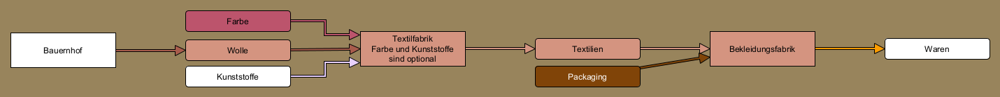
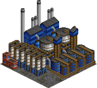

# GermanIndustries Dokumentation

## Konzepte

### Wirtschaftseinstellungen

Die Wirtschaft ist per default stabil. Keine Industrie wird einfach so schließen (abgesehen von extraktiven Industrien, denen das Material zum Fördern ausgeht), aber neue Industrien werden zufällig erzeugt.
Dies kann mittels Parametern beeinflusst werden.

Selbst wenn das Schließen von Industrien erlaubt ist, wird keine Industrie schließen, die aktiv produziert (sie hat Vorräte und es wurde in der jüngsten Vergangenheit etwas produziert).
Nur Industrien, die 12 Monate lang nichts produziert haben und denen die Vorräte ausgegangen sind haben ein kleines Risiko zu schließen.

Unabhängig davon kann man ein realistisches Wirtschaftsmodell per Parameter aktivieren. Das beeinflusst nur die maximale Produktion von Industrien. Historisch betrachtet erreichte z.B. die Kohleförderung
in Deutschland ihren Höchststand bereits in den 1950er Jahren und nahm seitdem ab. Dies ist im Set für extraktive Industrien nachgebildet. Sekundäre Industrien werden nicht beeinflusst, ihre Produktion
hängt nur von der Menge der angelieferten Vorräte ab.

Einige Industrien sind nur innerhalb einer bestimmten Zeit verfügbar. Bergwerke werden zum Beispiel erst ab 1800 errichtet, was der Tatsache Rechnung trägt dass erst die Entwicklung der Dampfmaschine ein konstantes
Abpumpen des Grundwassers und damit tiefere Bergwerksschächte erlaubte.
Bestimmte chemische Industrien sind erst ab Mitte des 19. Jahrhunderts verfügbar, und die Autoproduktion startet 1910. Einige Industrien wurden mit der Zeit aufgegeben, so zum Beispiel im Bergbau.
Das heißt ab bestimmten Spieljahren werden keine neuen Industrien dieser Typen angelegt.

### Elektrizität

Wenn der entsprechende Parameter aktiviert ist benötigen einige Industrien elektrischen Strom für ihre Produktion. Dieser wird von Kraftwerken "produziert".
Strom ist allerdings keine Fracht, die transportiert werden müsste, sondern wird automatisch verteilt.

Jede Industrie gehört zu genau einer Stadt, ebenso die Kraftwerke. Der von einem Kraftwerk produzierte Strom wird über die Stadt verteilt und kann von jeder Industrie dieser Stadt benutzt werden.
Der Strombedarf hängt dabei von der Größe der Stadt (je größer die Stadt, desto mehr Grundbedarf) und der Produktionsmenge der Industrien ab.
Wenn das Kraftwerk genug Strom liefert ist alles prima. Wenn nicht, werden die betroffenen Industrien die Produktion reduziern oder - im schlimmsten Fall - ganz stoppen.
Die notwendigen Informationen dazu werden im Industriefenster angezeigt.

Das Kraftwerk zeigt den aktuellen Bedarf und die Produktion. Der Bedarf ist dabei - wie oben erklärt - die Summe des Grundbedarfs der Stadt und der Ansprüche der Industrien der Stadt.

Diese drei Bilder zeigen die gleiche Industrie in verschiedenen Situationen - kein Strom verfügbar, etwas Strom verfügbar (aber nicht genug für die theoretisch mögliche Produktion) und genug Strom verfügbar.

### Modularität

Das Set ist modular angelegt.
Die grundlegende Industriekette ist relativ simpel und vergleichbar mit den Industrien im Basisspiel.
Allerdings kann man nun zusätzliche Erweiterungen per Parameter aktivieren.
Diese Erweiterungen fügen weitere Industrien und Frachten hin und modifizieren existierende Industrien.
Somit kann sich jeder Spieler das Set nach seinen Vorlieben konfigurieren.
Der eine möchte vielleicht auf einer kleinen Karte mit wenigen Industrien spielen, der nächste will auf einer großen Karte viele verschiedene Industrien, und wiedere andere möchten sich vielleicht auf bestimmte
Industriezweige konzentrieren.
Die meisten Erweiterungen können unabhängig voneinander aktiviert werden.

### Produktionsmengen

Primärindustrien (diejenigen, die keine Rohmaterialien benötigen, also Minen, Farmen, Ölquellen usw.) erhöhen ihre Produktion wenn man genügend produzierte Fracht abtransportiert.
Mit der Zeit wird die Produktion steigen oder sinken und sich so den Transportkapazitäten anpassen.

Industrien, die von angelieferten Rohmaterialien abhängen (siehe [Vorräte](#stockpiling) benutzen bei jedem Produktionsschritt (rund acht Mal im Monat mit den Standardeinstellungen) 10% ihres Vorrates für die Produktion.
Wenn also 100t Material vorrätig sind, wird der nächste Produktionsschritt 10t verbrauchen und somit 90t übrig lassen. Der Schritt danach verbraucht 9t, so dass 81t verbleiben.
Das wiederholt sich, bis die Vorräte erschöpft sind.

Die Produktionsmenge hängt nun von der Menge der eingesetzten Rohmaterialien und von der Art der Industrie ab. Jeder Industrietyp hat einen festen Wert für das Verhältnis zwischen einsetzten Materialien und der resultierenden
Menge an Produkten.
Eine gewisse Menge Abfall ist nun mal bei den meisten Produktionsschritten unvermeidlich.

Darüber hinaus kann die Produktionsmenge auch davon abhängen, wie viele verschiedene Rohmaterialien vorhanden sind. Die Nahrungsmittelfabrik z.B. verarbeitet Getreide, Vieh und Fisch, aber man braucht nicht alle drei
transportieren - die Produktion beginnt, sobald eine dieser Frachten vorrätig ist. Allerdings reduziert sich dabei die Produktmenge. Wenn man hingegen alle drei Frachten vorrätig hat, erhöht sich die Produktion von Nahrung drastisch.

Jede Industrie enthält die notwendigen Informationen im Infofenster.

Diese Industrie hängt von mehreren Rohmaterialien ab, beginnt die Produktion aber, sobald eins dieser Materialien vorrätig ist.

Diese Industrie hat optionale Abhängigkeiten. Die in schwarz dargestellten Rohstoffe müssen vorhanden sein, damit produziert werden kann, allerdings ist die Produktionsmenge limitiert, solange die optionalen
Rohstoffe nicht verfügbar sind.

Diese Industrie hat optionale Rohstoffe, beginnt aber mit der Produktion sobald einer der zwingend notwendigen Rohstoffe verfügbar ist.
Die Produktionsmenge erhöht sich hier mit der Anzahl der verschiedenen verfügbaren Rohstoffe.

### Erschöpfte Rohstoffe

Extraktive Industrien wie Bergwerke und Ölquellen werden mit einer zufälligen Menge an Rohstoffen generiert, die sie dann abbauen. Im Lauf der Zeit wird also dieser Vorrat immer geringer. Sobald keine Ressourcen
zum Abbauen mehr vorhanden sind wird die Industrie schließen. Das Industriefenster zeigt an, wie viel Rohstoffe noch gefördert werden können und wie lange das voraussichtlich noch dauern wird.

Das Bild zeigt, wie die relevanten Infos dargestellt werden. Damit sollte der Spieler ausreichend Vorwarnzeit zum Planen haben.

### Vorratshaltung

Die meisten Industrien verarbeiten Rohstoffe zu neuen Produkten. Je nach Industrie werden dabei verschiedene Arten von Abhängigkeiten modelliert.
Im einfachsten Fall benötigt die Industrie alle Rohstoffe, um irgendetwas produzieren zu können. Das einfachste Stahlwerk z.B. benötigt Kohle und Eisenerz. Wenn man nur Eisenerz anliefert wird es zwar bevorrated,
aber nichts produziert, solange Kohle fehlt.

Einige Industrien haben optionale Rohstoffe. Diese sind in der Liste in weiß dargestellt. Sie werden nicht zur Produktion benötigt, vergrößern aber die produzierten Mengen.

Die Vorräte können maximal 65.535 Einheiten speichern, das ist eine Limitierung des Spiels. Wenn man dieses Limit erreicht passiert aber nicht viel, die nächste Lieferung wird einfach für die Vorratshaltung ignoriert
(man erhält aber das Geld für die Lieferung). Da die Produktion mit der Menge der Vorräte skaliert sollte es schwierig sein, an diese Limitierungen zu stoßen, wenn man es nicht gerade darauf anlegt, weil man nicht alle notwendigen Rohstoffe bereitstellt.

## Parameter

Das Set enthält eine Reihe von Parametern, mit denen man das Verhalten beeinflussen kann:

 Die Produktionsmenge von extraktiven Industrien (Bergwerke, Ölquellen, ...) kann skaliert werden. Je nach verwendeten Fahrzeugen kann eine mehr oder wenige hohe Produktion sinnvoll sein.
- Das Wirtschaftsmodell (stabil oder realistisch). Das beeinflusst die Produktionsmengen der extraktiven Industrien, da z.B. im Bergbau die maximalen Fördermengen bereits in den 1950er Jahren erreicht wurden.
Mit dem realistischen Modell werden die Produktionsmengen danach abnehmen, egal wie gut man die Industrie bedient.
- Man kann festlegen, ob bestimmte Industrien elektrischen Strom benötigen (siehe [Elektrizität](#electricity).
- Verbieten der Industriegenerierung. Wenn das aktiviert ist werden nach dem Spielstart keine neuen Industrien mehr generiert. Der Spieler kann Industrien weiterhin finanzieren.
- Verbieten von Industrieschließungen. Wenn es aktiviert ist, werden Industrien niemals schließen. Ansonsten laufen Industrien, die 12 Monate lang nichts produziert haben Gefahr zu schließen.
- Erweiterungen an/abschalten. Jede Erweiterung fügt weitere Frachten und Industrien hinzu und verändert die Industrieketten. Siehe [Erweiterungen](#extensions) für eine detaillierte Auflistung.

## Die grundlegende Industriekette

Das Set enthält einige grundlegende Industrien und Frachten. Diese sind im Folgenden aufgelistet:

[Eisenerz](#cargo_IORE) [Fahrzeuge](#cargo_VEHI) [Fisch](#cargo_FISH) [Getreide](#cargo_GRAI) [Holz](#cargo_WOOD) [Kohle](#cargo_COAL) [Kunststoffe](#cargo_PLAS) [Nahrungsmittel](#cargo_FOOD) [Passagiere](#cargo_PASS) [Post](#cargo_MAIL) [Sand](#cargo_SAND) [Schnittholz](#cargo_WDPR) [Stahl](#cargo_STEL) [Vieh](#cargo_LVST) [Waren](#cargo_GOOD) [Öl](#cargo_OIL_) 

[Autofabrik](#industry_3) [Autohaus](#industry_7) [Bauernhof](#industry_9) [Bauhof](#industry_11) [Eisenerzbergwerk](#industry_14) [Fischgründe](#industry_17) [Hafen](#industry_18) [Hotel](#industry_22) [Integriertes Stahlwerk](#industry_23) [Kaufhaus](#industry_25) [Kohlebergwerk](#industry_26) [Kraftwerk](#industry_27) [Kunststofffabrik](#industry_28) [Laden](#industry_34) [Möbelfabrik](#industry_36) [Nahrungsmittelfabrik](#industry_37) [Sägewerk](#industry_42) [Wald](#industry_45) [Ölbohrinsel](#industry_48) [Ölquellen](#industry_49) 

Wenn eine Industriebox hier ein Jahr enthält, so ist es das erste Jahr in dem diese Industrie generiert/finanziert werden kann. Wenn die Box zwei Jahreszahlen enthält so sind es Start und Ende des Zeitrahmens, in dem die Industrie verfügbar ist.

Die Farben der Pfeile entsprechen den Farben, die im Wirtschaftsketten-Fenster im Spiel verwendet werden (mit Ausnahme von Elektrizität, die ja keine zu transportierende Fracht ist, siehe [Elektrizität](#electricity)).
Solange nicht anders angegeben, benötigen die Industrien alle angegeben Frachten, um irgendwas produzieren zu können.

## Erweiterungen

Dieses Bild zeigt die Interaktionen zwischen den unterschiedlichen Erweiterungen. Jede Erweiterung benutzt eine andere Farbe. Wenn die Erweiterung nicht aktiviert ist, kann man alle damit verbundenen Pfeile ignorieren.
Eine Fracht in einer farbigen Box ist Teil der Erweiterung der gleichen Farbe, wenn die Erweiterung also nicht aktiv ist, ist auch die Fracht nicht aktiv.
Für jede Erwtierung gibt es ein zusätzliches Diagramm, welches die Verbindungen zwischen den Frachten und Industrien detailliert zeigt.

Das Set enthält 5 Erweiterungen, die nachfolgend aufgelistet sind.

### Aluminium

Aluminium ist ein Leichtmetall, welches 1825 entdeckt wurde. Am Ende des 19. Jahrhunderts begann die Massenproduktion, und im Verlauf des 20. Jahrhunderts wurde es das wichtigste Nichteisen-Metall für industrielle Zwecke. Es ist leichter als Stahl, ein exzellenter Leiter und kann relativ einfach geformt und bearbeitet werden. Ohne Aluminium ist die Luftfahrt praktisch undenkbar. Aus ähnlichen Gründen wird Aluminium im Automobilbau eingesetzt, und quasi jeder kennt Alufolie und Getränkedosen. Die Herstellung von Aluminium konzentriert sich auf Südostasien und Australien, Norwegen ist der größte Produzent in Europa. 

Farbe in Industriediagrammen auf dieser Seite:&nbsp;&nbsp;&nbsp;&nbsp;&nbsp;&nbsp;

#### Frachten

* [Aluminium](#cargo_ALUM)
* [Bauxit](#cargo_AORE)

### Neue Industrien

* [Aluhütte](#industry_0)
* [Aluhütte](#industry_1)

#### Modifizierte Industrien

* [Aluhütte](#industry_0)
* [Aluhütte](#industry_1)
* [Autofabrik](#industry_4)
* [Autofabrik](#industry_6)
* [Hafen](#industry_19)
* [Hafen](#industry_21)

### Bauindustrie

Die Kunst des Bauens von steineren Wänden und Gebäuden ist eine der ältesten kulturellen Errungenschaften der Menschheit. Aus den Anfängen mit gebrannten Lehmziegeln entstand über Jahrhunderte ein eigener Industriezweig. Im 19. Jahrhundert wurde die industrielle Produktion von Ziegeln notwendig, aus denen man Fabrikhallen baute. Große Steinbrücken wie die Göltzschtalbrücke in Sachsen, die größte Ziegelsteinbrücke der Welt, zeigen eindrucksvoll wie wichtig diese Industriezweige waren. Die Ziegel wurden schließlich weitestgehend durch Zement und Beton verdrängt, was den Bau moderner Wolkenkratzer erst möglich macht. 

Farbe in Industriediagrammen auf dieser Seite:&nbsp;&nbsp;&nbsp;&nbsp;&nbsp;&nbsp;

#### Frachten

* [Kalkstein](#cargo_LIME)
* [Zement](#cargo_CMNT)
* [Ziegel](#cargo_BDMT)

### Neue Industrien

* [Kalksteinbergwerk](#industry_24)
* [Sandgrube](#industry_41)
* [Zementfabrik](#industry_46)
* [Ziegelei](#industry_47)

#### Modifizierte Industrien

* [Bauhof](#industry_10)
* [Farbenfabrik](#industry_16)
* [Kalksteinbergwerk](#industry_24)
* [Sandgrube](#industry_41)
* [Zementfabrik](#industry_46)
* [Ziegelei](#industry_47)

### Farbindustrie

Über tausende Jahre wurden Farben und Pigmente wie Indigo aus Pflanzen und diversen Pulvern hergestellt, was sie für industrielle Anwendungen schlicht zu teuer machte. Die Produktion künstlicher Farbmittel war eine der ersten wichtigen Anwendungen der noch jungen chemischen Industrie. Einige der wichtigsten chemischen Konzerne Deutschlands gehen auf Farbfabriken zurück, wie Agfa oder BASF (beide führen Teile des Namens auf Anilin zurück, eine Chemikalie, die in der Produktion von Farben eine bedeutende Rolle spielt). 1925 schlossen sich die größten Chemiekonzerne Deutschlands zur IG Farbengesellschaft zusammen und formten so die weltgrößte Chemiefirma. Selbst heute noch sind Farben, Pigmente und Färbemittel wichtige Produkte der Chemieindustrie und haben ein weites Feld von Anwendungen in der Textilindustrie, in der Kunststoffherstellung, im Bauwesen und nicht zuletzt im Automobilsektor. 

Farbe in Industriediagrammen auf dieser Seite:&nbsp;&nbsp;&nbsp;&nbsp;&nbsp;&nbsp;

#### Frachten

* [Farbe](#cargo_COAT)
* [Kupfer](#cargo_COPR)
* [Kupfererz](#cargo_CORE)
* [Ruß](#cargo_CBLK)

### Neue Industrien

* [Farbenfabrik](#industry_15)
* [Farbenfabrik](#industry_16)
* [Kupfererzbergwerk](#industry_32)
* [Kupferhütte](#industry_33)
* [Rußfabrik](#industry_39)

#### Modifizierte Industrien

* [Autofabrik](#industry_5)
* [Autofabrik](#industry_6)
* [Farbenfabrik](#industry_15)
* [Farbenfabrik](#industry_16)
* [Hafen](#industry_20)
* [Hafen](#industry_21)
* [Kunststofffabrik](#industry_30)
* [Kunststofffabrik](#industry_31)
* [Kupfererzbergwerk](#industry_32)
* [Kupferhütte](#industry_33)
* [Rußfabrik](#industry_39)
* [Textilfabrik](#industry_44)

### Grundlegende Anorganische Chemie

Anorganische Chemie beschäftigt sich mit chemischen Verbindungen, die nicht auf Kohlenstoff basieren. Dazu zählen zahllose Minerale, Säuren, Laugen und natürlich Metalle. Mit dem Fortschritt in der chemischen Forschung und der Entdeckung immer neuer Anwendungen wurden diese Stoffe immer wichtiger. Lange Zeit waren die Produktionsmengen von Schwefelsäure und Chlor wichtige Indikatoren für Aussagen über die Industrialisierung eines Landes. Die Erweiterung führt eine Reihe von grundlegenden Chemikalien und die zugehörigen Industrien ein, die wiederum eine Voraussetzung für andere Erweiterungen sind. 

Farbe in Industriediagrammen auf dieser Seite:&nbsp;&nbsp;&nbsp;&nbsp;&nbsp;&nbsp;

#### Frachten

* [Chlor](#cargo_CHLO)
* [Natronlauge](#cargo_LYE_)
* [Salz](#cargo_SALT)
* [Wasserstoff](#cargo_H2__)

### Neue Industrien

* [Arzneimittelfabrik](#industry_2)
* [Chloralkali Elektrolyseanlage](#industry_13)
* [Salzbergwerk](#industry_40)

#### Modifizierte Industrien

* [Aluhütte](#industry_1)
* [Arzneimittelfabrik](#industry_2)
* [Chloralkali Elektrolyseanlage](#industry_13)
* [Kunststofffabrik](#industry_29)
* [Kunststofffabrik](#industry_31)
* [Nahrungsmittelfabrik](#industry_38)
* [Salzbergwerk](#industry_40)

### Textilindustrie

Die Produktion von Garnen und Stoffen zur Herstellung von Kleidung war eine der ersten Kulturleistungen der Menscheit. Rohstoffe für die Produktion umfassen Wolle von Schafen und anderen Tieren als auch verschiedenste Pflanzenfasern wie Baumwolle. Innovationen der chemischen Industrie im 20. Jahrhundert brachten zusätzlich Kunstfasern wie polyester hervor. 

Die Herstellung von Stoffen war ein arbeitsintensiver Prozess und gehörte zu den ersten Bereichen, die von der Industrialisierung im 18. Jahrhundert erfasst wurden. Deutschland hatte eine große Textilindustrie in Sachsen und Schlesien, die wiederum von der Industrialisierung profitierte. Chemnitz wurde so zum Zentrum des Maschinenbaus mit einem Fokus auf die Herstellung von Textilmaschinen. Allerdings schrumpft die Industrie seit der Mitte des 20. Jahrhunderts, und heutzutage ist der Großteil der Produktion aus Kostengründen nach Asien abgewandert. 

Farbe in Industriediagrammen auf dieser Seite:&nbsp;&nbsp;&nbsp;&nbsp;&nbsp;&nbsp;

#### Frachten

* [Textilien](#cargo_TEXT)
* [Wolle](#cargo_WOOL)

### Neue Industrien

* [Bekleidungsfabrik](#industry_12)
* [Textilfabrik](#industry_43)
* [Textilfabrik](#industry_44)

#### Modifizierte Industrien

* [Bauernhof](#industry_8)
* [Bekleidungsfabrik](#industry_12)
* [Möbelfabrik](#industry_35)
* [Textilfabrik](#industry_43)
* [Textilfabrik](#industry_44)

## Cargos

Das Set enthält 31 Frachten, die nachfolgend aufgelistet sind.

### Aluminium

Aluminium ist ein Leichtmetall, was praktisch überall dort zum Einsatz kommt, wo Stahl zu schwer ist. Man benötigt es zum Bau von Flugzeugen und Autos, aber auch für Haushaltsgegenstände wie Alufolie und Getränkedosen. Allerdings ist die Herstellung von reinem Aluminium ein relativ komplizierter und äußerst energieintensiver Prozess. Die Massenproduktion begann entsprechend erst im späten 19. Jahrhundert. Deutschland ist heute einer der größten Produzenten in Europa (und der größte Verbraucher), obwohl die Energiekosten vergleichsweise hoch liegen. 

Eintrag in der Frachttabelle: ALUM

Teil der Erweiterung: [Aluminium](#extension_0)

Frachtklassen: Stückgut

Farbe in der Wirtschaftsketten-Übersicht:&nbsp;&nbsp;&nbsp;&nbsp;&nbsp;&nbsp;

| Produziert von | Benötigt von |
| -- | -- |
| [Aluhütte](#industry_0) | [Autofabrik](#industry_4) |
| [Aluhütte](#industry_1) | [Autofabrik](#industry_6) |

### Bauxit

Bauxit ist ein Erz aus welchem Aluminium hergestellt wird. Deutschland hat keine eigenen Bauxitlagerstätten und ist daher von Importen abhängig. 

Eintrag in der Frachttabelle: AORE

Teil der Erweiterung: [Aluminium](#extension_0)

Frachtklassen: Schüttgut

Farbe in der Wirtschaftsketten-Übersicht:&nbsp;&nbsp;&nbsp;&nbsp;&nbsp;&nbsp;

| Produziert von | Benötigt von |
| -- | -- |
| [Hafen](#industry_19) | [Aluhütte](#industry_0) |
| [Hafen](#industry_21) | [Aluhütte](#industry_1) |

### Chlor

Chlor ist ein sehr reaktionsfreudiges chemisches Element, welches eine große Rolle in der Papierindustrie oder als Desinfektionsmittel spielt. Darüber hinaus wird es für zahllose Prozesse in der chemischen Industrie benötigt, hauptsächlich bei der Produktion von verschiedensten Kunststoffen wie PVC. In höheren Konzentrationen ist Chlor äußerst giftig und wurde in der Vergangenheit auch im Rahmen chemischer Kriegführung eingesetzt. Seit dem frühen 20. Jahrhundert wird Chlor hauptsächlich durch das Spalten von Salzlösungen durch Elektrolyse im sogenannten Chlor-Alkali-Prozess hergestellt. 

Eintrag in der Frachttabelle: CHLO

Teil der Erweiterung: [Grundlegende Anorganische Chemie](#extension_3)

Frachtklassen: Flüssiggut, Gefahrgut

Farbe in der Wirtschaftsketten-Übersicht:&nbsp;&nbsp;&nbsp;&nbsp;&nbsp;&nbsp;

| Produziert von | Benötigt von |
| -- | -- |
| [Chloralkali Elektrolyseanlage](#industry_13) | [Arzneimittelfabrik](#industry_2) |
|  | [Kunststofffabrik](#industry_29) |
|  | [Kunststofffabrik](#industry_31) |

### Eisenerz

Die Menschheit nutzt Eisen seit der, tja, Eisenzeit vor etwa 3000 Jahren. Heutzutage wird Eisenerz quasi ausschließlich zur Produktion von Stahl genutzt, der wiederum eines der wichtigsten Materialien in der Weltwirtschaft darstellt. 

Deutschland hatte niemals große Vorkommen von Eisenerz und war immer auf Importe zum Beispiel aus Schweden angewiesen. 

Eintrag in der Frachttabelle: IORE

Frachtklassen: Schüttgut

Farbe in der Wirtschaftsketten-Übersicht:&nbsp;&nbsp;&nbsp;&nbsp;&nbsp;&nbsp;

| Produziert von | Benötigt von |
| -- | -- |
| [Eisenerzbergwerk](#industry_14) | [Farbenfabrik](#industry_15) |
| [Hafen](#industry_18) | [Farbenfabrik](#industry_16) |
| [Hafen](#industry_19) | [Integriertes Stahlwerk](#industry_23) |
| [Hafen](#industry_20) |  |
| [Hafen](#industry_21) |  |

### Fahrzeuge

Im weitesten Sinne sind Fahrzeuge selbstfahrende Landfahrzeuge zum Transport von Menschen und Gütern. In erster Linie sind damit natürlich Autos gemeint. 

Diese werden in Automobilfabriken gebaut und müssen nun in die Städte und zu den Exporthäfen transportiert werden. Autos sind eines der wichtigsten Exportgüter der deutschen Wirtschaft. Aus Sicht des Transports sind sie auch ein spezieller Fall, denn man braucht dafür besondere Eisenbahnwagen oder Lastwagen. 

Eintrag in der Frachttabelle: VEHI

Frachtklassen: Stückgut, Übergröße

Farbe in der Wirtschaftsketten-Übersicht:&nbsp;&nbsp;&nbsp;&nbsp;&nbsp;&nbsp;

| Produziert von | Benötigt von |
| -- | -- |
| [Autofabrik](#industry_3) | [Autohaus](#industry_7) |
| [Autofabrik](#industry_4) | [Hafen](#industry_18) |
| [Autofabrik](#industry_5) | [Hafen](#industry_19) |
| [Autofabrik](#industry_6) | [Hafen](#industry_20) |
|  | [Hafen](#industry_21) |

### Farbe

Farben sind so alt wie die Menschheit und wurden schon vor zehntausenden Jahren für Höhlenmalereien benutzt. Zahlreiche verschieden Farben sind seit dem Altertum bekannt. Oftmals waren diese aber sehr teuer, da sie aufwändig aus seltenen Pflanzen gewonnen wurden. Die chemische Industrie hat zahllose künstliche Verbindungen entwickelt, aus denen sich Farben und Färbemittel herstellen lassen, die wiederum vielfältige Anwendungen haben. So werden Farben und Lacke im Automobilbau verwendet, während Färbemittel eine große Rolle in der Textilindustrie spielen, um nur einige zu nennen. Farben werden auch im Haushalt eingesetzt, zum Beispiel zum Streichen der Wände, und Tinte zum Schreiben ist ebenfalls ein Produkt der Farbenindustrie. 

Eintrag in der Frachttabelle: COAT

Teil der Erweiterung: [Farbindustrie](#extension_2)

Frachtklassen: Flüssiggut, Stückgut

Farbe in der Wirtschaftsketten-Übersicht:&nbsp;&nbsp;&nbsp;&nbsp;&nbsp;&nbsp;

| Produziert von | Benötigt von |
| -- | -- |
| [Farbenfabrik](#industry_15) | [Autofabrik](#industry_5) |
| [Farbenfabrik](#industry_16) | [Autofabrik](#industry_6) |
|  | [Kunststofffabrik](#industry_30) |
|  | [Kunststofffabrik](#industry_31) |
|  | [Textilfabrik](#industry_44) |

### Fisch

Menschen haben schon seit jeher Fische gefangen. Im Spiel stellt es den Spieler vor interessante Transportaufgaben, da der Fisch im Hafen umgeladen werden muss. 

Eintrag in der Frachttabelle: FISH

Frachtklassen: Expressgut, Kühlfracht

Farbe in der Wirtschaftsketten-Übersicht:&nbsp;&nbsp;&nbsp;&nbsp;&nbsp;&nbsp;

| Produziert von | Benötigt von |
| -- | -- |
| [Fischgründe](#industry_17) | [Nahrungsmittelfabrik](#industry_37) |
|  | [Nahrungsmittelfabrik](#industry_38) |

### Getreide

Deutschland ist bekannt für seine Vielfalt in Sachen Brot und Bier, und für beides braucht man Getreide. Deutschland ist einer der größten Getreideproduzenten Europas und kann den Bedarf vollständig selbst decken. Ein Großteil des Getreides wird als Tierfutter genutzt, nur ein Fünftel wird für in der Lebensmittelindustrie genutzt, und etwa 10% werden zum Bierbrauen gebraucht. Darüber hinaus wird viel Getreide, insbesondere Weizen, exportiert. 

Eintrag in der Frachttabelle: GRAI

Frachtklassen: Schüttgut

Farbe in der Wirtschaftsketten-Übersicht:&nbsp;&nbsp;&nbsp;&nbsp;&nbsp;&nbsp;

| Produziert von | Benötigt von |
| -- | -- |
| [Bauernhof](#industry_8) | [Nahrungsmittelfabrik](#industry_37) |
| [Bauernhof](#industry_9) | [Nahrungsmittelfabrik](#industry_38) |

### Holz

Holz wurde bereits von den ersten Menschen verwendet um Speere für die Jagd zu schnitzen oder um Feuer zu machen. Danach folgten Holzhütten, Schiffe, und irgendwann entwickelte man Papier aus Holzfasern. Heute ist Holz nach wie vor ein wichtiger Rohstoff und wird im 21. Jahrhundert wieder bedeutender, da es nachwächst. 

Deutschland ist reich an Wäldern, daher war Holz immer wirtschaftlich relevant. Heute ist Deutschland der größte Papierproduzent in Europa und hat auch eine bedeutsame Möbelindustrie 

Eintrag in der Frachttabelle: WOOD

Frachtklassen: Stückgut

Farbe in der Wirtschaftsketten-Übersicht:&nbsp;&nbsp;&nbsp;&nbsp;&nbsp;&nbsp;

| Produziert von | Benötigt von |
| -- | -- |
| [Wald](#industry_45) | [Sägewerk](#industry_42) |

### Kalkstein

Kalkstein besteht in erster Linie aus Kalkverbindungen. Er wird zur Herstellung von Zement benötigt, kann aber auch direkt als Baumaterial benutzt werden. Darüber hinaus ist Kalkstein ein wichtiger Rohstoff in der Chemieindustrie und wichtig in der Produktion von Stahl und Glas. 

Eintrag in der Frachttabelle: LIME

Teil der Erweiterung: [Bauindustrie](#extension_1)

Frachtklassen: Schüttgut

Farbe in der Wirtschaftsketten-Übersicht:&nbsp;&nbsp;&nbsp;&nbsp;&nbsp;&nbsp;

| Produziert von | Benötigt von |
| -- | -- |
| [Kalksteinbergwerk](#industry_24) | [Farbenfabrik](#industry_16) |
|  | [Zementfabrik](#industry_46) |

### Kohle

Kohle war der wichtigste Faktor der industriellen Revolution des 19. Jahrhunderts, da es für den Antrieb von Dampfmaschinen gebraucht wird. Mit der Entwicklung von Eisenbahnen und Dampfschiffen und später Kraftwerken stieg der Bedarf an Kohle immer weiter. 

Deutschland hatte in mehreren Gebieten große Kohlevorkommen, diese Gebiete wie eben das Ruhrgebiet oder Schlesien wurden in der Folge Zentren der Industrialisierung. Kohle blieb während des gesamten 20. Jahrhunderts wichtig, wurde aber aus Gründen des Umweltschutzes nach und nach aus verschiedenen Bereichen verdrängt. 

Eintrag in der Frachttabelle: COAL

Frachtklassen: Schüttgut

Farbe in der Wirtschaftsketten-Übersicht:&nbsp;&nbsp;&nbsp;&nbsp;&nbsp;&nbsp;

| Produziert von | Benötigt von |
| -- | -- |
| [Hafen](#industry_18) | [Integriertes Stahlwerk](#industry_23) |
| [Hafen](#industry_19) | [Kraftwerk](#industry_27) |
| [Hafen](#industry_20) | [Rußfabrik](#industry_39) |
| [Hafen](#industry_21) | [Ziegelei](#industry_47) |
| [Kohlebergwerk](#industry_26) |  |

### Kunststoffe

Kunststoffe umfassen eine ganze Reihe von synthetischen Materialien, die hauptsächlich aus Öl hergestellt werden. Sie wurden im frühen 20. Jahrhundert entwickelt und boten billige, leichte und haltbare Materialien für quasi jeden vorstellbaren Zweck. Der Großteil wird für Verpackungen benutzt, es gibt aber auch Verwendungen im Bauwesen (Rohrleitungen), in allen Arten von technischen Geräten wie Staubsaugern, aber auch im Möbelbau und als Spielzeug - als Legobaustein zum Beispiel. 

Im Set umfassen Kunststoffe nicht nur synthetische Materialien mit den namensgebenden plastischen Eigenschaften, sondern auch Kunstfasern wie Nylon und Polyester, die in der Textilindustrie relevant sind. 

Eintrag in der Frachttabelle: PLAS

Frachtklassen: Nässeempfindlich, Schüttgut

Farbe in der Wirtschaftsketten-Übersicht:&nbsp;&nbsp;&nbsp;&nbsp;&nbsp;&nbsp;

| Produziert von | Benötigt von |
| -- | -- |
| [Kunststofffabrik](#industry_28) | [Autofabrik](#industry_3) |
| [Kunststofffabrik](#industry_29) | [Autofabrik](#industry_4) |
| [Kunststofffabrik](#industry_30) | [Autofabrik](#industry_5) |
| [Kunststofffabrik](#industry_31) | [Autofabrik](#industry_6) |
|  | [Möbelfabrik](#industry_35) |
|  | [Möbelfabrik](#industry_36) |
|  | [Textilfabrik](#industry_43) |
|  | [Textilfabrik](#industry_44) |

### Kupfer

Kupfer ist ein Metall, welches seit dem Altertum bekannt ist und zu den ersten von Menschen verwendeten Metallen gehört. Es ist leicht zu verarbeiten und hat zahlreiche Anwendungen. Heutzutage wird es hauptsächlich für Kabel und Drähte und alle Arten von elektrischen Bauteilen benutzt. In der Vergangenheit wurde es auch zur Herstellung von Farben und als Material für Dächer benutzt. 

Eintrag in der Frachttabelle: COPR

Teil der Erweiterung: [Farbindustrie](#extension_2)

Frachtklassen: Stückgut

Farbe in der Wirtschaftsketten-Übersicht:&nbsp;&nbsp;&nbsp;&nbsp;&nbsp;&nbsp;

| Produziert von | Benötigt von |
| -- | -- |
| [Kupferhütte](#industry_33) | [Farbenfabrik](#industry_15) |
|  | [Farbenfabrik](#industry_16) |

### Kupfererz

Kupfererze kommen in verschiedenen Formen vor, die sich unterschiedlich gut zur Herstellung von Kupfer eignen. Der Abbau von Kupfererzen kann tausende von Jahren bis in die sogenannte Kupferzeit zurückverfolgt werden. Heutzutage ist Kupfererz von ein wichtiger Rohstoff, da Kupfer eines der wichtigsten Metalle für industrielle Zwecke ist. 

Deutschland hat keine bedeutsamen Vorkommen von Kupfererzen, allerdings wurden diese noch bis ins späte 20. Jahrhundert vorwiegend in Ostdeutschland abgebaut, weil man dort keinen Zugang zum Weltmarkt hatte. Allerdings hat Deutschland heute große Kapazitäten zur Produktion von Kupfer und ist ein großer Importeur von entsprechenden Erzen. 

Eintrag in der Frachttabelle: CORE

Teil der Erweiterung: [Farbindustrie](#extension_2)

Frachtklassen: Schüttgut

Farbe in der Wirtschaftsketten-Übersicht:&nbsp;&nbsp;&nbsp;&nbsp;&nbsp;&nbsp;

| Produziert von | Benötigt von |
| -- | -- |
| [Hafen](#industry_20) | [Kupferhütte](#industry_33) |
| [Hafen](#industry_21) |  |
| [Kupfererzbergwerk](#industry_32) |  |

### Nahrungsmittel

Jeder muss essen, und seitdem Menschen in Städten leben gab den Bedarf, Lebensmittel in die Städte zu transportieren. Selbst heute noch kann man frisches Obst und Gemüse auf dem Wochenmarkt kaufen, während der Großteil der industriell produzierten Lebensmittel von den Fabriken zu Supermärkten transportiert wird. 

Eintrag in der Frachttabelle: FOOD

Frachtklassen: Expressgut, Kühlfracht

Farbe in der Wirtschaftsketten-Übersicht:&nbsp;&nbsp;&nbsp;&nbsp;&nbsp;&nbsp;

| Produziert von | Benötigt von |
| -- | -- |
| [Nahrungsmittelfabrik](#industry_37) | [Hotel](#industry_22) |
| [Nahrungsmittelfabrik](#industry_38) | [Laden](#industry_34) |

### Natronlauge

Natronlauge ist eine basische Lösung. Sie hat eine große Bedeutung in der Produktion von Waschmitteln und Seifen, aber auch in der Lebensmittelindustrie und in anderen Bereichen. Ein Großteil der Natronlauge wird in der Papierherstellung benötigt, darüber hinaus findet es Anwendung in der Produktion von Färbemitteln und Bleichmachern. Natronlauge wird zusammen mit Chlor aus der elektrolytischen Spaltung von Salzlösungen im sogenannten Chlor-Alkali-Prozess gewonnen. 

Eintrag in der Frachttabelle: LYE_

Teil der Erweiterung: [Grundlegende Anorganische Chemie](#extension_3)

Frachtklassen: Flüssiggut, Gefahrgut

Farbe in der Wirtschaftsketten-Übersicht:&nbsp;&nbsp;&nbsp;&nbsp;&nbsp;&nbsp;

| Produziert von | Benötigt von |
| -- | -- |
| [Chloralkali Elektrolyseanlage](#industry_13) | [Aluhütte](#industry_1) |
|  | [Nahrungsmittelfabrik](#industry_38) |

### Passagiere

Ob es nun Urlaub oder Dienstreise ist - Menschen müssen und wollen verreisen. Jahrhundertelang hieß Reisen Laufen oder Reiten, technische Innovationen beschleunigten das Reisen jedoch erheblich. Man baute Häfen, Straßen und später Eisenbahnen und schließlich Flughäfen. Das Reisen wurde nicht nur schneller, sondern auch preiswerter - und heutzutage sind Reisen möglich, die vor noch gar nicht langer Zeit völlig undenkbar waren. 

Eintrag in der Frachttabelle: PASS

Frachtklassen: Passagiere

Farbe in der Wirtschaftsketten-Übersicht:&nbsp;&nbsp;&nbsp;&nbsp;&nbsp;&nbsp;

| Produziert von | Benötigt von |
| -- | -- |
| [Hotel](#industry_22) | [Hotel](#industry_22) |
| [Ölbohrinsel](#industry_48) | [Ölbohrinsel](#industry_48) |

### Post

Der Transport von Post war schon immer eine wichtige Aufgabe eines jeden Verkehrsnetzes. Jahrhunderte lang waren Postkutschen im Einsatz, bevor sie von Eisenbahnen und Lastwagen verdrängt wurden. Während die Anzahl der transportierten Briefe und Postkarten im 21. Jahrhundert zurückgeht - man schickt Nachrichten übers Internet - ist der Transport von Paketen heutzutage wichtiger denn je, Onlineshopping sei Dank. 

Eintrag in der Frachttabelle: MAIL

Frachtklassen: Post

Farbe in der Wirtschaftsketten-Übersicht:&nbsp;&nbsp;&nbsp;&nbsp;&nbsp;&nbsp;

| Produziert von | Benötigt von |
| -- | -- |

### Ruß

Ruß ist ein Pulver von praktisch reinem Kohlenstoff. Es wird als schwarzes Pigment für Farben, Tinten und in der Kunststoffherstellung benutzt. Haupteinsatzgebiet ist jedoch die Reifenherstellung für den Automobilbau. 

Eintrag in der Frachttabelle: CBLK

Teil der Erweiterung: [Farbindustrie](#extension_2)

Frachtklassen: Nässeempfindlich, Pulver, Schüttgut, Stückgut

Farbe in der Wirtschaftsketten-Übersicht:&nbsp;&nbsp;&nbsp;&nbsp;&nbsp;&nbsp;

| Produziert von | Benötigt von |
| -- | -- |
| [Rußfabrik](#industry_39) | [Farbenfabrik](#industry_15) |
|  | [Farbenfabrik](#industry_16) |

### Salz

Salz wird seit dem Altertum verwendet, um Nahrungsmittel haltbar zu machen. Bis ins ausgehende Mittelalter wurde Salz als weißes Gold gehandelt und spielte eine entscheidende Rolle im Bereich Handel, Steuerrecht und Wirtschaft im Allgemeinen. Das veränderte sich erst, als Salzbergbau im 19. Jahrhundert technisch möglich und praktikabel wurde. Darüber hinaus wurde Salz durch Fortschritte in der Wissenschaft und Chemie zu dieser Zeit ein grundlegender Rohstoff in der Produktion von Chlor, Natronlauge und Soda, die wiederum zu den wichtigsten Rohstoffen in der chemischen Industrie zählen. Heutzutage werden etwa 80% des in Deutschland geförderten Salzes für industrielle Zwecke genutzt, weniger als 5% werden in der Lebensmittelindustrie eingesetzt. 

Eintrag in der Frachttabelle: SALT

Teil der Erweiterung: [Grundlegende Anorganische Chemie](#extension_3)

Frachtklassen: Nässeempfindlich, Schüttgut

Farbe in der Wirtschaftsketten-Übersicht:&nbsp;&nbsp;&nbsp;&nbsp;&nbsp;&nbsp;

| Produziert von | Benötigt von |
| -- | -- |
| [Salzbergwerk](#industry_40) | [Chloralkali Elektrolyseanlage](#industry_13) |
|  | [Nahrungsmittelfabrik](#industry_38) |

### Sand

Sand findet man quasi überall in der Welt. Er besteht hauptsächlich aus Silikatverbindugnen in Partikeln unterschiedlicher Größe. Sand wird maßgeblich in der Bauindustrie benötigt, zum Beispiel bei der Herstellung von Mörtel und Beton, aber auch als Quelle für Silizium, welches wiederum wichtig für elektronische Bauteile ist. 

Eintrag in der Frachttabelle: SAND

Frachtklassen: Schüttgut

Farbe in der Wirtschaftsketten-Übersicht:&nbsp;&nbsp;&nbsp;&nbsp;&nbsp;&nbsp;

| Produziert von | Benötigt von |
| -- | -- |
| [Sandgrube](#industry_41) | [Bauhof](#industry_10) |
|  | [Zementfabrik](#industry_46) |

### Schnittholz

Holz in Form von Bäumen kann nicht direkt industriell verwendet werden. Es muss in verschiedene Formen geschnitten werden, so dass es im Bauwesen oder in der Möbelindustrie benutzt werden kann. Im Set bezeichnet Schnittholz alle Arten von vorverarbeitetem Holz in Form von Balken oder Brettern. 

Eintrag in der Frachttabelle: WDPR

Frachtklassen: Stückgut

Farbe in der Wirtschaftsketten-Übersicht:&nbsp;&nbsp;&nbsp;&nbsp;&nbsp;&nbsp;

| Produziert von | Benötigt von |
| -- | -- |
| [Sägewerk](#industry_42) | [Bauhof](#industry_10) |
|  | [Bauhof](#industry_11) |
|  | [Möbelfabrik](#industry_35) |
|  | [Möbelfabrik](#industry_36) |

### Stahl

Stahl, eine Verbindung aus Eisen und Kohlenstoff, wurde bereits vor über 2000 Jahren in Asien hergestellt. Im 16. und 17. Jahrhundert begann die industrielle Stahlproduktion in Europe, in erster Linie in England. Technische Verbesserungen im 19. Jahrhundert führten schließlich zur billigen Massenproduktion von hochwertigem Stahl. Gleichzeitig stieg der Bedarf exponentiell an, da Stahl für Eisenbahnen gebraucht wurde, Holz als Hauptwerkstoff im Schiffbau ersetzt und natürlich zum Bau von Gebäuden, Brücken und zahllosen anderen Strukturen benötigt wurde. 

Das erste Stahlwerk Deutschlands wurde im frühen 19. Jahrhundert in Essen im Ruhrgebiet gebaut. Aus diesem ging später der Krupp-Konzern hervor. Heute ist Deutschland mit Abstand der größte Stahlproduzent in Europa. 

Eintrag in der Frachttabelle: STEL

Frachtklassen: Stückgut

Farbe in der Wirtschaftsketten-Übersicht:&nbsp;&nbsp;&nbsp;&nbsp;&nbsp;&nbsp;

| Produziert von | Benötigt von |
| -- | -- |
| [Integriertes Stahlwerk](#industry_23) | [Autofabrik](#industry_3) |
|  | [Autofabrik](#industry_4) |
|  | [Autofabrik](#industry_5) |
|  | [Autofabrik](#industry_6) |

### Textilien

Textilien sind ein Oberbegriff für alle Arten von faserbasierten Materialien wie Garn, Fäden und Stoffe. Sie werden hauptsächlich zur Produktion von Kleidung verwendet, spielen aber auch bei der Herstellung von Vorhängen, Teppichen und anderen Haushaltsgegenständen eine Rolle. Darüber hinaus gibt es einen großen Bereich industrieller Textilien, wie zum Beispiel für Sicherheitsgurte oder für medizinische Verbände, um nur einige zu nennen. Im Set werden Textilien als Rohstoff für verschiedene andere Industrien eingesetzt. 

Eintrag in der Frachttabelle: TEXT

Teil der Erweiterung: [Textilindustrie](#extension_4)

Frachtklassen: Nässeempfindlich, Stückgut

Farbe in der Wirtschaftsketten-Übersicht:&nbsp;&nbsp;&nbsp;&nbsp;&nbsp;&nbsp;

| Produziert von | Benötigt von |
| -- | -- |
| [Textilfabrik](#industry_43) | [Bekleidungsfabrik](#industry_12) |
| [Textilfabrik](#industry_44) | [Möbelfabrik](#industry_35) |

### Vieh

Fleisch war und ist ein wichtiger Teil der menschlichen Nahrung, und dementsprechend ist die Viehhaltung ein wichtiger Teil der Lebensmittelindustrie. Der Transport von Vieh ist auch eine spezielle Herausforderung im Spiel, da man dafür oftmals spezialisierte Fahrzeuge benötigt. 

Eintrag in der Frachttabelle: LVST

Frachtklassen: Stückgut

Farbe in der Wirtschaftsketten-Übersicht:&nbsp;&nbsp;&nbsp;&nbsp;&nbsp;&nbsp;

| Produziert von | Benötigt von |
| -- | -- |
| [Bauernhof](#industry_8) | [Nahrungsmittelfabrik](#industry_37) |
| [Bauernhof](#industry_9) | [Nahrungsmittelfabrik](#industry_38) |

### Waren

Im Spiel stellen Waren eine Abstraktion für praktisch alles dar, was in Fabriken produziert und in Städten verkauft wird. Das können also Möbel, Haushaltsgegenstände, Kleidung oder Spielzeuge sein. 

Eintrag in der Frachttabelle: GOOD

Frachtklassen: Expressgut

Farbe in der Wirtschaftsketten-Übersicht:&nbsp;&nbsp;&nbsp;&nbsp;&nbsp;&nbsp;

| Produziert von | Benötigt von |
| -- | -- |
| [Arzneimittelfabrik](#industry_2) | [Hafen](#industry_18) |
| [Bekleidungsfabrik](#industry_12) | [Hafen](#industry_19) |
| [Möbelfabrik](#industry_35) | [Hafen](#industry_20) |
| [Möbelfabrik](#industry_36) | [Hafen](#industry_21) |
|  | [Kaufhaus](#industry_25) |

### Wasserstoff

Wasserstoff ist das simpelste und häufigste chemische Element im Universum. Auf der Erde findet man es hauptsächlich in Verbindungen, in erster Linie in Form von Wasser und in Kohlenwasserstoffen wie Öl. Wasserstoff hat zahlreiche Anwendungen in der chemischen Industrie, hauptsächlich bei der Herstellung von Ammoniak. Darüber hinaus wird es als Raketentreibstoff verwendet, aber auch als Kühlmittel. 

Eintrag in der Frachttabelle: H2__

Teil der Erweiterung: [Grundlegende Anorganische Chemie](#extension_3)

Frachtklassen: Flüssiggut, Gefahrgut

Farbe in der Wirtschaftsketten-Übersicht:&nbsp;&nbsp;&nbsp;&nbsp;&nbsp;&nbsp;

| Produziert von | Benötigt von |
| -- | -- |

### Wolle

Wolle ist eine Textilfaser, die hauptsächlich von Schafen gewonnen wird und zu Garn und weiter zu Textilien verarbeitet wird. 

Eintrag in der Frachttabelle: WOOL

Teil der Erweiterung: [Textilindustrie](#extension_4)

Frachtklassen: Nässeempfindlich, Stückgut

Farbe in der Wirtschaftsketten-Übersicht:&nbsp;&nbsp;&nbsp;&nbsp;&nbsp;&nbsp;

| Produziert von | Benötigt von |
| -- | -- |
| [Bauernhof](#industry_8) | [Textilfabrik](#industry_43) |
|  | [Textilfabrik](#industry_44) |

### Zement

Zement ist ein wesentlicher Bestandteil bei der Herstellung von Mörtel und Beton, die zu den wichtigsten und weitverbreitetsten Resourcen der Welt gehören. Ohne sie könnten keine Wolkenkratzer gebaut werden. 

Eintrag in der Frachttabelle: CMNT

Teil der Erweiterung: [Bauindustrie](#extension_1)

Frachtklassen: Nässeempfindlich, Pulver, Schüttgut

Farbe in der Wirtschaftsketten-Übersicht:&nbsp;&nbsp;&nbsp;&nbsp;&nbsp;&nbsp;

| Produziert von | Benötigt von |
| -- | -- |
| [Zementfabrik](#industry_46) | [Bauhof](#industry_10) |

### Ziegel

Ziegel wurden seit dem Altertum für den Bau von Gebäuden genutzt. Im Zuge der Industrialisierung wuchs der Bedarf nach preiswerten Ziegeln sprunghaft, um daraus Fabrikhallen und Brücken zu bauen. Noch heute sind Ziegelsteine relevant, obwohl man sie aus statischen Gründen nicht für den Bau von Wolkenkratzern nutzen kann. 

Eintrag in der Frachttabelle: BDMT

Teil der Erweiterung: [Bauindustrie](#extension_1)

Frachtklassen: Stückgut

Farbe in der Wirtschaftsketten-Übersicht:&nbsp;&nbsp;&nbsp;&nbsp;&nbsp;&nbsp;

| Produziert von | Benötigt von |
| -- | -- |
| [Ziegelei](#industry_47) | [Bauhof](#industry_10) |

### Öl

Öl war bereits im alten Babylon bekannt. Im 19. Jahrhundert wurde es hauptsächlich verwendet um Petroleum zu erzeugen, welches wiederum als Lampenöl Verwendung fand. Erst mit der Entwicklung von Verbrennungsmotoren und ihrer Abhängigkeit von Treibstoff wurde Erdöl zu dem wirtschaftlichen und politischen Faktor, der es heute ist. 

Neben der simplen Verbrennung als Treibstoff ist Öl natürlich die Basis für das, was heute als Petrochemie bekannt ist. Das begann in den 1920er Jahren mit synthetischem Kautschuk für Reifen, in den späten 30er Jahren wurden Nylonfasern entwickelt, und heutzutage findet man ölbasierte Kunststoffe quasi überall. 

Aufgrund der zahllosen Anwendungsmöglichkeiten stieg der Bedarf immer weiter, und heute hängen weite Teile der deutschen Industrie direkt oder indirekt von Erdölimporten ab, was nicht nur ein wirtschaftlicher Faktor ist, sondern auch politische Relevanz hat. 

Eintrag in der Frachttabelle: OIL_

Frachtklassen: Flüssiggut

Farbe in der Wirtschaftsketten-Übersicht:&nbsp;&nbsp;&nbsp;&nbsp;&nbsp;&nbsp;

| Produziert von | Benötigt von |
| -- | -- |
| [Hafen](#industry_18) | [Kraftwerk](#industry_27) |
| [Hafen](#industry_19) | [Kunststofffabrik](#industry_28) |
| [Hafen](#industry_20) | [Kunststofffabrik](#industry_29) |
| [Hafen](#industry_21) | [Kunststofffabrik](#industry_30) |
| [Ölbohrinsel](#industry_48) | [Kunststofffabrik](#industry_31) |
| [Ölquellen](#industry_49) | [Rußfabrik](#industry_39) |

## Industries

### Aluhütte

Die Aluminiumhütte erzeugt Aluminium aus Bauxit, einem Aluminiumerz. Der Prozess besteht aus zwei Schritten, im ersten wird das Bauxit in einem chemischen Prozess aufgespalten um Verunreinigungen zu entfernen bevor es zu Aluminiumoxid umgewandelt wird. Der zweite Schritte besteht aus der Aufspaltung des Aluminiumoxids durch Elektrolyse. Das erfordert sehr viel elektrischen Strom und erzeugt große Mengen an Kohlendioxid. Damit ist die Produktion eigentlich nur in Gebieten sinnvoll, wo billiger Strom verfügbar ist. 

In Deutschland ist nur eine Firma verblieben, die Aluminium herstellt. Sie betreibt drei Anlagen, die Aluminium hauptsächlich aus Metallschrott recyceln. 

Diese Industrie benötigt Extension: [Aluminium](#extension_0) 

Diese Industrie ist nicht aktiv wenn folgende Erweiterungen aktiv sind: [Grundlegende Anorganische Chemie](#extension_3) 

Industry ist erst ab 1900 verfügbar.
Diese Beschränkung betrifft auch das Finanzieren der Industrie.

Farbe in der Übersichtskarte:&nbsp;&nbsp;&nbsp;&nbsp;&nbsp;&nbsp;

Industrie elektrischen Strom zur Production. Siehe [Elektrizität](#electricity).

| Benötigt | Produziert |
| -- | -- |
| [Bauxit](#cargo_AORE) | [Aluminium](#cargo_ALUM) |

### Aluhütte

Die Aluminiumhütte erzeugt Aluminium aus Bauxit, einem Aluminiumerz. Der Prozess besteht aus zwei Schritten, im ersten wird das Bauxit in einem chemischen Prozess aufgespalten um Verunreinigungen zu entfernen bevor es zu Aluminiumoxid umgewandelt wird. Der zweite Schritte besteht aus der Aufspaltung des Aluminiumoxids durch Elektrolyse. Das erfordert sehr viel elektrischen Strom und erzeugt große Mengen an Kohlendioxid. Damit ist die Produktion eigentlich nur in Gebieten sinnvoll, wo billiger Strom verfügbar ist. 

In Deutschland ist nur eine Firma verblieben, die Aluminium herstellt. Sie betreibt drei Anlagen, die Aluminium hauptsächlich aus Metallschrott recyceln. 

Diese Industrie benötigt Extension: [Aluminium](#extension_0) [Grundlegende Anorganische Chemie](#extension_3) 

Industry ist erst ab 1900 verfügbar.
Diese Beschränkung betrifft auch das Finanzieren der Industrie.

Farbe in der Übersichtskarte:&nbsp;&nbsp;&nbsp;&nbsp;&nbsp;&nbsp;

Industrie elektrischen Strom zur Production. Siehe [Elektrizität](#electricity).

| Benötigt | Produziert |
| -- | -- |
| [Bauxit](#cargo_AORE) | [Aluminium](#cargo_ALUM) |
| [Natronlauge](#cargo_LYE_) |  |

### Arzneimittelfabrik

Pharmazeutische Produkte wie Arzneimittel und Impfstoffe sind eine wichtiger Bestandteil der deutschen Wirtschaft. Das geht auf das 19. Jahrhundert zurück, als Durchbrüche in der Chemieforschung die Herstellung neuartiger Medikamente erlaubte. Eins der bekanntesten Beispiele ist die Firma Bayer, die als Hersteller von Färbemitteln begann und später Aspirin entwickelte und heute einer der größten Pharmahersteller der Welt ist. 

Diese Industrie benötigt Extension: [Grundlegende Anorganische Chemie](#extension_3) 

Industry ist erst ab 1900 verfügbar.
Diese Beschränkung betrifft auch das Finanzieren der Industrie.

Farbe in der Übersichtskarte:&nbsp;&nbsp;&nbsp;&nbsp;&nbsp;&nbsp;

Die Industrie beginnt mit der Produktion sobald irgendein Rohstoff verfügbar ist. Die maximale Produktion erhöht sich mit der Anzahl der verfügbaren verschiedenen Rohstoffe.

| Benötigt | Produziert |
| -- | -- |
| [Chlor](#cargo_CHLO) | [Waren](#cargo_GOOD) |

### Autofabrik

Deutschland ist weltbekannt für seine Automobilindustrie. Zahlreiche bahnbrechende Erfindungen auf dem Weg zur Erfindung des Automobils wurden in der zweiten Hälfte des 19. Jahrhunderts in Deutschland gemacht. Die Massenmotorisierung begann allerdings erst nach dem Zweiten Weltkrieg, hauptsächlich in Form des VW Käfer, einem der meistproduzierten Autos aller Zeiten. Heutzutage sind Fahrzeuge nach wie vor ein Exportschlager der deutschen Industrie. Mit Marken wie Mercedes-Benz, Audi, BMW oder Porsche ist die Autoindustrie weltbekannt und einer der wichtigsten Wirtschaftszweige überhaupt. 

Diese Industrie ist nicht aktiv wenn folgende Erweiterungen aktiv sind: [Aluminium](#extension_0) [Farbindustrie](#extension_2) 

Industry ist erst ab 1910 verfügbar.
Diese Beschränkung betrifft auch das Finanzieren der Industrie.

Farbe in der Übersichtskarte:&nbsp;&nbsp;&nbsp;&nbsp;&nbsp;&nbsp;

Industrie elektrischen Strom zur Production. Siehe [Elektrizität](#electricity).

| Benötigt | Produziert |
| -- | -- |
| [Kunststoffe](#cargo_PLAS) | [Fahrzeuge](#cargo_VEHI) |
| [Stahl](#cargo_STEL) |  |

### Autofabrik

Deutschland ist weltbekannt für seine Automobilindustrie. Zahlreiche bahnbrechende Erfindungen auf dem Weg zur Erfindung des Automobils wurden in der zweiten Hälfte des 19. Jahrhunderts in Deutschland gemacht. Die Massenmotorisierung begann allerdings erst nach dem Zweiten Weltkrieg, hauptsächlich in Form des VW Käfer, einem der meistproduzierten Autos aller Zeiten. Heutzutage sind Fahrzeuge nach wie vor ein Exportschlager der deutschen Industrie. Mit Marken wie Mercedes-Benz, Audi, BMW oder Porsche ist die Autoindustrie weltbekannt und einer der wichtigsten Wirtschaftszweige überhaupt. 

Diese Industrie benötigt Extension: [Aluminium](#extension_0) 

Diese Industrie ist nicht aktiv wenn folgende Erweiterungen aktiv sind: [Farbindustrie](#extension_2) 

Industry ist erst ab 1910 verfügbar.
Diese Beschränkung betrifft auch das Finanzieren der Industrie.

Farbe in der Übersichtskarte:&nbsp;&nbsp;&nbsp;&nbsp;&nbsp;&nbsp;

Industrie elektrischen Strom zur Production. Siehe [Elektrizität](#electricity).

| Benötigt | Produziert |
| -- | -- |
| [Aluminium](#cargo_ALUM) | [Fahrzeuge](#cargo_VEHI) |
| [Kunststoffe](#cargo_PLAS) |  |
| [Stahl](#cargo_STEL) |  |

### Autofabrik

Deutschland ist weltbekannt für seine Automobilindustrie. Zahlreiche bahnbrechende Erfindungen auf dem Weg zur Erfindung des Automobils wurden in der zweiten Hälfte des 19. Jahrhunderts in Deutschland gemacht. Die Massenmotorisierung begann allerdings erst nach dem Zweiten Weltkrieg, hauptsächlich in Form des VW Käfer, einem der meistproduzierten Autos aller Zeiten. Heutzutage sind Fahrzeuge nach wie vor ein Exportschlager der deutschen Industrie. Mit Marken wie Mercedes-Benz, Audi, BMW oder Porsche ist die Autoindustrie weltbekannt und einer der wichtigsten Wirtschaftszweige überhaupt. 

Diese Industrie benötigt Extension: [Farbindustrie](#extension_2) 

Diese Industrie ist nicht aktiv wenn folgende Erweiterungen aktiv sind: [Aluminium](#extension_0) 

Industry ist erst ab 1910 verfügbar.
Diese Beschränkung betrifft auch das Finanzieren der Industrie.

Farbe in der Übersichtskarte:&nbsp;&nbsp;&nbsp;&nbsp;&nbsp;&nbsp;

Industrie elektrischen Strom zur Production. Siehe [Elektrizität](#electricity).

| Benötigt | Produziert |
| -- | -- |
| [Farbe](#cargo_COAT) | [Fahrzeuge](#cargo_VEHI) |
| [Kunststoffe](#cargo_PLAS) |  |
| [Stahl](#cargo_STEL) |  |

### Autofabrik

Deutschland ist weltbekannt für seine Automobilindustrie. Zahlreiche bahnbrechende Erfindungen auf dem Weg zur Erfindung des Automobils wurden in der zweiten Hälfte des 19. Jahrhunderts in Deutschland gemacht. Die Massenmotorisierung begann allerdings erst nach dem Zweiten Weltkrieg, hauptsächlich in Form des VW Käfer, einem der meistproduzierten Autos aller Zeiten. Heutzutage sind Fahrzeuge nach wie vor ein Exportschlager der deutschen Industrie. Mit Marken wie Mercedes-Benz, Audi, BMW oder Porsche ist die Autoindustrie weltbekannt und einer der wichtigsten Wirtschaftszweige überhaupt. 

Diese Industrie benötigt Extension: [Aluminium](#extension_0) [Farbindustrie](#extension_2) 

Industry ist erst ab 1910 verfügbar.
Diese Beschränkung betrifft auch das Finanzieren der Industrie.

Farbe in der Übersichtskarte:&nbsp;&nbsp;&nbsp;&nbsp;&nbsp;&nbsp;

Industrie elektrischen Strom zur Production. Siehe [Elektrizität](#electricity).

| Benötigt | Produziert |
| -- | -- |
| [Aluminium](#cargo_ALUM) | [Fahrzeuge](#cargo_VEHI) |
| [Farbe](#cargo_COAT) |  |
| [Kunststoffe](#cargo_PLAS) |  |
| [Stahl](#cargo_STEL) |  |

### Autohaus

Autohändler verkaufen Autos in den Städten. Üblicherweise bieten sie auch Services rund ums Auto an, so zum Beispiel Werkstattarbeiten, Ersatzteile oder Reifenwechsel. 

Industry ist erst ab 1800 verfügbar.
Diese Beschränkung betrifft auch das Finanzieren der Industrie.

Farbe in der Übersichtskarte:&nbsp;&nbsp;&nbsp;&nbsp;&nbsp;&nbsp;

| Benötigt | Produziert |
| -- | -- |
| [Fahrzeuge](#cargo_VEHI) |  |

### Bauernhof

Bauernhöfe sind die wichtigste landwirtschaftliche Industrie im Set, denn sie produzieren Getreide und Vieh. Beides sind relevante Rohstoffe für die Lebensmittelindustrie. 

Diese Industrie benötigt Extension: [Textilindustrie](#extension_4) 

Farbe in der Übersichtskarte:&nbsp;&nbsp;&nbsp;&nbsp;&nbsp;&nbsp;

| Benötigt | Produziert |
| -- | -- |
|  | [Getreide](#cargo_GRAI) |
|  | [Vieh](#cargo_LVST) |
|  | [Wolle](#cargo_WOOL) |

### Bauernhof

Bauernhöfe sind die wichtigste landwirtschaftliche Industrie im Set, denn sie produzieren Getreide und Vieh. Beides sind relevante Rohstoffe für die Lebensmittelindustrie. 

Diese Industrie ist nicht aktiv wenn folgende Erweiterungen aktiv sind: [Textilindustrie](#extension_4) 

Farbe in der Übersichtskarte:&nbsp;&nbsp;&nbsp;&nbsp;&nbsp;&nbsp;

| Benötigt | Produziert |
| -- | -- |
|  | [Getreide](#cargo_GRAI) |
|  | [Vieh](#cargo_LVST) |

### Bauhof

Der Bauhof stellt Baumaterialien für die Stadt und ihre Bewohner bereit. Damit ist es eigentlich eher ein Baumarkt, in dem die Einwohner der Städte Baumaterial und Werkzeuge kaufen können. Bauhöfe hingegen sind zumindest in Deutschland kommunale Einrichtungen, in denen z.B. Streusand und andere notwendige Materialien gelagert werden. 

Diese Industrie benötigt Extension: [Bauindustrie](#extension_1) 

Farbe in der Übersichtskarte:&nbsp;&nbsp;&nbsp;&nbsp;&nbsp;&nbsp;

| Benötigt | Produziert |
| -- | -- |
| [Ziegel](#cargo_BDMT) |  |
| [Zement](#cargo_CMNT) |  |
| [Sand](#cargo_SAND) |  |
| [Schnittholz](#cargo_WDPR) |  |

### Bauhof

Der Bauhof stellt Baumaterialien für die Stadt und ihre Bewohner bereit. Damit ist es eigentlich eher ein Baumarkt, in dem die Einwohner der Städte Baumaterial und Werkzeuge kaufen können. Bauhöfe hingegen sind zumindest in Deutschland kommunale Einrichtungen, in denen z.B. Streusand und andere notwendige Materialien gelagert werden. 

Diese Industrie ist nicht aktiv wenn folgende Erweiterungen aktiv sind: [Bauindustrie](#extension_1) 

Farbe in der Übersichtskarte:&nbsp;&nbsp;&nbsp;&nbsp;&nbsp;&nbsp;

| Benötigt | Produziert |
| -- | -- |
| [Schnittholz](#cargo_WDPR) |  |

### Bekleidungsfabrik

Die Bekleidungsfabrik ist der Ort, an dem aus Stoffen Kleidungsstücke gefertigt werden. Europa hat eine reichhaltige Geschichte der Bekleidungsindustrie, die allerdings quasi komplett durch billigere asiatische Konkurrenz ersetzt wurde. Spezialgeschäfte für hochwertige Bekleidung haben noch ihre eigene Nische. Deutschland hatte im 19. Jahrhundert eine bedeutende Bekleidungsindustrie, hauptsächlich in Schlesien und Sachsen. Heute existieren zwar noch viele Firmen, teilweise auch international sehr bekannte wie Boss, Triumph oder adidas, aber die Produktion wurde üblicherweise nach Asien verlagert. 

Diese Industrie benötigt Extension: [Textilindustrie](#extension_4) 

Farbe in der Übersichtskarte:&nbsp;&nbsp;&nbsp;&nbsp;&nbsp;&nbsp;

| Benötigt | Produziert |
| -- | -- |
| [Textilien](#cargo_TEXT) | [Waren](#cargo_GOOD) |

### Chloralkali Elektrolyseanlage

Die Chlor-Alkali-Anlage benutzt Elektrolyse, um Salz in Chlor und Natronlauge aufzuspalten. Als Nebenprodukt entsteht dabei Wasserstoff. Der Prozess wurde im späten 19. Jahrhundert entwickelt und ist einer der wichtigsten grundlegenden technischen Prozesse der Chemieindustrie, da die beiden Hauptprodukte quasi überall benötigt werden. Die Reaktion benötigt große Mengen elektrischer Energie. Die ersten Anlagen dieser Art wurden um 1890 herum in Deutschland, Spanien, Frankreich und Russland gebaut. Heute sind über 20 Analgen in Deutschland in Betrieb, hauptsächlich in den klassischen Zentren der chemischen Industrie wie Ludwigshafen (BASF) und Schkopau (Dow Chemical), wobei sich die größte Anlage im norddeutschen Stade befindet. 

Diese Industrie benötigt Extension: [Grundlegende Anorganische Chemie](#extension_3) 

Industry ist erst ab 1900 verfügbar.
Diese Beschränkung betrifft auch das Finanzieren der Industrie.

Farbe in der Übersichtskarte:&nbsp;&nbsp;&nbsp;&nbsp;&nbsp;&nbsp;

Industrie elektrischen Strom zur Production. Siehe [Elektrizität](#electricity).

| Benötigt | Produziert |
| -- | -- |
| [Salz](#cargo_SALT) | [Chlor](#cargo_CHLO) |
|  | [Natronlauge](#cargo_LYE_) |

### Eisenerzbergwerk

Eisenerz wurde bereits im Altertum abgebaut und verhüttet. Im Zusammenhang mit der Entwicklung von preiswerten Prozessen zur Stahlherstellung und dem wachsenden Bedarf, zum Beispiel für die Eisenbahn, wurde die Stahlindustrie im 19. Jahrhundert einer der wichtigsten Wirtschaftszweige. 

In Deutschland wurde bis in die Mitte des 20. Jahrhunderts Eisenerz gefördert, aber insgesamt war Deutschland schon immer auf Erzimporte angewiesen. 

Industry ist nur von 1800 bis 1930 verfügbar.
Diese Beschränkung betrifft auch das Finanzieren der Industrie.

Farbe in der Übersichtskarte:&nbsp;&nbsp;&nbsp;&nbsp;&nbsp;&nbsp;

Die Industrie wird mit endlichen Ressourcen generiert und schließt sobald diese erschöpft sind. Siehe [Ressourcen](#resource_depletion).

| Benötigt | Produziert |
| -- | -- |
|  | [Eisenerz](#cargo_IORE) |

### Farbenfabrik

Die Herstellung von Farben, Pigmenten, Färbemitteln und ähnlichen Produkten waren schon immer ein wichtiger Teil der deutschen Chemieindustrie. Einige der bekanntesten deutschen Chemiefirmen (z.B. Agfa, BASF, Bayer, Hoechst) begannen als Produzenten von Farben oder haben zumindest ein großes Sortiment an entsprechenden Produkten im Angebot. Diese Firmen gehör(t)en auch zu den größten Chemiefirmen der Welt und sind entsprechend relevant für die deutsche Wirtschaft. Dementsprechend musste eine Farbenfabrik im Set enthalten sein. 

Diese Industrie benötigt Extension: [Farbindustrie](#extension_2) 

Diese Industrie ist nicht aktiv wenn folgende Erweiterungen aktiv sind: [Bauindustrie](#extension_1) 

Industry ist erst ab 1850 verfügbar.
Diese Beschränkung betrifft auch das Finanzieren der Industrie.

Farbe in der Übersichtskarte:&nbsp;&nbsp;&nbsp;&nbsp;&nbsp;&nbsp;

Die Industrie beginnt mit der Produktion sobald irgendein Rohstoff verfügbar ist. Die maximale Produktion erhöht sich mit der Anzahl der verfügbaren verschiedenen Rohstoffe.

| Benötigt | Produziert |
| -- | -- |
| [Ruß](#cargo_CBLK) | [Farbe](#cargo_COAT) |
| [Kupfer](#cargo_COPR) |  |
| [Eisenerz](#cargo_IORE) |  |

### Farbenfabrik

Die Herstellung von Farben, Pigmenten, Färbemitteln und ähnlichen Produkten waren schon immer ein wichtiger Teil der deutschen Chemieindustrie. Einige der bekanntesten deutschen Chemiefirmen (z.B. Agfa, BASF, Bayer, Hoechst) begannen als Produzenten von Farben oder haben zumindest ein großes Sortiment an entsprechenden Produkten im Angebot. Diese Firmen gehör(t)en auch zu den größten Chemiefirmen der Welt und sind entsprechend relevant für die deutsche Wirtschaft. Dementsprechend musste eine Farbenfabrik im Set enthalten sein. 

Diese Industrie benötigt Extension: [Farbindustrie](#extension_2) [Bauindustrie](#extension_1) 

Industry ist erst ab 1850 verfügbar.
Diese Beschränkung betrifft auch das Finanzieren der Industrie.

Farbe in der Übersichtskarte:&nbsp;&nbsp;&nbsp;&nbsp;&nbsp;&nbsp;

Die Industrie beginnt mit der Produktion sobald irgendein Rohstoff verfügbar ist. Die maximale Produktion erhöht sich mit der Anzahl der verfügbaren verschiedenen Rohstoffe.

| Benötigt | Produziert |
| -- | -- |
| [Ruß](#cargo_CBLK) | [Farbe](#cargo_COAT) |
| [Kupfer](#cargo_COPR) |  |
| [Eisenerz](#cargo_IORE) |  |
| [Kalkstein](#cargo_LIME) |  |

### Fischgründe

Fisch muss auf dem Meer gefangen werden, was im Spiel eine interessante Herausforderung für den Transport darstellt, da man den Fisch von Schiffen aus in Häfen umladen muss. Obwohl Deutschland Zugang zur Nord- und Ostsee hat, wird ein Großteil des Fisches importiert. Deutschland ist sogar einer der größten Importeure für Fisch in Europa. 

Farbe in der Übersichtskarte:&nbsp;&nbsp;&nbsp;&nbsp;&nbsp;&nbsp;

| Benötigt | Produziert |
| -- | -- |
|  | [Fisch](#cargo_FISH) |

### Hafen

Häfen sind Handelszentren, und da die deutsche Wirtschaft schon immer Rohstoffe importiert und zahlreiche Güter exportiert, sind Häfen natürlich auch in diesem Set vertreten. Die deutschen Häfen an Nord- und Ostsee spielten schon im Mittelalter eine wichtige Rolle, als Städte wie Hamburg und Lübeck über die Hanse wirtschaftliche und politische Macht besaßen. Heutzutage ist Hamburg noch immer der geschäftigste Hafen Deutschlands. 

Im Set steigt die maximale Produktion von Häfen nach und nach immer weiter. Das simuliert die Tatsache, dass Schiffe immer größere werden und Innovationen wie die Einführugn von Containern die Menge der umgeschlagenen Güter verfielfachten. 

Diese Industrie ist nicht aktiv wenn folgende Erweiterungen aktiv sind: [Aluminium](#extension_0) [Farbindustrie](#extension_2) 

Farbe in der Übersichtskarte:&nbsp;&nbsp;&nbsp;&nbsp;&nbsp;&nbsp;

| Benötigt | Produziert |
| -- | -- |
| [Waren](#cargo_GOOD) | [Kohle](#cargo_COAL) |
| [Fahrzeuge](#cargo_VEHI) | [Eisenerz](#cargo_IORE) |
|  | [Öl](#cargo_OIL_) |

### Hafen

Häfen sind Handelszentren, und da die deutsche Wirtschaft schon immer Rohstoffe importiert und zahlreiche Güter exportiert, sind Häfen natürlich auch in diesem Set vertreten. Die deutschen Häfen an Nord- und Ostsee spielten schon im Mittelalter eine wichtige Rolle, als Städte wie Hamburg und Lübeck über die Hanse wirtschaftliche und politische Macht besaßen. Heutzutage ist Hamburg noch immer der geschäftigste Hafen Deutschlands. 

Im Set steigt die maximale Produktion von Häfen nach und nach immer weiter. Das simuliert die Tatsache, dass Schiffe immer größere werden und Innovationen wie die Einführugn von Containern die Menge der umgeschlagenen Güter verfielfachten. 

Diese Industrie benötigt Extension: [Aluminium](#extension_0) 

Diese Industrie ist nicht aktiv wenn folgende Erweiterungen aktiv sind: [Farbindustrie](#extension_2) 

Farbe in der Übersichtskarte:&nbsp;&nbsp;&nbsp;&nbsp;&nbsp;&nbsp;

| Benötigt | Produziert |
| -- | -- |
| [Waren](#cargo_GOOD) | [Bauxit](#cargo_AORE) |
| [Fahrzeuge](#cargo_VEHI) | [Kohle](#cargo_COAL) |
|  | [Eisenerz](#cargo_IORE) |
|  | [Öl](#cargo_OIL_) |

### Hafen

Häfen sind Handelszentren, und da die deutsche Wirtschaft schon immer Rohstoffe importiert und zahlreiche Güter exportiert, sind Häfen natürlich auch in diesem Set vertreten. Die deutschen Häfen an Nord- und Ostsee spielten schon im Mittelalter eine wichtige Rolle, als Städte wie Hamburg und Lübeck über die Hanse wirtschaftliche und politische Macht besaßen. Heutzutage ist Hamburg noch immer der geschäftigste Hafen Deutschlands. 

Im Set steigt die maximale Produktion von Häfen nach und nach immer weiter. Das simuliert die Tatsache, dass Schiffe immer größere werden und Innovationen wie die Einführugn von Containern die Menge der umgeschlagenen Güter verfielfachten. 

Diese Industrie benötigt Extension: [Farbindustrie](#extension_2) 

Diese Industrie ist nicht aktiv wenn folgende Erweiterungen aktiv sind: [Aluminium](#extension_0) 

Farbe in der Übersichtskarte:&nbsp;&nbsp;&nbsp;&nbsp;&nbsp;&nbsp;

| Benötigt | Produziert |
| -- | -- |
| [Waren](#cargo_GOOD) | [Kohle](#cargo_COAL) |
| [Fahrzeuge](#cargo_VEHI) | [Kupfererz](#cargo_CORE) |
|  | [Eisenerz](#cargo_IORE) |
|  | [Öl](#cargo_OIL_) |

### Hafen

Häfen sind Handelszentren, und da die deutsche Wirtschaft schon immer Rohstoffe importiert und zahlreiche Güter exportiert, sind Häfen natürlich auch in diesem Set vertreten. Die deutschen Häfen an Nord- und Ostsee spielten schon im Mittelalter eine wichtige Rolle, als Städte wie Hamburg und Lübeck über die Hanse wirtschaftliche und politische Macht besaßen. Heutzutage ist Hamburg noch immer der geschäftigste Hafen Deutschlands. 

Im Set steigt die maximale Produktion von Häfen nach und nach immer weiter. Das simuliert die Tatsache, dass Schiffe immer größere werden und Innovationen wie die Einführugn von Containern die Menge der umgeschlagenen Güter verfielfachten. 

Diese Industrie benötigt Extension: [Aluminium](#extension_0) [Farbindustrie](#extension_2) 

Farbe in der Übersichtskarte:&nbsp;&nbsp;&nbsp;&nbsp;&nbsp;&nbsp;

| Benötigt | Produziert |
| -- | -- |
| [Waren](#cargo_GOOD) | [Bauxit](#cargo_AORE) |
| [Fahrzeuge](#cargo_VEHI) | [Kohle](#cargo_COAL) |
|  | [Kupfererz](#cargo_CORE) |
|  | [Eisenerz](#cargo_IORE) |
|  | [Öl](#cargo_OIL_) |

### Hotel

Ob für Urlaub oder Dienstreisen, Hotels sind eine relevante Wirtschaftsgröße. In einigen Regionen wir z.B. an der Ostseeküste ist Tourismus der wichtigste Wirtschaftsfaktor. Große Städte wie Frankfurt oder München haben ebenfalls eine überdurchschnittlich große Zahl an Hotels, da dort Handelsmessen und andere jährliche Festveranstaltungen stattfinden. 

Im set "produzieren" Hotels so viele Passagiere, wie man anliefert, was darstellen soll dass Gäste die dort einchecken irgendwann auch wieder auschecken werden. 

Farbe in der Übersichtskarte:&nbsp;&nbsp;&nbsp;&nbsp;&nbsp;&nbsp;

| Benötigt | Produziert |
| -- | -- |
| [Nahrungsmittel](#cargo_FOOD) | [Passagiere](#cargo_PASS) |
| [Passagiere](#cargo_PASS) |  |

### Integriertes Stahlwerk

Die Stahlproduktion war einer der Kernfaktoren der Industrialisierung im 19. Jahrhundert, insbesondere im Zusammenhang mit der Entwicklung der Eisenbahn. In Deutschland hatte die Stahlindustrie ihre Zentren im Ruhrgebiet und im Saarland, wo ausreichend Kohle verfügbar war, während das Eisenerz importiert wurde. Heutzutage ist die Stahlproduktion noch immer relevant, das Eisenerz wird von den Häfen an der Nordsee zu den Stahlwerken im Ruhrgebiet und in Niedersachsen transportiert. 

Es gibt verschiedene Varianten von Stahlwerken auf Basis unterschiedlicher Prozesse, das Set modelliert aber nur ein modernes hochintegriertes Hüttenwerk. Die verschiedenen Schritte der Stahlerzeugung aus Eisenerz, angefangen mit geschmolzenem Roheisen aus dem Hochofen, finden alle innerhalb des Stahlwerks statt und sind daher für ein Transportspiel nicht relevant. 

Industry ist erst ab 1800 verfügbar.
Diese Beschränkung betrifft auch das Finanzieren der Industrie.

Farbe in der Übersichtskarte:&nbsp;&nbsp;&nbsp;&nbsp;&nbsp;&nbsp;

| Benötigt | Produziert |
| -- | -- |
| [Kohle](#cargo_COAL) | [Stahl](#cargo_STEL) |
| [Eisenerz](#cargo_IORE) |  |

### Kalksteinbergwerk

Kalkstein wird bereits seit Jahrhunderten in Deutschland abgebaut, üblicherweise in Steinbrüchen. 

Diese Industrie benötigt Extension: [Bauindustrie](#extension_1) 

Industry ist erst ab 1800 verfügbar.
Diese Beschränkung betrifft auch das Finanzieren der Industrie.

Farbe in der Übersichtskarte:&nbsp;&nbsp;&nbsp;&nbsp;&nbsp;&nbsp;

Die Industrie wird mit endlichen Ressourcen generiert und schließt sobald diese erschöpft sind. Siehe [Ressourcen](#resource_depletion).

| Benötigt | Produziert |
| -- | -- |
|  | [Kalkstein](#cargo_LIME) |

### Kaufhaus

Das Kaufhaus steht stellvertretend für sämtliche Läden einer Stadt, in denen man alles kaufen kann, was man so gebrauchen kann, sei es Kleidung, Haushaltsgegenstände wie Waschmaschinen, Spielzeug usw. Kaufhäuser lösen im Set das Problem dass kleine Städte üblicherweise keine Waren akzeptieren, bevor sie nicht auf eine gewisse Größe angewachsen sind. 

Farbe in der Übersichtskarte:&nbsp;&nbsp;&nbsp;&nbsp;&nbsp;&nbsp;

| Benötigt | Produziert |
| -- | -- |
| [Waren](#cargo_GOOD) |  |

### Kohlebergwerk

Kohlebergbau wurde im Zuge der industriellen Revolution im 19. Jahrhundert einer der wichtigsten Industriezweige, da man die Kohle zum Antrieb der Dampfmaschinen brauchte. Mit Dampfmaschinen wurde quasi alles angetrieben, ob nun Wasserpumpen in den Bergwerken oder Webstühle. Mit der Entwicklung der Eisenbahn und der Einführung der Dampfschiffahrt wuchs der Bedarf nach Kohle noch weiter. 

Der Kohlebergbau begann in Deutschland hautpsächlich im Ruhrgebiet und in Schlesien, aber auch im Saarland. Entsprechend waren diese Gebiete auch die Zentren der Schwerindustrie. Im frühen 20. Jahrhundert stieg die Produktion rasch an, da sich neuartige Technologien wie der Presslufhammer durchsetzten. Zu dieser Zeit war Deutschland einer der größten Kohleproduzenten der Welt. Nach dem Zweiten Weltkrieg war das Produktionsmaximum in den 1950er Jahren erreicht. Die steigenden Kosten machten den Kohlebergbau unprofitable, so dass die Industrie seit den 1960er Jahren schrumpfte und jahrzehntelang subventioniert werden musste. Die letzten Kohlebergwerke stellten den Betrieb 2018 ein. 

Industry ist nur von 1800 bis 1950 verfügbar.
Diese Beschränkung betrifft auch das Finanzieren der Industrie.

Farbe in der Übersichtskarte:&nbsp;&nbsp;&nbsp;&nbsp;&nbsp;&nbsp;

Die Industrie wird mit endlichen Ressourcen generiert und schließt sobald diese erschöpft sind. Siehe [Ressourcen](#resource_depletion).

| Benötigt | Produziert |
| -- | -- |
|  | [Kohle](#cargo_COAL) |

### Kraftwerk

Kraftwerke erzeugen elektrischen Strom, üblicherweise indem sie Wasser kochen und mit dem Wasserdampf Turbinen antreiben, die wiederum mit Generatoren gekuppelt sind. Das gleiche Prinzip wird auch in Atomkraftwerken angewandt, während Wasserkraftwerke das Wasser direkt auf die Turbinen leiten. Da es im Spiel um den Transport von Frachten geht, konzentriert sich das Set auf fossile Energien und den Transport von Kohle und Öl. 

Industry ist erst ab 1880 verfügbar.
Diese Beschränkung betrifft auch das Finanzieren der Industrie.

Farbe in der Übersichtskarte:&nbsp;&nbsp;&nbsp;&nbsp;&nbsp;&nbsp;

Industrie produziert elektrischen Strom. Siehe [Elektrizität](#electricity).

| Benötigt | Produziert |
| -- | -- |
| [Kohle](#cargo_COAL) |  |
| [Öl](#cargo_OIL_) |  |

### Kunststofffabrik

Kunststoffe umfassen alle Arten von künstlich hergestellten Materialien wie PVC oder Polyethylen. In Deutschland begann die Kunststoffproduktion mit künstlichem Kautschuk unter dem Namen Buna in den 1930er Jahren. Die Buna-Werke in Schkopau existieren noch heute und produzieren nach wie vor, gehören allerdings inzwischen zu Dow Chemical. BASF, einer der größten Chemiekonzerne der Welt, entwickelte im Verlauf des 20. Jahrhunderts ebenfalls verschiedene Arten von Kunststoffen. 

Diese Industrie ist nicht aktiv wenn folgende Erweiterungen aktiv sind: [Grundlegende Anorganische Chemie](#extension_3) [Farbindustrie](#extension_2) 

Industry ist erst ab 1930 verfügbar.
Diese Beschränkung betrifft auch das Finanzieren der Industrie.

Farbe in der Übersichtskarte:&nbsp;&nbsp;&nbsp;&nbsp;&nbsp;&nbsp;

| Benötigt | Produziert |
| -- | -- |
| [Öl](#cargo_OIL_) | [Kunststoffe](#cargo_PLAS) |

### Kunststofffabrik

Kunststoffe umfassen alle Arten von künstlich hergestellten Materialien wie PVC oder Polyethylen. In Deutschland begann die Kunststoffproduktion mit künstlichem Kautschuk unter dem Namen Buna in den 1930er Jahren. Die Buna-Werke in Schkopau existieren noch heute und produzieren nach wie vor, gehören allerdings inzwischen zu Dow Chemical. BASF, einer der größten Chemiekonzerne der Welt, entwickelte im Verlauf des 20. Jahrhunderts ebenfalls verschiedene Arten von Kunststoffen. 

Diese Industrie benötigt Extension: [Grundlegende Anorganische Chemie](#extension_3) 

Diese Industrie ist nicht aktiv wenn folgende Erweiterungen aktiv sind: [Farbindustrie](#extension_2) 

Industry ist erst ab 1930 verfügbar.
Diese Beschränkung betrifft auch das Finanzieren der Industrie.

Farbe in der Übersichtskarte:&nbsp;&nbsp;&nbsp;&nbsp;&nbsp;&nbsp;

| Benötigt | Produziert |
| -- | -- |
| [Chlor](#cargo_CHLO) | [Kunststoffe](#cargo_PLAS) |
| [Öl](#cargo_OIL_) |  |

### Kunststofffabrik

Kunststoffe umfassen alle Arten von künstlich hergestellten Materialien wie PVC oder Polyethylen. In Deutschland begann die Kunststoffproduktion mit künstlichem Kautschuk unter dem Namen Buna in den 1930er Jahren. Die Buna-Werke in Schkopau existieren noch heute und produzieren nach wie vor, gehören allerdings inzwischen zu Dow Chemical. BASF, einer der größten Chemiekonzerne der Welt, entwickelte im Verlauf des 20. Jahrhunderts ebenfalls verschiedene Arten von Kunststoffen. 

Diese Industrie benötigt Extension: [Farbindustrie](#extension_2) 

Diese Industrie ist nicht aktiv wenn folgende Erweiterungen aktiv sind: [Grundlegende Anorganische Chemie](#extension_3) 

Industry ist erst ab 1930 verfügbar.
Diese Beschränkung betrifft auch das Finanzieren der Industrie.

Farbe in der Übersichtskarte:&nbsp;&nbsp;&nbsp;&nbsp;&nbsp;&nbsp;

| Benötigt | Produziert |
| -- | -- |
| [Farbe](#cargo_COAT) | [Kunststoffe](#cargo_PLAS) |
| [Öl](#cargo_OIL_) |  |

### Kunststofffabrik

Kunststoffe umfassen alle Arten von künstlich hergestellten Materialien wie PVC oder Polyethylen. In Deutschland begann die Kunststoffproduktion mit künstlichem Kautschuk unter dem Namen Buna in den 1930er Jahren. Die Buna-Werke in Schkopau existieren noch heute und produzieren nach wie vor, gehören allerdings inzwischen zu Dow Chemical. BASF, einer der größten Chemiekonzerne der Welt, entwickelte im Verlauf des 20. Jahrhunderts ebenfalls verschiedene Arten von Kunststoffen. 

Diese Industrie benötigt Extension: [Grundlegende Anorganische Chemie](#extension_3) [Farbindustrie](#extension_2) 

Industry ist erst ab 1930 verfügbar.
Diese Beschränkung betrifft auch das Finanzieren der Industrie.

Farbe in der Übersichtskarte:&nbsp;&nbsp;&nbsp;&nbsp;&nbsp;&nbsp;

| Benötigt | Produziert |
| -- | -- |
| [Chlor](#cargo_CHLO) | [Kunststoffe](#cargo_PLAS) |
| [Farbe](#cargo_COAT) |  |
| [Öl](#cargo_OIL_) |  |

### Kupfererzbergwerk

Kupfererze wurden schon seit dem Altertum abgebaut. Im Set sind die Bergwerke, wie alle anderen Bergwerke auch, erst später verfügbar, da man ohne mechanische Unterstützung nicht im großen Maßstab Bergbau betreiben kann. In Europa gab es nur wenige Erzlagerstäten. Kupfererz wurde in Mitteldeutschland abgebaut, aber die Vorräte waren bereits vor Beginn der industriellen Revolution erschöpft. Die letzten Kupfererzbergwerke waren noch bis Mitte des 20. Jahrhunderts in Betrieb, was jedoch gerade in Ostdeutschland politische Gründe hatte, denn man hatte keinen Zugang zum Kupferweltmarkt. Heute wird Kupfererz importiert, während das Recycling von Kupferschrott eine wachsende Bedeutung hat. 

Diese Industrie benötigt Extension: [Farbindustrie](#extension_2) 

Industry ist nur von 1800 bis 1930 verfügbar.
Diese Beschränkung betrifft auch das Finanzieren der Industrie.

Farbe in der Übersichtskarte:&nbsp;&nbsp;&nbsp;&nbsp;&nbsp;&nbsp;

Die Industrie wird mit endlichen Ressourcen generiert und schließt sobald diese erschöpft sind. Siehe [Ressourcen](#resource_depletion).

| Benötigt | Produziert |
| -- | -- |
|  | [Kupfererz](#cargo_CORE) |

### Kupferhütte

Die Erzeugung von Kupfer aus Kupfererz ist ein energieintensiver Prozess auf Basis von Elektrolyse. Nebenprodukte sind weitere Metallerze sowie Schwefel, je nach Qualität des verwendeten Kupfererzes. Im Set wird davon ausgegangen, dass Kupfererz hoher Qualität verwendet wird, während schwefelreiche Erze Teil einer anderen Erweiterung sind. Der größte Kupferproduzent Europas ist in Hamburg ansässig und erzeugt dort Kupfer aus importiertem Erz und aus Metallschrott. 

Diese Industrie benötigt Extension: [Farbindustrie](#extension_2) 

Industry ist erst ab 1900 verfügbar.
Diese Beschränkung betrifft auch das Finanzieren der Industrie.

Farbe in der Übersichtskarte:&nbsp;&nbsp;&nbsp;&nbsp;&nbsp;&nbsp;

Industrie elektrischen Strom zur Production. Siehe [Elektrizität](#electricity).

| Benötigt | Produziert |
| -- | -- |
| [Kupfererz](#cargo_CORE) | [Kupfer](#cargo_COPR) |

### Laden

Der Lebensmittelladen ist im Prinzip eine Darstellung dessen, was heutzutage als Supermarkt bekannt ist. Supermärkte entstanden allerdings erst in der zweiten Hälfte des 20. Jahrhunderts, vorher war der klassische Tante-Emma-Laden oder der Wochenmarkt der Platz, wo man Lebensmittel kaufte. 

Farbe in der Übersichtskarte:&nbsp;&nbsp;&nbsp;&nbsp;&nbsp;&nbsp;

| Benötigt | Produziert |
| -- | -- |
| [Nahrungsmittel](#cargo_FOOD) |  |

### Möbelfabrik

Deutschland hat eine vergleichsweise große Möbelindustrie, wobei IKEA der Marktführer ist. In aller Regel werden Möbel von spezialisierten Händlern vertrieben, die zahllose Möbelgeschäfte im ganzen Land betreiben. Die klassische Möbelherstellung durch Tischler hat hingegen kaum noch eine Relevanz. 

Diese Industrie benötigt Extension: [Textilindustrie](#extension_4) 

Farbe in der Übersichtskarte:&nbsp;&nbsp;&nbsp;&nbsp;&nbsp;&nbsp;

Die Industrie beginnt mit der Produktion sobald irgendein Rohstoff verfügbar ist. Die maximale Produktion erhöht sich mit der Anzahl der verfügbaren verschiedenen Rohstoffe.

| Benötigt | Produziert |
| -- | -- |
| [Kunststoffe](#cargo_PLAS) | [Waren](#cargo_GOOD) |
| [Textilien](#cargo_TEXT) |  |
| [Schnittholz](#cargo_WDPR) |  |

### Möbelfabrik

Deutschland hat eine vergleichsweise große Möbelindustrie, wobei IKEA der Marktführer ist. In aller Regel werden Möbel von spezialisierten Händlern vertrieben, die zahllose Möbelgeschäfte im ganzen Land betreiben. Die klassische Möbelherstellung durch Tischler hat hingegen kaum noch eine Relevanz. 

Diese Industrie ist nicht aktiv wenn folgende Erweiterungen aktiv sind: [Textilindustrie](#extension_4) 

Farbe in der Übersichtskarte:&nbsp;&nbsp;&nbsp;&nbsp;&nbsp;&nbsp;

Die Industrie beginnt mit der Produktion sobald irgendein Rohstoff verfügbar ist. Die maximale Produktion erhöht sich mit der Anzahl der verfügbaren verschiedenen Rohstoffe.

| Benötigt | Produziert |
| -- | -- |
| [Kunststoffe](#cargo_PLAS) | [Waren](#cargo_GOOD) |
| [Schnittholz](#cargo_WDPR) |  |

### Nahrungsmittelfabrik

Die Nahrungsmittelfabrik fasst verschiedenste Industrien zusammen, die Lebensmittel herstellen. Ob es nun eine Bäckereiprodukte sind, Dosenfisch oder Fleisch, alles wird hier hergestellt, um in die Supermarktregale transportiert zu werden. 

Diese Industrie ist nicht aktiv wenn folgende Erweiterungen aktiv sind: [Grundlegende Anorganische Chemie](#extension_3) 

Farbe in der Übersichtskarte:&nbsp;&nbsp;&nbsp;&nbsp;&nbsp;&nbsp;

Die Industrie beginnt mit der Produktion sobald irgendein Rohstoff verfügbar ist. Die maximale Produktion erhöht sich mit der Anzahl der verfügbaren verschiedenen Rohstoffe.

| Benötigt | Produziert |
| -- | -- |
| [Fisch](#cargo_FISH) | [Nahrungsmittel](#cargo_FOOD) |
| [Getreide](#cargo_GRAI) |  |
| [Vieh](#cargo_LVST) |  |

### Nahrungsmittelfabrik

Die Nahrungsmittelfabrik fasst verschiedenste Industrien zusammen, die Lebensmittel herstellen. Ob es nun eine Bäckereiprodukte sind, Dosenfisch oder Fleisch, alles wird hier hergestellt, um in die Supermarktregale transportiert zu werden. 

Diese Industrie benötigt Extension: [Grundlegende Anorganische Chemie](#extension_3) 

Farbe in der Übersichtskarte:&nbsp;&nbsp;&nbsp;&nbsp;&nbsp;&nbsp;

Industrie benötigt wenigstens eine der in schwarz dargestellten Rohmaterialien zur Produktion. In weiß dargestellte Materialien erhöhen die maximale Produktion. Die maximale Produktion erhöht sich mit der Anzahl der verfügbaren verschiedenen Rohstoffe.

| Benötigt | Produziert |
| -- | -- |
| [Fisch](#cargo_FISH) | [Nahrungsmittel](#cargo_FOOD) |
| [Getreide](#cargo_GRAI) |  |
| [Vieh](#cargo_LVST) |  |
| [Natronlauge](#cargo_LYE_) |  |
| [Salz](#cargo_SALT) |  |

### Rußfabrik

Die Rußfabrik spaltet Kohlenstoffverbindungen wie Kohle oder Öl auf und erzeugt daraus quasi reines Kohlenstoffpulver. Üblicherweise werden dafür die schweren Fraktionen der Erdöldestillation, Schweröle als, genutzt, die anderweitig kaum Verwendung haben. Je nach eingesetztem Prozess entsteht bei diesem Prozess eine erhebliche Menge Kohlendioxid. Forschungen in jüngster Zeit haben jedoch zu neuen Ansätzen geführt, bei denen Kohlenwasserstoffe komplett in Kohlenstoff und Wasserstoff zerlegt werden, was den ökologischen Fußabdruck massiv reduziert. 

Diese Industrie benötigt Extension: [Farbindustrie](#extension_2) 

Industry ist erst ab 1850 verfügbar.
Diese Beschränkung betrifft auch das Finanzieren der Industrie.

Farbe in der Übersichtskarte:&nbsp;&nbsp;&nbsp;&nbsp;&nbsp;&nbsp;

Die Industrie beginnt mit der Produktion sobald irgendein Rohstoff verfügbar ist. Die maximale Produktion erhöht sich mit der Anzahl der verfügbaren verschiedenen Rohstoffe.

| Benötigt | Produziert |
| -- | -- |
| [Kohle](#cargo_COAL) | [Ruß](#cargo_CBLK) |
| [Öl](#cargo_OIL_) |  |

### Salzbergwerk

Aufgrund von jahrtausende währenden geologischen Prozessen gibt es in Nord- und Mitteldeutschland erhebliche Salzlagerstätten. An einigen Stellen tritt salzhaltiges Wasser an die Oberfläche, dort waren bereits im Mittelalter Salzsieder tätig. Eine wichtige Veränderung war der Beginn des Salzbergbaus im 19. Jahrhundert. Das erste Salzbergwerk entstand 1855 in Staßfurt, welches damals zu Preußen gehörte. Im benachbarten Bernburg wird seit etwa 1920 Salz abgebaut, die gesamte Gegend gehört heute zum entsprechend benannten Salzlandkreis. Weitere Bergwerke existieren in Niedersachsen und in Süddeutschland. Heute ist Deutschland mit Abstand der größte Salzproduzent Europas. Damit ist das Salz mit seiner Bedeutung für die chemische Industrie ein wichtiger Wirtschaftsfaktor. 

Diese Industrie benötigt Extension: [Grundlegende Anorganische Chemie](#extension_3) 

Industry ist erst ab 1800 verfügbar.
Diese Beschränkung betrifft auch das Finanzieren der Industrie.

Farbe in der Übersichtskarte:&nbsp;&nbsp;&nbsp;&nbsp;&nbsp;&nbsp;

Die Industrie wird mit endlichen Ressourcen generiert und schließt sobald diese erschöpft sind. Siehe [Ressourcen](#resource_depletion).

| Benötigt | Produziert |
| -- | -- |
|  | [Salz](#cargo_SALT) |

### Sandgrube

Sand wird üblicherweise in Sandgruben abgebaut. Aufgrund der geologischen Prozesse, die die Erdoberfläche über Millionen von Jahren formten, findet man Sandgruben hauptsächlich in Norddeutschland, aber auch im Alpenraum. 

Diese Industrie benötigt Extension: [Bauindustrie](#extension_1) 

Farbe in der Übersichtskarte:&nbsp;&nbsp;&nbsp;&nbsp;&nbsp;&nbsp;

Die Industrie wird mit endlichen Ressourcen generiert und schließt sobald diese erschöpft sind. Siehe [Ressourcen](#resource_depletion).

| Benötigt | Produziert |
| -- | -- |
|  | [Sand](#cargo_SAND) |

### Sägewerk

Sägewerke schneiden Holz in normierte Größen und Formen, so dass die resultierenden Balken und Bretter in verschiedensten Industrien verwendet werden können. Damit sind Sägewerke ein notwendiger Zwischenschritt in der Bereitstellung von Rohstoffen für die Bauindustrie, die Möbelindustrie und andere. 

Farbe in der Übersichtskarte:&nbsp;&nbsp;&nbsp;&nbsp;&nbsp;&nbsp;

| Benötigt | Produziert |
| -- | -- |
| [Holz](#cargo_WOOD) | [Schnittholz](#cargo_WDPR) |

### Textilfabrik

Die Textilfabrik fasst mehrere Industrien zusammen, die sich mit der Herstellung von Garn und Stoffen beschäftigen. Diese Arbeiten fanden jahrhundertelang hauptsächlich kleingewerblich statt, bevor die Mechanisierung im 18. und 19. Jahrhundert Einzug hielt. Webstühle gehörten damals zu den ersten Geräten, die mechanisch betrieben wurden, um die Produktionszeiten zu verkürzen. Im Set kombiniert diese Industrie sämtliche Schritte der Verarbeitung von Wolle und synthetischen Fasern zu Garn (spinnen), bevor sie z.B. durch Weben zu Stoffen verarbeitet werden. Diese Stoffe werden dann von anderen Industrien verwendet, um verschiedenste Waren zu produzieren. 

Diese Industrie benötigt Extension: [Textilindustrie](#extension_4) 

Diese Industrie ist nicht aktiv wenn folgende Erweiterungen aktiv sind: [Farbindustrie](#extension_2) 

Farbe in der Übersichtskarte:&nbsp;&nbsp;&nbsp;&nbsp;&nbsp;&nbsp;

| Benötigt | Produziert |
| -- | -- |
| [Kunststoffe](#cargo_PLAS) | [Textilien](#cargo_TEXT) |
| [Wolle](#cargo_WOOL) |  |

### Textilfabrik

Die Textilfabrik fasst mehrere Industrien zusammen, die sich mit der Herstellung von Garn und Stoffen beschäftigen. Diese Arbeiten fanden jahrhundertelang hauptsächlich kleingewerblich statt, bevor die Mechanisierung im 18. und 19. Jahrhundert Einzug hielt. Webstühle gehörten damals zu den ersten Geräten, die mechanisch betrieben wurden, um die Produktionszeiten zu verkürzen. Im Set kombiniert diese Industrie sämtliche Schritte der Verarbeitung von Wolle und synthetischen Fasern zu Garn (spinnen), bevor sie z.B. durch Weben zu Stoffen verarbeitet werden. Diese Stoffe werden dann von anderen Industrien verwendet, um verschiedenste Waren zu produzieren. 

Diese Industrie benötigt Extension: [Textilindustrie](#extension_4) [Farbindustrie](#extension_2) 

Farbe in der Übersichtskarte:&nbsp;&nbsp;&nbsp;&nbsp;&nbsp;&nbsp;

Industrie benötigt die in schwarz dargestellten Rohmaterialien zur Produktion. In weiß dargestellte Materialien erhöhen die maximale Produktion.

| Benötigt | Produziert |
| -- | -- |
| [Farbe](#cargo_COAT) | [Textilien](#cargo_TEXT) |
| [Kunststoffe](#cargo_PLAS) |  |
| [Wolle](#cargo_WOOL) |  |

### Wald

Wälder wurden bereits als Quelle für Holz genutzt, als Menschen noch mit Speeren jagten und die ersten Holzhütten bauten. Holz hat diverse industrielle Einsatzgebiete, u.a. in der Papierherstellung, somit sind Wälder ein wichtiger Industriezweig, nicht nur in der Realität, sondern auch im Spiel. Im Gegensatz zu den Kohle oder Öl ist Holz auch ein nachwachsender Rohstoff, so dass Wälder im Set unendlich lange produzieren können. 

Farbe in der Übersichtskarte:&nbsp;&nbsp;&nbsp;&nbsp;&nbsp;&nbsp;

| Benötigt | Produziert |
| -- | -- |
|  | [Holz](#cargo_WOOD) |

### Zementfabrik

Die ersten Zementwerke in Deutschland entstanden im frühen 19. Jahrhundert. In der zweiten Hälfte des Jahrhunderts wurden die Produktionsprozesse und Qualitätsanforderungen vereinheitlicht und standardisiert. Heute ist Deutschland mit über 50 Zementwerken der größte Produzent Europas. 

Diese Industrie benötigt Extension: [Bauindustrie](#extension_1) 

Industry ist erst ab 1800 verfügbar.
Diese Beschränkung betrifft auch das Finanzieren der Industrie.

Farbe in der Übersichtskarte:&nbsp;&nbsp;&nbsp;&nbsp;&nbsp;&nbsp;

| Benötigt | Produziert |
| -- | -- |
| [Kalkstein](#cargo_LIME) | [Zement](#cargo_CMNT) |
| [Sand](#cargo_SAND) |  |

### Ziegelei

Die effiziente Massenproduktion von Ziegeln begann im 19. Jahrhundert im Rahmen der industriellen Revolution. Viele neue Industriegebäude mussten gebaut werden, und die neuen Eisenbahnstrecken erforderten große Brücken. 

Ziegel wurden schon seit dem Altertum produziert, üblicherweise wurde Holz verfeuert um die notwendige Hitze zu erzeugen. Im Set wird eine modernere Variante des Ziegelei dargestellt, die Kohle statt Holz benutzt. 

Diese Industrie benötigt Extension: [Bauindustrie](#extension_1) 

Industry ist erst ab 1800 verfügbar.
Diese Beschränkung betrifft auch das Finanzieren der Industrie.

Farbe in der Übersichtskarte:&nbsp;&nbsp;&nbsp;&nbsp;&nbsp;&nbsp;

| Benötigt | Produziert |
| -- | -- |
| [Kohle](#cargo_COAL) | [Ziegel](#cargo_BDMT) |

### Ölbohrinsel

Ölbohrinseln werden genutzt, um Öl aus Lagerstätten zu fördern, die unter dem Meeresboden liegen. Zahlreiche derartige Lagerstätten wurden in der Nordsee entdeckt, und seit der Mitte der 1980er Jahre fördert auch Deutschland Öl in diesen Gebieten Allerdings ist die Förderung bereits seit den 1990er Jahren rückläufig. 

Im Set produzieren Ölbohrinseln eine konstante Anzahl von Passagieren, was die Arbeiter simuliert, die auf diesen Plattformen arbeiten. 

Industry ist erst ab 1985 verfügbar.
Diese Beschränkung betrifft auch das Finanzieren der Industrie.

Farbe in der Übersichtskarte:&nbsp;&nbsp;&nbsp;&nbsp;&nbsp;&nbsp;

Die Industrie wird mit endlichen Ressourcen generiert und schließt sobald diese erschöpft sind. Siehe [Ressourcen](#resource_depletion).

| Benötigt | Produziert |
| -- | -- |
| [Passagiere](#cargo_PASS) | [Öl](#cargo_OIL_) |
|  | [Passagiere](#cargo_PASS) |

### Ölquellen

Es ist ein relativ unbekannter Fakt, dass die ersten Ölbohrungen in den späten 1850er Jahren in Deutschland stattfanden, noch vor dem ersten großen Ölboom in Nordamerika. Eine Ölquellen werden noch heute in Norddeutschland (hauptsächlich in Niedersachsen) betrieben, aber viele Quellen wurden bereits in den 1960er Jahren aufgegeben, da der Import von Öl immer billiger wurde. 

Industry ist nur von 1860 bis 1985 verfügbar.
Diese Beschränkung betrifft auch das Finanzieren der Industrie.

Farbe in der Übersichtskarte:&nbsp;&nbsp;&nbsp;&nbsp;&nbsp;&nbsp;

Die Industrie wird mit endlichen Ressourcen generiert und schließt sobald diese erschöpft sind. Siehe [Ressourcen](#resource_depletion).

| Benötigt | Produziert |
| -- | -- |
|  | [Öl](#cargo_OIL_) |

